Time series regression - Store sales forecasting, Part 1
================
Ahmet Zamanis

- <a href="#introduction" id="toc-introduction">Introduction</a>
- <a href="#data-preparation" id="toc-data-preparation">Data
  preparation</a>
- <a href="#overview-of-hybrid-modeling-approach"
  id="toc-overview-of-hybrid-modeling-approach">Overview of hybrid
  modeling approach</a>
- <a href="#exploratory-analysis-1-time-calendar-effects"
  id="toc-exploratory-analysis-1-time-calendar-effects">Exploratory
  analysis 1: Time &amp; calendar effects</a>
  - <a href="#trend" id="toc-trend">Trend</a>
  - <a href="#seasonality" id="toc-seasonality">Seasonality</a>
  - <a href="#autocorrelation-partial-autocorrelation"
    id="toc-autocorrelation-partial-autocorrelation">Autocorrelation &amp;
    partial autocorrelation</a>
  - <a href="#april-2016-earthquake" id="toc-april-2016-earthquake">April
    2016 Earthquake</a>
- <a href="#feature-engineering-time-calendar-features"
  id="toc-feature-engineering-time-calendar-features">Feature engineering:
  Time &amp; calendar features</a>
  - <a href="#calendar-effects-weekly-seasonality-features"
    id="toc-calendar-effects-weekly-seasonality-features">Calendar effects
    &amp; weekly seasonality features</a>
  - <a href="#trend-monthly-seasonality-features"
    id="toc-trend-monthly-seasonality-features">Trend &amp; monthly
    seasonality features</a>
- <a href="#model-1-time-effects-decomposition"
  id="toc-model-1-time-effects-decomposition">Model 1: Time effects
  decomposition</a>
  - <a href="#preprocessing" id="toc-preprocessing">Preprocessing</a>
  - <a href="#model-specification" id="toc-model-specification">Model
    specification</a>
  - <a href="#model-validation-predicting-2017-sales"
    id="toc-model-validation-predicting-2017-sales">Model validation:
    Predicting 2017 sales</a>
  - <a href="#rolling-crossvalidation"
    id="toc-rolling-crossvalidation">Rolling crossvalidation</a>
  - <a href="#residuals-diagnosis-stationarity"
    id="toc-residuals-diagnosis-stationarity">Residuals diagnosis &amp;
    stationarity</a>
  - <a href="#time-decomposition" id="toc-time-decomposition">Time
    decomposition</a>
- <a href="#exploratory-analysis-2-lags-covariates"
  id="toc-exploratory-analysis-2-lags-covariates">Exploratory analysis 2:
  Lags &amp; covariates</a>
  - <a href="#covariates-stationarity-differencing"
    id="toc-covariates-stationarity-differencing">Covariates stationarity
    &amp; differencing</a>
  - <a href="#sales-features" id="toc-sales-features">Sales features</a>
  - <a href="#oil-features" id="toc-oil-features">Oil features</a>
  - <a href="#onpromotion-features"
    id="toc-onpromotion-features">Onpromotion features</a>
  - <a href="#transactions-features"
    id="toc-transactions-features">Transactions features</a>
- <a href="#model-2-lags-covariates"
  id="toc-model-2-lags-covariates">Model 2: Lags &amp; covariates</a>
  - <a href="#preprocessing-1" id="toc-preprocessing-1">Preprocessing</a>
  - <a href="#model-specification-1" id="toc-model-specification-1">Model
    specification</a>
  - <a href="#model-validation-predicting-2017-sales-1"
    id="toc-model-validation-predicting-2017-sales-1">Model validation:
    Predicting 2017 sales</a>
  - <a href="#arima-model-summary" id="toc-arima-model-summary">ARIMA model
    summary</a>
  - <a href="#backtesting-historical-forecasts"
    id="toc-backtesting-historical-forecasts">Backtesting / Historical
    forecasts</a>
  - <a href="#residuals-diagnosis-stationarity-1"
    id="toc-residuals-diagnosis-stationarity-1">Residuals diagnosis &amp;
    stationarity</a>
- <a href="#conclusion" id="toc-conclusion">Conclusion</a>

## Introduction

This is a report on time series analysis & regression modeling,
performed in Python, mainly with the
[Darts](https://unit8co.github.io/darts/) library. The dataset is from
the [Kaggle Store Sales - Time Series
Forecasting](https://www.kaggle.com/competitions/store-sales-time-series-forecasting)
competition. The data consists of daily sales data for an Ecuadorian
supermarket chain between 2013 and 2017. This is part 1 of the analysis,
which will focus only on forecasting the daily national sales of the
chain, aggregated across all stores and categories. In part 2, we will
forecast the sales in each category - store combination as required by
the competition, and apply hierarchical reconciliation methods.

The main information source used extensively for this analysis is the
textbook [Forecasting: Principles and
Practice](https://otexts.com/fpp3/), written by Rob J. Hyndman and
George Athanasopoulos. The book is the most complete source on time
series analysis & forecasting I could find. It uses R and the
[tidyverts](https://tidyverts.org/) libraries for its examples, which
have the best time series analysis workflow among the R libraries I’ve
tried.

## Data preparation

The data is split into several .csv files. **train.csv** and
**test.csv** are the main datasets, consisting of daily sales data. The
training data ranges from 01-01-2013 to 15-08-2017, and the testing data
consists of the following 15 days in August 2017. We won’t do a
competition submission in part 1, so we won’t work on the testing data.

``` python
print(df_train.head(5))
```

       id        date  store_nbr      family  sales  onpromotion
    0   0  2013-01-01          1  AUTOMOTIVE 0.0000            0
    1   1  2013-01-01          1   BABY CARE 0.0000            0
    2   2  2013-01-01          1      BEAUTY 0.0000            0
    3   3  2013-01-01          1   BEVERAGES 0.0000            0
    4   4  2013-01-01          1       BOOKS 0.0000            0

- For each day, we have the sales in each store (out of a possible 54)
  and each product category (out of a possible 33). This amounts to 1782
  time series that need to be forecasted for the competition.

- **onpromotion** is the number of items on sale in one day, in one
  category & store combination.

**stores.csv** contains more information about each store: The city,
state, store type and store cluster.

``` python
print(df_stores.head(5))
```

       store_nbr           city                           state type  cluster
    0          1          Quito                       Pichincha    D       13
    1          2          Quito                       Pichincha    D       13
    2          3          Quito                       Pichincha    D        8
    3          4          Quito                       Pichincha    D        9
    4          5  Santo Domingo  Santo Domingo de los Tsachilas    D        4

**holidays.csv** contains information about local (city-wide), regional
(state-wide) and national holidays, and some special nation-wide events
that occured in the time period. We will use these along with the
stores’ location data to create calendar features, to adjust for effects
of holidays and special events on sales.

``` python
print(df_holidays.head(5))
```

             date     type    locale locale_name                    description  \
    0  2012-03-02  Holiday     Local       Manta             Fundacion de Manta   
    1  2012-04-01  Holiday  Regional    Cotopaxi  Provincializacion de Cotopaxi   
    2  2012-04-12  Holiday     Local      Cuenca            Fundacion de Cuenca   
    3  2012-04-14  Holiday     Local    Libertad      Cantonizacion de Libertad   
    4  2012-04-21  Holiday     Local    Riobamba      Cantonizacion de Riobamba   

       transferred  
    0        False  
    1        False  
    2        False  
    3        False  
    4        False  

**oil.csv** consists of the daily oil prices in the time period. Ecuador
has an oil-dependent economy, so this may be an useful predictor of the
cyclicality in supermarket sales. We don’t have the oil price for the
first day of the data.

``` python
print(df_oil.head(5))
```

             date  dcoilwtico
    0  2013-01-01         NaN
    1  2013-01-02     93.1400
    2  2013-01-03     92.9700
    3  2013-01-04     93.1200
    4  2013-01-07     93.2000

**transactions.csv** consists of the daily number of transactions at
each store. Note that only store 25 is recorded for the first day, so
it’s likely all stores aren’t open in all days.

``` python
print(df_trans.head(5))
```

             date  store_nbr  transactions
    0  2013-01-01         25           770
    1  2013-01-02          1          2111
    2  2013-01-02          2          2358
    3  2013-01-02          3          3487
    4  2013-01-02          4          1922

We will rename some columns from the datasets and merge the
supplementary information into the main sales dataset. We’ll aggregate
daily transactions across all stores beforehand, as we are only
interested in predicting daily national sales.

``` python
# Rename columns
df_holidays = df_holidays.rename(columns = {"type":"holiday_type"})
df_oil = df_oil.rename(columns = {"dcoilwtico":"oil"})
df_stores = df_stores.rename(columns = {
  "type":"store_type", "cluster":"store_cluster"})

# Aggregate daily transactions across all stores
df_trans = df_trans.groupby("date").transactions.sum()

# Add columns from oil, stores and transactions datasets into main data
df_train = df_train.merge(df_trans, on = ["date"], how = "left")
df_train = df_train.merge(df_oil, on = "date", how = "left")
df_train = df_train.merge(df_stores, on = "store_nbr", how = "left")
```

Incorporating the holidays information into the sales dataset will
require more work. We’ll create a four binary columns that record
whether a day is a local, regional or national holiday, or had a special
event.

``` python
# Split holidays data into local, regional, national and events
events = df_holidays[df_holidays["holiday_type"] == "Event"]
df_holidays = df_holidays.drop(labels=(events.index), axis=0)
local = df_holidays.loc[df_holidays["locale"] == "Local"]
regional = df_holidays.loc[df_holidays["locale"] == "Regional"]
national = df_holidays.loc[df_holidays["locale"] == "National"]
```

There are cases of multiple holidays or events sharing the same date and
locale. We’ll inspect the duplicates and drop them so we don’t have
issues in feature engineering.

- Rows with **transferred = True** are dates that are normally holidays,
  but the holiday was transferred to another date. In other words, these
  are not holidays in effect.

- Rows with **holiday_type = Transfer** are dates that are not normally
  holidays, but had another holiday transferred to this date. In other
  words, these are holidays in effect.

- Rows with **holiday_type = Bridge** are dates that are not normally
  holidays, but were added to extend preceding / following holidays.

``` python
# Inspect local holidays sharing same date & locale
print(local[local.duplicated(["date", "locale_name"], keep = False)])
```

               date holiday_type locale locale_name  \
    264  2016-07-24   Additional  Local   Guayaquil   
    265  2016-07-24     Transfer  Local   Guayaquil   

                             description  transferred  
    264         Fundacion de Guayaquil-1        False  
    265  Traslado Fundacion de Guayaquil        False  

``` python
# Drop the transfer row
local = local.drop(265, axis = 0)
```

``` python
# Inspect regional holidays sharing same date & locale. None exist
print(regional[regional.duplicated(["date", "locale_name"], keep = False)])
```

    Empty DataFrame
    Columns: [date, holiday_type, locale, locale_name, description, transferred]
    Index: []

``` python
# Inspect national holidays sharing same date & locale
print(national[national.duplicated(["date"], keep = False)])
```

               date holiday_type    locale locale_name                description  \
    35   2012-12-24       Bridge  National     Ecuador             Puente Navidad   
    36   2012-12-24   Additional  National     Ecuador                  Navidad-1   
    39   2012-12-31       Bridge  National     Ecuador  Puente Primer dia del ano   
    40   2012-12-31   Additional  National     Ecuador       Primer dia del ano-1   
    156  2014-12-26       Bridge  National     Ecuador             Puente Navidad   
    157  2014-12-26   Additional  National     Ecuador                  Navidad+1   

         transferred  
    35         False  
    36         False  
    39         False  
    40         False  
    156        False  
    157        False  

``` python
# Drop bridge days
national = national.drop([35, 39, 156], axis = 0)
```

``` python
# Inspect events sharing same date
print(events[events.duplicated(["date"], keep = False)])
```

               date holiday_type    locale locale_name          description  \
    244  2016-05-08        Event  National     Ecuador  Terremoto Manabi+22   
    245  2016-05-08        Event  National     Ecuador      Dia de la Madre   

         transferred  
    244        False  
    245        False  

``` python
# Drop the earthquake row as it is a one-time event
events = events.drop(244, axis = 0)
```

After getting rid of duplicates, we can create binary columns that
signify whether a date was a local / regional / national holiday /
event. We’ll merge these back into the sales data.

``` python
# Add local_holiday binary column to local holidays data, to be merged into main 
# data.
local["local_holiday"] = (
  local.holiday_type.isin(["Transfer", "Additional", "Bridge"]) |
  ((local.holiday_type == "Holiday") & (local.transferred == False))
  ).astype(int)

# Add regional_holiday binary column to regional holidays data
regional["regional_holiday"] = (
  regional.holiday_type.isin(["Transfer", "Additional", "Bridge"]) |
  ((regional.holiday_type == "Holiday") & (regional.transferred == False))
  ).astype(int)

# Add national_holiday binary column to national holidays data
national["national_holiday"] = (
  national.holiday_type.isin(["Transfer", "Additional", "Bridge"]) |
  ((national.holiday_type == "Holiday") & (national.transferred == False))
  ).astype(int)

# Add event column to events
events["event"] = 1

# Merge local holidays binary column to main data, on date and city
local_merge = local.drop(
  labels = [
    "holiday_type", "locale", "description", "transferred"], axis = 1).rename(
      columns = {"locale_name":"city"})
df_train = df_train.merge(local_merge, how="left", on=["date", "city"])
df_train["local_holiday"] = df_train["local_holiday"].fillna(0).astype(int)

# Merge regional holidays binary column to main data
regional_merge = regional.drop(
  labels = [
    "holiday_type", "locale", "description", "transferred"], axis = 1).rename(
      columns = {"locale_name":"state"})
df_train = df_train.merge(regional_merge, how="left", on=["date", "state"])
df_train["regional_holiday"] = df_train["regional_holiday"].fillna(0).astype(int)

# Merge national holidays binary column to main data, on date
national_merge = national.drop(
  labels = [
    "holiday_type", "locale", "locale_name", "description", 
    "transferred"], axis = 1)
df_train = df_train.merge(national_merge, how="left", on="date")
df_train["national_holiday"] = df_train["national_holiday"].fillna(0).astype(int)

# Merge events binary column to main data
events_merge = events.drop(
  labels = [
    "holiday_type", "locale", "locale_name", "description", 
    "transferred"], axis = 1)
df_train = df_train.merge(events_merge, how="left", on="date")
df_train["event"] = df_train["event"].fillna(0).astype(int)
```

We’ll set the **date** column to a DateTimeIndex, and view the sales
data with the added columns. Remeber that the transactions column is now
the national transactions across all stores in one day.

``` python
# Set datetime index
df_train = df_train.set_index(pd.to_datetime(df_train.date))
df_train = df_train.drop("date", axis=1)
print(df_train.head(5))
```

                id  store_nbr      family  sales  onpromotion  transactions  oil  \
    date                                                                           
    2013-01-01   0          1  AUTOMOTIVE 0.0000            0      770.0000  NaN   
    2013-01-01   1          1   BABY CARE 0.0000            0      770.0000  NaN   
    2013-01-01   2          1      BEAUTY 0.0000            0      770.0000  NaN   
    2013-01-01   3          1   BEVERAGES 0.0000            0      770.0000  NaN   
    2013-01-01   4          1       BOOKS 0.0000            0      770.0000  NaN   

                 city      state store_type  store_cluster  local_holiday  \
    date                                                                    
    2013-01-01  Quito  Pichincha          D             13              0   
    2013-01-01  Quito  Pichincha          D             13              0   
    2013-01-01  Quito  Pichincha          D             13              0   
    2013-01-01  Quito  Pichincha          D             13              0   
    2013-01-01  Quito  Pichincha          D             13              0   

                regional_holiday  national_holiday  event  
    date                                                   
    2013-01-01                 0                 1      0  
    2013-01-01                 0                 1      0  
    2013-01-01                 0                 1      0  
    2013-01-01                 0                 1      0  
    2013-01-01                 0                 1      0  

With financial data, it’s a good idea to normalize for inflation. We’ll
CPI adjust the sales and oil prices columns, with 2010 as our base year.
The CPI values for Ecuador in the time period were retrieved
[here](https://data.worldbank.org/indicator/FP.CPI.TOTL?end=2017&locations=EC&start=2010&view=chart).

- We’ll use the yearly CPI values for simplicity, but it’s possible to
  use monthly CPI as well.

- Since 2017 is not complete in the data, and we’ll use it as the
  validation period, we’ll use 2016’s CPI for 2017 to avoid leaking
  information from the future into our predictions. In a real-life
  scenario, the expected / forecasted CPI or inflation rates could be
  used as well.

``` python
# CPI adjust sales and oil, with CPI 2010 = 100
cpis = {
  "2010":100, "2013":112.8, "2014":116.8, "2015":121.5, "2016":123.6, 
  "2017":123.6
  }
  
for year in [2013, 2014, 2015, 2016, 2017]:
  df_train["sales"].loc[df_train.index.year==year] = df_train["sales"].loc[
    df_train.index.year==year] / cpis[str(year)] * cpis["2010"]
  df_train["oil"].loc[df_train.index.year==year] = df_train["oil"].loc[
    df_train.index.year==year] / cpis[str(year)] * cpis["2010"]
```

We have some columns with missing values in our training data.

``` python
# Check missing values in each column
pd.isnull(df_train).sum()
```

    id                       0
    store_nbr                0
    family                   0
    sales                    0
    onpromotion              0
    transactions          3564
    oil                 928422
    city                     0
    state                    0
    store_type               0
    store_cluster            0
    local_holiday            0
    regional_holiday         0
    national_holiday         0
    event                    0
    dtype: int64

We will interpolate the missing values in the oil and transactions
columns using time interpolation.

- This performs linear interpolation, but also takes the date-time index
  of observations into account.

- If we don’t set `limit_direction = "both"`, the first value for oil
  won’t be interpolated.

``` python
df_train["oil"] = df_train["oil"].interpolate("time", limit_direction = "both")
df_train["transactions"] = df_train["transactions"].interpolate(
  "time", limit_direction = "both")
```

We will now aggregate daily sales across all categories and stores, to
retrieve our target variable. We have 1684 days of national sales data.

``` python
sales = df_train.groupby("date").sales.sum()
sales
```

    date
    2013-01-01     2226.6126
    2013-01-02   439798.2429
    2013-01-03   320444.3538
    2013-01-04   314237.3024
    2013-01-05   423182.7316
                     ...    
    2017-08-11   668587.1537
    2017-08-12   641286.8407
    2017-08-13   700355.7261
    2017-08-14   615633.0146
    2017-08-15   617040.4012
    Name: sales, Length: 1684, dtype: float64

We will create a Darts
[TimeSeries](https://unit8co.github.io/darts/generated_api/darts.timeseries.html)
with our target variable.

``` python
from darts import TimeSeries

ts_sales = TimeSeries.from_series(
  sales, 
  freq="D" # Time series frequency is daily
  )
print(ts_sales)
```

    <TimeSeries (DataArray) (date: 1688, component: 1, sample: 1)>
    array([[[  2226.6126]],

           [[439798.2429]],

           [[320444.3538]],

           ...,

           [[700355.7261]],

           [[615633.0146]],

           [[617040.4012]]])
    Coordinates:
      * date       (date) datetime64[ns] 2013-01-01 2013-01-02 ... 2017-08-15
      * component  (component) object 'sales'
    Dimensions without coordinates: sample
    Attributes:
        static_covariates:  None
        hierarchy:          None

- Each Pandas series / dataframe column passed is stored as a component
  in the Darts TS. The date-time index is stored in `.time_index`**.**
  We had 1684 rows in our Pandas series, but the Darts TS has 1688
  dates. This means our series had some missing dates, which Darts
  created automatically. We’ll fill in the values for these dates later.

- To create a multivariate time series, we create a Pandas dataframe
  with each time series as a column, and a common date-time index. When
  we pass this dataframe to TimeSeries, we’ll have each time series as a
  component. If the time series have a **hierarchy**, i.e. if they sum
  up together in a certain way, we can map that hierarchy as a
  dictionary to later perform hierarchical reconciliation. We will
  explore this further in part 2 of the analysis.

- **Static covariates** are time-invariant covariates that may be used
  as predictors, if not used to split the time series into a
  multivariate series. They are stored together with the target series
  in Darts TS. In our case, the type or cluster of a store may be used
  as static covariates, but for part 1 of our analysis we are looking at
  national sales, so we won’t use these.

## Overview of hybrid modeling approach

A time series can be written as the sum of several components:

- **Trend:** The long-term change.

- **Seasonality:** A fluctuation (or several) that repeats based on a
  fixed, known time period, often related to how we measure time and
  schedule our lives. For example, the fluctuation of retail store sales
  across days of a week, or electricity usage across hours of a day.

- **Cyclicality:** A fluctuation that does not repeat based on a fixed,
  known time period, often caused by temporary factors. For example, the
  effect of a sharp increase / decrease in oil prices on car sales.

- **Remainder / Error:** The unpredictable component of the time series,
  at least with the available data and methods.

When analyzing a time series with plots, it can be difficult to
determine the nature and causes of fluctuations. It can be especially
tricky to tell apart the cyclical effects from repeating seasonality.
Because of this, we will split our analysis and modeling into two steps:

- In step 1, we will analyze the time effects: The trend, seasonality
  and calendar effects (such as holidays & events). We’ll build a model
  that predicts these effects and remove the predictions from the time
  series, leaving the effects of cyclicality and the unpredictable
  component. This is called **time decomposition.**

- In step 2, we will re-analyze the time-decomposed time series, this
  time considering the effects of covariates and lagged values of sales
  itself as predictors, to try and account for the cyclicality. We’ll
  build a model that uses these predictors, train it on the decomposed
  sales, and add up the predictions of both models to arrive at our
  final predictions.

- This approach is called a **hybrid model.** It allows us to
  differentiate and separately model different time series components.
  We can also use more than one type of algorithm and combine their
  strengths.

## Exploratory analysis 1: Time & calendar effects

### Trend

Let’s start by analyzing the overall trend in sales, with a simple time
series plot. Darts offers the ability to plot time series quickly.

``` python
_ =  ts_sales.plot()
_ =  plt.ylabel("Daily sales, millions")
plt.show()
plt.close()
```

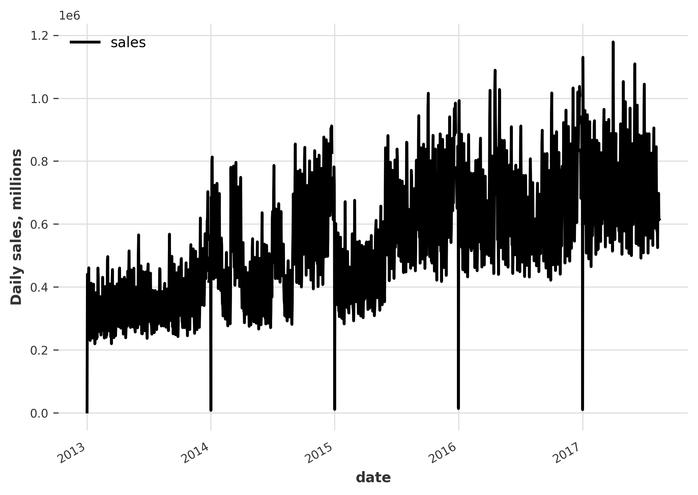

The time series plot shows us several things:

- Supermarket sales show an increasing trend over the years. The trend
  is close to linear overall, but the rate of increase declines roughly
  from the start of 2015. Consider one straight line from 2013 to 2015,
  and a second, less steep one from 2015 to the end.

- Sales mostly fluctuate around the trend, which suggests strong
  seasonality. However, there are also sharp deviations from the trend
  in certain periods, mainly across 2014 and at the start of 2015. These
  are likely cyclical in nature.

- The “waves” of seasonal fluctuations seem to be getting bigger over
  time. This suggests we should use a multiplicative time decomposition
  instead of additive.

- Sales decline very sharply in the first day of every year, almost to
  zero.

### Seasonality

#### Annual seasonality

Let’s look at annual seasonality: How sales fluctuate over a year based
on quarters, months, weeks of a year and days of a year. In the plots
below, we have the daily sales averaged by each respective calendar
period, colored by each year in the data. The confidence bands indicate
the minimum and maximum daily sales in each respective period (in the
last plot, we just have the daily sales without any averaging).

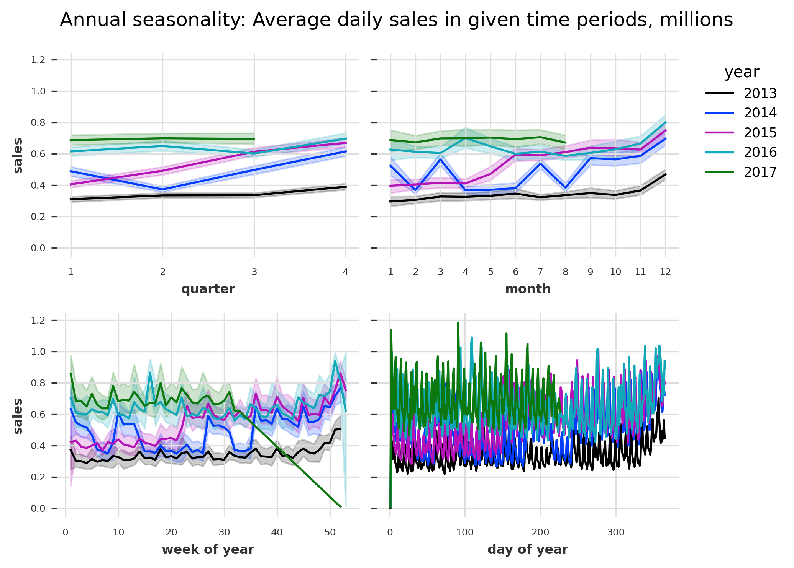

- **Quarterly:** Sales do not seem to have a considerable quarterly
  seasonality pattern. However, the plot still shows us a few things:

  - Sales generally slightly increase over a year.

  - In Q2 2014, there was a considerable drop. Sales declined almost to
    the level of Q2 2013. This was likely a cyclical effect.

- **Monthly:** Sales do seem to fluctuate slightly over months, but
  there’s no clear seasonal pattern that’s apparent across all years.
  However, sales seem to sharply increase in November and December every
  year, likely due to Christmas.

  - The cyclicality in 2014 is seen in more detail: Sales dropped almost
    to their 2013 levels in certain months, and recovered sharply in
    others.

  - We also see a considerable drop in the first half of 2015, where
    sales dropped roughly to 2014 levels, followed by a recovery.

  - There is a sharp increase in April 2016, where sales were as high as
    2017 levels. This is due to a large earthquake that happened in
    April 16 2016, and the related relief efforts.

- **Weekly:** The seasonal patterns are more visible in the weekly plot,
  as we see the “waves” of fluctuation line up across years. It’s very
  likely the data has strong weekly seasonality, which is what we’d
  expect from supermarket sales.

  - The data for 2017 ends after August 15, so the sharp decline
    afterwards is misleading.

  - The sharp decline at the end of 2016 is also misleading, as 2016 was
    a 366-day year.

- **Daily:** This plot is a bit noisy, but the very similar fluctuations
  across all years indicate the data is strongly seasonal. It also
  highlights some cyclical effects such as the April 2016 earthquake and
  the 2014 drops.

Another way to look at annual seasonality is to average sales in a
certain calendar period across all years, without grouping by year.

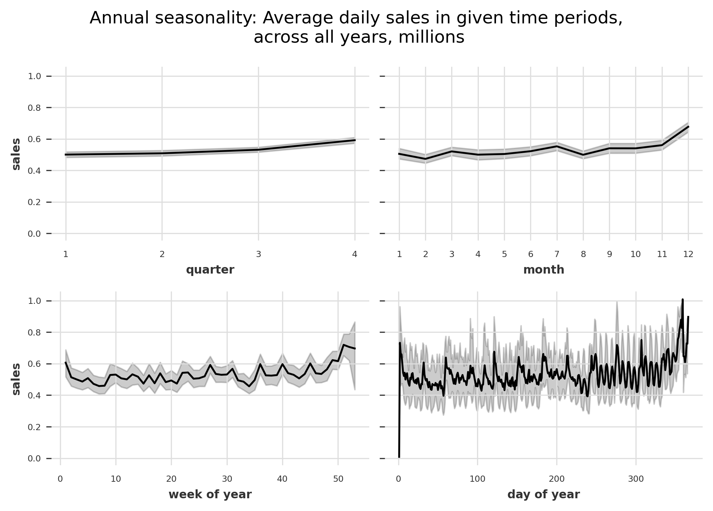

This shows us the “overall” seasonality pattern across one year: We
likely have a strong weekly seasonality pattern that holds across the
years, and some monthly seasonality especially towards December.

#### Monthly & weekly seasonality

Now let’s look at seasonality across days of a month and days of a week.
These will likely be the most important seasonality patterns in
supermarket sales. There are three ways to look at these plots: First we
will group them by year.

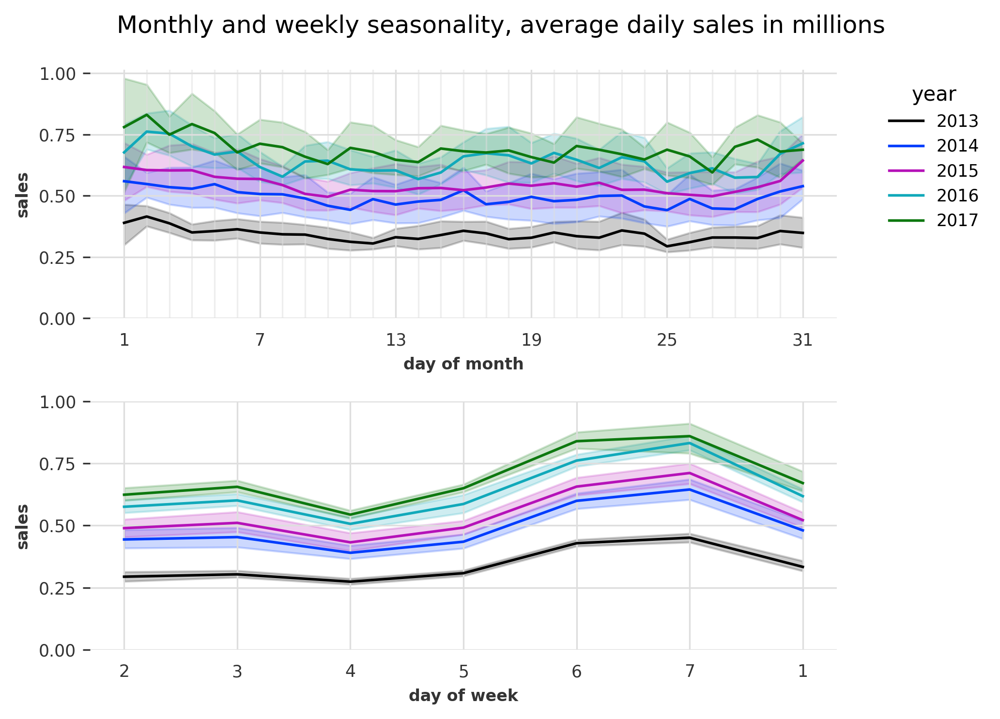

- The weekly seasonality pattern across days of a week is clear. Sales
  are lowest in Thursdays, increase and peak at Sundays, then drop on
  Mondays. The pattern holds in all years.

- The monthly seasonality across days of a month aren’t as strong, but
  look considerable. Sales are generally highest at the start of a
  month, likely because most salaries are paid at the end of a month,
  though the competition information also says salaries are paid
  biweekly, in the middle and at the end of each month.

We can look at the same plots grouped by month. The confidence bands are
suppressed as they make the plots hard to read.

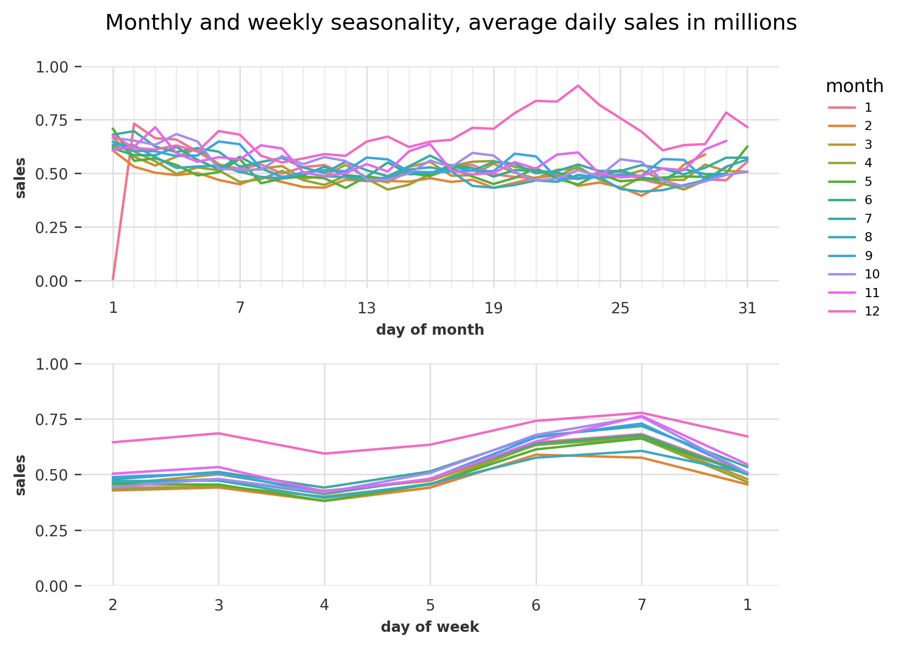

This plot shows us the monthly and weekly seasonality pattern generally
holds across all months, but December is a notable exception:

- Sales in December are considerably higher roughly from the 13th, due
  to Christmas approaching. The Christmas peak seems to happen in the
  23th, followed by a decline, and another sharp increase in the 30th.

- The sales by day of week are also higher in December for every day,
  but the pattern of the weekly seasonality is the same.

- We can also see that sales decline very sharply in January 1st, almost
  to zero, and make a considerably sharp recovery in the 2nd.

And finally, without any grouping: The averages across all years and
months.

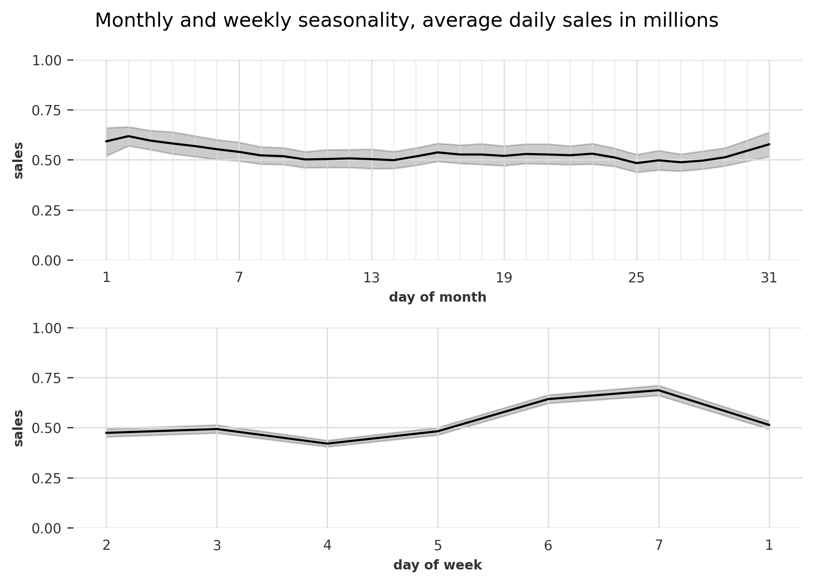

This plot allows us to see the overall monthly seasonality pattern more
clearly: Sales are higher at the start of a month, slightly decline
until the mid-month payday, slightly increase afterwards, and start
peaking again towards the end of a month.

### Autocorrelation & partial autocorrelation

Autocorrelation is the correlation of a variable with its own past
values. Partial autocorrelation can be thought of as the marginal
contribution of each lagged value to autocorrelation, since the lags are
likely to hold common information. The patterns in the autocorrelation
and partial autocorrelation plots can give us insight into the seasonal
patterns.

``` python
# FIG3: ACF and PACF plots
from statsmodels.graphics.tsaplots import plot_acf, plot_pacf
fig3, axes3 = plt.subplots(2)
_ = fig3.suptitle('Autocorrelation and partial autocorrelation, daily sales, up to 54 days')
_ = plot_acf(sales, lags=range(0,55), ax=axes3[0])
_ = plot_pacf(sales, lags=range(0,55), ax=axes3[1], method="ywm")

# Show fig3
plt.show()
plt.close("all")
```

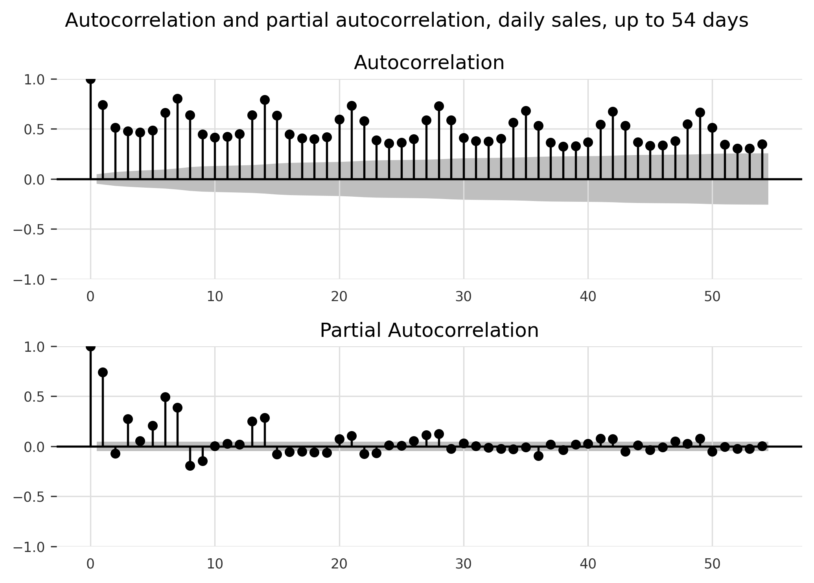

The sinusoidal pattern in the ACF plot is typical for strong weekly
seasonality:

- Sales at T=0 are highly correlated with the sales of the previous day
  at T=1.

- The correlation declines until T=6, which is the previous value of the
  next weekday from T=0, and spikes again at T=7, which is the previous
  value of the same weekday.

- The pattern repeats weekly after T=7, with declining strength.

The PACF plot shows the marginal contribution of each lag to the
relationship with the present day value. The partial autocorrelation is
highest for lag 1, and significant correlations die out roughly after 14
days. In step 2 of this analysis, we will revisit this plot to derive
features from sales lags, after performing time decomposition with model
1.

### April 2016 Earthquake

One more time effect we will look at is the April 2016 earthquake, a
one-off occurrence we need to adjust for in our model. The plots below
show the seasonality of sales in April and May, in every year. The black
dashed vertical line marks April 16.

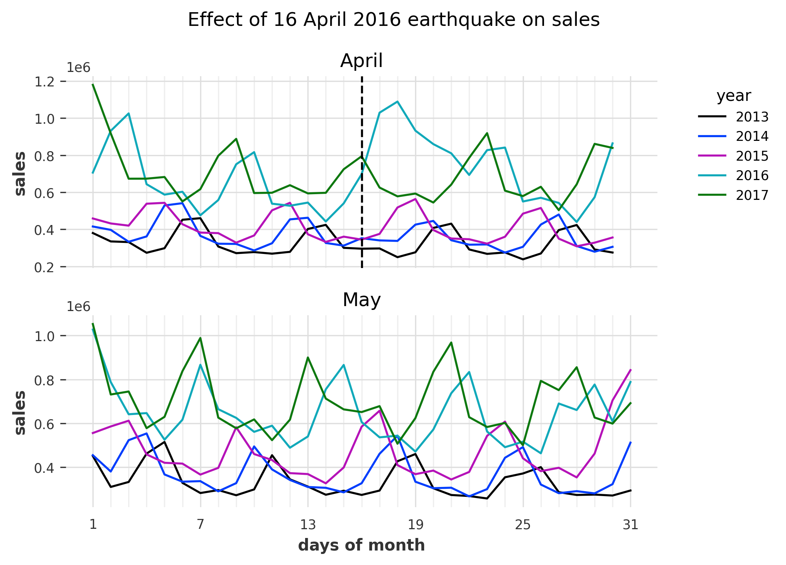

With the earthquake, the sales sharply increased from the expected
seasonal pattern and trend, peaked in April 18, then declined and
returned to the seasonal expectations around April 22. It doesn’t seem
like sales were higher than normal for the rest of April 2016, or in May
2016. We’ll engineer our earthquake feature accordingly.

## Feature engineering: Time & calendar features

Our main candidate for the time decomposition model is a simple linear
regression, so we will focus our feature engineering towards that.

- With linear regression, we can model and extrapolate trends and
  seasonality patterns, as well as adjust for one-off calendar effects.

- Methods that can’t extrapolate outside the training values are not
  suitable for modeling time effects, even if they are more “advanced”.

### Calendar effects & weekly seasonality features

We’ll flag the dates that influence sales considerably with binary or
ordinal features. These columns will take non-zero values if a certain
calendar effect is present in a date, and zero values otherwise.

Sales decline very sharply every year in January 1st, almost to zero.
The sales in January 2nd then recover sharply, which is a huge relative
increase for one day, so we will flag both dates with dummy features.

``` python
# New year's day features
df_train["ny1"] = ((df_train.index.day == 1) & (df_train.index.month == 1)).astype(int)


# Set holiday dummies to 0 if NY dummies are 1
df_train.loc[df_train["ny1"] == 1, ["local_holiday", "regional_holiday", "national_holiday"]] = 0

df_train["ny2"] = ((df_train.index.day == 2) & (df_train.index.month == 1)).astype(int)

df_train.loc[df_train["ny2"] == 1, ["local_holiday", "regional_holiday", "national_holiday"]] = 0
```

We have considerably higher sales in December due to Christmas and the
New Years’ Eve.

- For NY’s eve effects, we can simply flag December 30 and 31st with
  dummy features.

- For Christmas effects, we will create two integer columns that reflect
  the “strength” of the Christmas effect on sales, based on day of
  month. The first column will reach its maximum value in December 23rd,
  and the second will decline as the date moves away from that. For
  dates outside December 13-27, these features will take a value of
  zero. This may not be the most sophisticated way to reflect the
  Christmas effects on our model, but it should be simple and effective.

``` python
# NY's eve features
df_train["ny_eve31"] = ((df_train.index.day == 31) & (df_train.index.month == 12)).astype(int)

df_train["ny_eve30"] = ((df_train.index.day == 30) & (df_train.index.month == 12)).astype(int)

df_train.loc[(df_train["ny_eve31"] == 1) | (df_train["ny_eve30"] == 1), ["local_holiday", "regional_holiday", "national_holiday"]] = 0


# Proximity to Christmas sales peak
df_train["xmas_before"] = 0

df_train.loc[
  (df_train.index.day.isin(range(13,24))) & (df_train.index.month == 12), "xmas_before"] = df_train.loc[
  (df_train.index.day.isin(range(13,24))) & (df_train.index.month == 12)].index.day - 12

df_train["xmas_after"] = 0
df_train.loc[
  (df_train.index.day.isin(range(24,28))) & (df_train.index.month == 12), "xmas_after"] = abs(df_train.loc[
  (df_train.index.day.isin(range(24,28))) & (df_train.index.month == 12)].index.day - 27)

df_train.loc[(df_train["xmas_before"] != 0) | (df_train["xmas_after"] != 0), ["local_holiday", "regional_holiday", "national_holiday"]] = 0
```

To account for the effect of the April 2016 earthquake, we create a
feature similar to the ones for Christmas. The value peaks at April 18th
and takes a value of zero for dates outside April 17-22, 2016.

``` python
# Strength of earthquake effect on sales
# April 18 > 17 > 19 > 20 > 21 > 22
df_train["quake_after"] = 0
df_train.loc[df_train.index == "2016-04-18", "quake_after"] = 6
df_train.loc[df_train.index == "2016-04-17", "quake_after"] = 5
df_train.loc[df_train.index == "2016-04-19", "quake_after"] = 4
df_train.loc[df_train.index == "2016-04-20", "quake_after"] = 3
df_train.loc[df_train.index == "2016-04-21", "quake_after"] = 2
df_train.loc[df_train.index == "2016-04-22", "quake_after"] = 1
```

We previously created binary features to indicate
local-regional-national holidays, and special events. There are only a
few different events in the dataset, and they differ in nature, so we
will break up the events column and create separate binary features for
each event. We already created a feature for the earthquake, so we’ll
skip that one.

``` python
# Split events, delete events column
df_train["dia_madre"] = ((df_train["event"] == 1) & (df_train.index.month == 5) & (df_train.index.day.isin([8,10,11,12,14]))).astype(int)

df_train["futbol"] = ((df_train["event"] == 1) & (df_train.index.isin(pd.date_range(start = "2014-06-12", end = "2014-07-13")))).astype(int)

df_train["black_friday"] = ((df_train["event"] == 1) & (df_train.index.isin(["2014-11-28", "2015-11-27", "2016-11-25"]))).astype(int)

df_train["cyber_monday"] = ((df_train["event"] == 1) & (df_train.index.isin(["2014-12-01", "2015-11-30", "2016-11-28"]))).astype(int)

df_train = df_train.drop("event", axis=1)
```

Holidays and events may lead to an increase in sales in advance, so we
will create one lag column for each holiday column, and the Mother’s Day
event. These features could be tailored more carefully according to each
holiday and event, but we’ll keep it simple.

``` python
# Holiday-event leads
df_train["local_lead1"] = df_train["local_holiday"].shift(-1).fillna(0)
df_train["regional_lead1"] = df_train["regional_holiday"].shift(-1).fillna(0)
df_train["national_lead1"] = df_train["national_holiday"].shift(-1).fillna(0)
df_train["diamadre_lead1"] = df_train["dia_madre"].shift(-1).fillna(0)
```

To capture the weekly seasonality in a simple manner, we’ll create 6
dummy features for days of the week. We won’t create one for Monday,
since a 0 value for the other 6 columns means Monday.

``` python
# Days of week dummies
df_train["tuesday"] = (df_train.index.dayofweek == 1).astype(int)
df_train["wednesday"] = (df_train.index.dayofweek == 2).astype(int)
df_train["thursday"] = (df_train.index.dayofweek == 3).astype(int)
df_train["friday"] = (df_train.index.dayofweek == 4).astype(int)
df_train["saturday"] = (df_train.index.dayofweek == 5).astype(int)
df_train["sunday"] = (df_train.index.dayofweek == 6).astype(int)
```

Now we will aggregate the time features by mean. For local and regional
holidays, this will give us fractional values between 0 and 1, which is
likely a decent way to reflect local and regional holidays’ effects on
national sales.

``` python
# Aggregate time features by mean
time_covars = df_train.drop(
  columns=['id', 'store_nbr', 'family', 'sales', 'onpromotion', 'transactions', 'oil', 'city', 'state', 'store_type', 'store_cluster'], axis=1).groupby("date").mean(numeric_only=True)
```

### Trend & monthly seasonality features

In the exploratory analysis, we saw the overall trend can be modeled
linearly, but the rate of increase (the slope of the trend line)
declines from the start of 2015. To capture this, we will model a
piecewise linear trend with one knot at 01-01-2015.

- The slope of the linear trend will change and decline once, at the
  knot date. In effect, the result will be two linear trend lines added
  together.

- It’s possible to add more “turns” to a linear trend with more knots,
  but one is enough in our case. We want the trend to be simple, and
  robust against seasonal or cyclical fluctuations.

``` python
# Add piecewise linear trend dummies
time_covars["trend"] = range(1, 1685) # Linear dummy 1

# Knot to be put at period 729
print(time_covars.loc[time_covars.index=="2015-01-01"]["trend"]) 
```

    date
    2015-01-01    729
    Name: trend, dtype: int64

``` python
# Add second linear trend dummy
time_covars["trend_knot"] = 0
time_covars.iloc[728:,-1] = range(0, 956)

# Check start and end of knot
print(time_covars.loc[time_covars["trend"]>=729][["trend", "trend_knot"]]) 
```

                trend  trend_knot
    date                         
    2015-01-01    729           0
    2015-01-02    730           1
    2015-01-03    731           2
    2015-01-04    732           3
    2015-01-05    733           4
    ...           ...         ...
    2017-08-11   1680         951
    2017-08-12   1681         952
    2017-08-13   1682         953
    2017-08-14   1683         954
    2017-08-15   1684         955

    [956 rows x 2 columns]

For the monthly seasonality, we will create Fourier features. This will
capture the slight increases and decreases in sales throughout a month,
mostly due to proximity to paydays.

- Named after the French mathematician, Fourier series can be used to
  model any periodic, repeating fluctuation / waveform as sums of
  numerous sine-cosine pairs.

- We’ll create 5 Fourier pairs (10 columns in total) for 28-period
  seasonality. T

  - Too few pairs may not capture the fluctuations well, while too many
    run the risk of overfitting.

- December was an exception to the monthly seasonality pattern, but our
  Christmas and NY features will adjust for that.

``` python
from statsmodels.tsa.deterministic import DeterministicProcess

# Add Fourier features for monthly seasonality
dp = DeterministicProcess(
  index = time_covars.index,
  constant = False,
  order = 0, # No trend feature
  seasonal = False, # No seasonal dummy features
  period = 28, # 28-period seasonality (28 days, 1 month)
  fourier = 5, # 5 Fourier pairs
  drop = True # Drop perfectly collinear terms
)
time_covars = time_covars.merge(dp.in_sample(), how="left", on="date")

# View Fourier features
print(time_covars.iloc[0:5, -10:])
```

                sin(1,28)  cos(1,28)  sin(2,28)  cos(2,28)  sin(3,28)  cos(3,28)  \
    date                                                                           
    2013-01-01     0.0000     1.0000     0.0000     1.0000     0.0000     1.0000   
    2013-01-02     0.2225     0.9749     0.4339     0.9010     0.6235     0.7818   
    2013-01-03     0.4339     0.9010     0.7818     0.6235     0.9749     0.2225   
    2013-01-04     0.6235     0.7818     0.9749     0.2225     0.9010    -0.4339   
    2013-01-05     0.7818     0.6235     0.9749    -0.2225     0.4339    -0.9010   

                sin(4,28)  cos(4,28)  sin(5,28)  cos(5,28)  
    date                                                    
    2013-01-01     0.0000     1.0000     0.0000     1.0000  
    2013-01-02     0.7818     0.6235     0.9010     0.4339  
    2013-01-03     0.9749    -0.2225     0.7818    -0.6235  
    2013-01-04     0.4339    -0.9010    -0.2225    -0.9749  
    2013-01-05    -0.4339    -0.9010    -0.9749    -0.2225  

## Model 1: Time effects decomposition

We will now build our time decomposition linear regression model in
Darts, and compare it with some baseline models, as well as some models
that are quicker to implement.

### Preprocessing

``` python
# Create Darts time series with time features
ts_timecovars = TimeSeries.from_dataframe(
  time_covars, freq="D", fill_missing_dates=False)
```

Our target and covariate Series had 1684 rows each, but the Darts
TimeSeries we create from them have 1688 dates. This is likely because
we have gaps in our original series. We can check this easily in Darts.

``` python
# Scan for gaps
print(ts_timecovars.gaps())
```

       gap_start    gap_end  gap_size
    0 2013-12-25 2013-12-25         1
    1 2014-12-25 2014-12-25         1
    2 2015-12-25 2015-12-25         1
    3 2016-12-25 2016-12-25         1

It seems our data is missing values for December 25th in every year (the
data for 2017 ends in August). Darts automatically filled in the missing
dates to 1688, but we need to fill the missing values in our target and
covariate series.

``` python
# Fill gaps by interpolating missing values
from darts.dataprocessing.transformers import MissingValuesFiller
na_filler = MissingValuesFiller()
ts_sales = na_filler.transform(ts_sales)
ts_timecovars = na_filler.transform(ts_timecovars)

# Scan for gaps again
print(ts_timecovars.gaps())
```

    Empty DataFrame
    Columns: [gap_start, gap_end]
    Index: []

Our exploratory analysis showed that the seasonal fluctuations in sales
become larger over time. We should use a multiplicative decomposition
instead of additive.

- In **additive decomposition**, we decompose a time series as **Total
  =** **Trend + Seasonality + Remainder.**

- In **multiplicative decomposition**, we decompose a time series as
  **Total =** **Trend \* Seasonality \* Remainder.**

One way of performing multiplicative decomposition is taking the
logarithm of the time series and performing additive decomposition,
because if

$Y = T * S * R$,

then

$log(Y) = log(T) + log(S) + log(R)$ .

``` python
# Define functions to perform log transformation and reverse it. +1 to avoid zeroes
def trafo_log(x):
  return x.map(lambda x: np.log(x+1))

def trafo_exp(x):
  return x.map(lambda x: np.exp(x)-1)
```

We’ll train our time decomposition models on the natural logarithm of
the daily sales data from 2013-2016, and validate their prediction
performance on 2017.

``` python
# Train-validation split: Pre 2017 vs 2017
y_train1, y_val1 = trafo_log(ts_sales[:-227]), trafo_log(ts_sales[-227:])
x_train1, x_val1 = ts_timecovars[:-227], ts_timecovars[-227:]
```

### Model specification

We’ll compare the performance of our linear regression model against a
few other models.

Naive drift and naive seasonal are two baseline models, meant to
represent the performance of a very simple prediction.

- Naive drift fits a straight line from the start to the end of the
  training data, and extrapolates it to make predictions.

- Naive seasonal simply repeats the last K values in the training set.

We’ll also test two seasonal models which require little input. These
models cannot use other covariates in their predictions, such as our
calendar features.

- Fast Fourier Transform is an algorithm that converts a signal from the
  time domain to the frequency domain, used in many fields such as
  engineering and music.

  - In our case, we’ll try to extrapolate the seasonality waves in our
    data with FFT. The model will first perform detrending with an
    exponential trend, to try and account for the slope change in 2015.

- Exponential smoothing uses exponentially weighted moving averages to
  make predictions. The EMA gives more weight to recent observations,
  and less to older observations.

  - We’ll use the implementation with separate additive trend, seasonal
    and error components, as well as with trend dampening to try and
    account for the slope change in 2015. This implementation is also
    known as the [Holt-Winters’
    method](https://otexts.com/fpp3/taxonomy.html).
  - The
    [StatsForecastETS](https://unit8co.github.io/darts/generated_api/darts.models.forecasting.sf_ets.html)
    implementation we’ll use derives the best parameters automatically
    from the training data.

And finally, we’ll use our tailored linear regression model with
piecewise linear trend dummies, Fourier features for monthly seasonality
and dummy features for weekly seasonality & calendar effects. We’ll see
how much better it performs compared to models that can be specified and
applied quickly.

``` python
# Import models
from darts.models.forecasting.baselines import NaiveDrift, NaiveSeasonal
from darts.models.forecasting.fft import FFT
from darts.models.forecasting.sf_ets import StatsForecastETS as ETS
from darts.models.forecasting.linear_regression_model import LinearRegressionModel

# Specify baseline models
model_drift = NaiveDrift()
model_seasonal = NaiveSeasonal(K=7) # Repeat the last week of the training data

# Specify FFT model
model_fft = FFT(
  required_matches = {"day", "day_of_week"}, # Try to match the days of month and days of week of the training sequence with the predictions sequence  
  nr_freqs_to_keep = 10, # Keep 10 frequencies
  trend = "exp" # Exponential detrending
)

# Specify ETS model
model_ets = ETS(
  season_length = 7, # Weekly seasonality
  model = "AAA", # Additive trend, seasonality and remainder component
  damped = 0.9 # Dampen the trend over time
)

# Specify linear regression model
model_linear1 = LinearRegressionModel(
  lags_future_covariates = [0] # Don't create any covariate lags
  )
```

### Model validation: Predicting 2017 sales

We’ll train our models on 2013-2016 sales data, predict the sales for
2017, and score the predictions with a custom function. We’ll use three
regression performance metrics:

- **Root mean squared error (RMSE),**

- **Root mean squared log error (RMSLE),**

- **Mean absolute percentage error (MAPE).**

``` python
# Fit models on train data (pre-2017), predict validation data (2017)
model_drift.fit(y_train1)
pred_drift = model_drift.predict(n = 227)

model_seasonal.fit(y_train1)
pred_seasonal = model_seasonal.predict(n = 227)

model_fft.fit(y_train1)
pred_fft = model_fft.predict(n = 227)

model_ets.fit(y_train1)
pred_ets = model_ets.predict(n = 227)

model_linear1.fit(y_train1, future_covariates = x_train1)
pred_linear1 = model_linear1.predict(n = 227, future_covariates = x_val1)
```

``` python
# Define model scoring function
from darts.metrics import mape, rmse, rmsle
def perf_scores(val, pred, model="drift"):
  
  scores_dict = {
    "RMSE": rmse(trafo_exp(val), trafo_exp(pred)), 
    "RMSLE": rmse(val, pred), 
    "MAPE": mape(trafo_exp(val), trafo_exp(pred))
      }
      
  print("Model: " + model)
  
  for key in scores_dict:
    print(
      key + ": " + 
      str(round(scores_dict[key], 4))
       )
  print("--------")  

# Score models' performance
perf_scores(y_val1, pred_drift, model="Naive drift")
perf_scores(y_val1, pred_seasonal, model="Naive seasonal")
perf_scores(y_val1, pred_fft, model="FFT")
perf_scores(y_val1, pred_ets, model="Exponential smoothing")
perf_scores(y_val1, pred_linear1, model="Linear regression")
```

    Model: Naive drift
    RMSE: 899727.1315
    RMSLE: 0.8665
    MAPE: 161.8275
    --------
    Model: Naive seasonal
    RMSE: 183226.1742
    RMSLE: 0.3836
    MAPE: 64.2437
    --------
    Model: FFT
    RMSE: 226535.1335
    RMSLE: 0.3972
    MAPE: 59.8851
    --------
    Model: Exponential smoothing
    RMSE: 201526.3126
    RMSLE: 0.3956
    MAPE: 75.8211
    --------
    Model: Linear regression
    RMSE: 75003.7023
    RMSLE: 0.1061
    MAPE: 8.1491
    --------

We see our linear regression model performs much better than the other
methods tested.

- It’s also notable that the naive seasonal model beats the ETS model in
  all metrics, while beating FFT in RMSE and RMSLE. However, FFT beats
  the naive seasonal model in MAPE.

- The ETS model also beats FFT in RMSE and RMSLE, while having
  considerably higher MAPE. This is likely because MAPE is a measure of
  relative error, while RMSE and RMSLE are measures of absolute error.

  - For example, an absolute error of 2 translates to 2% MAPE if the
    true value is 100, but it translates to 0.2% MAPE if the true value
    is 1000.

  - In both cases, the absolute error is the same, but we may argue an
    absolute error of 2 is more “costly” for the former case.

- In either case, RMSLE is likely the more important metric among these
  three. Log errors penalize underpredictions more strongly than
  overpredictions, which could be good for assessing sales predictions,
  as unfulfilled demand is likely more costly than overstocking. The
  competition is also scored on RMSLE.

Let’s plot the predictions of our models and compare them visually with
the actual values.

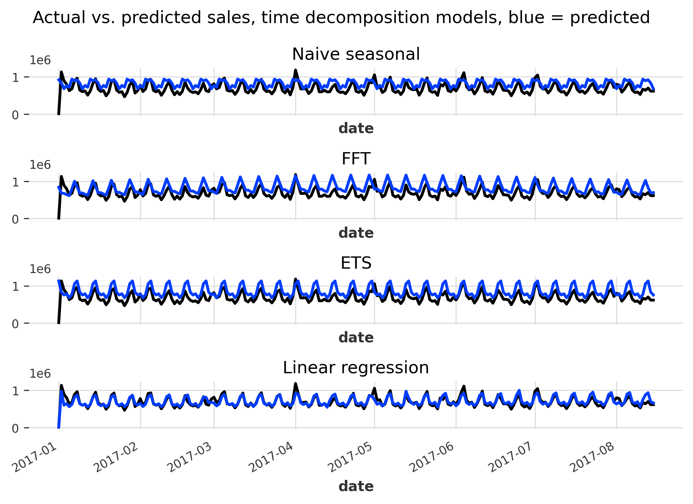

The FFT and ETS models actually did a good job of capturing the weekly
seasonality pattern in the data, as the shape and timing of the waves in
the predictions are similar to the actual values.

- However, the FFT and ETS models generally overestimated the trend of
  2017 sales.

  - This is likely because their methods for modeling the trend is not
    fully suitable for the trend in our data.

- The naive seasonal model performed close to FFT and ETS by
  coincidence, because the 7 days of sales it repeated were not far from
  the trend of 2017.

- The naive, FFT and ETS models also couldn’t account for the sharp drop
  in sales in January 1st, as they don’t take in covariates.

- In contrast, the linear model’s trend and seasonality are both on
  point, and the January 1st drop is adjusted for nicely. The model is
  not able to match some spikes and troughs fully, which are possibly
  cyclical in nature. That’s where model 2 will come in.

  - The piecewise linear trend method allows us to respond to turns in
    the trend more precisely, while keeping the trend lines robust
    against fluctuations.

### Rolling crossvalidation

We can further evaluate the performance of our model with rolling
crossvalidation: This is the practice of training a model with past data
up to a certain time point, predicting the next time point(s), adding
them to the training data and repeating the process with increasingly
wider training windows until the end of the data.

- We’ll start by training the model on 2013 only, as it makes sense to
  feed a full year of the seasonality patterns to the model.

- Then we’ll predict the next day, add it to the training data, and
  repeat the process until the end of the data. This could take a long
  time for more sophisticated algorithms, but it should be fine for
  linear regression.

- We’ll also retrieve the residuals for each prediction to perform
  residual diagnosis.

``` python
# Retrieve historical forecasts and decomposed residuals for 2014-2017
pred_hist1 = model_linear1.historical_forecasts(
  trafo_log(ts_sales), 
  future_covariates = ts_timecovars, start = 365, stride = 1,
  verbose = True)
res_linear1 = trafo_log(ts_sales[365:]) - pred_hist1

# Score historical forecasts
perf_scores(trafo_log(ts_sales[365:]), pred_hist1, model="Linear regression, historical")
```

      0%|          | 0/1323 [00:00<?, ?it/s]

    Model: Linear regression, historical
    RMSE: 99341.6312
    RMSLE: 0.1828
    MAPE: 13.8001
    --------

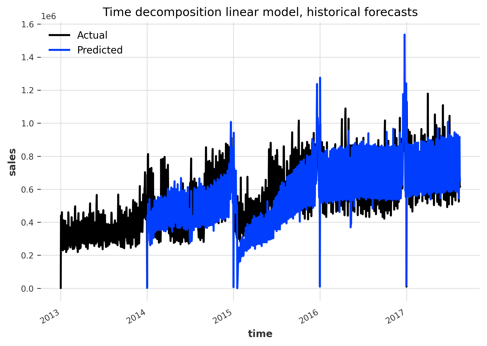

Again, the model captures the trend & seasonality patterns nicely, but
the errors due to cyclical effects are even more apparent in 2014 and
2015. If we had modeled the trend non-linearly, the trend term would
likely respond strongly to these fluctuations, potentially causing
overfitting issues for predictions after the training time period.

### Residuals diagnosis & stationarity

We’ll now analyze the residuals from our historical forecasts.

``` python
# Diagnose linear model 1's innovation residuals
from darts.utils.statistics import plot_residuals_analysis, plot_pacf
_ = plot_residuals_analysis(res_linear1)
plt.show()
plt.close("all")

# PACF plot of decomped sales residuals
_ =  plot_pacf(res_linear1, max_lag=56)
_ = plt.title("Partial autocorrelation plot, residuals of linear model 1")
_ = plt.xlabel("Lags")
_ = plt.ylabel("PACF")
_ = plt.xticks(np.arange(0, 56, 10))
_ = plt.xticks(np.arange(0, 56, 1), minor=True)
_ = plt.grid(which='minor', alpha=0.5)
_ = plt.grid(which='major', alpha=1)
plt.show()
plt.close("all")
```

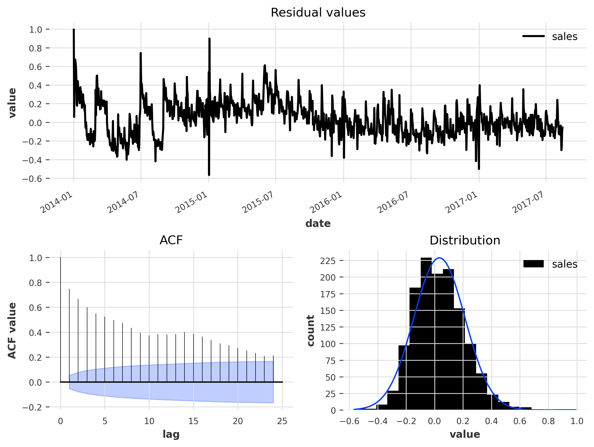

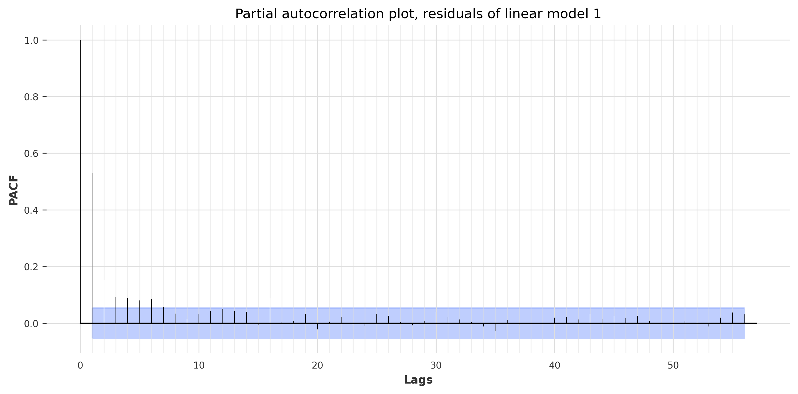

Ideally, we’d want very small residuals that are normally distributed
around zero, representing the truly unpredictable remainder of our
models. This is not the case overall, so there’s room for improvement in
our predictions.

- Residuals for 2014-2015 especially deviate from zero. This is likely
  due to the cyclical behavior we observed in this period, though the
  smaller training data likely plays a role as well.

- The overall distribution of the residuals is not too far from a normal
  distribution around zero, but the right tail is bigger, indicating
  some values are strongly underpredicted. These are mostly from
  2014-2015.

- The PACF plot shows strong partial autocorrelation with lag 1, and a
  weak one with lag 2, which means we’ll likely include lagged sales
  features in the second model. There are also small, barely significant
  partial autocorrelations after lag 2.

A **stationary time series** is one free of trend and seasonality, also
called **white noise**. Ideally, we’d want our residuals to be
stationary to consider our modeling complete. We can test their
stationarity with two statistical tests. First is the
Kwiatkowski-Phillips-Schmidt-Shin test.

``` python
# Import KPSS and ADF tests
from darts.utils.statistics import stationarity_test_kpss, stationarity_test_adf

print(
  "KPSS test p-value: " + 
  stationarity_test_kpss(res_linear1)[1].astype(str)
) # Null rejected = data is non-stationary
```

    KPSS test p-value: 0.01

    C:\Users\PC\Documents\Work\DataScience\GitHub\KaggleStoreSales\venv\lib\site-packages\statsmodels\tsa\stattools.py:2018: InterpolationWarning:

    The test statistic is outside of the range of p-values available in the
    look-up table. The actual p-value is smaller than the p-value returned.

The null hypothesis for the KPSS test (this version) is stationarity
around a constant value. With a p-value smaller than 0.01, the null is
rejected, so the test suggests our residuals are non-stationary.

Second is the Augmented Dickey-Fuller test.

``` python
print(
  "ADF test p-value: " +
  stationarity_test_adf(res_linear1)[1].astype(str)
) # Null rejected = data is stationary around a constant
```

    ADF test p-value: 7.49538399004551e-05

The null hypothesis for the ADF test (this version) is the presence of a
unit root, while the alternative hypothesis is stationarity around a
constant. With a very small p-value, the null is rejected and the
alternative is accepted, so the test suggests our residuals are
stationary around a constant, conflicting with the KPSS test.

### Time decomposition

We will train our second model on the time-decomposed sales, which are
the residuals of the first model.

- Since 2013-2016 will serve as our training data, we need to fit the
  first model on 2013-2016, and retrieve the fitted residuals to serve
  as the time-decomposed training data for the second model, but Darts
  doesn’t allow predictions on the training data (which makes sense, as
  this is normally a mistake if the goal is to evaluate model
  performance).

- Instead, it’s possible to use the `model_linear1.residuals()` method,
  which returns the residuals from rolling crossvalidation as performed
  previously, but this will lead to higher residuals for the earlier
  days in our data, as they will be retrieved from models fitted on
  small portions of our available data, without seeing all the examples
  of the time patterns we want to remove.

- Since we are ultimately interested in improving our model’s
  performance in 2017 predictions, and we already validated model 1 on
  2017, we’ll perform the final time decomposition in sklearn, which
  allows predictions on the training data.

``` python
# Perform time decomposition in Sklearn

# Retrieve Darts target and features with filled gaps
sales = ts_sales.pd_series()
time_covars = ts_timecovars.pd_dataframe()

# Train-test split
y_train, y_val = trafo_log(sales[:-227]), trafo_log(sales[-227:])
x_train, x_val = time_covars.iloc[:-227,], time_covars.iloc[-227:,]

# Fit & predict on 13-16, retrieve residuals
from sklearn.linear_model import LinearRegression
model_decomp = LinearRegression()
model_decomp.fit(x_train, y_train)
pred1 = model_decomp.predict(x_train)
res1 = y_train - pred1

# Predict on 17, retrieve residuals
pred2 = model_decomp.predict(x_val)
res2 = y_val - pred2

# Concatenate residuals to get decomposed sales
sales_decomp = pd.concat([res1, res2])

# Concatenate predictions to get model 1 predictions
preds_model1 = pd.Series(np.concatenate((pred1, pred2)), index = sales_decomp.index)
```

Now, `preds_model1` are the fitted values of model 1 on 2013-2016, and
its predictions for 2017. `sales_decomp` are the fitted residuals for
2013-2016 and the prediction residuals for 2017. We’ll fit model 2 on
`sales_decomp`, and add `preds_model1` to its predictions to achieve our
final hybrid predictions.

## Exploratory analysis 2: Lags & covariates

Now we will explore the sales lags & covariate time series as possible
predictors for our second model.

``` python
# Aggregate daily covariates from df_train: oil, onpromotion, transactions
covars = df_train.groupby("date").agg(
 { "oil": "mean",
  "onpromotion": "sum",
  "transactions": "mean"}
  )

# Merge decomposed sales and covariates
sales_covariates = covars.merge(sales_decomp.rename("sales"), on = "date", how = "left")
```

### Covariates stationarity & differencing

Oil, onpromotion and transactions are time series that we will consider
as predictors of sales.

- However, we performed time decomposition on sales. Our covariate
  series may display their own time effects and seasonalities. We can
  use stationarity tests to quickly check for this.

- If a covariate is non-stationary, a quick way to possibly make it
  stationary is differencing: Subtracting each value from the value of
  the previous period. This will give us the change in each period,
  instead of the absolute value.

``` python
# Test stationarity of covariates
from statsmodels.tsa.stattools import kpss, adfuller

print(
  "KPSS test p-value: " + 
  kpss(sales_covariates["oil"])[1].astype(str)
) # Null rejected = data is non-stationary

print(
  "ADF test p-value: " +
  adfuller(sales_covariates["oil"])[1].astype(str)
) # Null accepted = data is non-stationary
```

    KPSS test p-value: 0.01
    ADF test p-value: 0.8027065796825488

Both the KPSS and ADF test suggest the oil time series is
non-stationary, so we’ll difference it. If one covariate is differenced,
it makes sense to difference the others as well.

``` python
# Difference the covariates
from sktime.transformations.series.difference import Differencer
diff = Differencer(lags = 1)
sales_covariates[
  ['oil', 'onpromotion', 'transactions']] = diff.fit_transform(
    sales_covariates[['oil', 'onpromotion', 'transactions']])
print(sales_covariates)
```

                   oil  onpromotion  transactions   sales
    date                                                 
    2013-01-01  0.0000       0.0000        0.0000 -0.7649
    2013-01-02  0.0000       0.0000    92445.0000  0.0696
    2013-01-03 -0.1507       0.0000   -14711.0000  0.2949
    2013-01-04  0.1330       0.0000      -10.0000  0.1230
    2013-01-05  0.0236       0.0000    15079.0000  0.1126
    ...            ...          ...           ...     ...
    2017-08-11  0.2184    6262.0000     6487.0000 -0.1136
    2017-08-12 -0.3290   -5867.0000      376.0000 -0.3183
    2017-08-13 -0.3290     971.0000    -3934.0000 -0.2906
    2017-08-14 -0.3290   -1240.0000     -545.0000 -0.1182
    2017-08-15 -0.0162    2562.0000     1113.0000 -0.0716

    [1684 rows x 4 columns]

Now our covariate columns all represent the change in each covariate
compared to the previous period.

### Sales features

Let’s evaluate features derived from sales lags as possible predictors.
We’ll start with autocorrelation plots.

``` python
from statsmodels.graphics.tsaplots import plot_pacf as pacf_tsa
from sktime.utils.plotting import plot_lags
from scipy.stats import pearsonr, spearmanr
```


As we saw in model 1’s residuals analysis, sales lag 1 makes a strong
contribution to the partial autocorrelation, while lags 2 to 5 make weak
but significant contributions.

Linear correlation may not always do justice to the relationship between
two variables, so let’s look at the scatterplots of sales with its first
9 lags.

``` python
# FIG9: Sales lag scatterplots
fig9, axes9 = plot_lags(
  sales_covariates["sales"], lags = [1,2,3,4,5,6,7,8,9],
  suptitle = "Sales lags")
  
# Show fig9
plt.show()
plt.close("all")
```

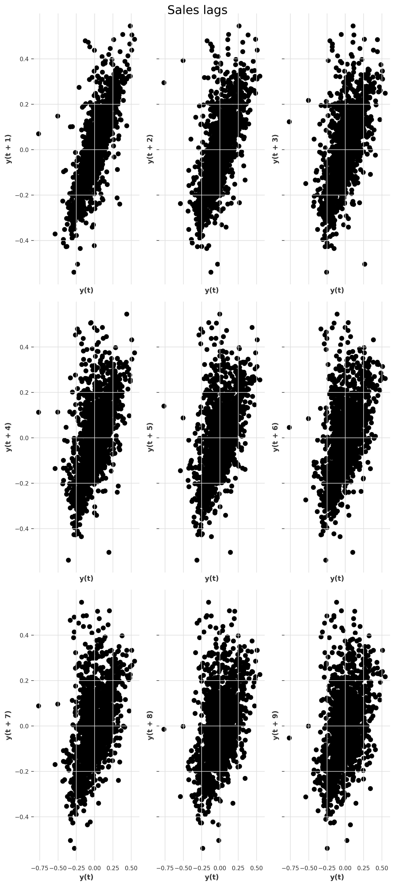

It doesn’t look like any lag after 1 displays a considerably different
relationship with sales.

We can also consider a rolling feature, such as a moving average.

- Since we know lag 1 is the most important lag, an exponentially
  weighted moving average makes sense. This type of moving average puts
  more weight on recent lags, and less on older lags.

- A 5-day period makes sense, as the significance of partial
  autocorrelations die out after lag 5.

``` python
# Calculate 5-day exponential moving average of sales lags
sales_covariates["sales_ema5"] = sales_covariates["sales"].rolling(
  window = 5, min_periods = 1, center = False, win_type = "exponential").mean()
```

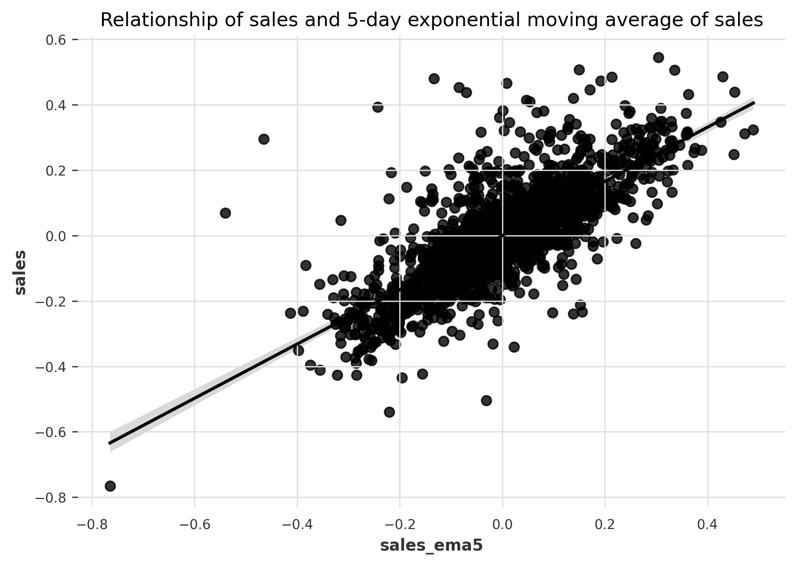

We can see sales EMA5 is a good linear predictor of sales, similar to
lag 1. Let’s compare lag 1’s correlation with sales to EMA5’s
correlation with sales.

``` python
# Correlation of sales and lag 1
pearsonr(sales_covariates["sales"], sales_covariates["sales"].shift(1).fillna(method="bfill")) 
```

    PearsonRResult(statistic=0.790350805157687, pvalue=0.0)

``` python
# Correlation of sales and ema5
pearsonr(sales_covariates["sales"], sales_covariates["sales_ema5"]) 
```

    PearsonRResult(statistic=0.7580111987059072, pvalue=1.7543396815e-314)

Lag 1 comes out as the slightly stronger linear predictor, but EMA5 is a
good one too. We can include both as features.

### Oil features

The oil price change of one day is not likely to mean much by itself,
and the effect of oil prices on the economy likely takes some time to
manifest.

- Therefore, we’ll just consider moving averages of the oil price as
  features.

- These won’t be exponentially weighted averages, as recent oil prices
  likely require time to make their effect on sales. It’s even possible
  oil prices with a certain degree of lag are the more important
  predictors.

``` python
# Calculate oil MAs
oil_ma = sales_covariates.assign(
  oil_ma7 = lambda x: x["oil"].rolling(window = 7, center = False).mean(),
  oil_ma14 = lambda x: x["oil"].rolling(window = 14, center = False).mean(),
  oil_ma28 = lambda x: x["oil"].rolling(window = 28, center = False).mean(),
  oil_ma84 = lambda x: x["oil"].rolling(window = 84, center = False).mean(),
  oil_ma168 = lambda x: x["oil"].rolling(window = 168, center = False).mean(),
  oil_ma336 = lambda x: x["oil"].rolling(window = 336, center = False).mean(),
)
```


We don’t see particularly strong relationships between oil price change
MAs and sales, though the monthly MA is the most notable one with a
correlation of -0.2, so we will use that as a feature.

Since we need 28 past periods to calculate this MA for a 29th period,
we’ll have missing values for the first 28 periods in our data. After
some iteration, these were interpolated decently with a second-order
spline interpolation.

``` python
# Keep monthly oil MAs as a feature
sales_covariates["oil_ma28"] = sales_covariates["oil"].rolling(window = 28, center = False).mean()

# Spline interpolation for missing values
sales_covariates["oil_ma28"] = sales_covariates["oil_ma28"].interpolate(
  method = "spline", order = 2, limit_direction = "both")

# Check quality of interpolation
_ = sales_covariates["oil"].plot()
_ = sales_covariates["oil_ma28"].plot()
_ = plt.title("Oil price change and its 28-day moving average, first 28 MAs interpolated")
plt.show()
plt.close("all")
```

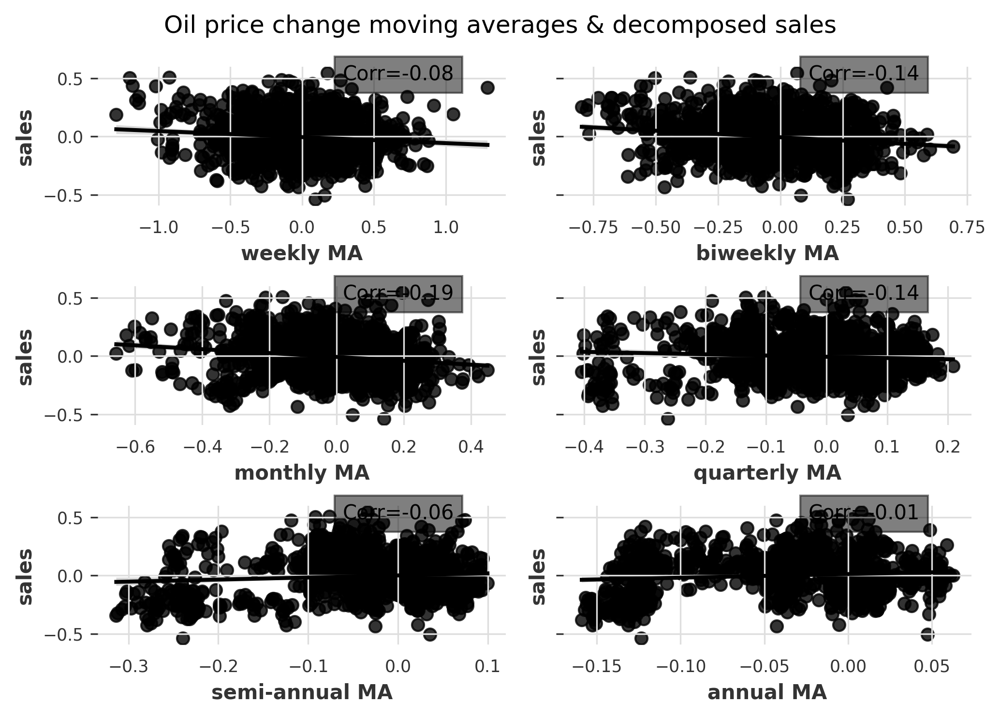

### Onpromotion features

Onpromotion is the number of items that are on sale, aggregated across
all stores and categories. We’ll start exploring the relationship
between onpromotion and sales using a cross-correlation plot: The
correlations of sales at time 0, with lags and leads of onpromotion.
Since the supermarket chain controls the number of items that will go on
sale, it may be feasible to use leading values of onpromotion as
predictors.

``` python
# Cross-correlation of sales & onpromotion
_ = plt.xcorr(
  sales_covariates["sales"], sales_covariates["onpromotion"], usevlines=True, maxlags=56, normed=True)
_ = plt.grid(True)
_ = plt.ylim([-0.1, 0.1])
_ = plt.xlabel("onpromotion lags / leads")
_ = plt.title("Cross-correlation, decomposed sales & onpromotion change")
plt.show()
plt.close("all")
```

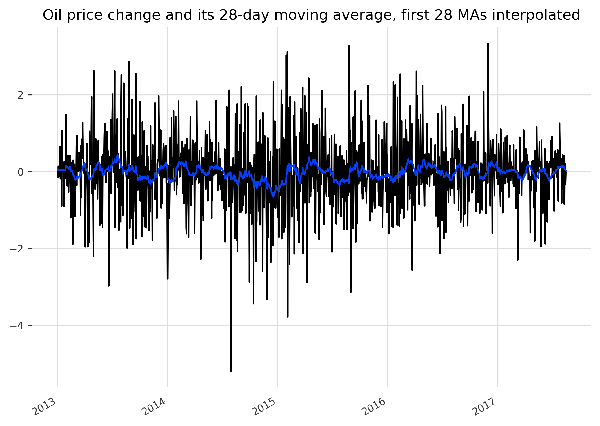

Single lags / leads of onpromotion don’t display any significant
correlations with sales, though there is a repeating pattern of likely
six days. Let’s look at the scatterplots of sales at time 0, with four
of the more relatively significant lags (lag 0 being the present value
of onpromotion).

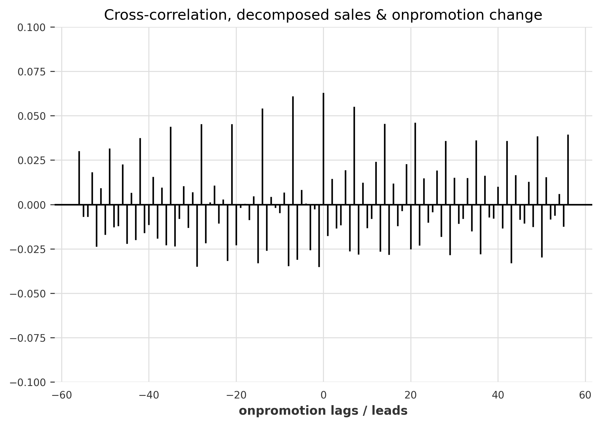

Again, no significant relationship between single onpromotion lags and
sales. Let’s consider moving averages.

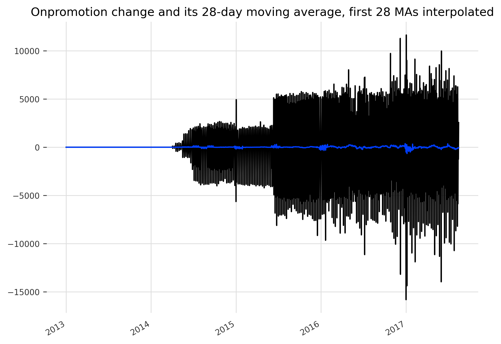

The monthly and quarterly MA of onpromotion seems to be slightly
positively correlated with sales. We’ll use the monthly MA as a feature,
as we would have to fill in too many missing values for the quarterly
MA.

``` python
# Keep monthly onpromotion MAs as a feature
sales_covariates["onp_ma28"] = sales_covariates["onpromotion"].rolling(window = 28, center = False).mean()

# Spline interpolation for missing values
sales_covariates["onp_ma28"] = sales_covariates["onp_ma28"].interpolate(
  method = "spline", order = 2, limit_direction = "both")

# Check quality of interpolation
_ = sales_covariates["onpromotion"].plot()
_ = sales_covariates["onp_ma28"].plot()
_ = plt.title("Onpromotion change and its 28-day moving average, first 28 MAs interpolated")
plt.show()
plt.close("all")
```

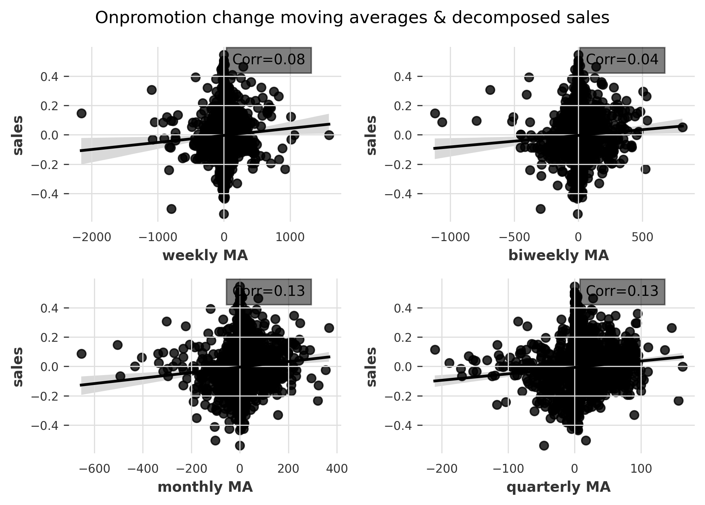

The daily changes in onpromotion are practically zero roughly until Q1
2014. Afterwards, changes in onpromotion became increasingly larger,
which probably hints at a macroeconomic shift in 2014. The cyclicality
in our data becomes especially prominent in 2014 as well.

### Transactions features

Finally, we have the number of transactions, aggregated across all
stores.

- This is most likely to be a current predictor of sales, i.e. days with
  higher transactions are likely to be days with higher sales. We
  wouldn’t know the number of transactions in advance, so this may not
  be useful. Still, recent levels of transactions may help us predict
  future sales.

- The transactions data is only available for the training dataset (up
  to mid-August 2017), and not for the testing dataset (15 days after
  the training dataset).

- We can freely consider transactions as a feature for part 1 of this
  analysis, but in part 2 we’ll only be able to consider lag 15 or older
  values of transactions as features. Lag 15 is marked with a red dashed
  vertical line in the cross-correlation plot below.

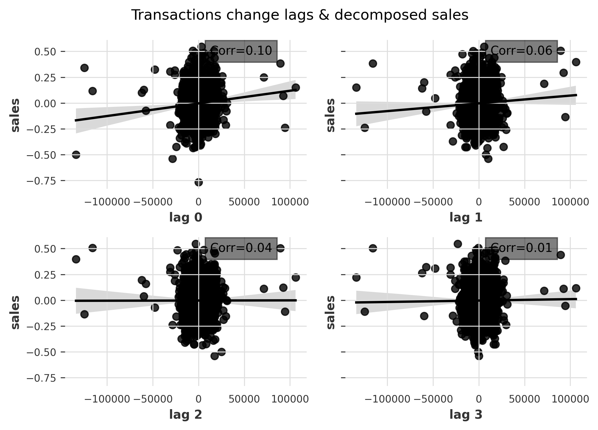

Again, single transactions lags don’t display strong correlations with
sales. Unlike onpromotion, there doesn’t seem to be a repeating pattern
either. Lags 0-3 are relatively stronger, so let’s see their
scatterplots.


As we expected, the present value of transactions have a weak, but
relatively stronger positive relationship with the value of sales
compared to the lags.

- However, the correlation and the line is impacted by a few outliers
  with particularly low or high values for transactions, while the
  relationship seems even weaker for the vast majority of observations.

- This likely tells us that a huge drop / increase in transactions is
  likely to affect sales a bit, but usual fluctuations in transactions
  doesn’t tell much about the sales.

Let’s consider moving averages of changes in transactions, as a possible
indicator of recent sales activity.


The MAs are much more significant than single lags, though the
correlations are still likely impacted by extreme values. Still, these
features could help our model adjust for extreme increases / decreases
in transactions. We’ll keep the weekly MA as it has the strongest linear
relationship, and will create the fewest number of missing values to
fill in.

``` python
# Keep weekly transactions MA
sales_covariates["trns_ma7"] = sales_covariates["transactions"].rolling(window = 7, center = False).mean()

# Backwards linear interpolation
sales_covariates["trns_ma7"] = sales_covariates["trns_ma7"].interpolate("linear", limit_direction = "backward")

# Check quality of interpolation
_ = sales_covariates["transactions"].plot()
_ = sales_covariates["trns_ma7"].plot()
_ = plt.title("Transactions change and its 7-day moving average, first 7 MAs interpolated")
plt.show()
plt.close("all")
```

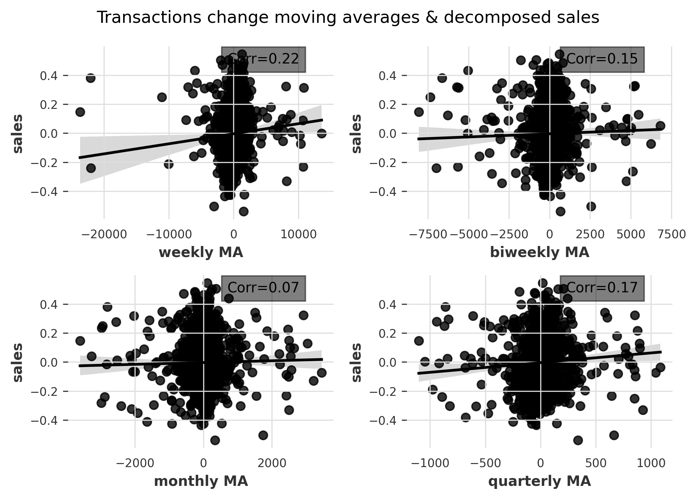

We can see the sharp drop in transactions on January 1st, and the
recovery on January 2nd, reflected both in the time series plot of
transactions changes, and its weekly moving average.

## Model 2: Lags & covariates

### Preprocessing

We repeat some preprocessing steps for model 2.

``` python
# Drop original covariates & target
lags_covars = sales_covariates.drop(
  ['oil', 'onpromotion', 'transactions', 'sales'], axis = 1)

# Make Darts TS with selected covariates
ts_lagscovars = TimeSeries.from_dataframe(
  lags_covars, freq="D")

# Make Darts TS with decomposed sales
ts_decomp = TimeSeries.from_series(sales_decomp.rename("sales"), freq="D")

# Make Darts TS with model 1 predictions
ts_preds1 = TimeSeries.from_series(preds_model1.rename("sales"), freq="D")

# Fill gaps in TS
ts_decomp = na_filler.transform(ts_decomp)
ts_lagscovars = na_filler.transform(ts_lagscovars)

# Train-test split (pre-post 2017)
y_train2, y_val2 = ts_decomp[:-227], trafo_log(ts_sales[-227:])
x_train2, x_val2 = ts_lagscovars[:-227], ts_lagscovars[-227:]
```

In model 1, our features were trend dummies, Fourier pairs and binary /
ordinal features for calendar effects, none of which required scaling.
In this model, we have covariates of different natures and value ranges.
For example, the oil price changes are often fractional, while changes
in transactions are often in the thousands. The former reflects a unit
price, the latter reflects a count. Therefore, we’ll scale and center
our features to avoid domination by features with large values.

``` python
# Scale covariates
from sklearn.preprocessing import StandardScaler
from darts.dataprocessing.transformers import Scaler
scaler = Scaler(StandardScaler())
x_train2 = scaler.fit_transform(x_train2)
x_val2 = scaler.transform(x_val2)
```

### Model specification

We’ll use the same baseline models as we did in model 1. We’ll compare
them with an ARIMA model, another linear regression, and a random forest
model.

- ARIMA models combine **autoregressive models (AR)** and **moving
  average models (MA)**.

  - An AR model of **order p** uses the linear combination of the **past
    p values** of a series to forecast its future values.

  - A MA model of **order q** performs regression on the **past q
    forecast errors** of a series to forecast its future values. It can
    be thought of as a weighted moving average of the past q forecast
    errors.

  - The **order d** indicates the order of differentiation previously
    applied to the target series.

  - This implementation of the ARIMA model also takes in covariates,
    which will be used as linear predictors just like in linear
    regression.

  - We’ll use an
    [AutoARIMA](https://alkaline-ml.com/pmdarima/modules/generated/pmdarima.arima.AutoARIMA.html#pmdarima.arima.AutoARIMA.summary)
    process, which will derive and apply the best ARIMA parameters from
    the data. The best ARIMA model will be chosen by minimizing the
    Corrected Akaike Information Criterion (AICc), which reflects the
    tradeoff between variance explained by the model, and model
    complexity.

- A random forest builds **an N number of decision trees**, each with
  **an M number of randomly selected predictors** out of all the
  predictors in the dataset. The predictions of each tree are combined
  with a voting system, yielding an **ensemble prediction**.

  - Tree-based models can perform feature selection to a degree, capture
    non-linear relationships, and discover interactions between
    predictors.

  - They can’t extrapolate a relationship outside the value ranges in
    the training set, so we didn’t consider them for the time
    decomposition model.

  - We could also include a more sophisticated gradient boosting
    algorithm such as XGBoost, but these often require [extensive
    hyperparameter
    tuning](https://github.com/AhmetZamanis/LoanRequestClassification/blob/main/Report.md#xgboost)
    to perform at their best, so we will skip it. In contrast, the
    random forest has fewer hyperparameters, and the default settings
    often do fine without needing tuning.

``` python
# Import models
from darts.models.forecasting.baselines import NaiveDrift, NaiveSeasonal
from darts.models.forecasting.auto_arima import AutoARIMA
from darts.models.forecasting.linear_regression_model import LinearRegressionModel
from darts.models.forecasting.random_forest import RandomForest

# Specify baseline models
model_drift = NaiveDrift()
model_seasonal = NaiveSeasonal(K=5)

# Specify AutoARIMA model
model_arima = AutoARIMA(
  start_p = 1,
  max_p = 5,
  start_q = 0,
  max_q = 5,
  d = 0,
  seasonal = False, # Don't include seasonal terms
  stationary = True, # The data is stationary, don't difference
  information_criterion = 'aicc', # Minimize AICc to choose best model
  trace = True, # Print the tuning iterations
  random_state = 1923
)

# Specify second linear regression model
model_linear2 = LinearRegressionModel(
  lags = 1, # Target lag 1
  lags_future_covariates = [0] # No covariate lags
  )

# Specify random forest model  
model_forest = RandomForest(
  lags = [-1, -2, -3, -4, -5], # Target lags that can be used
  lags_future_covariates = [0], # No covariate lags
  random_state = 1923,
  n_jobs = -2 # Use all but one of the CPUs
  )
```

Similar to model 1, our naive seasonal model will repeat the last 5
values in the training data. K=7 was the most significant seasonality
period before time decomposition. Now it appears K=5 is the most
significant period for autoregression.

- To determine the search spaces for the AR and MA components in the
  AutoARIMA model, we look at the ACF and PACF plots of decomposed sales
  (see [Sales features](#sales-features)).

  - The ACF plot shows exponential / sinusoidal decline, and the last
    significant spike in the PACF plot is at lag 2, though small but
    significant partial correlations persist up to lag 5.

  - Accordingly, we’ll consider AR components from 1 to 5, and MA
    components from 0 to 5, though it’s likely the order of the MA
    component will be low, if not zero.

  - We specify a differencing order of 0, as our target is already
    decomposed of time effects, so we didn’t difference it. We also do
    not perform detrending, or include seasonal components in our ARIMA
    models.

- Our linear regression model will take in sales lag 1, sales EMA5, oil
  MA28, onpromotion MA28 and transactions MA7 as predictors.

- The random forest model is capable of feature selection to a degree,
  so we will feed it the same predictors as the linear regression model,
  plus lags 3-5 which were slightly significant on their own.

### Model validation: Predicting 2017 sales

Let’s train our models on the decomposed sales of 2013-2016, predict the
values for 2017, and add these to the 2017 predictions of model 1 to
retrieve our final, hybrid model predictions.

``` python
# Fit models on train data (pre-2017), predict validation data (2017)
model_drift.fit(y_train2)
pred_drift2 = model_drift.predict(n = 227) + ts_preds1[-227:]

model_seasonal.fit(y_train2)
pred_seasonal2 = model_seasonal.predict(n = 227) + ts_preds1[-227:]

model_arima.fit(y_train2, future_covariates = x_train2)
pred_arima = model_arima.predict(
  n = 227, future_covariates = x_val2) + ts_preds1[-227:]

model_linear2.fit(y_train2, future_covariates = x_train2)
pred_linear2 = model_linear2.predict(
  n = 227, future_covariates = x_val2) + ts_preds1[-227:]

model_forest.fit(y_train2, future_covariates = x_train2)
pred_forest = model_forest.predict(
  n = 227, future_covariates = x_val2) + ts_preds1[-227:]
```

    Performing stepwise search to minimize aicc

     ARIMA(1,0,0)(0,0,0)[0] intercept   : AICC=-2805.963, Time=0.25 sec
     ARIMA(0,0,0)(0,0,0)[0] intercept   : AICC=-2539.978, Time=0.16 sec

     ARIMA(0,0,1)(0,0,0)[0] intercept   : AICC=-2902.368, Time=0.20 sec
     ARIMA(0,0,0)(0,0,0)[0]             : AICC=-2541.995, Time=0.14 sec

     ARIMA(1,0,1)(0,0,0)[0] intercept   : AICC=-2900.354, Time=0.28 sec

     ARIMA(0,0,2)(0,0,0)[0] intercept   : AICC=-2900.356, Time=0.33 sec

     ARIMA(1,0,2)(0,0,0)[0] intercept   : AICC=-2923.947, Time=0.76 sec

     ARIMA(2,0,2)(0,0,0)[0] intercept   : AICC=-2930.285, Time=0.80 sec

     ARIMA(2,0,1)(0,0,0)[0] intercept   : AICC=-2908.076, Time=0.55 sec

     ARIMA(3,0,2)(0,0,0)[0] intercept   : AICC=-2925.162, Time=0.88 sec

     ARIMA(2,0,3)(0,0,0)[0] intercept   : AICC=-2921.878, Time=0.89 sec

     ARIMA(1,0,3)(0,0,0)[0] intercept   : AICC=-2925.349, Time=0.86 sec

     ARIMA(3,0,1)(0,0,0)[0] intercept   : AICC=-2914.881, Time=0.79 sec

     ARIMA(3,0,3)(0,0,0)[0] intercept   : AICC=-2920.268, Time=1.00 sec

     ARIMA(2,0,2)(0,0,0)[0]             : AICC=-2932.683, Time=0.76 sec

     ARIMA(1,0,2)(0,0,0)[0]             : AICC=-2926.428, Time=0.60 sec

     ARIMA(2,0,1)(0,0,0)[0]             : AICC=-2910.099, Time=0.51 sec

     ARIMA(3,0,2)(0,0,0)[0]             : AICC=-2927.185, Time=0.81 sec

     ARIMA(2,0,3)(0,0,0)[0]             : AICC=-2924.489, Time=0.83 sec

     ARIMA(1,0,1)(0,0,0)[0]             : AICC=-2902.374, Time=0.24 sec

     ARIMA(1,0,3)(0,0,0)[0]             : AICC=-2930.810, Time=0.78 sec

     ARIMA(3,0,1)(0,0,0)[0]             : AICC=-2917.879, Time=0.76 sec

     ARIMA(3,0,3)(0,0,0)[0]             : AICC=-2922.432, Time=0.91 sec

    Best model:  ARIMA(2,0,2)(0,0,0)[0]          
    Total fit time: 14.086 seconds

``` python
# Score models' performance
perf_scores(y_val2, pred_drift2, model="Naive drift")
perf_scores(y_val2, pred_seasonal2, model="Naive seasonal")
perf_scores(y_val2, pred_arima, model="ARIMA")
perf_scores(y_val2, pred_linear2, model="Linear")
perf_scores(y_val2, pred_forest, model="Random forest")
```

    Model: Naive drift
    RMSE: 137822.5506
    RMSLE: 0.2019
    MAPE: 15.5944
    --------
    Model: Naive seasonal
    RMSE: 161264.8033
    RMSLE: 0.2189
    MAPE: 20.5417
    --------
    Model: ARIMA
    RMSE: 70231.2188
    RMSLE: 0.095
    MAPE: 6.8247
    --------
    Model: Linear
    RMSE: 76222.5702
    RMSLE: 0.1029
    MAPE: 7.0422
    --------
    Model: Random forest
    RMSE: 66313.3178
    RMSLE: 0.0929
    MAPE: 6.6345
    --------

Remember that these are hybrid predictions: Each prediction is the
combined result of the linear regression time decomposition model, and
the respective lags & covariates models.

- As a refresher, model 1’s standalone performance scores on 2017 data:

      RMSE: 75003.7023
      RMSLE: 0.1061
      MAPE: 8.1491

- Combining model 1 with a baseline model doesn’t increase prediction
  errors all that much. This is because our data had strong time
  effects, so getting model 1 right did most of the job.

- Combining model 1 with a second linear regression increases our RMSE,
  while reducing our RMSLE and especially MAPE.

  - This likely means applying model 2 reduces the tendency to
    underpredict, at the cost of increasing overpredictions a bit, which
    is preferable.

- Combining model 1 with an ARIMA model reduces our errors considerably.
  The performance is a bit better than linear regression, likely because
  ARIMA has a more sophisticated usage of the past values of the target
  series.

- Combining model 1 with the random forest model decreases all error
  metrics considerably, and it appears to be the winning choice.

  - The ARIMA still yields a close performance, even though it can’t
    capture non-linear relationships or interactions like random forest
    does.

Let’s see the predictions plotted against the actual values.

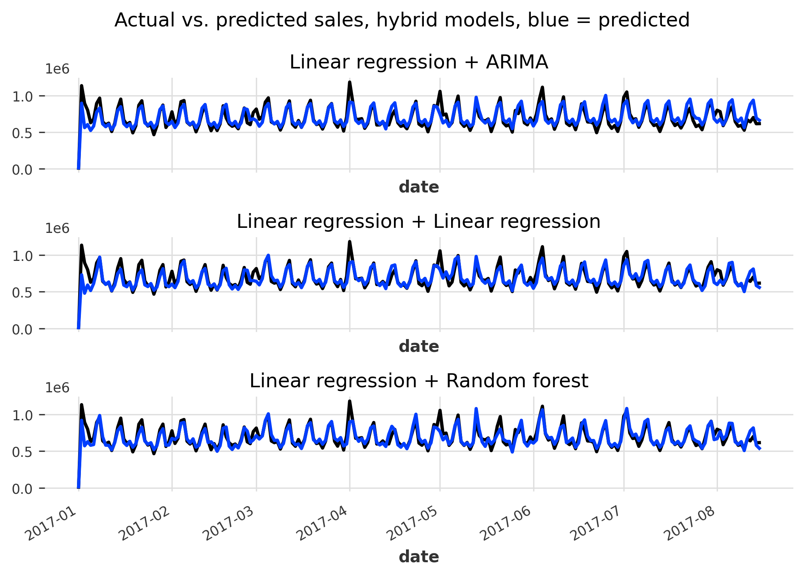

The performance of the 3 hybrids are similar overall, and it’s hard to
see big differences from the plots.

- The random forest did a better job of adjusting to some spikes and
  troughs, likely because it is able to select features and find
  interactions between predictors.

- Still, certain large spikes are partially unaccounted for, especially
  the sharp recovery after January 1st, and the spikes at the start of
  April and May 2017. These may be due to factors not documented in our
  dataset. Or they may be related to commemorations for the earthquake
  in April 2016.

### ARIMA model summary

Before carrying on with our best hybrid model, which is linear + random
forest, we can view the model summary of the ARIMA model for some
insight.

The AutoARIMA process has chosen an ARIMA(2, 0, 2) model, which uses the
last 2 lags and the last 2 forecast errors as predictors, along with our
covariates. Covariates x1 through x4 refer to
`sales_ema5, oil_ma28, onp_ma28 and trns_ma7` respectively.

``` python
print(model_arima.model.summary())
```

                                   SARIMAX Results                                
    ==============================================================================
    Dep. Variable:                      y   No. Observations:                 1461
    Model:               SARIMAX(2, 0, 2)   Log Likelihood                1475.404
    Date:                Wed, 08 Feb 2023   AIC                          -2932.807
    Time:                        16:58:06   BIC                          -2885.225
    Sample:                             0   HQIC                         -2915.058
                                   - 1461                                         
    Covariance Type:                  opg                                         
    ==============================================================================
                     coef    std err          z      P>|z|      [0.025      0.975]
    ------------------------------------------------------------------------------
    x1             0.1457      0.003     51.378      0.000       0.140       0.151
    x2            -0.0006      0.002     -0.373      0.709      -0.004       0.003
    x3             0.0040      0.001      2.808      0.005       0.001       0.007
    x4             0.0140      0.001     12.208      0.000       0.012       0.016
    ar.L1          0.9304      0.039     23.911      0.000       0.854       1.007
    ar.L2         -0.1716      0.043     -4.007      0.000      -0.256      -0.088
    ma.L1         -0.4195      0.040    -10.536      0.000      -0.498      -0.341
    ma.L2         -0.4297      0.043     -9.899      0.000      -0.515      -0.345
    sigma2         0.0078      0.000     48.948      0.000       0.007       0.008
    ===================================================================================
    Ljung-Box (L1) (Q):                   0.01   Jarque-Bera (JB):              2359.85
    Prob(Q):                              0.92   Prob(JB):                         0.00
    Heteroskedasticity (H):               1.06   Skew:                             0.74
    Prob(H) (two-sided):                  0.52   Kurtosis:                         9.05
    ===================================================================================

    Warnings:
    [1] Covariance matrix calculated using the outer product of gradients (complex-step).

The AIC score is not meaningful on its own without being compared to AIC
scores of other models, though smaller values (including negative)
indicate a better trade-off between variance explained and model
complexity.

- The first lag has a positive coefficient (`ar.L1`), so a higher value
  for lag 1 means a higher prediction for sales at T=0.

- Lag 2 and the forecast errors 1 & 2 (`ma.L1, ma.L2`) have a negative
  effect on the prediction. If lag 2 or the forecast errors increase,
  the prediction for T=0 is pulled back.

- The oil moving average (coefficient `x2`) does not have a significant
  effect. The sales EMA has a considerable positive effect, while the
  onpromotion and transactions MAs have small but significant positive
  effects.

- The p-value for the Ljung-Box test is 0.92, so the null hypothesis of
  residual independence is accepted. The residuals of our model are not
  correlated, so applying a third autoregressive model on them is not
  likely to improve predictions.

- The p-value for the heteroskedasticity test is 0.52, so the residuals
  meet the equal variance assumption. The model makes similar errors
  across the entire predicted time series, which means its performance
  is consistent.

- The null hypothesis for the Jarque-Bera test is zero skew & zero
  excess kurtosis in the distribution of the tested data. With a p-value
  of 0, the null hypothesis is rejected, and we can see the residuals
  have a skew of 0.74 and kurtosis of 9.05, compared to 0 and 3
  respectively for a normal distribution.

  - A high kurtosis distribution can be thought of as a narrower and
    taller distribution compared to normal, which likely means our
    residuals are packed tightly around zero (or possibly a non-zero
    value).
  - The positive skew means the residuals distribution has a right tail,
    i.e. is skewed to the left. This likely means the model overpredicts
    more than it underpredicts, which is preferable.

### Backtesting / Historical forecasts

We can retrieve the historical forecasts for model 2 as we did for model
1, and add them to model 1’s historical forecasts to retrieve historical
forecasts of the hybrid model.

- Keep in mind we performed time decomposition by fitting model 1 on
  2013-2016 and retrieving the fitted residuals for 2013-2016. This
  means these historical forecasts shouldn’t be interpreted as reliable
  out-of-sample validation.

- 2017 does not suffer from this issue, as 2017 time decomposed sales
  were predicted out-of-sample.

- As before, we’ll start by feeding the full year of 2013 as our initial
  training data, and expand our training window by 1 day in each
  iteration.

``` python
# Retrieve historical forecasts & residuals for linear + random forest

# Fit scaler on 2013
scaler.fit(ts_lagscovars[:365])

# Predict historical forecasts for 2014-2017
pred_hist2 = model_forest.historical_forecasts(
  trafo_log(ts_decomp), 
  future_covariates = scaler.transform(ts_lagscovars), start = 365, stride = 1,
  verbose = True) + ts_preds1[365:]

# Retrieve residuals for 2014-2017
res_hist2 = trafo_log(ts_sales[365:]) - pred_hist2

# Score historical forecasts for linear + random_forest
perf_scores(trafo_log(ts_sales[365:]), pred_hist2, model="Linear + random forest")
```

      0%|          | 0/1323 [00:00<?, ?it/s]

    Model: Linear + random forest
    RMSE: 61002.573
    RMSLE: 0.0944
    MAPE: 6.5231
    --------

With model 1, the overall historical forecasts performed considerably
worse than the 2017 predictions. With the hybrid, the historical
forecasts perform very close to the 2017 predictions. Again, this is
partly misleading due to the way we performed time decomposition, but
the improvements from accounting for cyclical effects in 2014-2015 are
likely a factor too.

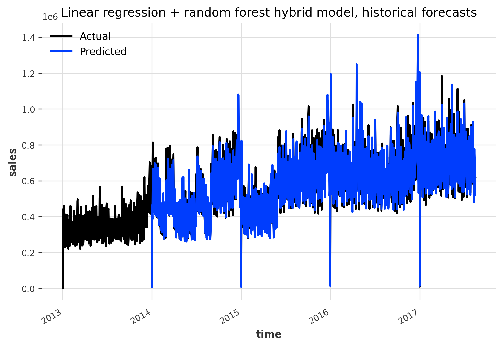

As we see from the historical forecasts plot, the cyclical fluctuations
in 2014 and H1 2015, which were mostly unaccounted for in model 1, are
matched nicely with the hybrid model. The spikes and troughs in the rest
of the data are also matched better.

### Residuals diagnosis & stationarity

We can diagnose the residuals of the hybrid model and test their
stationarity.

``` python
# Residuals diagnosis
_ = plot_residuals_analysis(res_hist2)
plt.show()
plt.close("all")

# PACF plot
_ = plot_pacf(res_hist2, max_lag=56)
_ = plt.title("Partial autocorrelation plot, hybrid model innovation residuals")
_ = plt.xlabel("Lags")
_ = plt.ylabel("PACF")
_ = plt.xticks(np.arange(0, 56, 10))
_ = plt.xticks(np.arange(0, 56, 1), minor=True)
_ = plt.grid(which='minor', alpha=0.5)
_ = plt.grid(which='major', alpha=1)
plt.show()
plt.close("all")
```

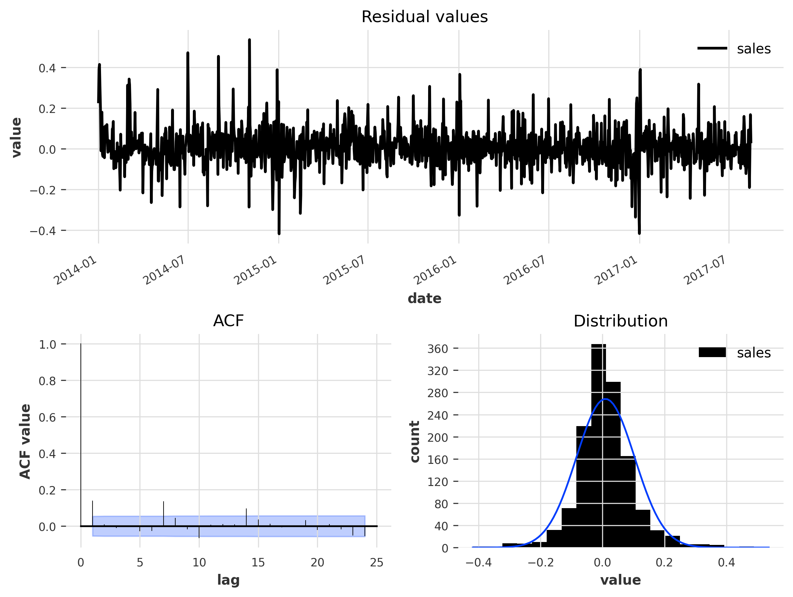

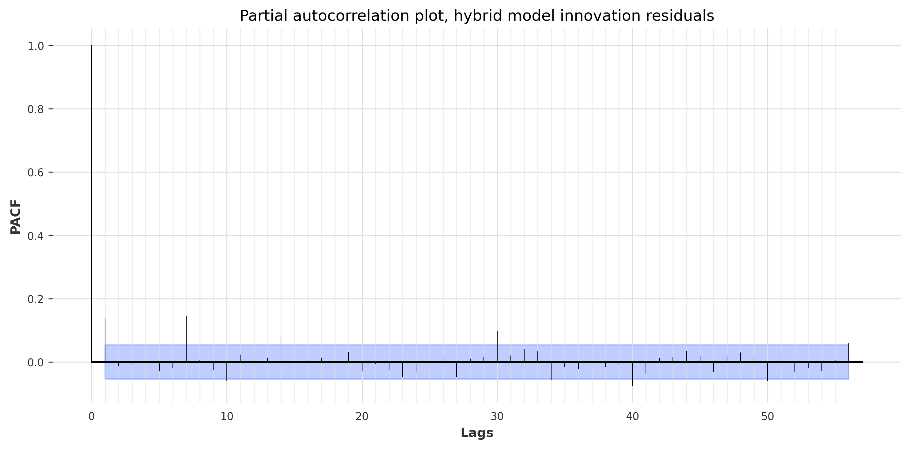

Overall, the residuals seem much closer to stationary.

- There are a few particularly large residuals, especially in 2014-2015,
  and at year starts.

- The distribution of residuals is more centered around 0, with smaller
  extreme values. This time, the extreme values are well-balanced
  between positive and negative. It seems the model overpredicts a bit
  more than it underpredicts (as the ARIMA summary suggested), which is
  preferable to the opposite.

- The ACF and PACF plots display almost no significant autocorrelation,
  except for a weak autocorrelation with lag 1 and 7.

``` python
# Stationarity tests on hybrid model residuals
print(
  "KPSS test p-value: " + 
  stationarity_test_kpss(res_hist2)[1].astype(str)
) # Null rejected = data is non-stationary

print(
  "ADF test p-value: " + 
  str(stationarity_test_adf(res_hist2)[1])
) # Null rejected = data is stationary around a constant
```

    KPSS test p-value: 0.017435346001820496
    ADF test p-value: 1.9338571199099526e-21

The stationarity tests are still in conflict:

- The p-value for the KPSS test is smaller than 0.05 , leading us to
  reject the null hypothesis of stationarity around a constant, though
  we are closer to stationarity compared to model 1’s test results.

- The p-value for the ADF test is practically 0, rejecting the null
  hypothesis of the presence of an unit root. This implies the data is
  stationary around a constant.

## Conclusion

In part 1 of this analysis, we were able to predict national daily
sales, aggregated across all categories and stores, pretty well.

- In the end, a hybrid model combining linear regression for the time
  effects, and random forest regression for the remainder, gave us the
  best results.

- However, the second model’s relative improvement was not huge, as the
  first model already performed very well.

- This means the time & seasonality effects in our data were much
  stronger than any “unexpected” cyclicality, which is what we’d
  intuitively expect for supermarket sales.

- Still, there was considerable cyclicality in 2014 and H1 2015, which
  showed up as relatively large values in the historical residuals of
  model 1. Applying autoregression & utilizing covariates in model 2
  helped us adjust for these.

- Autoregression is more “reactive” than predictive: It won’t predict an
  initial unexpected fluctuation in advance, but that fluctuation will
  enter the model as a predictor in the next period, and allow the model
  to adjust predictions for the following periods.

In part 2, we will attempt to make a competition submission, predicting
the daily sales for every store & category combination. That makes 33
categories across 54 stores, a total of 1782 series to generate a
prediction for.

- In part 1, with only one series to predict, we were able to perform
  manual exploratory analysis and carefully tailor our models,
  especially for time decomposition. It’s also generally easier to
  predict more aggregated series, as they are less noisy: The national
  sales likely fluctuate much less compared to sales in one store, one
  category.

- In part 2, we will have to come up with a strategy that will simplify
  our work while still yielding good predictions. Some of the 33 product
  categories likely have very different seasonality patterns. We’ll
  likely rely on more “automatic” models that are able to derive time
  effects & seasonality, such as AutoARIMA and more sophisticated neural
  networks available in Darts.

- We’ll also explore the topic of **hierarchical reconciliation**:
  Making sure our predictions are coherent within the levels of the time
  series hierarchy. There are several methods to reconcile predictions
  in a hierarchy, and it can even improve prediction accuracy.

Any comments or suggestions are welcome.
