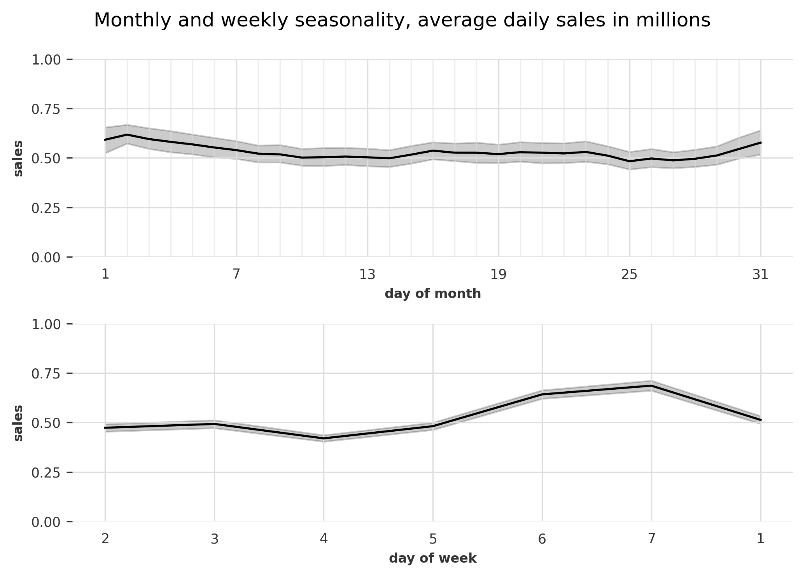
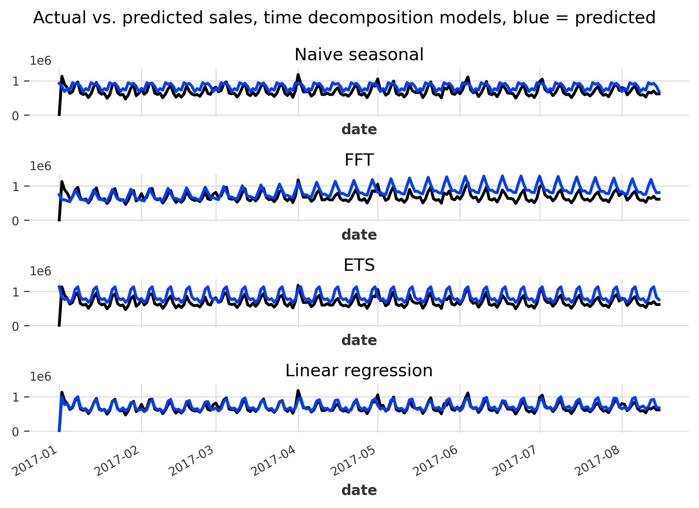
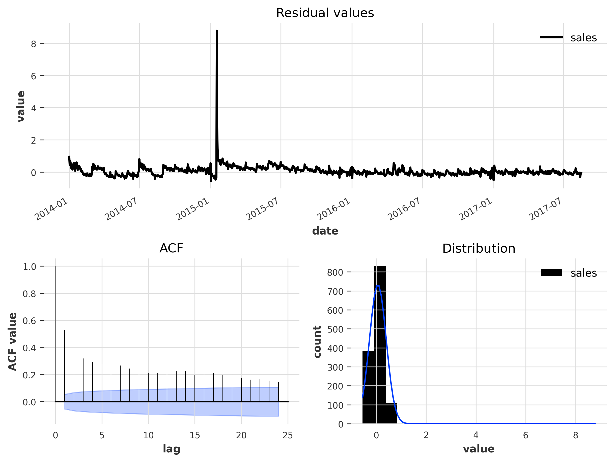
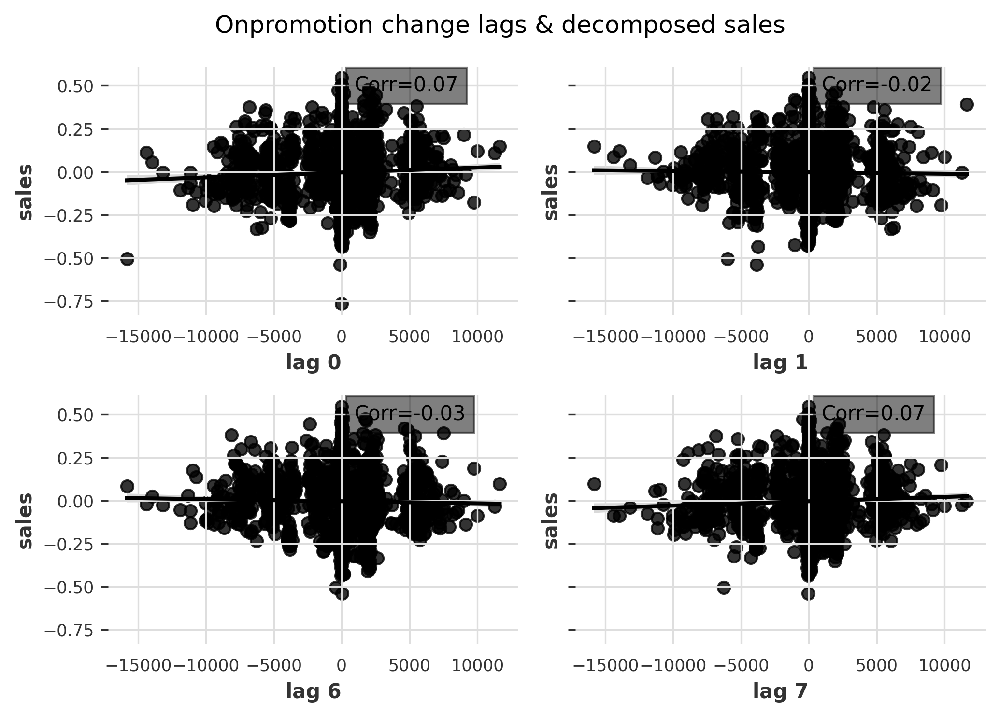
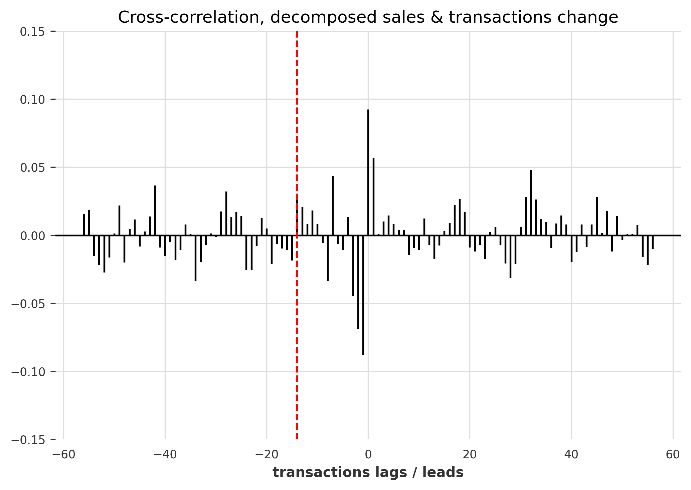
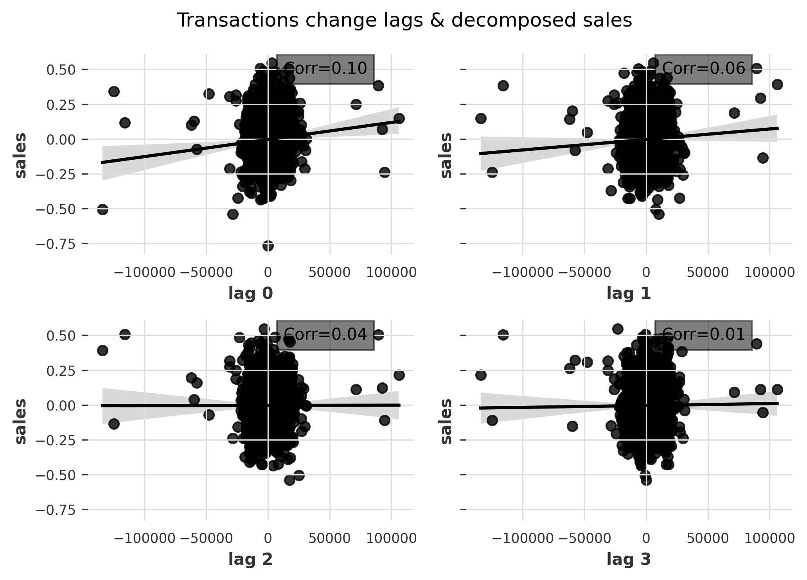
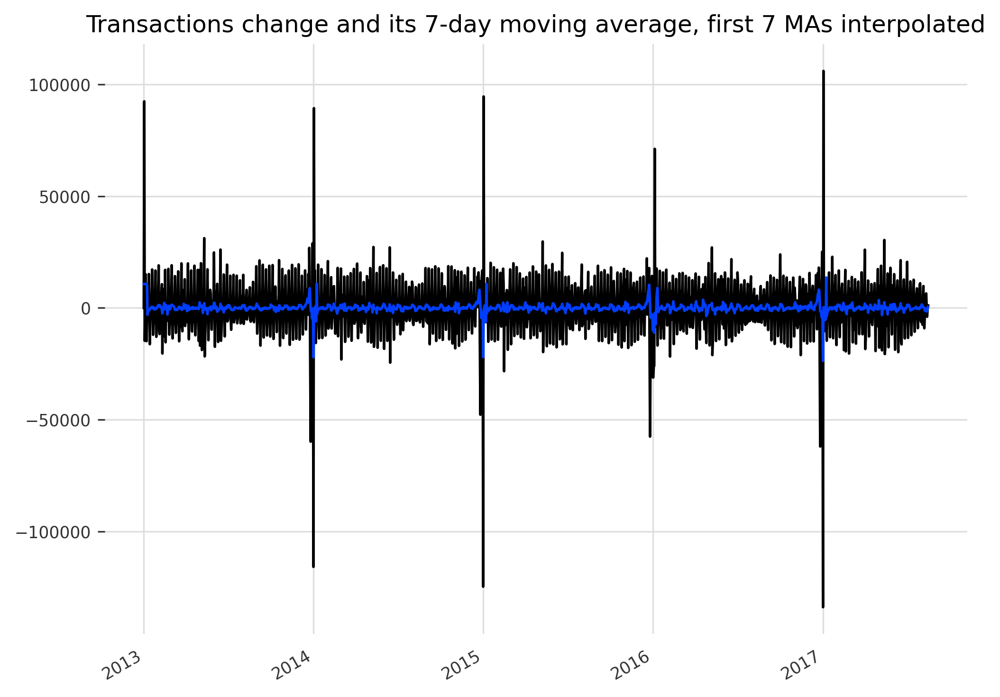
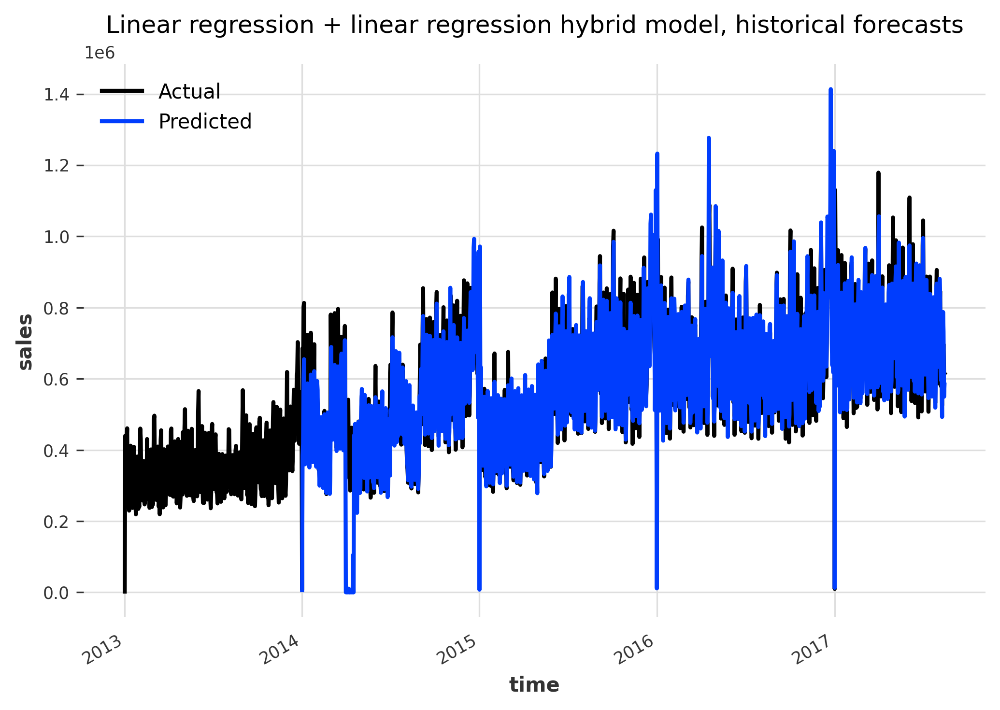
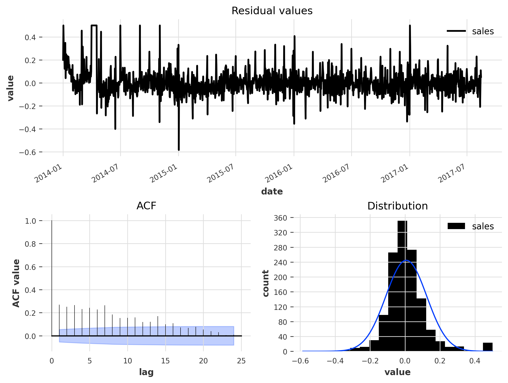
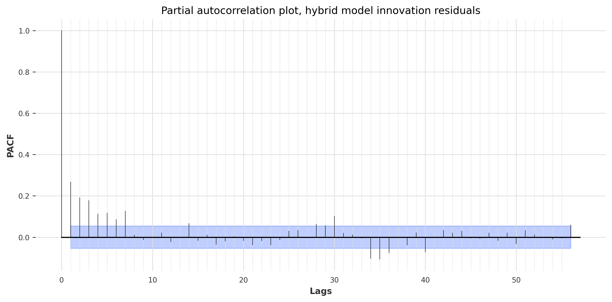

Time series regression - Store sales forecasting, part 1
================
Ahmet Zamanis

- <a href="#introduction" id="toc-introduction">Introduction</a>
- <a href="#data-preparation" id="toc-data-preparation">Data
  preparation</a>
- <a href="#overview-of-hybrid-modeling-approach"
  id="toc-overview-of-hybrid-modeling-approach">Overview of hybrid
  modeling approach</a>
- <a href="#exploratory-analysis-1-time-calendar-effects"
  id="toc-exploratory-analysis-1-time-calendar-effects">Exploratory
  analysis 1: Time &amp; calendar effects</a>
  - <a href="#trend" id="toc-trend">Trend</a>
  - <a href="#seasonality" id="toc-seasonality">Seasonality</a>
  - <a href="#autocorrelation-partial-autocorrelation"
    id="toc-autocorrelation-partial-autocorrelation">Autocorrelation &amp;
    partial autocorrelation</a>
  - <a href="#april-2016-earthquake" id="toc-april-2016-earthquake">April
    2016 Earthquake</a>
- <a href="#feature-engineering-time-calendar-features"
  id="toc-feature-engineering-time-calendar-features">Feature engineering:
  Time &amp; calendar features</a>
  - <a href="#calendar-effects-weekly-seasonality-features"
    id="toc-calendar-effects-weekly-seasonality-features">Calendar effects
    &amp; weekly seasonality features</a>
  - <a href="#trend-monthly-seasonality-features"
    id="toc-trend-monthly-seasonality-features">Trend &amp; monthly
    seasonality features</a>
- <a href="#model-1-time-effects-decomposition"
  id="toc-model-1-time-effects-decomposition">Model 1: Time effects
  decomposition</a>
  - <a href="#preprocessing" id="toc-preprocessing">Preprocessing</a>
  - <a href="#model-specification" id="toc-model-specification">Model
    specification</a>
  - <a href="#model-validation-predicting-2017-sales"
    id="toc-model-validation-predicting-2017-sales">Model validation:
    Predicting 2017 sales</a>
  - <a href="#rolling-crossvalidation"
    id="toc-rolling-crossvalidation">Rolling crossvalidation</a>
  - <a href="#residuals-diagnosis-stationarity"
    id="toc-residuals-diagnosis-stationarity">Residuals diagnosis &amp;
    stationarity</a>
  - <a href="#time-decomposition" id="toc-time-decomposition">Time
    decomposition</a>
- <a href="#exploratory-analysis-2-lags-covariates"
  id="toc-exploratory-analysis-2-lags-covariates">Exploratory analysis 2:
  Lags &amp; covariates</a>
  - <a href="#covariates-stationarity-differencing"
    id="toc-covariates-stationarity-differencing">Covariates stationarity
    &amp; differencing</a>
  - <a href="#sales-features" id="toc-sales-features">Sales features</a>
  - <a href="#oil-features" id="toc-oil-features">Oil features</a>
  - <a href="#onpromotion-features"
    id="toc-onpromotion-features">Onpromotion features</a>
  - <a href="#transactions-features"
    id="toc-transactions-features">Transactions features</a>
- <a href="#model-2-lags-covariates"
  id="toc-model-2-lags-covariates">Model 2: Lags &amp; covariates</a>
  - <a href="#preprocessing-1" id="toc-preprocessing-1">Preprocessing</a>
  - <a href="#model-specification-1" id="toc-model-specification-1">Model
    specification</a>
  - <a href="#model-validation-predicting-2017-sales-1"
    id="toc-model-validation-predicting-2017-sales-1">Model validation:
    Predicting 2017 sales</a>
  - <a href="#arima-model-summary" id="toc-arima-model-summary">ARIMA model
    summary</a>
  - <a href="#backtesting-historical-forecasts"
    id="toc-backtesting-historical-forecasts">Backtesting / Historical
    forecasts</a>
  - <a href="#residuals-diagnosis-stationarity-1"
    id="toc-residuals-diagnosis-stationarity-1">Residuals diagnosis &amp;
    stationarity</a>
- <a href="#conclusion" id="toc-conclusion">Conclusion</a>

## Introduction

This is a report on time series analysis & regression modeling,
performed in Python, mainly with the
[Darts](https://unit8co.github.io/darts/) library. The dataset is from
the [Kaggle Store Sales - Time Series
Forecasting](https://www.kaggle.com/competitions/store-sales-time-series-forecasting)
competition. The data consists of daily sales data for an Ecuadorian
supermarket chain between 2013 and 2017. This is part 1 of the analysis,
which will focus only on forecasting the daily national sales of the
chain, aggregated across all stores and categories. In part 2, we will
forecast the sales in each category - store combination as required by
the competition, and apply hierarchical reconciliation methods.

The main information source used extensively for this analysis is the
textbook [Forecasting: Principles and
Practice](https://otexts.com/fpp3/), written by Rob J. Hyndman and
George Athanasopoulos. The book is the most complete source on time
series analysis & forecasting I could find. It uses R and the
[tidyverts](https://tidyverts.org/) libraries for its examples, which
have the best time series analysis workflow among the R libraries I’ve
tried.

<details>
<summary>Show code</summary>

``` python
# Import libraries
import pandas as pd 
import numpy as np
import matplotlib.pyplot as plt
import seaborn as sns

# Set printing options
np.set_printoptions(suppress=True, precision=4)
pd.options.display.float_format = '{:.4f}'.format
pd.set_option('display.max_columns', None)

# Set plotting options
plt.rcParams['figure.dpi'] = 300
plt.rcParams['savefig.dpi'] = 300
plt.rcParams["figure.autolayout"] = True
```

</details>

## Data preparation

<details>
<summary>Show code</summary>

``` python
# Load original datasets
df_train = pd.read_csv("./OriginalData/train.csv", encoding="utf-8")
df_stores = pd.read_csv("./OriginalData/stores.csv", encoding="utf-8")
df_oil = pd.read_csv("./OriginalData/oil.csv", encoding="utf-8")
df_holidays = pd.read_csv("./OriginalData/holidays_events.csv", encoding="utf-8")
df_trans = pd.read_csv("./OriginalData/transactions.csv", encoding="utf-8")
```

</details>

The data is split into several .csv files. **train.csv** and
**test.csv** are the main datasets, consisting of daily sales data. The
training data ranges from 01-01-2013 to 15-08-2017, and the testing data
consists of the following 16 days until the end of August 2017. We won’t
do a competition submission in part 1, so we won’t work on the testing
data.

<details>
<summary>Show code</summary>

``` python
print(df_train.head(5))
```

</details>

       id        date  store_nbr      family  sales  onpromotion
    0   0  2013-01-01          1  AUTOMOTIVE 0.0000            0
    1   1  2013-01-01          1   BABY CARE 0.0000            0
    2   2  2013-01-01          1      BEAUTY 0.0000            0
    3   3  2013-01-01          1   BEVERAGES 0.0000            0
    4   4  2013-01-01          1       BOOKS 0.0000            0

- For each day, we have the sales in each store (out of a possible 54)
  and each product category (out of a possible 33). This amounts to 1782
  time series that need to be forecasted for the competition.

- **onpromotion** is the number of items on sale in one day, in one
  category & store combination.

**stores.csv** contains more information about each store: The city,
state, store type and store cluster.

<details>
<summary>Show code</summary>

``` python
print(df_stores.head(5))
```

</details>

       store_nbr           city                           state type  cluster
    0          1          Quito                       Pichincha    D       13
    1          2          Quito                       Pichincha    D       13
    2          3          Quito                       Pichincha    D        8
    3          4          Quito                       Pichincha    D        9
    4          5  Santo Domingo  Santo Domingo de los Tsachilas    D        4

**holidays.csv** contains information about local (city-wide), regional
(state-wide) and national holidays, and some special nation-wide events
that occured in the time period. We will use these along with the
stores’ location data to create calendar features, to adjust for effects
of holidays and special events on sales.

<details>
<summary>Show code</summary>

``` python
print(df_holidays.head(5))
```

</details>

             date     type    locale locale_name                    description  \
    0  2012-03-02  Holiday     Local       Manta             Fundacion de Manta   
    1  2012-04-01  Holiday  Regional    Cotopaxi  Provincializacion de Cotopaxi   
    2  2012-04-12  Holiday     Local      Cuenca            Fundacion de Cuenca   
    3  2012-04-14  Holiday     Local    Libertad      Cantonizacion de Libertad   
    4  2012-04-21  Holiday     Local    Riobamba      Cantonizacion de Riobamba   

       transferred  
    0        False  
    1        False  
    2        False  
    3        False  
    4        False  

**oil.csv** consists of the daily oil prices in the time period. Ecuador
has an oil-dependent economy, so this may be an useful predictor of the
cyclicality in supermarket sales. We don’t have the oil price for the
first day of the data.

<details>
<summary>Show code</summary>

``` python
print(df_oil.head(5))
```

</details>

             date  dcoilwtico
    0  2013-01-01         NaN
    1  2013-01-02     93.1400
    2  2013-01-03     92.9700
    3  2013-01-04     93.1200
    4  2013-01-07     93.2000

**transactions.csv** consists of the daily number of transactions at
each store. Note that only store 25 is recorded for the first day, so
it’s likely all stores aren’t open in all days.

<details>
<summary>Show code</summary>

``` python
print(df_trans.head(5))
```

</details>

             date  store_nbr  transactions
    0  2013-01-01         25           770
    1  2013-01-02          1          2111
    2  2013-01-02          2          2358
    3  2013-01-02          3          3487
    4  2013-01-02          4          1922

We will rename some columns from the datasets and merge the
supplementary information into the main sales dataset. We’ll aggregate
daily transactions across all stores beforehand, as we are only
interested in predicting daily national sales.

<details>
<summary>Show code</summary>

``` python
# Rename columns
df_holidays = df_holidays.rename(columns = {"type":"holiday_type"})
df_oil = df_oil.rename(columns = {"dcoilwtico":"oil"})
df_stores = df_stores.rename(columns = {
  "type":"store_type", "cluster":"store_cluster"})

# Aggregate daily transactions across all stores
df_trans_agg = df_trans.groupby("date").transactions.sum()

# Add columns from oil, stores and transactions datasets into main data
df_train = df_train.merge(df_trans_agg, on = ["date"], how = "left")
df_train = df_train.merge(df_oil, on = "date", how = "left")
df_train = df_train.merge(df_stores, on = "store_nbr", how = "left")
```

</details>

Incorporating the holidays information into the sales dataset will
require more work. We’ll create a four binary columns that record
whether a day is a local, regional or national holiday, or had a special
event.

<details>
<summary>Show code</summary>

``` python
# Split holidays data into local, regional, national and events
events = df_holidays[df_holidays["holiday_type"] == "Event"].copy()
df_holidays = df_holidays.drop(labels=(events.index), axis=0)
local = df_holidays.loc[df_holidays["locale"] == "Local"].copy()
regional = df_holidays.loc[df_holidays["locale"] == "Regional"].copy()
national = df_holidays.loc[df_holidays["locale"] == "National"].copy()
```

</details>

There are cases of multiple holidays or events sharing the same date and
locale. We’ll inspect the duplicates and drop them so we don’t have
issues in feature engineering.

- Rows with **transferred = True** are dates that are normally holidays,
  but the holiday was transferred to another date. In other words, these
  are not holidays in effect.

- Rows with **holiday_type = Transfer** are dates that are not normally
  holidays, but had another holiday transferred to this date. In other
  words, these are holidays in effect.

- Rows with **holiday_type = Bridge** are dates that are not normally
  holidays, but were added to extend preceding / following holidays.

<details>
<summary>Show code</summary>

``` python
# Inspect local holidays sharing same date & locale
print(local[local.duplicated(["date", "locale_name"], keep = False)])
```

</details>

               date holiday_type locale locale_name  \
    264  2016-07-24   Additional  Local   Guayaquil   
    265  2016-07-24     Transfer  Local   Guayaquil   

                             description  transferred  
    264         Fundacion de Guayaquil-1        False  
    265  Traslado Fundacion de Guayaquil        False  

<details>
<summary>Show code</summary>

``` python
# Drop the transfer row
local = local.drop(265, axis = 0)
```

</details>
<details>
<summary>Show code</summary>

``` python
# Inspect regional holidays sharing same date & locale. None exist
print(regional[regional.duplicated(["date", "locale_name"], keep = False)])
```

</details>

    Empty DataFrame
    Columns: [date, holiday_type, locale, locale_name, description, transferred]
    Index: []

<details>
<summary>Show code</summary>

``` python
# Inspect national holidays sharing same date & locale
print(national[national.duplicated(["date"], keep = False)])
```

</details>

               date holiday_type    locale locale_name                description  \
    35   2012-12-24       Bridge  National     Ecuador             Puente Navidad   
    36   2012-12-24   Additional  National     Ecuador                  Navidad-1   
    39   2012-12-31       Bridge  National     Ecuador  Puente Primer dia del ano   
    40   2012-12-31   Additional  National     Ecuador       Primer dia del ano-1   
    156  2014-12-26       Bridge  National     Ecuador             Puente Navidad   
    157  2014-12-26   Additional  National     Ecuador                  Navidad+1   

         transferred  
    35         False  
    36         False  
    39         False  
    40         False  
    156        False  
    157        False  

<details>
<summary>Show code</summary>

``` python
# Drop bridge days
national = national.drop([35, 39, 156], axis = 0)
```

</details>
<details>
<summary>Show code</summary>

``` python
# Inspect events sharing same date
print(events[events.duplicated(["date"], keep = False)])
```

</details>

               date holiday_type    locale locale_name          description  \
    244  2016-05-08        Event  National     Ecuador  Terremoto Manabi+22   
    245  2016-05-08        Event  National     Ecuador      Dia de la Madre   

         transferred  
    244        False  
    245        False  

<details>
<summary>Show code</summary>

``` python
# Drop the earthquake row as it is a one-time event
events = events.drop(244, axis = 0)
```

</details>

After getting rid of duplicates, we can create binary columns that
signify whether a date was a local / regional / national holiday /
event. We’ll merge these back into the sales data.

<details>
<summary>Show code</summary>

``` python
# Add local_holiday binary column to local holidays data, to be merged into main 
# data.
local["local_holiday"] = (
  local.holiday_type.isin(["Transfer", "Additional", "Bridge"]) |
  ((local.holiday_type == "Holiday") & (local.transferred == False))
  ).astype(int)

# Add regional_holiday binary column to regional holidays data
regional["regional_holiday"] = (
  regional.holiday_type.isin(["Transfer", "Additional", "Bridge"]) |
  ((regional.holiday_type == "Holiday") & (regional.transferred == False))
  ).astype(int)

# Add national_holiday binary column to national holidays data
national["national_holiday"] = (
  national.holiday_type.isin(["Transfer", "Additional", "Bridge"]) |
  ((national.holiday_type == "Holiday") & (national.transferred == False))
  ).astype(int)

# Add event column to events
events["event"] = 1

# Merge local holidays binary column to main data, on date and city
local_merge = local.drop(
  labels = [
    "holiday_type", "locale", "description", "transferred"], axis = 1).rename(
      columns = {"locale_name":"city"})
df_train = df_train.merge(local_merge, how="left", on=["date", "city"])
df_train["local_holiday"] = df_train["local_holiday"].fillna(0).astype(int)

# Merge regional holidays binary column to main data
regional_merge = regional.drop(
  labels = [
    "holiday_type", "locale", "description", "transferred"], axis = 1).rename(
      columns = {"locale_name":"state"})
df_train = df_train.merge(regional_merge, how="left", on=["date", "state"])
df_train["regional_holiday"] = df_train["regional_holiday"].fillna(0).astype(int)

# Merge national holidays binary column to main data, on date
national_merge = national.drop(
  labels = [
    "holiday_type", "locale", "locale_name", "description", 
    "transferred"], axis = 1)
df_train = df_train.merge(national_merge, how="left", on="date")
df_train["national_holiday"] = df_train["national_holiday"].fillna(0).astype(int)

# Merge events binary column to main data
events_merge = events.drop(
  labels = [
    "holiday_type", "locale", "locale_name", "description", 
    "transferred"], axis = 1)
df_train = df_train.merge(events_merge, how="left", on="date")
df_train["event"] = df_train["event"].fillna(0).astype(int)
```

</details>

We’ll set the **date** column to a DateTimeIndex, and view the sales
data with the added columns. Remember that the transactions column is
now the national transactions across all stores in one day.

<details>
<summary>Show code</summary>

``` python
# Set datetime index
df_train = df_train.set_index(pd.to_datetime(df_train.date))
df_train = df_train.drop("date", axis=1)
print(df_train.head(5))
```

</details>

                id  store_nbr      family  sales  onpromotion  transactions  oil  \
    date                                                                           
    2013-01-01   0          1  AUTOMOTIVE 0.0000            0      770.0000  NaN   
    2013-01-01   1          1   BABY CARE 0.0000            0      770.0000  NaN   
    2013-01-01   2          1      BEAUTY 0.0000            0      770.0000  NaN   
    2013-01-01   3          1   BEVERAGES 0.0000            0      770.0000  NaN   
    2013-01-01   4          1       BOOKS 0.0000            0      770.0000  NaN   

                 city      state store_type  store_cluster  local_holiday  \
    date                                                                    
    2013-01-01  Quito  Pichincha          D             13              0   
    2013-01-01  Quito  Pichincha          D             13              0   
    2013-01-01  Quito  Pichincha          D             13              0   
    2013-01-01  Quito  Pichincha          D             13              0   
    2013-01-01  Quito  Pichincha          D             13              0   

                regional_holiday  national_holiday  event  
    date                                                   
    2013-01-01                 0                 1      0  
    2013-01-01                 0                 1      0  
    2013-01-01                 0                 1      0  
    2013-01-01                 0                 1      0  
    2013-01-01                 0                 1      0  

With financial data, it’s a good idea to perform CPI adjustment before
analysis, to remove the effects of inflation / deflation on our models
and predictions. We’ll CPI adjust the sales and oil prices columns with
2010 as our base year. The CPI values for Ecuador in the time period
were retrieved
[here](https://data.worldbank.org/indicator/FP.CPI.TOTL?end=2017&locations=EC&start=2010&view=chart).

- We’ll use the yearly CPI values for simplicity, but it’s possible to
  use monthly CPI as well.

<details>
<summary>Show code</summary>

``` python
# CPI adjust sales and oil, with CPI 2010 = 100
cpis = {
  "2010": 100, "2013": 112.8, "2014": 116.8, "2015": 121.5, "2016": 123.6, 
  "2017": 124.1
  }
  
for year in [2013, 2014, 2015, 2016, 2017]:
  df_train.loc[df_train.index.year == year, "sales"] = df_train.loc[
    df_train.index.year == year, "sales"] / cpis[str(year)] * cpis["2010"]
  df_train.loc[df_train.index.year == year, "oil"] = df_train.loc[
    df_train.index.year == year, "oil"] / cpis[str(year)] * cpis["2010"]
```

</details>

We have some columns with missing values in our training data.

<details>
<summary>Show code</summary>

``` python
# Check missing values in each column
pd.isnull(df_train).sum()
```

</details>

    id                       0
    store_nbr                0
    family                   0
    sales                    0
    onpromotion              0
    transactions          3564
    oil                 928422
    city                     0
    state                    0
    store_type               0
    store_cluster            0
    local_holiday            0
    regional_holiday         0
    national_holiday         0
    event                    0
    dtype: int64

We will interpolate the missing values in the oil and transactions
columns using time interpolation.

- This performs linear interpolation, but also takes the date-time index
  of observations into account.

- If we don’t set `limit_direction = "both"`, the first value for oil
  won’t be interpolated.

<details>
<summary>Show code</summary>

``` python
df_train["oil"] = df_train["oil"].interpolate("time", limit_direction = "both")
df_train["transactions"] = df_train["transactions"].interpolate(
  "time", limit_direction = "both")
```

</details>

We will now aggregate daily sales across all categories and stores, to
retrieve our target variable. We have 1684 days of national sales data.

<details>
<summary>Show code</summary>

``` python
sales = df_train.groupby("date").sales.sum()
sales
```

</details>

    date
    2013-01-01     2226.6126
    2013-01-02   439798.2429
    2013-01-03   320444.3538
    2013-01-04   314237.3024
    2013-01-05   423182.7316
                     ...    
    2017-08-11   665893.4102
    2017-08-12   638703.0903
    2017-08-13   697533.9867
    2017-08-14   613152.6238
    2017-08-15   614554.3400
    Name: sales, Length: 1684, dtype: float64

We will create a Darts
[TimeSeries](https://unit8co.github.io/darts/generated_api/darts.timeseries.html)
with our target variable.

<details>
<summary>Show code</summary>

``` python
from darts import TimeSeries

ts_sales = TimeSeries.from_series(
  sales, 
  freq="D" # Time series frequency is daily
  )
print(ts_sales)
```

</details>

    <TimeSeries (DataArray) (date: 1688, component: 1, sample: 1)>
    array([[[  2226.6126]],

           [[439798.2429]],

           [[320444.3538]],

           ...,

           [[697533.9867]],

           [[613152.6238]],

           [[614554.34  ]]])
    Coordinates:
      * date       (date) datetime64[ns] 2013-01-01 2013-01-02 ... 2017-08-15
      * component  (component) object 'sales'
    Dimensions without coordinates: sample
    Attributes:
        static_covariates:  None
        hierarchy:          None

- Each Pandas series / dataframe column passed is stored as a component
  in the Darts TS. The date-time index is stored in `.time_index`**.**
  We had 1684 rows in our Pandas series, but the Darts TS has 1688
  dates. This means our series had some missing dates, which Darts
  created automatically. We’ll fill in the values for these dates later.

- To create a multivariate time series, we create a Pandas dataframe
  with each time series as a column, and a common date-time index. When
  we pass this dataframe to TimeSeries, we’ll have each time series as a
  component. If the multivariate time series has a **hierarchy**,
  i.e. if they sum up together in a certain way, we can map that
  hierarchy as a dictionary to later perform hierarchical
  reconciliation. We will explore this further in part 2 of the
  analysis.

- **Static covariates** are time-invariant covariates that may be used
  as predictors in global models (models trained on multiple time series
  at once). They are stored together with the target series in the Darts
  TS. In our case, the location, type or cluster of a store may be used
  as static covariates, but for part 1 of our analysis we are looking at
  national sales, so these aren’t applicable.

## Overview of hybrid modeling approach

A time series can be written as the sum of several components:

- **Trend:** The long-term change.

- **Seasonality:** A fluctuation (or several) that repeats based on a
  fixed, known time period, often related to how we measure time and
  schedule our lives. For example, the fluctuation of retail store sales
  across days of a week, or electricity usage across hours of a day.

- **Cyclicality:** A fluctuation that does not repeat based on a fixed,
  known time period, often caused by temporary factors. For example, the
  effect of a sharp increase / decrease in oil prices on car sales.

- **Remainder / Error:** The unpredictable component of the time series,
  at least with the available data and methods.

When analyzing a time series with plots, it can be difficult to
determine the nature and causes of fluctuations. It can be especially
tricky to tell apart the cyclical effects from repeating seasonality.
Because of this, we will split our analysis and modeling into two steps:

- In step 1, we will analyze the time effects: The trend, seasonality
  and calendar effects (such as holidays & events). We’ll build a model
  that predicts these effects and remove the predictions from the time
  series, leaving the effects of cyclicality and the unpredictable
  component. This is called **time decomposition.**

- In step 2, we will re-analyze the time-decomposed time series, this
  time considering the effects of covariates and lagged values of sales
  itself as predictors, to try and account for the cyclicality. We’ll
  build a model that uses these predictors, train it on the decomposed
  sales, and add up the predictions of both models to arrive at our
  final predictions.

- This approach is called a **hybrid model.** It allows us to
  differentiate and separately model different time series components.
  We can also use more than one type of algorithm and combine their
  strengths.

## Exploratory analysis 1: Time & calendar effects

### Trend

Let’s start by analyzing the overall trend in sales, with a simple time
series plot. Darts offers the ability to plot time series quickly.

<details>
<summary>Show code</summary>

``` python
_ =  ts_sales.plot()
_ =  plt.ylabel("Daily sales, millions")
plt.show()
plt.close()
```

</details>


The time series plot shows us several things:

- Supermarket sales show an increasing trend over the years. The trend
  is close to linear overall, but the rate of increase declines roughly
  from the start of 2015. Consider one straight line from 2013 to 2015,
  and a second, less steep one from 2015 to the end.

- Sales mostly fluctuate around the trend with a repeating pattern,
  which suggests strong seasonality. However, there are also sharp
  deviations from the trend in certain periods, mainly across 2014 and
  at the start of 2015. These are likely cyclical in nature.

- The “waves” of seasonal fluctuations seem to be getting bigger over
  time. This suggests we should use a multiplicative time decomposition
  instead of additive.

- Sales decline very sharply in the first day of every year, almost to
  zero.

### Seasonality

#### Annual seasonality

Let’s look at annual seasonality: How sales fluctuate over a year based
on quarters, months, weeks of a year and days of a year. In the plots
below, we have the daily sales averaged by each respective calendar
period, colored by each year in the data. The confidence bands indicate
the minimum and maximum daily sales in each respective period (in the
last plot, we just have the daily sales without any averaging).

<details>
<summary>Show code</summary>

``` python
# FIG1: Annual seasonality, period averages
fig1, axes1 = plt.subplots(2,2, sharey=True)
_ =  fig1.suptitle('Annual seasonality: Average daily sales in given time periods, millions')

# Average sales per quarter of year
_ =  sns.lineplot(
  ax = axes1[0,0],
  x = sales.index.quarter.astype(str), 
  y = (sales / 1000000), 
  hue = sales.index.year.astype(str), data=sales, legend=False)
_ =  axes1[0,0].set_xlabel("quarter", fontsize=8)
_ =  axes1[0,0].set_ylabel("sales", fontsize=8)
_ =  axes1[0,0].tick_params(axis='both', which='major', labelsize=6)

# Average sales per month of year
_ =  sns.lineplot(
  ax = axes1[0,1],
  x = sales.index.month.astype(str), 
  y = (sales / 1000000), 
  hue = sales.index.year.astype(str), data=sales)
_ =  axes1[0,1].set_xlabel("month", fontsize=8)
_ =  axes1[0,1].set_ylabel("sales",fontsize=8)
_ =  axes1[0,1].legend(title = "year", bbox_to_anchor=(1.05, 1.0), fontsize="small", loc='best')
_ =  axes1[0,1].tick_params(axis='both', which='major', labelsize=6)

# Average sales per week of year
_ =  sns.lineplot(
  ax = axes1[1,0],
  x = sales.index.week, 
  y = (sales / 1000000), 
  hue = sales.index.year.astype(str), data=sales, legend=False)
_ =  axes1[1,0].set_xlabel("week of year", fontsize=8)
_ =  axes1[1,0].set_ylabel("sales",fontsize=8)
_ =  axes1[1,0].tick_params(axis='both', which='major', labelsize=6)
_ =  axes1[1,0].xaxis.set_ticks(np.arange(0, 52, 10))

# Average sales per day of year
_ =  sns.lineplot(
  ax = axes1[1,1],
  x = sales.index.dayofyear, 
  y = (sales / 1000000), 
  hue = sales.index.year.astype(str), data=sales, legend=False)
_ =  axes1[1,1].set_xlabel("day of year", fontsize=8)
_ =  axes1[1,1].set_ylabel("sales",fontsize=8)
_ =  axes1[1,1].tick_params(axis='both', which='major', labelsize=6)
_ =  axes1[1,1].xaxis.set_ticks(np.arange(0, 365, 100))

# Show fig1
plt.show()
plt.close("all")
```

</details>


- **Quarterly:** Sales do not seem to have a considerable quarterly
  seasonality pattern. However, the plot still shows us a few things:

  - Sales generally slightly increase over a year, but the trend may be
    stagnating / declining at the end of our data in 2017.

  - In Q2 2014, there was a considerable drop. Sales declined almost to
    the level of Q2 2013. This was likely a cyclical effect.

- **Monthly:** Sales do seem to fluctuate slightly over months, but
  there’s no clear seasonal pattern that’s apparent across all years.
  However, sales seem to sharply increase in November and December every
  year, likely due to Christmas.

  - The cyclicality in 2014 is seen in more detail: Sales dropped almost
    to their 2013 levels in certain months, and recovered sharply in
    others.

  - We also see a considerable drop in the first half of 2015, where
    sales dropped roughly to 2014 levels, followed by a recovery.

  - There is a sharp increase in April 2016, where sales were as high as
    2017 levels. This is due to a large earthquake that happened in
    April 16 2016, and the related relief efforts.

- **Weekly:** The seasonal patterns are more visible in the weekly plot,
  as we see the “waves” of fluctuation line up across years. It’s very
  likely the data has strong weekly seasonality, which is what we’d
  expect from supermarket sales.

  - The data for 2017 ends after August 15, so the sharp decline
    afterwards is misleading, though there may still be a stagnation /
    decline in the overall trend.

  - The sharp decline at the end of 2016 is also misleading, as 2016 was
    a 366-day year.

- **Daily:** This plot is a bit noisy, but the very similar fluctuations
  across all years indicate the data is strongly seasonal. It also
  highlights some cyclical effects such as the April 2016 earthquake and
  the 2014 drops.

Another way to look at annual seasonality is to average sales in a
certain calendar period across all years, without grouping by year.

<details>
<summary>Show code</summary>

``` python
# FIG1.1: Annual seasonality, averaged over years
fig11, axes11 = plt.subplots(2,2, sharey=True)
_ = fig11.suptitle('Annual seasonality: Average daily sales in given time periods,\n across all years, millions');

# Average sales per quarter of year
_ = sns.lineplot(
  ax = axes11[0,0],
  x = sales.index.quarter.astype(str), 
  y = (sales / 1000000), 
  data=sales, legend=False)
_ = axes11[0,0].set_xlabel("quarter", fontsize=8)
_ = axes11[0,0].set_ylabel("sales", fontsize=8)
_ = axes11[0,0].tick_params(axis='both', which='major', labelsize=6)

# Average sales per month of year
_ = sns.lineplot(
  ax = axes11[0,1],
  x = sales.index.month.astype(str), 
  y = (sales / 1000000), 
  data=sales)
_ = axes11[0,1].set_xlabel("month", fontsize=8)
_ = axes11[0,1].set_ylabel("sales",fontsize=8)
_ = axes11[0,1].tick_params(axis='both', which='major', labelsize=6)

# Average sales per week of year
_ = sns.lineplot(
  ax = axes11[1,0],
  x = sales.index.week, 
  y = (sales / 1000000), 
  data=sales, legend=False)
_ = axes11[1,0].set_xlabel("week of year", fontsize=8)
_ = axes11[1,0].set_ylabel("sales",fontsize=8)
_ = axes11[1,0].tick_params(axis='both', which='major', labelsize=6)
_ = axes11[1,0].xaxis.set_ticks(np.arange(0, 52, 10))

# Average sales per day of year
_ = sns.lineplot(
  ax = axes11[1,1],
  x = sales.index.dayofyear, 
  y = (sales / 1000000), 
  data=sales, legend=False)
_ = axes11[1,1].set_xlabel("day of year", fontsize=8)
_ = axes11[1,1].set_ylabel("sales",fontsize=8)
_ = axes11[1,1].tick_params(axis='both', which='major', labelsize=6)
_ = axes11[1,1].xaxis.set_ticks(np.arange(0, 365, 100))

# Show fig1.1
plt.show()
plt.close("all")
```

</details>


This shows us the “overall” seasonality pattern across all years: We
likely have a strong weekly seasonality pattern that holds across the
years, and some monthly seasonality especially towards December.

#### Monthly & weekly seasonality

Now let’s look at seasonality across days of a month and days of a week.
These will likely be the most important seasonality patterns in
supermarket sales. There are three ways to look at these plots: First we
will group them by year.

<details>
<summary>Show code</summary>

``` python
# FIG2: Monthly and weekly seasonality
fig2, axes2 = plt.subplots(2)
_ = fig2.suptitle('Monthly and weekly seasonality, average daily sales in millions')

# Average sales per day of month
_ = sns.lineplot(
  ax = axes2[0],
  x = sales.index.day, 
  y = (sales / 1000000), 
  hue = sales.index.year.astype(str), data=sales)
_ = axes2[0].legend(title = "year", bbox_to_anchor=(1.05, 1.0), fontsize="small", loc='best')
_ = axes2[0].set_xlabel("day of month", fontsize=8)
_ = axes2[0].set_ylabel("sales", fontsize=8)
_ = axes2[0].xaxis.set_ticks(np.arange(1, 32, 6))
_ = axes2[0].xaxis.set_ticks(np.arange(1, 32, 1), minor=True)
_ = axes2[0].yaxis.set_ticks(np.arange(0, 1.25, 0.25))
_ = axes2[0].grid(which='minor', alpha=0.5)
_ = axes2[0].grid(which='major', alpha=1)

# Average sales per day of week
_ = sns.lineplot(
  ax = axes2[1],
  x = (sales.index.dayofweek+1).astype(str), 
  y = (sales / 1000000), 
  hue = sales.index.year.astype(str), data=sales, legend=False)
_ = axes2[1].set_xlabel("day of week", fontsize=8)
_ = axes2[1].set_ylabel("sales", fontsize=8)
_ = axes2[1].yaxis.set_ticks(np.arange(0, 1.25, 0.25))

# Show fig2
plt.show()
plt.close("all")
```

</details>


- The weekly seasonality pattern across days of a week is clear. Sales
  are lowest in Thursdays, increase and peak at Sundays, then drop on
  Mondays. The pattern holds in all years.

- The monthly seasonality across days of a month isn’t as strong, but
  looks considerable. Sales are generally highest at the start of a
  month, likely because most salaries are paid at the end of a month,
  though the competition information also says salaries are paid
  biweekly, in the middle and at the end of each month.

We can look at the same plots grouped by month. The confidence bands are
suppressed as they make the plots hard to read.

<details>
<summary>Show code</summary>

``` python
# FIG2.1: Monthly and weekly seasonality, colored by month
fig21, axes21 = plt.subplots(2)
_ = fig21.suptitle('Monthly and weekly seasonality, average daily sales in millions')

# Average sales per day of month, colored by month
_ = sns.lineplot(
  ax = axes21[0],
  x = sales.index.day, 
  y = (sales / 1000000), 
  hue = sales.index.month.astype(str), data=sales, errorbar=None)
_ = axes21[0].legend(title = "month", bbox_to_anchor=(1.05, 1.0), fontsize="x-small", loc='best')
_ = axes21[0].set_xlabel("day of month", fontsize=8)
_ = axes21[0].set_ylabel("sales", fontsize=8)
_ = axes21[0].xaxis.set_ticks(np.arange(1, 32, 6))
_ = axes21[0].xaxis.set_ticks(np.arange(1, 32, 1), minor=True)
_ = axes21[0].yaxis.set_ticks(np.arange(0, 1.25, 0.25))
_ = axes21[0].grid(which='minor', alpha=0.5)
_ = axes21[0].grid(which='major', alpha=1)

# Average sales per day of week, colored by month
_ = sns.lineplot(
  ax = axes21[1],
  x = (sales.index.dayofweek+1).astype(str), 
  y = (sales / 1000000), 
  hue = sales.index.month.astype(str), data=sales, errorbar=None, legend=None)
_ = axes21[1].set_xlabel("day of week", fontsize=8)
_ = axes21[1].set_ylabel("sales", fontsize=8)
_ = axes21[1].yaxis.set_ticks(np.arange(0, 1.25, 0.25))

# Show fig2.1
plt.show()
plt.close("all")
```

</details>


This plot shows us the monthly and weekly seasonality pattern generally
holds across all months, but December is a notable exception:

- Sales in December are considerably higher roughly from the 13th, due
  to Christmas approaching. The Christmas peak seems to happen in the
  23th, followed by a decline, and another sharp increase in the 30th.

- The sales by day of week are also higher in December for every day,
  but the pattern of the weekly seasonality is the same.

- We can also see that sales decline very sharply in January 1st, almost
  to zero, and make a considerably sharp recovery in the 2nd.

And finally, without any grouping: The averages across all years and
months.

<details>
<summary>Show code</summary>

``` python
# FIG2.2: Monthly and weekly seasonality, average across years
fig22, axes22 = plt.subplots(2)
_ =  fig22.suptitle('Monthly and weekly seasonality, average daily sales in millions')

# Average sales per day of month
_ =  sns.lineplot(
  ax = axes22[0],
  x = sales.index.day, 
  y = (sales / 1000000), 
  data=sales)
_ =  axes22[0].set_xlabel("day of month", fontsize=8)
_ =  axes22[0].set_ylabel("sales", fontsize=8)
_ =  axes22[0].xaxis.set_ticks(np.arange(1, 32, 6))
_ =  axes22[0].xaxis.set_ticks(np.arange(1, 32, 1), minor=True)
_ =  axes22[0].yaxis.set_ticks(np.arange(0, 1.25, 0.25))
_ =  axes22[0].grid(which='minor', alpha=0.5)
_ =  axes22[0].grid(which='major', alpha=1)

# Average sales per day of week
_ =  sns.lineplot(
  ax = axes22[1],
  x = (sales.index.dayofweek+1).astype(str), 
  y = (sales / 1000000), 
  data=sales)
_ =  axes22[1].set_xlabel("day of week", fontsize=8)
_ =  axes22[1].set_ylabel("sales", fontsize=8)
_ =  axes22[1].yaxis.set_ticks(np.arange(0, 1.25, 0.25))

# Show fig22
plt.show()
plt.close("all")
```

</details>



This plot allows us to see the overall monthly seasonality pattern more
clearly: Sales are higher at the start of a month, slightly decline
until the mid-month payday, slightly increase afterwards, and start
peaking again towards the end of a month.

### Autocorrelation & partial autocorrelation

Autocorrelation is the correlation of a variable with its own past
values. Partial autocorrelation can be thought of as the marginal
contribution of each lagged value to autocorrelation, since the lags are
likely to hold common information. The patterns in the autocorrelation
and partial autocorrelation plots can give us insight into the seasonal
patterns.

<details>
<summary>Show code</summary>

``` python
# FIG3: ACF and PACF plots
from statsmodels.graphics.tsaplots import plot_acf, plot_pacf
fig3, axes3 = plt.subplots(2)
_ = fig3.suptitle('Autocorrelation and partial autocorrelation, daily sales, up to 54 days')
_ = plot_acf(sales, lags=range(0,55), ax=axes3[0])
_ = plot_pacf(sales, lags=range(0,55), ax=axes3[1], method="ywm")

# Show fig3
plt.show()
plt.close("all")
```

</details>


The sinusoidal pattern in the ACF plot is typical for strong weekly
seasonality:

- Sales at T=0 are highly correlated with the sales of the previous day
  at T-1.

- The correlation declines until T-6, which is the previous value of the
  next weekday from T=0, and spikes again at T-7, which is the previous
  value of the same weekday.

- The pattern repeats weekly after T-7, with declining strength.

The PACF plot shows the marginal contribution of each lag to the
relationship with the present day value. The partial autocorrelation is
highest for lag 1, and significant correlations die out roughly after 14
days. In step 2 of this analysis, we will revisit this plot to derive
features from sales lags, after performing time decomposition with model
1.

### April 2016 Earthquake

One more time effect we will look at is the April 2016 earthquake, a
one-off occurrence we need to adjust for in our model. The plots below
show the seasonality of sales in April and May, in every year. The black
dashed vertical line marks April 16.

<details>
<summary>Show code</summary>

``` python
# FIG6: Zoom in on earthquake: 16 April 2016
april_sales = sales.loc[sales.index.month == 4]
may_sales = sales.loc[sales.index.month == 5]

fig6, axes6 = plt.subplots(2, sharex=True)
_ = fig6.suptitle("Effect of 16 April 2016 earthquake on sales")

# April
_ = sns.lineplot(
  ax = axes6[0],
  x = april_sales.index.day,
  y = april_sales,
  hue = april_sales.index.year.astype(str),
  data = april_sales
)
_ = axes6[0].set_title("April")
_ = axes6[0].legend(title = "year", bbox_to_anchor=(1.05, 1.0), fontsize="small", loc='best')
_ = axes6[0].set_xlabel("days of month")
_ = axes6[0].set_xticks(np.arange(1, 32, 6))
_ = axes6[0].set_xticks(np.arange(1, 32, 1), minor=True)
_ = axes6[0].grid(which='minor', alpha=0.5)
_ = axes6[0].grid(which='major', alpha=1)
_ = axes6[0].axvline(x = 16, color = "black", linestyle = "dashed")

# May
_ = sns.lineplot(
  ax = axes6[1],
  x = may_sales.index.day,
  y = may_sales,
  hue = may_sales.index.year.astype(str),
  data = may_sales, legend=False
)
_ = axes6[1].set_title("May")
_ = axes6[1].set_xlabel("days of month")
_ = axes6[1].set_xticks(np.arange(1, 32, 6))
_ = axes6[1].set_xticks(np.arange(1, 32, 1), minor=True)
_ = axes6[1].grid(which='minor', alpha=0.5)
_ = axes6[1].grid(which='major', alpha=1)

# Show FIG6
plt.show()
plt.close("all")
```

</details>


With the earthquake, the sales sharply increased from the expected
seasonal pattern and trend, peaked in April 18, then declined and
returned to the seasonal expectations around April 22. It doesn’t seem
like sales were higher than normal for the rest of April 2016, or in May
2016. We’ll engineer our earthquake feature accordingly.

## Feature engineering: Time & calendar features

Our main candidate for the time decomposition model is a simple linear
regression, so we will focus our feature engineering towards that.

- With linear regression, we can model and extrapolate trends and
  seasonality patterns, as well as adjust for one-off calendar effects.

- Methods that can’t extrapolate outside the training values are not
  suitable for modeling time effects, even if they are more “advanced”.

### Calendar effects & weekly seasonality features

We’ll flag the dates that influence sales considerably with binary or
ordinal features. These columns will take non-zero values if a certain
calendar effect is present in a date, and zero values otherwise.

Sales decline very sharply every year in January 1st, almost to zero.
The sales in January 2nd then recover sharply, which is a huge relative
increase for one day, so we will flag both dates with dummy features.

<details>
<summary>Show code</summary>

``` python
# New year's day features
df_train["ny1"] = ((df_train.index.day == 1) & (df_train.index.month == 1)).astype(int)


# Set holiday dummies to 0 if NY dummies are 1
df_train.loc[df_train["ny1"] == 1, ["local_holiday", "regional_holiday", "national_holiday"]] = 0

df_train["ny2"] = ((df_train.index.day == 2) & (df_train.index.month == 1)).astype(int)

df_train.loc[df_train["ny2"] == 1, ["local_holiday", "regional_holiday", "national_holiday"]] = 0
```

</details>

We have considerably higher sales in December due to Christmas and the
New Years’ Eve.

- For NY’s eve effects, we can simply flag December 30 and 31st with
  dummy features.

- For Christmas effects, we will create two integer columns that reflect
  the “strength” of the Christmas effect on sales, based on day of
  month. The first column will reach its maximum value in December 23rd,
  and the second will decline as the date moves away from that. For
  dates outside December 13-27, these features will take a value of
  zero. This may not be the most sophisticated way to reflect the
  Christmas effects on our model, but it should be simple and effective.

<details>
<summary>Show code</summary>

``` python
# NY's eve features
df_train["ny_eve31"] = ((df_train.index.day == 31) & (df_train.index.month == 12)).astype(int)

df_train["ny_eve30"] = ((df_train.index.day == 30) & (df_train.index.month == 12)).astype(int)

df_train.loc[(df_train["ny_eve31"] == 1) | (df_train["ny_eve30"] == 1), ["local_holiday", "regional_holiday", "national_holiday"]] = 0


# Proximity to Christmas sales peak
df_train["xmas_before"] = 0

df_train.loc[
  (df_train.index.day.isin(range(13,24))) & (df_train.index.month == 12), "xmas_before"] = df_train.loc[
  (df_train.index.day.isin(range(13,24))) & (df_train.index.month == 12)].index.day - 12

df_train["xmas_after"] = 0
df_train.loc[
  (df_train.index.day.isin(range(24,28))) & (df_train.index.month == 12), "xmas_after"] = abs(df_train.loc[
  (df_train.index.day.isin(range(24,28))) & (df_train.index.month == 12)].index.day - 27)

df_train.loc[(df_train["xmas_before"] != 0) | (df_train["xmas_after"] != 0), ["local_holiday", "regional_holiday", "national_holiday"]] = 0
```

</details>

To account for the effect of the April 2016 earthquake, we create a
feature similar to the ones for Christmas. The value peaks at April 18th
and takes a value of zero for dates outside April 17-22, 2016.

<details>
<summary>Show code</summary>

``` python
# Strength of earthquake effect on sales
# April 18 > 17 > 19 > 20 > 21 > 22
df_train["quake_after"] = 0
df_train.loc[df_train.index == "2016-04-18", "quake_after"] = 6
df_train.loc[df_train.index == "2016-04-17", "quake_after"] = 5
df_train.loc[df_train.index == "2016-04-19", "quake_after"] = 4
df_train.loc[df_train.index == "2016-04-20", "quake_after"] = 3
df_train.loc[df_train.index == "2016-04-21", "quake_after"] = 2
df_train.loc[df_train.index == "2016-04-22", "quake_after"] = 1
```

</details>

We previously created binary features to indicate
local-regional-national holidays, and special events. There are only a
few different events in the dataset, and they differ in nature, so we
will break up the events column and create separate binary features for
each event. We already created a feature for the earthquake, so we’ll
skip that one.

<details>
<summary>Show code</summary>

``` python
# Split events, delete events column
df_train["dia_madre"] = ((df_train["event"] == 1) & (df_train.index.month == 5) & (df_train.index.day.isin([8,10,11,12,14]))).astype(int)

df_train["futbol"] = ((df_train["event"] == 1) & (df_train.index.isin(pd.date_range(start = "2014-06-12", end = "2014-07-13")))).astype(int)

df_train["black_friday"] = ((df_train["event"] == 1) & (df_train.index.isin(["2014-11-28", "2015-11-27", "2016-11-25"]))).astype(int)

df_train["cyber_monday"] = ((df_train["event"] == 1) & (df_train.index.isin(["2014-12-01", "2015-11-30", "2016-11-28"]))).astype(int)

df_train = df_train.drop("event", axis=1)
```

</details>

Holidays and events may lead to an increase in sales in advance, so we
will create one lag column for each holiday column, and the Mother’s Day
event. These features could be tailored more carefully according to each
holiday and event, but we’ll keep it simple.

<details>
<summary>Show code</summary>

``` python
# Holiday-event leads
df_train["local_lead1"] = df_train["local_holiday"].shift(-1).fillna(0)
df_train["regional_lead1"] = df_train["regional_holiday"].shift(-1).fillna(0)
df_train["national_lead1"] = df_train["national_holiday"].shift(-1).fillna(0)
df_train["diamadre_lead1"] = df_train["dia_madre"].shift(-1).fillna(0)
```

</details>

To capture the weekly seasonality in a simple manner, we’ll create 6
dummy features for days of the week. We won’t create one for Monday,
since a 0 value for the other 6 columns means Monday.

<details>
<summary>Show code</summary>

``` python
# Days of week dummies
df_train["tuesday"] = (df_train.index.dayofweek == 1).astype(int)
df_train["wednesday"] = (df_train.index.dayofweek == 2).astype(int)
df_train["thursday"] = (df_train.index.dayofweek == 3).astype(int)
df_train["friday"] = (df_train.index.dayofweek == 4).astype(int)
df_train["saturday"] = (df_train.index.dayofweek == 5).astype(int)
df_train["sunday"] = (df_train.index.dayofweek == 6).astype(int)
```

</details>

Now we will aggregate the time features by mean. For local and regional
holidays, this will give us fractional values between 0 and 1, which is
likely a decent way to reflect local and regional holidays’ effects on
national sales.

<details>
<summary>Show code</summary>

``` python
# Aggregate time features by mean
time_covars = df_train.drop(
  columns=['id', 'store_nbr', 'family', 'sales', 'onpromotion', 'transactions', 'oil', 'city', 'state', 'store_type', 'store_cluster'], axis=1).groupby("date").mean(numeric_only=True)
```

</details>

### Trend & monthly seasonality features

In the exploratory analysis, we saw the overall trend can be modeled
linearly, but the rate of increase (the slope of the trend line)
declines from the start of 2015. To capture this, we will model a
piecewise linear trend with one knot at 01-01-2015.

- The slope of the linear trend will change and decline once, at the
  knot date. In effect, the result will be two linear trend lines added
  together.

- It’s possible to add more “turns” to a linear trend with more knots,
  but one is enough in our case. We want the trend to be simple, and
  robust against seasonal or cyclical fluctuations.

<details>
<summary>Show code</summary>

``` python
# Add piecewise linear trend dummies
time_covars["trend"] = range(1, 1685) # Linear dummy 1

# Knot to be put at period 729
print(time_covars.loc[time_covars.index=="2015-01-01"]["trend"]) 
```

</details>

    date
    2015-01-01    729
    Name: trend, dtype: int64

<details>
<summary>Show code</summary>

``` python
# Add second linear trend dummy
time_covars["trend_knot"] = 0
time_covars.iloc[728:,-1] = range(0, 956)

# Check start and end of knot
print(time_covars.loc[time_covars["trend"]>=729][["trend", "trend_knot"]]) 
```

</details>

                trend  trend_knot
    date                         
    2015-01-01    729           0
    2015-01-02    730           1
    2015-01-03    731           2
    2015-01-04    732           3
    2015-01-05    733           4
    ...           ...         ...
    2017-08-11   1680         951
    2017-08-12   1681         952
    2017-08-13   1682         953
    2017-08-14   1683         954
    2017-08-15   1684         955

    [956 rows x 2 columns]

For the monthly seasonality, we will create Fourier features. This will
capture the slight increases and decreases in sales throughout a month,
mostly due to proximity to paydays.

- Named after the French mathematician, Fourier series can be used to
  model any periodic, repeating fluctuation / waveform as sums of
  numerous sine-cosine pairs.

- We’ll create 5 Fourier pairs (10 columns in total) for 28-period
  seasonality.

  - Too few pairs may not capture the fluctuations well, while too many
    run the risk of overfitting.

- December was an exception to the monthly seasonality pattern, but our
  Christmas and NY features will adjust for that.

<details>
<summary>Show code</summary>

``` python
from statsmodels.tsa.deterministic import DeterministicProcess

# Add Fourier features for monthly seasonality
dp = DeterministicProcess(
  index = time_covars.index,
  constant = False,
  order = 0, # No trend feature
  seasonal = False, # No seasonal dummy features
  period = 28, # 28-period seasonality (28 days, 1 month)
  fourier = 5, # 5 Fourier pairs
  drop = True # Drop perfectly collinear terms
)
time_covars = time_covars.merge(dp.in_sample(), how="left", on="date")

# View Fourier features
print(time_covars.iloc[0:5, -10:])
```

</details>

                sin(1,28)  cos(1,28)  sin(2,28)  cos(2,28)  sin(3,28)  cos(3,28)  \
    date                                                                           
    2013-01-01     0.0000     1.0000     0.0000     1.0000     0.0000     1.0000   
    2013-01-02     0.2225     0.9749     0.4339     0.9010     0.6235     0.7818   
    2013-01-03     0.4339     0.9010     0.7818     0.6235     0.9749     0.2225   
    2013-01-04     0.6235     0.7818     0.9749     0.2225     0.9010    -0.4339   
    2013-01-05     0.7818     0.6235     0.9749    -0.2225     0.4339    -0.9010   

                sin(4,28)  cos(4,28)  sin(5,28)  cos(5,28)  
    date                                                    
    2013-01-01     0.0000     1.0000     0.0000     1.0000  
    2013-01-02     0.7818     0.6235     0.9010     0.4339  
    2013-01-03     0.9749    -0.2225     0.7818    -0.6235  
    2013-01-04     0.4339    -0.9010    -0.2225    -0.9749  
    2013-01-05    -0.4339    -0.9010    -0.9749    -0.2225  

## Model 1: Time effects decomposition

We will now build our time decomposition linear regression model in
Darts, and compare it with some baseline models, as well as some models
that are quicker to implement.

### Preprocessing

<details>
<summary>Show code</summary>

``` python
# Create Darts time series with time features
ts_timecovars = TimeSeries.from_dataframe(
  time_covars, freq = "D", fill_missing_dates = False)
```

</details>

Our target and covariate Series had 1684 rows each, but the Darts
TimeSeries we create from them have 1688 dates. This is likely because
we have gaps in our original series. We can check this easily in Darts.

<details>
<summary>Show code</summary>

``` python
# Scan for gaps
print(ts_timecovars.gaps())
```

</details>

       gap_start    gap_end  gap_size
    0 2013-12-25 2013-12-25         1
    1 2014-12-25 2014-12-25         1
    2 2015-12-25 2015-12-25         1
    3 2016-12-25 2016-12-25         1

It seems our data is missing values for December 25th in every year (the
data for 2017 ends in August). Darts automatically filled in the missing
dates to 1688, but we need to fill the missing values in our target and
covariate series.

<details>
<summary>Show code</summary>

``` python
# Fill gaps by interpolating missing values
from darts.dataprocessing.transformers import MissingValuesFiller
na_filler = MissingValuesFiller()
ts_sales = na_filler.transform(ts_sales)
ts_timecovars = na_filler.transform(ts_timecovars)

# Scan for gaps again
print(ts_timecovars.gaps())
```

</details>

    Empty DataFrame
    Columns: [gap_start, gap_end]
    Index: []

Our exploratory analysis showed that the seasonal fluctuations in sales
become larger over time. We should use a multiplicative decomposition
instead of additive.

- In **additive decomposition**, we decompose a time series as **Total
  =** **Trend + Seasonality + Remainder.**

- In **multiplicative decomposition**, we decompose a time series as
  **Total =** **Trend \* Seasonality \* Remainder.**

One way of performing multiplicative decomposition is taking the
logarithm of the time series and performing additive decomposition,
because if

$Y = T * S * R$,

then

$log(Y) = log(T) + log(S) + log(R)$ .

<details>
<summary>Show code</summary>

``` python
# Define functions to perform log transformation and reverse it. +1 to avoid zeroes
def trafo_log(x):
  return x.map(lambda x: np.log(x+1))

def trafo_exp(x):
  return x.map(lambda x: np.exp(x)-1)
```

</details>

We’ll train our time decomposition models on the natural logarithm of
the daily sales data from 2013-2016, and validate their prediction
performance on 2017. We use an entire year of data for validation to see
if our features can capture long-term seasonality and fixed calendar
effects.

<details>
<summary>Show code</summary>

``` python
# Train-validation split: Pre 2017 vs 2017
y_train1, y_val1 = trafo_log(ts_sales[:-227]), trafo_log(ts_sales[-227:])
```

</details>

### Model specification

We’ll compare the performance of our linear regression model against a
few other models.

Naive drift and naive seasonal are two baseline models, meant to
represent the performance of a very simple prediction.

- Naive drift fits a straight line from the start to the end of the
  training data, and extrapolates it to make predictions.

- Naive seasonal simply repeats the last K values in the training set.

We’ll also test two seasonal models which require little input. These
models cannot use other covariates in their predictions, such as our
calendar features.

- Fast Fourier Transform is an algorithm that converts a signal from the
  time domain to the frequency domain, used in many fields such as
  engineering and music.

  - In our case, we’ll try to extrapolate the seasonality waves in our
    data with FFT. The model will first perform detrending with an
    exponential trend, to try and account for the slope change in 2015.

- Exponential smoothing uses exponentially weighted moving averages to
  make predictions. The EMA gives more weight to recent observations,
  and less to older observations.

  - We’ll use the implementation with separate additive trend, seasonal
    and error components, as well as with trend dampening to try and
    account for the slope change in 2015. This implementation is also
    known as the [Holt-Winters’
    method](https://otexts.com/fpp3/taxonomy.html).
  - The
    [StatsForecastETS](https://unit8co.github.io/darts/generated_api/darts.models.forecasting.sf_ets.html)
    implementation we’ll use derives the best parameters automatically
    from the training data.

And finally, we’ll use our tailored linear regression model with
piecewise linear trend dummies, Fourier features for monthly seasonality
and dummy features for weekly seasonality & calendar effects. We’ll see
how much better it performs compared to models that can be specified and
applied quickly.

- All of the covariates we’ll use in this step are known into the
  future: For example, when predicting the day after our training data,
  we’ll know what day of the week it will be, or what value our Fourier
  pairs will take. Darts takes in such covariates as **future
  covariates**, and requires their values as inputs for predictions into
  the future.

- Covariates that are known in the past, but won’t be known in the
  future are called **past covariates**. Some Darts models still use
  these as inputs, but models trained with past covariates have some
  limitations in future predictions:

  - They can predict up to **output_chunk_length** time steps without
    needing values of “future” past covariates.

  - For forecast horizons longer than output_chunk_length, they require
    “future” values of past covariates. These can be forecasts of the
    past covariates, of course using forecasts to forecast may lead to
    compounded errors.

  - We’ll use past covariates in the second step of this analysis.

  - We’ll set **output_chunk_length** to 15, meaning the model will
    predict 15 time steps in one go, similar to what the competition
    requires.

    - The model can still predict forecast horizons longer than 15 time
      steps, by using the predicted values of the target in
      auto-regressive fashion, as long as the future and past covariates
      are supplied. Of course, forecast errors will compound with longer
      horizons.

<details>
<summary>Show code</summary>

``` python
# Import models
from darts.models.forecasting.baselines import NaiveDrift, NaiveSeasonal
from darts.models.forecasting.fft import FFT
from darts.models.forecasting.sf_ets import StatsForecastETS as ETS
from darts.models.forecasting.linear_regression_model import LinearRegressionModel

# Specify baseline models
model_drift = NaiveDrift()
model_seasonal = NaiveSeasonal(K=7) # Repeat the last week of the training data

# Specify FFT model
model_fft = FFT(
  required_matches = {"day", "day_of_week"}, # Try to match the days of month and days of week of the training sequence with the predictions sequence  
  nr_freqs_to_keep = 10, # Keep 10 frequencies
  trend = "exp" # Exponential detrending
)

# Specify ETS model
model_ets = ETS(
  season_length = 7, # Weekly seasonality
  model = "AAA", # Additive trend, seasonality and remainder component
  damped = None # Try both a dampened and non-dampened trend
)

# Specify linear regression model
model_linear1 = LinearRegressionModel(
  lags_future_covariates = [0], # Don't create any future covariate lags
  output_chunk_length = 15 # Predict 15 time steps in one go
  )
```

</details>

### Model validation: Predicting 2017 sales

We’ll train our models on 2013-2016 sales data, predict the sales for
2017, and score the predictions with a custom function. We’ll use four
regression performance metrics:

- **Mean absolute error (MAE),**

- **Root mean squared error (RMSE),**

- **Root mean squared log error (RMSLE),**

- **Mean absolute percentage error (MAPE).**

<details>
<summary>Show code</summary>

``` python
# Fit models on train data (pre-2017), predict validation data (2017)
_ = model_drift.fit(y_train1)
pred_drift = model_drift.predict(n = 227)

_ = model_seasonal.fit(y_train1)
pred_seasonal = model_seasonal.predict(n = 227)

_ = model_fft.fit(y_train1)
pred_fft = model_fft.predict(n = 227)

_ = model_ets.fit(y_train1)
pred_ets = model_ets.predict(n = 227)

_ = model_linear1.fit(y_train1, future_covariates = ts_timecovars)
pred_linear1 = model_linear1.predict(n = 227, future_covariates = ts_timecovars)
```

</details>
<details>
<summary>Show code</summary>

``` python
# Define model scoring function
from darts.metrics import mape, rmse, rmsle, mae
def perf_scores(val, pred, model="drift"):
  
  scores_dict = {
    "MAE": mae(trafo_exp(val), trafo_exp(pred)),
    "RMSE": rmse(trafo_exp(val), trafo_exp(pred)), 
    "RMSLE": rmse(val, pred), 
    "MAPE": mape(trafo_exp(val), trafo_exp(pred))
      }
      
  print("Model: " + model)
  
  for key in scores_dict:
    print(
      key + ": " + 
      str(round(scores_dict[key], 4))
       )
  print("--------")  

# Score models' performance
perf_scores(y_val1, pred_drift, model="Naive drift")
perf_scores(y_val1, pred_seasonal, model="Naive seasonal")
perf_scores(y_val1, pred_fft, model="FFT")
perf_scores(y_val1, pred_ets, model="Exponential smoothing")
perf_scores(y_val1, pred_linear1, model="Linear regression")
```

</details>

    Model: Naive drift
    MAE: 798635.4611
    RMSE: 902091.7355
    RMSLE: 0.87
    MAPE: 162.8795
    --------
    Model: Naive seasonal
    MAE: 153335.7317
    RMSE: 184939.3724
    RMSLE: 0.3857
    MAPE: 64.8081
    --------
    Model: FFT
    MAE: 184690.6545
    RMSE: 228241.9286
    RMSLE: 0.3993
    MAPE: 60.4031
    --------
    Model: Exponential smoothing
    MAE: 177944.8239
    RMSE: 203758.4308
    RMSLE: 0.398
    MAPE: 76.5003
    --------
    Model: Linear regression
    MAE: 64128.0321
    RMSE: 81697.341
    RMSLE: 0.1171
    MAPE: 9.7622
    --------

We see our linear regression model performs much better than the other
methods tested.

It’s also notable that the naive seasonal model beats the FFT model in
all metrics except MAPE, while ETS scores close to naive seasonal on
MAE, RMSE and RMSLE, but much worse on MAPE.

- This is likely because MAPE is a measure of relative error, while the
  others are measures of absolute error.
  - For example, an absolute error of 2 translates to 2% MAPE if the
    true value is 100, but it translates to 0.2% MAPE if the true value
    is 1000.
  - In both cases, the absolute error is the same, but we may argue an
    absolute error of 2 is more “costly” for the former case.
- In either case, RMSLE is likely the most important metric among these
  three. Log errors penalize underpredictions more strongly than
  overpredictions, which could be good for assessing sales predictions,
  as unfulfilled demand is likely more costly than overstocking. The
  competition is also scored on RMSLE.
- The forecast horizon plays a huge role in the prediction scores of our
  models:
  - When the same models are validated on only the last 15 days of our
    training data, they perform very similarly to one another, and the
    ETS model has the best performance, even slightly better than our
    linear regression model with features.

    - The difference in performance is mainly because the models except
      linear regression can’t take in covariates to capture calendar
      effects or long-term seasonality. These may not matter much for a
      short forecast horizon like 15, but with a long forecast horizon
      like 227, they become more important. The linear regression is
      able to perform fairly similarly with a forecast horizon of 15 or
      227, while the other models do much worse with a longer horizon.

Let’s plot the predictions of our models and compare them visually with
the actual values.

<details>
<summary>Show code</summary>

``` python
# FIG7: Plot models' predictions against actual values
fig7, axes7 = plt.subplots(4, sharex=True, sharey=True)
_ = fig7.suptitle("Actual vs. predicted sales, time decomposition models, blue = predicted")

# Naive seasonal
_ = trafo_exp(y_val1).plot(ax = axes7[0], label="Actual")
_ = trafo_exp(pred_seasonal).plot(ax = axes7[0], label="Predicted")
_ = axes7[0].set_title("Naive seasonal")
#_ = axes7[0].set_label(fontsize="small")

# FFT
_ = trafo_exp(y_val1).plot(ax = axes7[1], label="Actual")
_ = trafo_exp(pred_fft).plot(ax = axes7[1], label="Predicted")
_ = axes7[1].set_title("FFT")
#_ = axes7[1].set_label(fontsize="small")

# ETS
_ = trafo_exp(y_val1).plot(ax = axes7[2], label="Actual")
_ = trafo_exp(pred_ets).plot(ax = axes7[2], label="Predicted")
_ = axes7[2].set_title("ETS")
#_ = axes7[2].set_label(fontsize="small")

# Linear regression
_ = trafo_exp(y_val1).plot(ax = axes7[3], label="Actual")
_ = trafo_exp(pred_linear1).plot(ax = axes7[3], label="Predicted")
_ = axes7[3].legend("", frameon = False)
_ = axes7[3].set_title("Linear regression")
#_ = axes7[3].set_label(fontsize="small")

# Show FIG7
plt.show()
plt.close("all")
```

</details>



The FFT and ETS models actually did a good job of capturing the weekly
seasonality pattern in the data, as the shape and timing of the waves in
the predictions are similar to the actual values.

- However, the FFT and ETS models generally overestimated the trend of
  2017 sales.

  - This is likely because their methods for modeling the trend is not
    fully suitable for the piecewise trend in our data.

- The naive seasonal model performed close to FFT and ETS by
  coincidence, because the 7 days of sales it repeated were not far from
  the trend of 2017.

- The naive, FFT and ETS models also couldn’t account for the sharp drop
  in sales in January 1st, as they don’t take in covariates.

- In contrast, the linear model’s trend and seasonality are both on
  point, and the January 1st drop is adjusted for nicely. The model is
  not able to match some spikes and troughs fully, which are possibly
  cyclical in nature. That’s where model 2 will come in.

  - The piecewise linear trend method allows us to adjust for major
    trend turns in the training data, while keeping the trend line
    robust for extrapolation into the future.

### Rolling crossvalidation

We can further evaluate the performance of our model with rolling
crossvalidation: This is the practice of training a model with past data
up to a certain time point, predicting the next time point(s), adding
them to the training data and repeating the process with increasingly
wider training windows until the end of the data.

- We’ll start by training the model on 2013 only, as it makes sense to
  feed a full year of the seasonality patterns to the model.

- Then we’ll predict the next day, add it to the training data, and
  repeat the process until the end of the data. This could take a long
  time for more sophisticated algorithms, but it should be fine for
  linear regression.

- Keep in mind the performance won’t be fully comparable to our 2017
  validation predictions, because those were made with an output chunk
  length of n=15, while the historical forecasts are computed with an
  output chunk length of n=1. We do this because the number of timesteps
  in our data is not divisible by 15, so we can’t obtain a forecast for
  all timesteps with n=15.

- We’ll also retrieve the residuals for each prediction to perform
  residual diagnosis.

<details>
<summary>Show code</summary>

``` python
# Retrieve historical forecasts and decomposed residuals for 2014-2017
pred_hist1 = model_linear1.historical_forecasts(
  trafo_log(ts_sales), 
  future_covariates = ts_timecovars, 
  start = 365, 
  stride = 1,
  forecast_horizon = 1,
  verbose = False)
res_linear1 = trafo_log(ts_sales[365:]) - pred_hist1

# Score historical forecasts
perf_scores(trafo_log(ts_sales[365:]), pred_hist1, model="Linear regression, historical")
```

</details>

    Model: Linear regression, historical
    MAE: 89260.1694
    RMSE: 114684.7746
    RMSLE: 0.3414
    MAPE: 16.4487
    --------

<details>
<summary>Show code</summary>

``` python
# Plot historical forecasts for linear regression
_ = ts_sales.plot(label="Actual")
_ = trafo_exp(pred_hist1).plot(label="Predicted")
_ = plt.title("Time decomposition linear model, historical forecasts")
_ = plt.ylabel("sales")
plt.show()
plt.close("all")
```

</details>


Again, the model captures the trend & seasonality patterns nicely, but
the errors due to cyclical effects are even more apparent in 2014 and
2015. If we had modeled the trend non-linearly, the trend term would
likely respond strongly to these fluctuations, potentially causing
overfitting issues for predictions after the training time period.

### Residuals diagnosis & stationarity

We’ll now analyze the residuals from our historical forecasts.

<details>
<summary>Show code</summary>

``` python
# Diagnose linear model 1's innovation residuals
from darts.utils.statistics import plot_residuals_analysis, plot_pacf
_ = plot_residuals_analysis(res_linear1)
plt.show()
plt.close("all")

# PACF plot of decomped sales residuals
_ =  plot_pacf(res_linear1, max_lag=56)
_ = plt.title("Partial autocorrelation plot, residuals of linear model 1")
_ = plt.xlabel("Lags")
_ = plt.ylabel("PACF")
_ = plt.xticks(np.arange(0, 56, 10))
_ = plt.xticks(np.arange(0, 56, 1), minor=True)
_ = plt.grid(which='minor', alpha=0.5)
_ = plt.grid(which='major', alpha=1)
plt.show()
plt.close("all")
```

</details>




Ideally, we’d want very small residuals that are normally distributed
around zero, representing the truly unpredictable remainder of our
models. This is not the case overall, so there’s room for improvement in
our predictions.

- Residuals for 2014-2015 especially deviate from zero. This is likely
  due to the cyclical behavior we observed in this period, though the
  smaller training data likely plays a role as well.

- The overall distribution of the residuals is not too far from a normal
  distribution around zero, but there is a huge right tail, indicating
  some values are strongly underpredicted. These are mostly from
  2014-2015, with one particularly huge residual at the start of 2015.

- The PACF plot shows strong partial autocorrelation with lag 1, and a
  weak one with lag 2, which means we’ll likely include lagged sales
  features in the second model. There are also small, barely significant
  partial autocorrelations after lag 2.

A **stationary time series** is one with values independent of the
observation time, free of trend and seasonality. Ideally, we’d expect
our decomposed residuals to be a stationary, **white noise** series
constantly fluctuating around zero. A related concept is the presence or
lack of a **unit root.**

- A **deterministic trend** is a linear trend plus small fluctuations
  around it with constant variance. It is fairly stable over time.
  Removing the trend yields a stationary error term with constant
  variance. Such a series is **trend-stationary**.

- A unit root, i.e. a **stochastic trend** is a linear trend plus a
  **random walk process:** The series fluctuates considerably around the
  linear trend, and can shift from it permanently. Removing the linear
  trend won’t make the series stationary, but **differencing** will
  (more on this later). Such a series is **difference-stationary**.

We can test stationarity and the presence of a unit root in the
residuals with two statistical tests. First is the
Kwiatkowski-Phillips-Schmidt-Shin test.

<details>
<summary>Show code</summary>

``` python
# Import KPSS and ADF tests
from darts.utils.statistics import stationarity_test_kpss, stationarity_test_adf

print(
  "KPSS test p-value: " + 
  stationarity_test_kpss(res_linear1)[1].astype(str)
) # Null rejected = data has unit root
```

</details>

    KPSS test p-value: 0.01

    C:\Users\PC\Documents\Work\DataScience\GitHub\KaggleStoreSales\venv\lib\site-packages\statsmodels\tsa\stattools.py:2018: InterpolationWarning:

    The test statistic is outside of the range of p-values available in the
    look-up table. The actual p-value is smaller than the p-value returned.

The null hypothesis for this version of the KPSS test is stationarity
around a constant value, while the alternative suggests the presence of
a unit root. With a p-value smaller than 0.01, the null is rejected, so
the test suggests our residuals have a unit root.

Second is the Augmented Dickey-Fuller test.

<details>
<summary>Show code</summary>

``` python
print(
  "ADF test p-value: " +
  stationarity_test_adf(res_linear1)[1].astype(str)
) # Null rejected = data has no unit root
```

</details>

    ADF test p-value: 2.492249770117031e-05

The null hypothesis for the ADF test is the presence of a unit root,
while the alternative hypothesis is lack of one. With a very small
p-value, the null is rejected and the alternative is accepted, so the
test suggests our residuals do not have a unit root, conflicting with
the KPSS test.

- This conflict is likely due to the unequal variance in the residuals,
  especially for values between 2014-2015.

### Time decomposition

We will train our second model on the time-decomposed sales, which are
the residuals of the first model.

- Since 2013-2016 will serve as our training data, we need to fit the
  first model on 2013-2016, and retrieve the fitted residuals to serve
  as the time-decomposed training data for the second model, but Darts
  doesn’t allow predictions on the training data (which makes sense, as
  this is normally a mistake if the goal is to evaluate model
  performance).

- Instead, it’s possible to use the `model_linear1.residuals()` method,
  which returns the residuals from rolling crossvalidation as performed
  previously, but this will lead to higher residuals for the earlier
  days in our data, as they will be retrieved from models fitted on
  small portions of our available data, without seeing all the examples
  of the time patterns we want to remove.

- Since we are ultimately interested in improving our model’s
  performance in 2017 predictions, and we already validated model 1 on
  2017, we’ll perform the final time decomposition in sklearn, which
  allows predictions on the training data.

<details>
<summary>Show code</summary>

``` python
# Perform time decomposition in Sklearn

# Retrieve Darts target and features with filled gaps
sales = ts_sales.pd_series()
time_covars = ts_timecovars.pd_dataframe()

# Train-test split
y_train, y_val = trafo_log(sales[:-227]), trafo_log(sales[-227:])
x_train, x_val = time_covars.iloc[:-227,], time_covars.iloc[-227:,]

# Fit & predict on 13-16, retrieve residuals
from sklearn.linear_model import LinearRegression
model_decomp = LinearRegression()
model_decomp.fit(x_train, y_train)
pred1 = model_decomp.predict(x_train)
res1 = y_train - pred1

# Predict on 17, retrieve residuals
pred2 = model_decomp.predict(x_val)
res2 = y_val - pred2

# Concatenate residuals to get decomposed sales
sales_decomp = pd.concat([res1, res2])

# Concatenate predictions to get model 1 predictions
preds_model1 = pd.Series(np.concatenate((pred1, pred2)), index = sales_decomp.index)
```

</details>

Now, `preds_model1` are the fitted values of model 1 on 2013-2016, and
its predictions for 2017. `sales_decomp` are the fitted residuals for
2013-2016 and the prediction residuals for 2017. We’ll fit model 2 on
`sales_decomp`, and add `preds_model1` to its predictions to achieve our
final hybrid predictions.

## Exploratory analysis 2: Lags & covariates

Now we will explore the sales lags & covariate time series as possible
predictors for our second model.

<details>
<summary>Show code</summary>

``` python
# Aggregate daily covariates from df_train: oil, onpromotion, transactions
covars = df_train.groupby("date").agg(
 { "oil": "mean",
  "onpromotion": "sum",
  "transactions": "mean"}
  )

# Merge decomposed sales and covariates
sales_covariates = covars.merge(sales_decomp.rename("sales"), on = "date", how = "left")
```

</details>

### Covariates stationarity & differencing

Oil, onpromotion and transactions are time series that we will consider
as predictors of sales.

- However, we performed time decomposition on sales. Our covariate
  series may display their own time effects and seasonalities. We can
  use stationarity tests to quickly check for this.

- If a covariate is non-stationary, a quick way to possibly make it
  stationary is differencing: Subtracting each value from the value of
  the previous period. This will give us the change in each period,
  instead of the absolute value.

<details>
<summary>Show code</summary>

``` python
# Test stationarity of covariates
from statsmodels.tsa.stattools import kpss, adfuller

print(
  "KPSS test p-value: " + 
  kpss(sales_covariates["oil"])[1].astype(str)
) # Null rejected = data is non-stationary

print(
  "ADF test p-value: " +
  adfuller(sales_covariates["oil"])[1].astype(str)
) # Null accepted = data has unit root
```

</details>

    KPSS test p-value: 0.01
    ADF test p-value: 0.8037342071858674

Both the KPSS and ADF test suggest the oil time series is
non-stationary, so we’ll difference it. If one covariate is differenced,
it makes sense to difference the others as well.

<details>
<summary>Show code</summary>

``` python
# Difference the covariates
from sktime.transformations.series.difference import Differencer
diff = Differencer(lags = 1)
sales_covariates[
  ['oil', 'onpromotion', 'transactions']] = diff.fit_transform(
    sales_covariates[['oil', 'onpromotion', 'transactions']])
print(sales_covariates)
```

</details>

                   oil  onpromotion  transactions   sales
    date                                                 
    2013-01-01  0.0000       0.0000        0.0000 -0.7649
    2013-01-02  0.0000       0.0000    92445.0000  0.0696
    2013-01-03 -0.1507       0.0000   -14711.0000  0.2949
    2013-01-04  0.1330       0.0000      -10.0000  0.1230
    2013-01-05  0.0236       0.0000    15079.0000  0.1126
    ...            ...          ...           ...     ...
    2017-08-11  0.2176    6262.0000     6487.0000 -0.1177
    2017-08-12 -0.3277   -5867.0000      376.0000 -0.3223
    2017-08-13 -0.3277     971.0000    -3934.0000 -0.2947
    2017-08-14 -0.3277   -1240.0000     -545.0000 -0.1223
    2017-08-15 -0.0161    2562.0000     1113.0000 -0.0757

    [1684 rows x 4 columns]

Now our covariate columns all represent the change in each covariate
compared to the previous period.

### Sales features

Let’s evaluate features derived from sales lags as possible predictors.
We’ll start with autocorrelation plots.

<details>
<summary>Show code</summary>

``` python
from statsmodels.graphics.tsaplots import plot_pacf as pacf_tsa
from sktime.utils.plotting import plot_lags
from scipy.stats import pearsonr, spearmanr
```

</details>
<details>
<summary>Show code</summary>

``` python
# FIG8: Sales ACF - PACF plot
fig8, axes8 = plt.subplots(2, sharex=True)
_ = fig8.suptitle('Autocorrelation and partial autocorrelation, decomposed sales, up to 14 days')

_ = plot_acf(
  sales_covariates["sales"], lags=np.arange(0, 15, 1, dtype=int), ax=axes8[0], marker=".")
_ = pacf_tsa(
  sales_covariates["sales"], lags=np.arange(0, 15, 1, dtype=int), ax=axes8[1], method="ywm", marker=".")

_ = axes8[0].xaxis.set_ticks(np.arange(0, 15, 1, dtype=int), minor=True)
_ = axes8[0].xaxis.set_ticks(np.arange(0, 15, 7, dtype=int))
_ = axes8[0].grid(which='minor', alpha=0.5)
_ = axes8[1].xaxis.set_ticks(np.arange(0, 15, 1, dtype=int), minor=True)
_ = axes8[1].xaxis.set_ticks(np.arange(0, 15, 7, dtype=int))
_ = axes8[1].grid(which='minor', alpha=0.5)

# Show fig8
plt.show()
plt.close("all")
```

</details>


As we saw in model 1’s residuals analysis, sales lag 1 makes a strong
contribution to the partial autocorrelation, while lags 2 to 5 make weak
but significant contributions.

Linear correlation may not always do justice to the relationship between
two variables, so let’s look at the scatterplots of sales with its first
9 lags.

<details>
<summary>Show code</summary>

``` python
# FIG9: Sales lag scatterplots
fig9, axes9 = plot_lags(
  sales_covariates["sales"], lags = [1,2,3,4,5,6,7,8,9],
  suptitle = "Sales lags")
  
# Show fig9
plt.show()
plt.close("all")
```

</details>


It doesn’t look like any lag after 1 displays a considerably different
relationship with sales.

We can also consider a rolling feature, such as a moving average.

- Since we know lag 1 is the most important lag, an exponentially
  weighted moving average makes sense. This type of moving average puts
  more weight on recent lags, and less on older lags.

- A 5-day period makes sense, as the significance of partial
  autocorrelations die out after lag 5.

<details>
<summary>Show code</summary>

``` python
# Calculate 5-day exponential moving average of sales lags
sales_covariates["sales_ema5"] = sales_covariates["sales"].rolling(
  window = 5, 
  min_periods = 1, 
  center = False, # T0 is the end of the window instead of the center
  closed = "left", # Exclude sales at T0 from the calculation
  win_type = "exponential").mean()
```

</details>
<details>
<summary>Show code</summary>

``` python
# Plot sales_ema5 vs sales  
_ = sns.regplot(
  data = sales_covariates,
  x = "sales_ema5",
  y = "sales"
)
_ = plt.title("Relationship of sales and 5-day exponential moving average of sales")
plt.show()
plt.close("all")
```

</details>


We can see sales EMA5 is a good linear predictor of sales, similar to
lag 1. Let’s compare lag 1’s correlation with sales to EMA5’s
correlation with sales.

<details>
<summary>Show code</summary>

``` python
# Correlation of sales and lag 1
pearsonr(sales_covariates["sales"], sales_covariates["sales"].shift(1).fillna(method="bfill")) 
```

</details>

    PearsonRResult(statistic=0.7905238105754431, pvalue=0.0)

<details>
<summary>Show code</summary>

``` python
# Correlation of sales and ema5
pearsonr(sales_covariates["sales"], sales_covariates["sales_ema5"]) 
```

</details>

    PearsonRResult(statistic=0.7582545348904933, pvalue=8.454075723e-315)

Lag 1 comes out as the slightly stronger linear predictor, but EMA5 is a
good one too. We can include both as features.

<details>
<summary>Show code</summary>

``` python
# Keep sales EMA5 as a feature, but calculate it with T0 included, as Darts will ask for at least 1 past covariate lag
sales_covariates["sales_ema5"] = sales_covariates["sales"].rolling(
  window = 5, 
  min_periods = 1, 
  center = False, # T0 is the end of the window instead of the center
  closed = "right", # Include T0 in the calculation
  win_type = "exponential").mean()
```

</details>

### Oil features

The oil price change of one day is not likely to mean much by itself,
and the effect of oil prices on the economy likely takes some time to
manifest.

- Therefore, we’ll just consider moving averages of the oil price as
  features.

- These won’t be exponentially weighted averages, as recent oil prices
  likely require time to make their effect on sales. It’s even possible
  oil prices with a certain degree of lag are the more important
  predictors.

<details>
<summary>Show code</summary>

``` python
# Calculate oil MAs
oil_ma = sales_covariates.assign(
  oil_ma7 = lambda x: x["oil"].rolling(window = 7, center = False, closed = "left").mean(),
  oil_ma14 = lambda x: x["oil"].rolling(window = 14, center = False, closed = "left").mean(),
  oil_ma28 = lambda x: x["oil"].rolling(window = 28, center = False, closed = "left").mean(),
  oil_ma84 = lambda x: x["oil"].rolling(window = 84, center = False, closed = "left").mean(),
  oil_ma168 = lambda x: x["oil"].rolling(window = 168, center = False, closed = "left").mean(),
  oil_ma336 = lambda x: x["oil"].rolling(window = 336, center = False, closed = "left").mean(),
)
```

</details>
<details>
<summary>Show code</summary>

``` python
# FIG10: Regplots of oil moving averages & sales
fig10, axes10 = plt.subplots(3,2, sharey=True)
_ = fig10.suptitle("Oil price change moving averages & decomposed sales")

# MA7
_ = sns.regplot(
  ax = axes10[0,0],
  data = oil_ma,
  x = "oil_ma7",
  y = "sales"
)
_ = axes10[0,0].set_xlabel("weekly MA")
_ = axes10[0,0].annotate(
    'Corr={:.2f}'.format(
      spearmanr(oil_ma["oil_ma7"], oil_ma["sales"], nan_policy='omit')[0]
      ), 
      xy=(.6, .9), xycoords="axes fraction", bbox=dict(alpha=0.5)
      )

# MA14
_ = sns.regplot(
  ax = axes10[0,1],
  data = oil_ma,
  x = "oil_ma14",
  y = "sales"
)
_ = axes10[0,1].set_xlabel("biweekly MA")
_ = axes10[0,1].annotate(
    'Corr={:.2f}'.format(
      spearmanr(oil_ma["oil_ma14"], oil_ma["sales"], nan_policy='omit')[0]
      ), 
      xy=(.6, .9), xycoords="axes fraction", bbox=dict(alpha=0.5)
      )

# MA28
_ = sns.regplot(
  ax = axes10[1,0],
  data = oil_ma,
  x = "oil_ma28",
  y = "sales"
)
_ = axes10[1,0].set_xlabel("monthly MA")
_ = axes10[1,0].annotate(
    'Corr={:.2f}'.format(
      spearmanr(oil_ma["oil_ma28"], oil_ma["sales"], nan_policy='omit')[0]
      ),
      xy=(.6, .9), xycoords="axes fraction", bbox=dict(alpha=0.5)
      )

# MA84
_ = sns.regplot(
  ax = axes10[1,1],
  data = oil_ma,
  x = "oil_ma84",
  y = "sales"
)
_ = axes10[1,1].set_xlabel("quarterly MA")
_ = axes10[1,1].annotate(
    'Corr={:.2f}'.format(
      spearmanr(oil_ma["oil_ma84"], oil_ma["sales"], nan_policy='omit')[0]
      ),
      xy=(.6, .9), xycoords="axes fraction", bbox=dict(alpha=0.5)
      )

# MA168
_ = sns.regplot(
  ax = axes10[2,0],
  data = oil_ma,
  x = "oil_ma168",
  y = "sales"
)
_ = axes10[2,0].set_xlabel("semi-annual MA")
_ = axes10[2,0].annotate(
    'Corr={:.2f}'.format(
      spearmanr(oil_ma["oil_ma168"], oil_ma["sales"], nan_policy='omit')[0]
      ),
      xy=(.6, .9), xycoords="axes fraction", bbox=dict(alpha=0.5)
      )

# MA336
_ = sns.regplot(
  ax = axes10[2,1],
  data = oil_ma,
  x = "oil_ma336",
  y = "sales"
)
_ = axes10[2,1].set_xlabel("annual MA")
_ = axes10[2,1].annotate(
    'Corr={:.2f}'.format(
      spearmanr(oil_ma["oil_ma336"], oil_ma["sales"], nan_policy='omit')[0]
      ),
      xy=(.6, .9), xycoords="axes fraction", bbox=dict(alpha=0.5)
      )

# Show fig10
plt.show()
plt.close("all")
```

</details>


We don’t see particularly strong relationships between oil price change
MAs and sales, though the monthly MA is the most notable one with a
correlation of -0.19, so we will use that as a feature.

Since we need 28 past periods to calculate this MA for a 29th period,
we’ll have missing values for the first 28 periods in our data. After
some iteration, these were interpolated decently with a second-order
spline interpolation.

<details>
<summary>Show code</summary>

``` python
# Keep monthly oil MAs as a feature
sales_covariates["oil_ma28"] = sales_covariates["oil"].rolling(window = 28, center = False).mean()

# Spline interpolation for missing values
sales_covariates["oil_ma28"] = sales_covariates["oil_ma28"].interpolate(
  method = "spline", order = 2, limit_direction = "both")

# Check quality of interpolation
_ = sales_covariates["oil"].plot()
_ = sales_covariates["oil_ma28"].plot()
_ = plt.title("Oil price change and its 28-day moving average, first 28 MAs interpolated")
plt.show()
plt.close("all")
```

</details>


### Onpromotion features

Onpromotion is the number of items that are on sale, aggregated across
all stores and categories. We’ll start exploring the relationship
between onpromotion and sales using a cross-correlation plot: The
correlations of sales at time 0, with lags and leads of onpromotion.
Since the supermarket chain controls the number of items that will go on
sale, it may be feasible to use leading values of onpromotion as
predictors.

<details>
<summary>Show code</summary>

``` python
# Cross-correlation of sales & onpromotion
_ = plt.xcorr(
  sales_covariates["sales"], sales_covariates["onpromotion"], usevlines=True, maxlags=56, normed=True)
_ = plt.grid(True)
_ = plt.ylim([-0.1, 0.1])
_ = plt.xlabel("onpromotion lags / leads")
_ = plt.title("Cross-correlation, decomposed sales & onpromotion change")
plt.show()
plt.close("all")
```

</details>


Single lags / leads of onpromotion don’t display any significant
correlations with sales, though there is a repeating pattern of likely
six days. Let’s look at the scatterplots of sales at time 0, with four
of the more relatively significant lags (lag 0 being the present value
of onpromotion).

<details>
<summary>Show code</summary>

``` python
# FIG12: Onpromotion lags 0 1 6 7
fig12, axes12 = plt.subplots(2,2, sharey=True)
_ = fig12.suptitle("Onpromotion change lags & decomposed sales")

# Lag 0
_ = sns.regplot(
  ax = axes12[0,0],
  x = sales_covariates["onpromotion"],
  y = sales_covariates["sales"]
)
_ = axes12[0,0].set_xlabel("lag 0")
_ = axes12[0,0].annotate(
    'Corr={:.2f}'.format(
      spearmanr(sales_covariates["onpromotion"], sales_covariates["sales"], nan_policy='omit')[0]
      ), 
      xy=(.6, .9), xycoords="axes fraction", bbox=dict(alpha=0.5)
      )
      
# Lag 1
_ = sns.regplot(
  ax = axes12[0,1],
  x = sales_covariates["onpromotion"].shift(1),
  y = sales_covariates["sales"]
)
_ = axes12[0,1].set_xlabel("lag 1")
_ = axes12[0,1].annotate(
    'Corr={:.2f}'.format(
      spearmanr(sales_covariates["onpromotion"].shift(1), sales_covariates["sales"], nan_policy='omit')[0]
      ), 
      xy=(.6, .9), xycoords="axes fraction", bbox=dict(alpha=0.5)
      )

# Lag 6
_ = sns.regplot(
  ax = axes12[1,0],
  x = sales_covariates["onpromotion"].shift(6),
  y = sales_covariates["sales"]
)
_ = axes12[1,0].set_xlabel("lag 6")
_ = axes12[1,0].annotate(
    'Corr={:.2f}'.format(
      spearmanr(sales_covariates["onpromotion"].shift(6), sales_covariates["sales"], nan_policy='omit')[0]
      ), 
      xy=(.6, .9), xycoords="axes fraction", bbox=dict(alpha=0.5)
      )

# Lag 7
_ = sns.regplot(
  ax = axes12[1,1],
  x = sales_covariates["onpromotion"].shift(7),
  y = sales_covariates["sales"]
)
_ = axes12[1,1].set_xlabel("lag 7")
_ = axes12[1,1].annotate(
    'Corr={:.2f}'.format(
      spearmanr(sales_covariates["onpromotion"].shift(7), sales_covariates["sales"], nan_policy='omit')[0]
      ), 
      xy=(.6, .9), xycoords="axes fraction", bbox=dict(alpha=0.5)
      )

# Show fig12
plt.show()
plt.close("all")
```

</details>



Again, no significant relationship between single onpromotion lags and
sales. Let’s consider moving averages.

<details>
<summary>Show code</summary>

``` python
# FIG11: Onpromotion MAs
fig11, axes11 = plt.subplots(2,2)
_ = fig11.suptitle("Onpromotion change moving averages & decomposed sales")

# Calculate MAs without min_periods = 1
onp_ma = sales_covariates.assign(
  onp_ma7 = lambda x: x["onpromotion"].rolling(window = 7, center = False, closed = "left").mean(),
  onp_ma14 = lambda x: x["onpromotion"].rolling(window = 14, center = False, closed = "left").mean(),
  onp_ma28 = lambda x: x["onpromotion"].rolling(window = 28, center = False, closed = "left").mean(),
  onp_ma84 = lambda x: x["onpromotion"].rolling(window = 84, center = False, closed = "left").mean()
)

# MA7
_ = sns.regplot(
  ax = axes11[0,0],
  data = onp_ma,
  x = "onp_ma7",
  y = "sales"
)
_ = axes11[0,0].set_xlabel("weekly MA")
_ = axes11[0,0].annotate(
    'Corr={:.2f}'.format(
      spearmanr(onp_ma["onp_ma7"], onp_ma["sales"], nan_policy='omit')[0]
      ), 
      xy=(.6, .9), xycoords="axes fraction", bbox=dict(alpha=0.5)
      )

# MA14
_ = sns.regplot(
  ax = axes11[0,1],
  data = onp_ma,
  x = "onp_ma14",
  y = "sales"
)
_ = axes11[0,1].set_xlabel("biweekly MA")
_ = axes11[0,1].annotate(
    'Corr={:.2f}'.format(
      spearmanr(onp_ma["onp_ma14"], onp_ma["sales"], nan_policy='omit')[0]
      ), 
      xy=(.6, .9), xycoords="axes fraction", bbox=dict(alpha=0.5)
      )

# MA28
_ = sns.regplot(
  ax = axes11[1,0],
  data = onp_ma,
  x = "onp_ma28",
  y = "sales"
)
_ = axes11[1,0].set_xlabel("monthly MA")
_ = axes11[1,0].annotate(
    'Corr={:.2f}'.format(
      spearmanr(onp_ma["onp_ma28"], onp_ma["sales"], nan_policy='omit')[0]
      ), 
      xy=(.6, .9), xycoords="axes fraction", bbox=dict(alpha=0.5)
      )

# MA84
_ = sns.regplot(
  ax = axes11[1,1],
  data = onp_ma,
  x = "onp_ma84",
  y = "sales"
)
_ = axes11[1,1].set_xlabel("quarterly MA")
_ = axes11[1,1].annotate(
    'Corr={:.2f}'.format(
      spearmanr(onp_ma["onp_ma84"], onp_ma["sales"], nan_policy='omit')[0]
      ), 
      xy=(.6, .9), xycoords="axes fraction", bbox=dict(alpha=0.5)
      )

# Show fig11
plt.show()
plt.close("all")
```

</details>


The monthly and quarterly MA of onpromotion seems to be slightly
positively correlated with sales. We’ll use the monthly MA as a feature,
as we would have to fill in too many missing values for the quarterly
MA.

<details>
<summary>Show code</summary>

``` python
# Keep monthly onpromotion MAs as a feature
sales_covariates["onp_ma28"] = sales_covariates["onpromotion"].rolling(window = 28, center = False).mean()

# Spline interpolation for missing values
sales_covariates["onp_ma28"] = sales_covariates["onp_ma28"].interpolate(
  method = "spline", order = 2, limit_direction = "both")

# Check quality of interpolation
_ = sales_covariates["onpromotion"].plot()
_ = sales_covariates["onp_ma28"].plot()
_ = plt.title("Onpromotion change and its 28-day MA, first 28 interpolated")
plt.show()
plt.close("all")
```

</details>


The daily changes in onpromotion are practically zero roughly until Q1
2014. Afterwards, changes in onpromotion became increasingly larger,
which probably hints at a macroeconomic shift in 2014. The cyclicality
in our data becomes especially prominent in 2014 as well.

### Transactions features

Finally, we have the number of transactions, aggregated across all
stores.

- This is most likely to be a current predictor of sales, i.e. days with
  higher transactions are likely to be days with higher sales. We
  wouldn’t know the number of transactions in advance, so this may not
  be useful. Still, recent levels of transactions may help us predict
  future sales.

- The transactions data is only available for the training dataset (up
  to mid-August 2017), and not for the testing dataset (15 days after
  the training dataset), which has implications for its use in part 2 of
  this analysis. Lag 15 is marked with a red dashed vertical line in the
  cross-correlation plot below.

<details>
<summary>Show code</summary>

``` python
# Cross-correlation of sales & transactions change
_ = plt.xcorr(
  sales_covariates["sales"], sales_covariates["transactions"], usevlines=True, maxlags=56, normed=True)
_ = plt.grid(True)
_ = plt.ylim([-0.15, 0.15])
_ = plt.axvline(x = -14, color = "red", linestyle = "dashed")
_ = plt.xlabel("transactions lags / leads")
_ = plt.title("Cross-correlation, decomposed sales & transactions change")
plt.show()
plt.close("all")
```

</details>



Again, single transactions lags don’t display strong correlations with
sales. Unlike onpromotion, there doesn’t seem to be a repeating pattern
either. Lags 0-3 are relatively stronger, so let’s see their
scatterplots.

<details>
<summary>Show code</summary>

``` python
# FIG14: Transactions lags 0-3
fig14, axes14 = plt.subplots(2,2, sharey=True)
_ = fig14.suptitle("Transactions change lags & decomposed sales")

# Lag 0
_ = sns.regplot(
  ax = axes14[0,0],
  x = sales_covariates["transactions"],
  y = sales_covariates["sales"]
)
_ = axes14[0,0].set_xlabel("lag 0")
_ = axes14[0,0].annotate(
    'Corr={:.2f}'.format(
      spearmanr(sales_covariates["transactions"], sales_covariates["sales"], nan_policy='omit')[0]
      ), 
      xy=(.6, .9), xycoords="axes fraction", bbox=dict(alpha=0.5)
      )
      
# Lag 1
_ = sns.regplot(
  ax = axes14[0,1],
  x = sales_covariates["transactions"].shift(1),
  y = sales_covariates["sales"]
)
_ = axes14[0,1].set_xlabel("lag 1")
_ = axes14[0,1].annotate(
    'Corr={:.2f}'.format(
      spearmanr(sales_covariates["transactions"].shift(1), sales_covariates["sales"], nan_policy='omit')[0]
      ), 
      xy=(.6, .9), xycoords="axes fraction", bbox=dict(alpha=0.5)
      )

# Lag 2
_ = sns.regplot(
  ax = axes14[1,0],
  x = sales_covariates["transactions"].shift(2),
  y = sales_covariates["sales"]
)
_ = axes14[1,0].set_xlabel("lag 2")
_ = axes14[1,0].annotate(
    'Corr={:.2f}'.format(
      spearmanr(sales_covariates["transactions"].shift(2), sales_covariates["sales"], nan_policy='omit')[0]
      ), 
      xy=(.6, .9), xycoords="axes fraction", bbox=dict(alpha=0.5)
      )

# Lag 3
_ = sns.regplot(
  ax = axes14[1,1],
  x = sales_covariates["transactions"].shift(3),
  y = sales_covariates["sales"]
)
_ = axes14[1,1].set_xlabel("lag 3")
_ = axes14[1,1].annotate(
    'Corr={:.2f}'.format(
      spearmanr(sales_covariates["onpromotion"].shift(3), sales_covariates["sales"], nan_policy='omit')[0]
      ), 
      xy=(.6, .9), xycoords="axes fraction", bbox=dict(alpha=0.5)
      )

# Show fig14
plt.show()
plt.close("all")
```

</details>



As we expected, the present value of transactions have a weak, but
relatively stronger positive relationship with the value of sales
compared to the lags.

- However, the correlation and the line is impacted by a few outliers
  with particularly low or high values for transactions, while the
  relationship seems even weaker for the vast majority of observations.

- This likely tells us that a huge drop / increase in transactions is
  likely to affect sales a bit, but usual fluctuations in transactions
  doesn’t tell much about the sales.

Let’s consider moving averages of changes in transactions, as a possible
indicator of recent sales activity.

<details>
<summary>Show code</summary>

``` python
# FIG13: Transactions MAs
fig13, axes13 = plt.subplots(2,2)
_ = fig13.suptitle("Transactions change moving averages & decomposed sales")

# Calculate MAs without min_periods = 1
trns_ma = sales_covariates.assign(
  trns_ma7 = lambda x: x["transactions"].rolling(window = 7, center = False, closed = "left").mean(),
  trns_ma14 = lambda x: x["transactions"].rolling(window = 14, center = False, closed = "left").mean(),
  trns_ma28 = lambda x: x["transactions"].rolling(window = 28, center = False, closed = "left").mean(),
  trns_ma84 = lambda x: x["transactions"].rolling(window = 84, center = False, closed = "left").mean()
)

# MA7
_ = sns.regplot(
  ax = axes13[0,0],
  data = trns_ma,
  x = "trns_ma7",
  y = "sales"
)
_ = axes13[0,0].set_xlabel("weekly MA")
_ = axes13[0,0].annotate(
    'Corr={:.2f}'.format(
      spearmanr(trns_ma["trns_ma7"], trns_ma["sales"], nan_policy='omit')[0]
      ), 
      xy=(.6, .9), xycoords="axes fraction", bbox=dict(alpha=0.5)
      )

# MA14
_ = sns.regplot(
  ax = axes13[0,1],
  data = trns_ma,
  x = "trns_ma14",
  y = "sales"
)
_ = axes13[0,1].set_xlabel("biweekly MA")
_ = axes13[0,1].annotate(
    'Corr={:.2f}'.format(
      spearmanr(trns_ma["trns_ma14"], trns_ma["sales"], nan_policy='omit')[0]
      ), 
      xy=(.6, .9), xycoords="axes fraction", bbox=dict(alpha=0.5)
      )

# MA28
_ = sns.regplot(
  ax = axes13[1,0],
  data = trns_ma,
  x = "trns_ma28",
  y = "sales"
)
_ = axes13[1,0].set_xlabel("monthly MA")
_ = axes13[1,0].annotate(
    'Corr={:.2f}'.format(
      spearmanr(trns_ma["trns_ma28"], trns_ma["sales"], nan_policy='omit')[0]
      ), 
      xy=(.6, .9), xycoords="axes fraction", bbox=dict(alpha=0.5)
      )

# MA84
_ = sns.regplot(
  ax = axes13[1,1],
  data = trns_ma,
  x = "trns_ma84",
  y = "sales"
)
_ = axes13[1,1].set_xlabel("quarterly MA")
_ = axes13[1,1].annotate(
    'Corr={:.2f}'.format(
      spearmanr(trns_ma["trns_ma84"], trns_ma["sales"], nan_policy='omit')[0]
      ), 
      xy=(.6, .9), xycoords="axes fraction", bbox=dict(alpha=0.5)
      )

# Show fig13
plt.show()
plt.close("all")
```

</details>


The MAs are more significant than single lags, though the correlations
are still likely impacted by extreme values. Still, these features could
help our model adjust for extreme increases / decreases in sales. We’ll
keep the weekly MA as it has the strongest linear relationship, and will
create the fewest number of missing values to fill in.

<details>
<summary>Show code</summary>

``` python
# Keep weekly transactions MA
sales_covariates["trns_ma7"] = sales_covariates["transactions"].rolling(window = 7, center = False).mean()

# Backwards linear interpolation
sales_covariates["trns_ma7"] = sales_covariates["trns_ma7"].interpolate("linear", limit_direction = "backward")

# Check quality of interpolation
_ = sales_covariates["transactions"].plot()
_ = sales_covariates["trns_ma7"].plot()
_ = plt.title("Transactions change and its 7-day moving average, first 7 MAs interpolated")
plt.show()
plt.close("all")
```

</details>



We can see the sharp drop in transactions on January 1st, and the
recovery on January 2nd, reflected both in the time series plot of
transactions changes, and its weekly moving average.

## Model 2: Lags & covariates

### Preprocessing

We repeat some preprocessing steps for model 2.

<details>
<summary>Show code</summary>

``` python
# Drop original covariates & target
lags_covars = sales_covariates.drop(
  ['oil', 'onpromotion', 'transactions', 'sales'], axis = 1)

# Make Darts TS with selected covariates
ts_lagscovars = TimeSeries.from_dataframe(
  lags_covars, freq="D")

# Make Darts TS with decomposed sales
ts_decomp = TimeSeries.from_series(sales_decomp.rename("sales"), freq="D")

# Make Darts TS with model 1 predictions
ts_preds1 = TimeSeries.from_series(preds_model1.rename("sales"), freq="D")

# Fill gaps in TS
ts_decomp = na_filler.transform(ts_decomp)
ts_lagscovars = na_filler.transform(ts_lagscovars)

# Train-test split (pre-post 2017)
y_train2, y_val2 = ts_decomp[:-227], trafo_log(ts_sales[-227:])
x_train2, x_val2 = ts_lagscovars[:-227], ts_lagscovars[-227:]
```

</details>

In model 1, our features were trend dummies, Fourier pairs and binary /
ordinal features for calendar effects, none of which required scaling.
In this model, we have covariates of different natures and value ranges.
For example, the oil price changes are often fractional, while changes
in transactions are often in the thousands. The former reflects a unit
price, the latter reflects a count. Therefore, we’ll scale and center
our features to avoid domination by features with large values.

<details>
<summary>Show code</summary>

``` python
# Scale covariates
from sklearn.preprocessing import StandardScaler
from darts.dataprocessing.transformers import Scaler
scaler = Scaler(StandardScaler())
x_train2 = scaler.fit_transform(x_train2)
x_val2 = scaler.transform(x_val2)

# Combine back scaled covariate series
ts_lagscovars_scaled = x_train2.append(x_val2)
```

</details>

### Model specification

We’ll use the same baseline models as we did in model 1. We’ll compare
them with an ARIMA model, another linear regression, and a random forest
model.

- ARIMA models combine **autoregressive models (AR)** and **moving
  average models (MA)**.

  - An AR model of **order p** uses the linear combination of the **past
    p values** of a series to forecast its future values.

  - A MA model of **order q** performs regression on the **past q
    forecast errors** of a series to forecast its future values. It can
    be thought of as a weighted moving average of the past q forecast
    errors.

  - The **order d** indicates the order of differentiation applied to
    the target series.

  - This implementation of the ARIMA model also takes in covariates,
    which will be used as linear predictors just like in linear
    regression.

  - We’ll use an
    [AutoARIMA](https://alkaline-ml.com/pmdarima/modules/generated/pmdarima.arima.AutoARIMA.html#pmdarima.arima.AutoARIMA.summary)
    process, which will derive and apply the best ARIMA parameters from
    the data. The best ARIMA model will be chosen by minimizing the
    Corrected Akaike Information Criterion (AICc), which reflects the
    tradeoff between variance explained by the model, and model
    complexity.

- A random forest builds **an N number of decision trees**, each with
  **an M number of randomly selected predictors** out of all the
  predictors in the dataset. The predictions of each tree are combined
  with a voting system, yielding an **ensemble prediction**.

  - Tree-based models can perform feature selection to a degree, capture
    non-linear relationships, and discover interactions between
    predictors.

  - They can’t extrapolate a relationship outside the value ranges in
    the training set, so we didn’t consider them for the time
    decomposition model. This inability may still impact the second
    model’s ability to predict future values.

  - We could also include a more sophisticated gradient boosting
    algorithm such as XGBoost, but these often require [extensive
    hyperparameter
    tuning](https://github.com/AhmetZamanis/LoanRequestClassification/blob/main/Report.md#xgboost)
    to perform at their best, so we will skip it. In contrast, the
    random forest has fewer hyperparameters, and the default settings
    often do fine without needing tuning.

  - Darts uses the Scikit-learn implementation of the random forest
    regression model, `RandomForestRegressor.`

    - This implementation uses all features to build all N trees by
      default, which I believe is misleading: Randomly subsetting the
      features to build each tree is a big part of how RF models combat
      overfitting. Taking that away just leaves us with an ensemble of
      trees built with sampled data, without any pruning, likely prone
      to overfitting.

    - Remember to set `max_features` which will be randomly chosen to
      build each tree to avoid this pitfall. Here we use a common
      heuristic for regression, which is the square root of the number
      of features, though it may not change much as we have few
      features.

<details>
<summary>Show code</summary>

``` python
# Import models
from darts.models.forecasting.auto_arima import AutoARIMA
from darts.models.forecasting.linear_regression_model import LinearRegressionModel
from darts.models.forecasting.random_forest import RandomForest

# Specify new seasonal baseline model
model_seasonal = NaiveSeasonal(K=5)

# Specify AutoARIMA model
model_arima = AutoARIMA(
  start_p = 1,
  max_p = 5,
  start_q = 0,
  max_q = 5,
  d = 0,
  seasonal = False, # Don't include seasonal terms
  stationary = True, # The data is stationary, don't difference
  information_criterion = 'aicc', # Minimize AICc to choose best model
  trace = True, # Print the tuning iterations
  random_state = 1923
)

# Specify second linear regression model
model_linear2 = LinearRegressionModel(
  lags = [-1], # Use one target lag
  lags_future_covariates = [0], # No future covariate lags
  lags_past_covariates = [-1], # Use lag 1 of past covariates
  output_chunk_length = 15 # Predict 15 steps in one go
  )

# Specify random forest model  
model_forest = RandomForest(
  lags = [-1],
  lags_future_covariates = [0],
  lags_past_covariates = [-1],
  output_chunk_length = 15,
  n_estimators = 500, # Build 500 trees,
  max_features = "sqrt", # Use a subset of features for each tree
  oob_score = True, # Score trees on out-of-bag samples
  random_state = 1923,
  n_jobs = 20
  )
```

</details>

Similar to model 1, our naive seasonal model will repeat the last 5
values in the training data. K=7 was the most significant seasonality
period before time decomposition. Now it appears K=5 is the most
significant period for autoregression.

- To determine the search spaces for the AR and MA components in the
  AutoARIMA model, we look at the ACF and PACF plots of decomposed sales
  (see [Sales features](#sales-features)).

  - The ACF plot shows exponential / sinusoidal decline, and the last
    significant spike in the PACF plot is at lag 2, though small but
    significant partial correlations persist up to lag 5.

  - Accordingly, we’ll consider AR components from 1 to 5, and MA
    components from 0 to 5.

  - We specify a differencing order of 0, as our target is already
    decomposed of time effects. We also do not perform detrending, or
    include seasonal components in our ARIMA models.

- Our linear and random forest regression models will take in sales lag
  1, sales EMA5, oil MA28, onpromotion MA28 and transactions MA7 as
  predictors.

  - Sales and transaction MAs will be past covariates: Their future
    values won’t be used for predictions. It makes sense to validate our
    model like this, as we won’t know the future values of these
    variables for our test data predictions in part 2.

### Model validation: Predicting 2017 sales

Let’s train our models on the decomposed sales of 2013-2016, predict the
values for 2017, and add these to the 2017 predictions of model 1 to
retrieve our final, hybrid model predictions.

<details>
<summary>Show code</summary>

``` python
# Specify future and past covariates
fut_cov = ['oil_ma28', 'onp_ma28']
past_cov = ['sales_ema5', 'trns_ma7']

# Fit models on train data (pre-2017), predict validation data (2017)
_ = model_drift.fit(y_train2)
pred_drift2 = model_drift.predict(n = 227) + ts_preds1[-227:]

_ = model_seasonal.fit(y_train2)
pred_seasonal2 = model_seasonal.predict(n = 227) + ts_preds1[-227:]

_ = model_arima.fit(
  y_train2, 
  future_covariates = ts_lagscovars_scaled[fut_cov]
)

pred_arima = model_arima.predict(
  n = 227, 
  future_covariates = ts_lagscovars_scaled[fut_cov]
  ) + ts_preds1[-227:]

_ = model_linear2.fit(
  y_train2, 
  future_covariates = ts_lagscovars_scaled[fut_cov],
  past_covariates = ts_lagscovars_scaled[past_cov]
  )
  
pred_linear2 = model_linear2.predict(
  n = 227, 
  future_covariates = ts_lagscovars_scaled[fut_cov],
  past_covariates = ts_lagscovars_scaled[past_cov]
  ) + ts_preds1[-227:]

_ = model_forest.fit(
  y_train2, 
  future_covariates = ts_lagscovars_scaled[fut_cov],
  past_covariates = ts_lagscovars_scaled[past_cov]
  )

pred_forest = model_forest.predict(
  n = 227, 
  future_covariates = ts_lagscovars_scaled[fut_cov],
  past_covariates = ts_lagscovars_scaled[past_cov]
  ) + ts_preds1[-227:]
```

</details>

    Performing stepwise search to minimize aicc

     ARIMA(1,0,0)(0,0,0)[0] intercept   : AICC=-2658.061, Time=0.26 sec
     ARIMA(0,0,0)(0,0,0)[0] intercept   : AICC=-1209.321, Time=0.11 sec

     ARIMA(0,0,1)(0,0,0)[0] intercept   : AICC=-2047.417, Time=0.16 sec
     ARIMA(0,0,0)(0,0,0)[0]             : AICC=-1211.332, Time=0.12 sec

     ARIMA(2,0,0)(0,0,0)[0] intercept   : AICC=-2669.324, Time=0.33 sec

     ARIMA(3,0,0)(0,0,0)[0] intercept   : AICC=-2688.389, Time=0.45 sec

     ARIMA(4,0,0)(0,0,0)[0] intercept   : AICC=-2688.234, Time=0.47 sec

     ARIMA(3,0,1)(0,0,0)[0] intercept   : AICC=-2698.913, Time=0.63 sec

     ARIMA(2,0,1)(0,0,0)[0] intercept   : AICC=-2504.471, Time=0.63 sec

     ARIMA(4,0,1)(0,0,0)[0] intercept   : AICC=-2685.232, Time=0.73 sec

     ARIMA(3,0,2)(0,0,0)[0] intercept   : AICC=-2701.060, Time=0.75 sec

     ARIMA(2,0,2)(0,0,0)[0] intercept   : AICC=-2694.612, Time=0.67 sec

     ARIMA(4,0,2)(0,0,0)[0] intercept   : AICC=-2696.165, Time=0.83 sec

     ARIMA(3,0,3)(0,0,0)[0] intercept   : AICC=-2689.299, Time=0.84 sec

     ARIMA(2,0,3)(0,0,0)[0] intercept   : AICC=-2691.841, Time=0.58 sec

     ARIMA(4,0,3)(0,0,0)[0] intercept   : AICC=-2693.147, Time=0.90 sec

     ARIMA(3,0,2)(0,0,0)[0]             : AICC=-2703.529, Time=0.65 sec

     ARIMA(2,0,2)(0,0,0)[0]             : AICC=-2701.749, Time=0.56 sec

     ARIMA(3,0,1)(0,0,0)[0]             : AICC=-2701.738, Time=0.58 sec

     ARIMA(4,0,2)(0,0,0)[0]             : AICC=-2701.644, Time=0.77 sec

     ARIMA(3,0,3)(0,0,0)[0]             : AICC=-2700.784, Time=0.81 sec

     ARIMA(2,0,1)(0,0,0)[0]             : AICC=-2686.749, Time=0.58 sec

     ARIMA(2,0,3)(0,0,0)[0]             : AICC=-2693.831, Time=0.50 sec

     ARIMA(4,0,1)(0,0,0)[0]             : AICC=-2688.787, Time=0.68 sec

     ARIMA(4,0,3)(0,0,0)[0]             : AICC=-2697.922, Time=0.83 sec

    Best model:  ARIMA(3,0,2)(0,0,0)[0]          
    Total fit time: 14.413 seconds

<details>
<summary>Show code</summary>

``` python
# Score models' performance
perf_scores(y_val2, pred_drift2, model="Naive drift")
perf_scores(y_val2, pred_seasonal2, model="Naive seasonal")
perf_scores(y_val2, pred_arima, model="ARIMA")
perf_scores(y_val2, pred_linear2, model="Linear")
perf_scores(y_val2, pred_forest, model="Random forest")
```

</details>

    Model: Naive drift
    MAE: 110648.8939
    RMSE: 135351.1619
    RMSLE: 0.1986
    MAPE: 15.2878
    --------
    Model: Naive seasonal
    MAE: 138273.0834
    RMSE: 162484.9224
    RMSLE: 0.2206
    MAPE: 20.7798
    --------
    Model: ARIMA
    MAE: 57659.4119
    RMSE: 78381.3524
    RMSLE: 0.1078
    MAPE: 8.3075
    --------
    Model: Linear
    MAE: 55895.8078
    RMSE: 78738.332
    RMSLE: 0.1072
    MAPE: 7.8976
    --------
    Model: Random forest
    MAE: 59505.884
    RMSE: 79361.7179
    RMSLE: 0.113
    MAPE: 8.9219
    --------

Remember that these are hybrid predictions: Each prediction is the
combined result of the linear regression time decomposition model, and
the respective lags & covariates models.

- As a refresher, model 1’s standalone performance scores on 2017 data:

      --------
      Model: Linear regression
      MAE: 64128.0321
      RMSE: 81697.341
      RMSLE: 0.1171
      MAPE: 9.7622
      --------

- Combining model 1 with a baseline model doesn’t increase prediction
  errors all that much. This is because our data had strong time
  effects, so getting model 1 right did most of the job.

- Combining model 1 with a second linear regression model yields the
  best performance in terms of MAE, RMSLE and MAPE, followed by ARIMA
  and random forest.

  - The improvement over model 1 is not big. This implies the effects of
    our covariates aren’t too important compared to the trend,
    seasonality and calendar effects.

- ARIMA yields the best performance on RMSE scores, though the scores
  are very close.

- RMSE punishes larger errors more severely due to the squaring applied,
  while RMSLE punishes underpredictions more severely due to the log
  transformation. So the ARIMA likely makes a little less error for
  larger values, while also underpredicting compared to linear
  regression.

Let’s see the predictions plotted against the actual values.

<details>
<summary>Show code</summary>

``` python
# FIG15: Plot models' predictions against actual values
fig15, axes15 = plt.subplots(3, sharex=True, sharey=True)
_ = fig15.suptitle("Actual vs. predicted sales, hybrid models, blue = predicted")

# ARIMA
_ = trafo_exp(y_val2).plot(ax = axes15[0], label="Actual")
_ = trafo_exp(pred_arima).plot(ax = axes15[0], label="Predicted")
_ = axes15[0].set_title("Linear regression + ARIMA")

# Linear regression
_ = trafo_exp(y_val2).plot(ax = axes15[1], label="Actual")
_ = trafo_exp(pred_linear2).plot(ax = axes15[1], label="Predicted")
_ = axes15[1].set_title("Linear regression + Linear regression")

# Random forest
_ = trafo_exp(y_val2).plot(ax = axes15[2], label="Actual")
_ = trafo_exp(pred_forest).plot(ax = axes15[2], label="Predicted")
_ = axes15[2].legend("", frameon = False)
_ = axes15[2].set_title("Linear regression + Random forest")

# Show fig15
plt.show()
plt.close("all")
```

</details>


The performance of the 3 hybrids are similar overall, and it’s hard to
see big differences from the plots.

- The random forest did a better job of adjusting to some spikes and
  troughs especially at the start of 2017, possibly because it is able
  to model non-linear relationships and find interactions between
  predictors.

- Still, certain large spikes are partially unaccounted for, especially
  the sharp recovery after January 1st, and the spikes at the start of
  April and May 2017. These may be due to factors not documented in our
  dataset. Or they may be related to commemorations for the earthquake
  in April 2016.

### ARIMA model summary

Before carrying on with our best hybrid model, which is linear + linear,
we can view the model summary of the ARIMA model for some insight.

The AutoARIMA process has chosen an ARIMA(3, 0, 2) model, which uses the
last 3 lags and the last 2 forecast errors as predictors, along with our
covariates. Covariates x1 and x2 refer to our future covariates,
`oil_ma28 and onp_ma28` respectively.

<details>
<summary>Show code</summary>

``` python
print(model_arima.model.summary())
```

</details>

                                   SARIMAX Results                                
    ==============================================================================
    Dep. Variable:                      y   No. Observations:                 1461
    Model:               SARIMAX(3, 0, 2)   Log Likelihood                1359.814
    Date:                Fri, 19 May 2023   AIC                          -2703.628
    Time:                        17:39:39   BIC                          -2661.333
    Sample:                             0   HQIC                         -2687.851
                                   - 1461                                         
    Covariance Type:                  opg                                         
    ==============================================================================
                     coef    std err          z      P>|z|      [0.025      0.975]
    ------------------------------------------------------------------------------
    x1            -0.0195      0.009     -2.068      0.039      -0.038      -0.001
    x2             0.0103      0.002      5.203      0.000       0.006       0.014
    ar.L1          0.7103      0.168      4.237      0.000       0.382       1.039
    ar.L2          0.6730      0.268      2.516      0.012       0.149       1.197
    ar.L3         -0.4157      0.118     -3.526      0.000      -0.647      -0.185
    ma.L1         -0.0052      0.164     -0.032      0.975      -0.326       0.316
    ma.L2         -0.6918      0.154     -4.503      0.000      -0.993      -0.391
    sigma2         0.0091      0.000     50.172      0.000       0.009       0.009
    ===================================================================================
    Ljung-Box (L1) (Q):                   0.71   Jarque-Bera (JB):              2542.43
    Prob(Q):                              0.40   Prob(JB):                         0.00
    Heteroskedasticity (H):               0.98   Skew:                             0.79
    Prob(H) (two-sided):                  0.83   Kurtosis:                         9.27
    ===================================================================================

    Warnings:
    [1] Covariance matrix calculated using the outer product of gradients (complex-step).

The AIC score is not meaningful on its own without being compared to AIC
scores of other models, though smaller values (including negative)
indicate a better trade-off between variance explained and model
complexity. This was the ARIMA model with the lowest AIC score among
those tried.

- The first two lags have positive coefficients (`ar.L1 and ar.L2`), so
  a higher value for lags 1 & 2 means a higher prediction for sales at
  T=0.

- Lag 3 and the forecast errors 1 & 2 (`ma.L1, ma.L2`) have a negative
  effect on the prediction. If lag 3 or the forecast errors increase,
  the prediction for T=0 is pulled back.

  - The first forecast error’s effect is not significant, with p =
    0.975, and the 95% confidence interval for the coefficient value
    ranging from roughly -0.3 to 0.3.

- The p-value for the Ljung-Box test is 0.4, so the null hypothesis of
  residual independence is accepted. The residuals of our model are not
  correlated, so applying a third autoregressive model on them is not
  likely to improve predictions.

- The p-value for the heteroskedasticity test is 0.83, so the residuals
  meet the equal variance assumption. The model makes similar errors
  across the entire predicted time series, which means its performance
  is consistent.

- The null hypothesis for the Jarque-Bera test is zero skew & zero
  excess kurtosis in the distribution of the tested data. With a p-value
  of 0, the null hypothesis is rejected, and we can see the residuals
  have a skew of 0.79 and kurtosis of 9.27, compared to 0 and 3
  respectively for a normal distribution.

  - A high kurtosis distribution can be thought of as a narrower and
    taller distribution compared to normal, which likely means our
    residuals are packed tightly around zero (or possibly a non-zero
    value).
  - The positive skew means the residuals distribution has a right tail,
    i.e. is skewed to the left. This likely means the model overpredicts
    more than it underpredicts, which is preferable.

### Backtesting / Historical forecasts

We can retrieve the historical forecasts for model 2 as we did for model
1, and add them to model 1’s historical forecasts to retrieve historical
forecasts of the hybrid model.

- Keep in mind we performed time decomposition by fitting model 1 on
  2013-2016 and retrieving the fitted residuals for 2013-2016. This
  means these historical forecasts shouldn’t be interpreted as reliable
  out-of-sample validation.

- 2017 does not suffer from this issue, as 2017 time decomposed sales
  were predicted out-of-sample.

- As we did before, we’ll start with the first 365 days, and expand our
  training window by 1 day in each iteration.

<details>
<summary>Show code</summary>

``` python
# Retrieve historical forecasts & residuals for linear + random forest

# Fit scaler on 2013, transform 2013+
scaler.fit(ts_lagscovars[:365])
ts_lagscovars_hist = scaler.transform(ts_lagscovars)


# Predict historical forecasts for 2014-2017
pred_hist2 = model_linear2.historical_forecasts(
  ts_decomp, 
  future_covariates = ts_lagscovars_hist[fut_cov],
  past_covariates = ts_lagscovars_hist[past_cov],
  start = 365, 
  stride = 1,
  forecast_horizon = 1,
  verbose = False) + ts_preds1[365:]

# Retrieve residuals for 2014-2017
res_hist2 = trafo_log(ts_sales[365:]) - pred_hist2

# Score historical forecasts for linear + random_forest
perf_scores(trafo_log(ts_sales[365:]), pred_hist2, model="Linear + linear")
```

</details>

    Model: Linear + linear
    MAE: 48026.0543
    RMSE: 78790.2799
    RMSLE: 5.9406
    MAPE: 8.4835
    --------

<details>
<summary>Show code</summary>

``` python
# Plot historical forecasts for random forest
_ = ts_sales.plot(label="Actual")
_ = trafo_exp(pred_hist2).plot(label="Predicted")
_ = plt.title("Linear regression + linear regression hybrid model, historical forecasts")
_ = plt.ylabel("sales")
plt.show()
plt.close("all")
```

</details>



With model 1, the overall historical forecasts performed considerably
worse than the 2017 predictions. With the hybrid, the historical
forecasts perform fairly close to the 2017 predictions, even a bit
better on MAE.

- Again, this is partly misleading due to the way we performed time
  decomposition, but the improvements from accounting for cyclical
  effects in 2014-2015 are likely a factor too.

- As we see from the historical forecasts plot, the cyclical
  fluctuations in 2014 and H1 2015, which were mostly unaccounted for in
  model 1, are matched nicely with the hybrid model. The spikes and
  troughs in the rest of the data are also matched better.

- The RMSLE score is absurdly high due to a few values erratically
  predicted as zero in mid-2014 (I do not know why, possibly due to the
  very sharp drop in sales that precedes these predictions). These
  errors are heavily penalized due to the nature of the RMSLE metric.

### Residuals diagnosis & stationarity

We can diagnose the residuals of the hybrid model and test their
stationarity. The erratic predictions in mid-2014 will yield massive
residuals, so we’ll clip them to 0.5 to get interpretable plots.

<details>
<summary>Show code</summary>

``` python
# Clip high end of residuals
res_hist2_plot = res_hist2.map(lambda x: np.clip(x, a_min = None, a_max = 0.5))

# Residuals diagnosis
_ = plot_residuals_analysis(res_hist2_plot)
plt.show()
plt.close("all")

# PACF plot
_ = plot_pacf(res_hist2_plot, max_lag=56)
_ = plt.title("Partial autocorrelation plot, hybrid model innovation residuals")
_ = plt.xlabel("Lags")
_ = plt.ylabel("PACF")
_ = plt.xticks(np.arange(0, 56, 10))
_ = plt.xticks(np.arange(0, 56, 1), minor=True)
_ = plt.grid(which='minor', alpha=0.5)
_ = plt.grid(which='major', alpha=1)
plt.show()
plt.close("all")
```

</details>





Overall, the residuals seem much closer to stationary.

- There are a few particularly large residuals (besides the erratic
  predictions’ residuals clipped to 0.5), especially in 2014-2015.

- The distribution of residuals is more centered around 0, with smaller
  extreme values. This time, the extreme values are well-balanced
  between positive and negative. It seems the model overpredicts a bit
  more than it underpredicts (as the ARIMA summary suggested), which is
  preferable to the opposite.

- The PACF plot still displays significant autocorrelations, mainly for
  lags 1-3. It’s possible the linear regression couldn’t account for the
  exact effect of lagged values, which may be non-linear in nature. Or,
  the ACF and PACF calculations are strongly impacted by the few erratic
  predictions in mid-2014.

<details>
<summary>Show code</summary>

``` python
# Stationarity tests on hybrid model residuals
print(
  "KPSS test p-value: " + 
  stationarity_test_kpss(res_hist2)[1].astype(str)
) # Null accepted = data is stationary

print(
  "ADF test p-value: " + 
  str(stationarity_test_adf(res_hist2)[1])
) # Null rejected = no unit root
```

</details>

    KPSS test p-value: 0.07112705469666736
    ADF test p-value: 2.2979600604438747e-08

The stationarity tests are no longer in conflict:

- The p-value for the KPSS test is larger than 0.05 , leading us to
  accept the null hypothesis of stationarity around a constant, though
  we are still close to non-stationarity.

- The p-value for the ADF test is practically 0, rejecting the null
  hypothesis of the presence of an unit root.

## Conclusion

In part 1 of this analysis, we were able to predict national daily
sales, aggregated across all categories and stores, pretty well.

- In the end, a hybrid model combining a linear regression for the time
  effects, and a second linear regression with covariates and lagged
  values for the remainder, gave us the best results. Using an ARIMA or
  random forest for the second model yielded very similar performance.

- However, the second model’s relative improvement was not big, as the
  first model already performed very well.

- This means the time & seasonality effects in our data were much
  stronger than any “unexpected” cyclicality, which is what we’d
  intuitively expect for supermarket sales.

- Still, there was considerable cyclicality in 2014 and H1 2015, which
  showed up as relatively large values in the historical residuals of
  model 1. Applying autoregression & utilizing covariates in model 2
  helped us adjust for these.

- Autoregression is more “reactive” than predictive: It won’t predict an
  initial unexpected fluctuation in advance, but that fluctuation will
  enter the model as a predictor in the next period, and allow the model
  to adjust predictions for the following periods.

  - However, this may also lead to erratic crashes in predictions, as we
    saw in the historical forecasts of model 2.

In part 2, we will attempt to make a competition submission, predicting
the daily sales for every store & category combination. That makes 33
categories across 54 stores, a total of 1782 series to generate a
prediction for.

- In part 1, with only one series to predict, we were able to perform
  manual exploratory analysis and carefully tailor our models,
  especially for time decomposition. It’s also generally easier to
  predict more aggregated series, as they are less noisy: The national
  sales likely fluctuate much less compared to sales in one store, one
  category.

- In part 2, we will have to come up with a strategy that will simplify
  our work while still yielding good predictions. Some of the 33 product
  categories likely have very different seasonality patterns. We’ll
  likely rely on more “automatic” models that are able to derive time
  effects & seasonality, such as AutoARIMA, or neural networks that can
  be trained “globally” on multiple time series to try and model them in
  one go.

- We’ll also explore the topic of **hierarchical reconciliation**:
  Making sure our predictions are coherent within the levels of the time
  series hierarchy. There are several methods to reconcile predictions
  in a hierarchy, and it can even improve prediction accuracy.

Any comments or suggestions are welcome.
