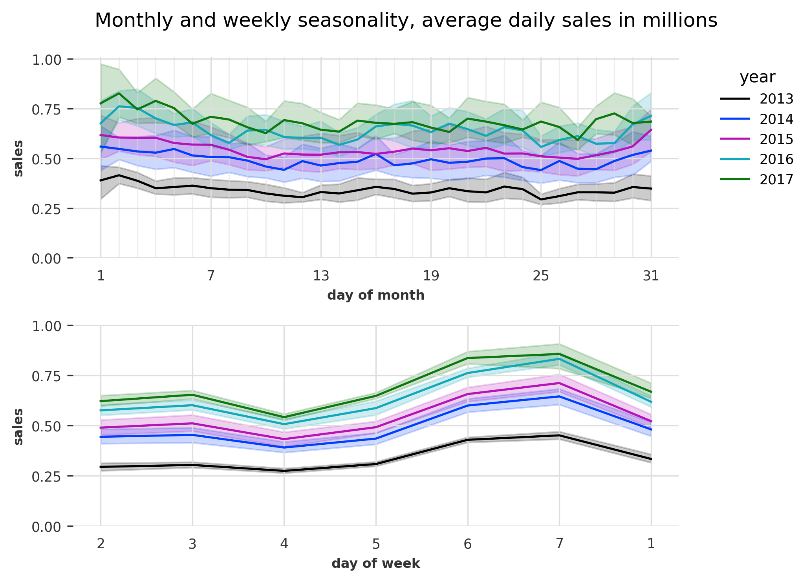
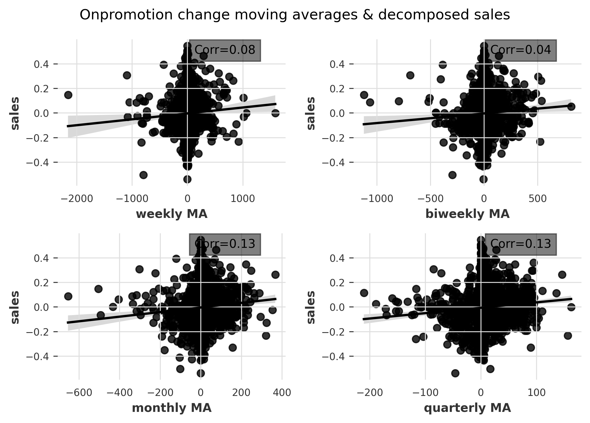
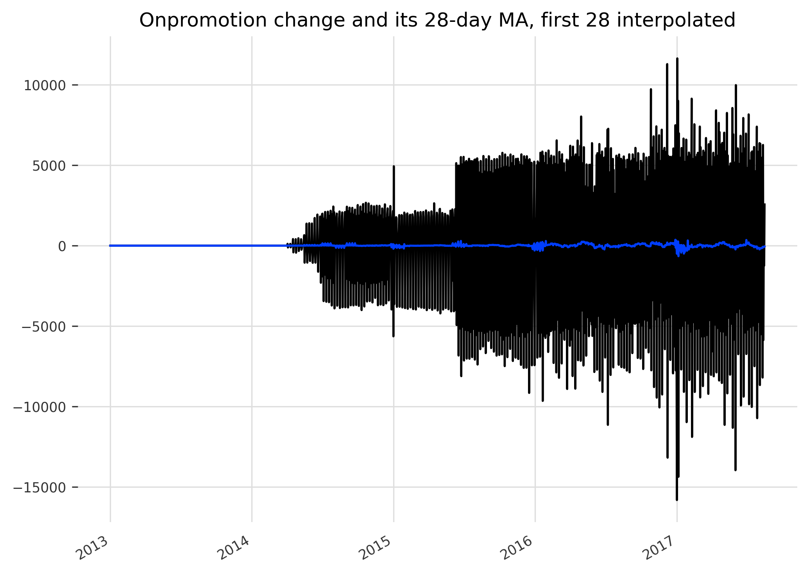

Time series regression - Store sales forecasting, Part 1
================
Ahmet Zamanis

- <a href="#introduction" id="toc-introduction">Introduction</a>
- <a href="#data-preparation" id="toc-data-preparation">Data
  preparation</a>
- <a href="#overview-of-hybrid-modeling-approach"
  id="toc-overview-of-hybrid-modeling-approach">Overview of hybrid
  modeling approach</a>
- <a href="#exploratory-analysis-1---time-calendar-effects"
  id="toc-exploratory-analysis-1---time-calendar-effects">Exploratory
  analysis 1 - Time &amp; calendar effects</a>
  - <a href="#trend" id="toc-trend">Trend</a>
  - <a href="#seasonality" id="toc-seasonality">Seasonality</a>
  - <a href="#autocorrelation-partial-autocorrelation"
    id="toc-autocorrelation-partial-autocorrelation">Autocorrelation &amp;
    partial autocorrelation</a>
  - <a href="#april-2016-earthquake" id="toc-april-2016-earthquake">April
    2016 Earthquake</a>
- <a href="#feature-engineering-1---time-calendar-features"
  id="toc-feature-engineering-1---time-calendar-features">Feature
  engineering 1 - Time &amp; calendar features</a>
  - <a href="#calendar-effects-weekly-seasonality-features"
    id="toc-calendar-effects-weekly-seasonality-features">Calendar effects
    &amp; weekly seasonality features</a>
  - <a href="#trend-monthly-seasonality-features"
    id="toc-trend-monthly-seasonality-features">Trend &amp; monthly
    seasonality features</a>
- <a href="#model-1---time-effects-decomposition"
  id="toc-model-1---time-effects-decomposition">Model 1 - Time effects
  decomposition</a>
  - <a href="#preprocessing" id="toc-preprocessing">Preprocessing</a>
  - <a href="#model-specification" id="toc-model-specification">Model
    specification</a>
  - <a href="#model-validation-predicting-2017-sales"
    id="toc-model-validation-predicting-2017-sales">Model validation:
    Predicting 2017 sales</a>
  - <a href="#rolling-crossvalidation"
    id="toc-rolling-crossvalidation">Rolling crossvalidation</a>
  - <a href="#residuals-diagnosis-stationarity"
    id="toc-residuals-diagnosis-stationarity">Residuals diagnosis &amp;
    stationarity</a>
  - <a href="#time-decomposition" id="toc-time-decomposition">Time
    decomposition</a>
- <a href="#exploratory-analysis-2---lags-covariates"
  id="toc-exploratory-analysis-2---lags-covariates">Exploratory analysis 2
  - Lags &amp; covariates</a>
  - <a href="#covariates-stationarity-differencing"
    id="toc-covariates-stationarity-differencing">Covariates stationarity
    &amp; differencing</a>
  - <a href="#sales-features" id="toc-sales-features">Sales features</a>
  - <a href="#oil-features" id="toc-oil-features">Oil features</a>
  - <a href="#onpromotion-features"
    id="toc-onpromotion-features">Onpromotion features</a>
  - <a href="#transactions-features"
    id="toc-transactions-features">Transactions features</a>
- <a href="#model-2---lags-covariates"
  id="toc-model-2---lags-covariates">Model 2 - Lags &amp; covariates</a>
  - <a href="#preprocessing-1" id="toc-preprocessing-1">Preprocessing</a>
  - <a href="#model-specification-1" id="toc-model-specification-1">Model
    specification</a>
  - <a href="#model-validation-predicting-2017-sales-1"
    id="toc-model-validation-predicting-2017-sales-1">Model validation:
    Predicting 2017 sales</a>
  - <a href="#backtesting-historical-forecasts"
    id="toc-backtesting-historical-forecasts">Backtesting / Historical
    forecasts</a>
  - <a href="#residuals-diagnosis-stationarity-1"
    id="toc-residuals-diagnosis-stationarity-1">Residuals diagnosis &amp;
    stationarity</a>
- <a href="#conclusion" id="toc-conclusion">Conclusion</a>

## Introduction

This is a report on time series analysis & regression modeling,
performed in Python, mainly with the
[Darts](https://unit8co.github.io/darts/) library. The dataset is from
the [Kaggle Store Sales - Time Series
Forecasting](https://www.kaggle.com/competitions/store-sales-time-series-forecasting)
competition. The data consists of daily sales data for an Ecuadorian
supermarket chain between 2013 and 2017. This is Part 1 of the analysis,
which will focus only on forecasting the daily national sales of the
chain, across all stores and categories. In Part 2, we will forecast the
sales in each category - store combination as required by the
competition, and attempt various hierarchical reconciliation techniques.

The main information source used extensively for this analysis is the
textbook [Forecasting: Principles and
Practice](https://otexts.com/fpp3/), written by Rob J. Hyndman and
George Athanasopoulos. The book is the most complete source on time
series analysis & forecasting I could find. It uses R and the
[tidyverts](https://tidyverts.org/) libraries in its example code.

## Data preparation

The data is split into several .csv files. **train.csv** and
**test.csv** are the main datasets, consisting of daily sales data. The
training data ranges from 01-01-2013 to 15-08-2017, and the testing data
consists of the following 15 days, in August 2017. We won’t do a
competition submission in Part 1, so we won’t load the testing data.

``` python
# View the daily sales data
df_train.head(5)
```

<div>
<style scoped>
    .dataframe tbody tr th:only-of-type {
        vertical-align: middle;
    }

    .dataframe tbody tr th {
        vertical-align: top;
    }

    .dataframe thead th {
        text-align: right;
    }
</style>
<table border="1" class="dataframe">
  <thead>
    <tr style="text-align: right;">
      <th></th>
      <th>id</th>
      <th>date</th>
      <th>store_nbr</th>
      <th>family</th>
      <th>sales</th>
      <th>onpromotion</th>
    </tr>
  </thead>
  <tbody>
    <tr>
      <th>0</th>
      <td>0</td>
      <td>2013-01-01</td>
      <td>1</td>
      <td>AUTOMOTIVE</td>
      <td>0.0000</td>
      <td>0</td>
    </tr>
    <tr>
      <th>1</th>
      <td>1</td>
      <td>2013-01-01</td>
      <td>1</td>
      <td>BABY CARE</td>
      <td>0.0000</td>
      <td>0</td>
    </tr>
    <tr>
      <th>2</th>
      <td>2</td>
      <td>2013-01-01</td>
      <td>1</td>
      <td>BEAUTY</td>
      <td>0.0000</td>
      <td>0</td>
    </tr>
    <tr>
      <th>3</th>
      <td>3</td>
      <td>2013-01-01</td>
      <td>1</td>
      <td>BEVERAGES</td>
      <td>0.0000</td>
      <td>0</td>
    </tr>
    <tr>
      <th>4</th>
      <td>4</td>
      <td>2013-01-01</td>
      <td>1</td>
      <td>BOOKS</td>
      <td>0.0000</td>
      <td>0</td>
    </tr>
  </tbody>
</table>
</div>

- For each day, we have the sales in each store (out of a possible 54)
  and each product category (out of a possible 33). This amounts to 1782
  time series that need to be forecasted for the competition, but in
  Part 1 of this analysis, we will keep it simple and only forecast the
  national sales in each day, in all categories.

- **onpromotion** is the number of items on sale that day, in that
  category & store.

**stores.csv** contains more information about each store: The city,
state, store type and store cluster.

``` python
df_stores.head(5)
```

<div>
<style scoped>
    .dataframe tbody tr th:only-of-type {
        vertical-align: middle;
    }

    .dataframe tbody tr th {
        vertical-align: top;
    }

    .dataframe thead th {
        text-align: right;
    }
</style>
<table border="1" class="dataframe">
  <thead>
    <tr style="text-align: right;">
      <th></th>
      <th>store_nbr</th>
      <th>city</th>
      <th>state</th>
      <th>type</th>
      <th>cluster</th>
    </tr>
  </thead>
  <tbody>
    <tr>
      <th>0</th>
      <td>1</td>
      <td>Quito</td>
      <td>Pichincha</td>
      <td>D</td>
      <td>13</td>
    </tr>
    <tr>
      <th>1</th>
      <td>2</td>
      <td>Quito</td>
      <td>Pichincha</td>
      <td>D</td>
      <td>13</td>
    </tr>
    <tr>
      <th>2</th>
      <td>3</td>
      <td>Quito</td>
      <td>Pichincha</td>
      <td>D</td>
      <td>8</td>
    </tr>
    <tr>
      <th>3</th>
      <td>4</td>
      <td>Quito</td>
      <td>Pichincha</td>
      <td>D</td>
      <td>9</td>
    </tr>
    <tr>
      <th>4</th>
      <td>5</td>
      <td>Santo Domingo</td>
      <td>Santo Domingo de los Tsachilas</td>
      <td>D</td>
      <td>4</td>
    </tr>
  </tbody>
</table>
</div>

**holidays.csv** contains information about local (city-wide), regional
(state-wide) and national holidays, and some special nation-wide events
in the time period. We will use these along with the stores’ location
data to create calendar features.

``` python
df_holidays.head(5)
```

<div>
<style scoped>
    .dataframe tbody tr th:only-of-type {
        vertical-align: middle;
    }

    .dataframe tbody tr th {
        vertical-align: top;
    }

    .dataframe thead th {
        text-align: right;
    }
</style>
<table border="1" class="dataframe">
  <thead>
    <tr style="text-align: right;">
      <th></th>
      <th>date</th>
      <th>type</th>
      <th>locale</th>
      <th>locale_name</th>
      <th>description</th>
      <th>transferred</th>
    </tr>
  </thead>
  <tbody>
    <tr>
      <th>0</th>
      <td>2012-03-02</td>
      <td>Holiday</td>
      <td>Local</td>
      <td>Manta</td>
      <td>Fundacion de Manta</td>
      <td>False</td>
    </tr>
    <tr>
      <th>1</th>
      <td>2012-04-01</td>
      <td>Holiday</td>
      <td>Regional</td>
      <td>Cotopaxi</td>
      <td>Provincializacion de Cotopaxi</td>
      <td>False</td>
    </tr>
    <tr>
      <th>2</th>
      <td>2012-04-12</td>
      <td>Holiday</td>
      <td>Local</td>
      <td>Cuenca</td>
      <td>Fundacion de Cuenca</td>
      <td>False</td>
    </tr>
    <tr>
      <th>3</th>
      <td>2012-04-14</td>
      <td>Holiday</td>
      <td>Local</td>
      <td>Libertad</td>
      <td>Cantonizacion de Libertad</td>
      <td>False</td>
    </tr>
    <tr>
      <th>4</th>
      <td>2012-04-21</td>
      <td>Holiday</td>
      <td>Local</td>
      <td>Riobamba</td>
      <td>Cantonizacion de Riobamba</td>
      <td>False</td>
    </tr>
  </tbody>
</table>
</div>

**oil.csv** consists of the daily oil prices in the time period. Ecuador
has an oil-dependent economy, so this may be a useful predictor of the
cyclicality in supermarket sales. We don’t have the oil price for the
first day of the time series.

``` python
df_oil.head(5)
```

<div>
<style scoped>
    .dataframe tbody tr th:only-of-type {
        vertical-align: middle;
    }

    .dataframe tbody tr th {
        vertical-align: top;
    }

    .dataframe thead th {
        text-align: right;
    }
</style>
<table border="1" class="dataframe">
  <thead>
    <tr style="text-align: right;">
      <th></th>
      <th>date</th>
      <th>dcoilwtico</th>
    </tr>
  </thead>
  <tbody>
    <tr>
      <th>0</th>
      <td>2013-01-01</td>
      <td>NaN</td>
    </tr>
    <tr>
      <th>1</th>
      <td>2013-01-02</td>
      <td>93.1400</td>
    </tr>
    <tr>
      <th>2</th>
      <td>2013-01-03</td>
      <td>92.9700</td>
    </tr>
    <tr>
      <th>3</th>
      <td>2013-01-04</td>
      <td>93.1200</td>
    </tr>
    <tr>
      <th>4</th>
      <td>2013-01-07</td>
      <td>93.2000</td>
    </tr>
  </tbody>
</table>
</div>

**transactions.csv** consists of the daily number of transactions at a
store. Another potentially useful feature. Each row is the number of
transactions in all categories, one day, at one store.

``` python
df_trans.head(5)
```

<div>
<style scoped>
    .dataframe tbody tr th:only-of-type {
        vertical-align: middle;
    }

    .dataframe tbody tr th {
        vertical-align: top;
    }

    .dataframe thead th {
        text-align: right;
    }
</style>
<table border="1" class="dataframe">
  <thead>
    <tr style="text-align: right;">
      <th></th>
      <th>date</th>
      <th>store_nbr</th>
      <th>transactions</th>
    </tr>
  </thead>
  <tbody>
    <tr>
      <th>0</th>
      <td>2013-01-01</td>
      <td>25</td>
      <td>770</td>
    </tr>
    <tr>
      <th>1</th>
      <td>2013-01-02</td>
      <td>1</td>
      <td>2111</td>
    </tr>
    <tr>
      <th>2</th>
      <td>2013-01-02</td>
      <td>2</td>
      <td>2358</td>
    </tr>
    <tr>
      <th>3</th>
      <td>2013-01-02</td>
      <td>3</td>
      <td>3487</td>
    </tr>
    <tr>
      <th>4</th>
      <td>2013-01-02</td>
      <td>4</td>
      <td>1922</td>
    </tr>
  </tbody>
</table>
</div>

We will rename some columns from the datasets and merge the
supplementary information into the sales dataset. We’ll aggregate daily
transactions across all stores beforehand, as we are only interested in
predicting daily national sales.

``` python
# Rename columns
df_holidays = df_holidays.rename(columns = {"type":"holiday_type"})
df_oil = df_oil.rename(columns = {"dcoilwtico":"oil"})
df_stores = df_stores.rename(columns = {
  "type":"store_type", "cluster":"store_cluster"})

# Aggregate daily transactions across all stores
df_trans = df_trans.groupby("date").transactions.sum()

# Add columns from oil, stores and transactions datasets into main data
df_train = df_train.merge(df_trans, on = ["date"], how = "left")
df_train = df_train.merge(df_oil, on = "date", how = "left")
df_train = df_train.merge(df_stores, on = "store_nbr", how = "left")
```

Incorporating the holidays information into the sales dataset will
require more work.

``` python
# Split holidays data into local, regional, national and events
events = df_holidays[df_holidays["holiday_type"] == "Event"]
df_holidays = df_holidays.drop(labels=(events.index), axis=0)
local = df_holidays.loc[df_holidays["locale"] == "Local"]
regional = df_holidays.loc[df_holidays["locale"] == "Regional"]
national = df_holidays.loc[df_holidays["locale"] == "National"]
```

There are cases of multiple holidays or events sharing the same date and
locale. We’ll inspect the duplicates and drop them so we don’t have
issues in feature engineering.

- Rows with **transferred = True** are dates that are normally holidays,
  but the holiday was transferred to another date. In other words, these
  are not holidays in effect.

- Rows with **holiday_type = Transfer** are dates that are not normally
  holidays, but had another holiday transferred to this date. In other
  words, these are holidays in effect.

- Rows with **holiday_type = Bridge** are dates that are not normally
  holidays, but were added to extend preceding / following holidays.

``` python
# Inspect local holidays sharing same date & locale
local[local.duplicated(["date", "locale_name"], keep = False)]
```

<div>
<style scoped>
    .dataframe tbody tr th:only-of-type {
        vertical-align: middle;
    }

    .dataframe tbody tr th {
        vertical-align: top;
    }

    .dataframe thead th {
        text-align: right;
    }
</style>
<table border="1" class="dataframe">
  <thead>
    <tr style="text-align: right;">
      <th></th>
      <th>date</th>
      <th>holiday_type</th>
      <th>locale</th>
      <th>locale_name</th>
      <th>description</th>
      <th>transferred</th>
    </tr>
  </thead>
  <tbody>
    <tr>
      <th>264</th>
      <td>2016-07-24</td>
      <td>Additional</td>
      <td>Local</td>
      <td>Guayaquil</td>
      <td>Fundacion de Guayaquil-1</td>
      <td>False</td>
    </tr>
    <tr>
      <th>265</th>
      <td>2016-07-24</td>
      <td>Transfer</td>
      <td>Local</td>
      <td>Guayaquil</td>
      <td>Traslado Fundacion de Guayaquil</td>
      <td>False</td>
    </tr>
  </tbody>
</table>
</div>

``` python
# Drop the transfer row
local = local.drop(265, axis = 0)
```

``` python
# Inspect regional holidays sharing same date & locale. None exist
regional[regional.duplicated(["date", "locale_name"], keep = False)]
```

<div>
<style scoped>
    .dataframe tbody tr th:only-of-type {
        vertical-align: middle;
    }

    .dataframe tbody tr th {
        vertical-align: top;
    }

    .dataframe thead th {
        text-align: right;
    }
</style>
<table border="1" class="dataframe">
  <thead>
    <tr style="text-align: right;">
      <th></th>
      <th>date</th>
      <th>holiday_type</th>
      <th>locale</th>
      <th>locale_name</th>
      <th>description</th>
      <th>transferred</th>
    </tr>
  </thead>
  <tbody>
  </tbody>
</table>
</div>

``` python
# Inspect national holidays sharing same date & locale
national[national.duplicated(["date"], keep = False)]
```

<div>
<style scoped>
    .dataframe tbody tr th:only-of-type {
        vertical-align: middle;
    }

    .dataframe tbody tr th {
        vertical-align: top;
    }

    .dataframe thead th {
        text-align: right;
    }
</style>
<table border="1" class="dataframe">
  <thead>
    <tr style="text-align: right;">
      <th></th>
      <th>date</th>
      <th>holiday_type</th>
      <th>locale</th>
      <th>locale_name</th>
      <th>description</th>
      <th>transferred</th>
    </tr>
  </thead>
  <tbody>
    <tr>
      <th>35</th>
      <td>2012-12-24</td>
      <td>Bridge</td>
      <td>National</td>
      <td>Ecuador</td>
      <td>Puente Navidad</td>
      <td>False</td>
    </tr>
    <tr>
      <th>36</th>
      <td>2012-12-24</td>
      <td>Additional</td>
      <td>National</td>
      <td>Ecuador</td>
      <td>Navidad-1</td>
      <td>False</td>
    </tr>
    <tr>
      <th>39</th>
      <td>2012-12-31</td>
      <td>Bridge</td>
      <td>National</td>
      <td>Ecuador</td>
      <td>Puente Primer dia del ano</td>
      <td>False</td>
    </tr>
    <tr>
      <th>40</th>
      <td>2012-12-31</td>
      <td>Additional</td>
      <td>National</td>
      <td>Ecuador</td>
      <td>Primer dia del ano-1</td>
      <td>False</td>
    </tr>
    <tr>
      <th>156</th>
      <td>2014-12-26</td>
      <td>Bridge</td>
      <td>National</td>
      <td>Ecuador</td>
      <td>Puente Navidad</td>
      <td>False</td>
    </tr>
    <tr>
      <th>157</th>
      <td>2014-12-26</td>
      <td>Additional</td>
      <td>National</td>
      <td>Ecuador</td>
      <td>Navidad+1</td>
      <td>False</td>
    </tr>
  </tbody>
</table>
</div>

``` python
# Drop bridge days
national = national.drop([35, 39, 156], axis = 0)
```

``` python
# Inspect events sharing same date
events[events.duplicated(["date"], keep = False)]
```

<div>
<style scoped>
    .dataframe tbody tr th:only-of-type {
        vertical-align: middle;
    }

    .dataframe tbody tr th {
        vertical-align: top;
    }

    .dataframe thead th {
        text-align: right;
    }
</style>
<table border="1" class="dataframe">
  <thead>
    <tr style="text-align: right;">
      <th></th>
      <th>date</th>
      <th>holiday_type</th>
      <th>locale</th>
      <th>locale_name</th>
      <th>description</th>
      <th>transferred</th>
    </tr>
  </thead>
  <tbody>
    <tr>
      <th>244</th>
      <td>2016-05-08</td>
      <td>Event</td>
      <td>National</td>
      <td>Ecuador</td>
      <td>Terremoto Manabi+22</td>
      <td>False</td>
    </tr>
    <tr>
      <th>245</th>
      <td>2016-05-08</td>
      <td>Event</td>
      <td>National</td>
      <td>Ecuador</td>
      <td>Dia de la Madre</td>
      <td>False</td>
    </tr>
  </tbody>
</table>
</div>

``` python
# Drop the earthquake row as it is a one-time event
events = events.drop(244, axis = 0)
```

After getting rid of duplicates, we can create binary columns that
signify whether a date was a local / regional / national holiday /
event. We’ll merge these back into the sales data.

``` python
# Add local_holiday binary column to local holidays data, to be merged into main 
# data.
local["local_holiday"] = (
  local.holiday_type.isin(["Transfer", "Additional", "Bridge"]) |
  ((local.holiday_type == "Holiday") & (local.transferred == False))
  ).astype(int)

# Add regional_holiday binary column to regional holidays data
regional["regional_holiday"] = (
  regional.holiday_type.isin(["Transfer", "Additional", "Bridge"]) |
  ((regional.holiday_type == "Holiday") & (regional.transferred == False))
  ).astype(int)

# Add national_holiday binary column to national holidays data
national["national_holiday"] = (
  national.holiday_type.isin(["Transfer", "Additional", "Bridge"]) |
  ((national.holiday_type == "Holiday") & (national.transferred == False))
  ).astype(int)

# Add event column to events
events["event"] = 1

# Merge local holidays binary column to main data, on date and city
local_merge = local.drop(
  labels = [
    "holiday_type", "locale", "description", "transferred"], axis = 1).rename(
      columns = {"locale_name":"city"})
df_train = df_train.merge(local_merge, how="left", on=["date", "city"])
df_train["local_holiday"] = df_train["local_holiday"].fillna(0).astype(int)

# Merge regional holidays binary column to main data
regional_merge = regional.drop(
  labels = [
    "holiday_type", "locale", "description", "transferred"], axis = 1).rename(
      columns = {"locale_name":"state"})
df_train = df_train.merge(regional_merge, how="left", on=["date", "state"])
df_train["regional_holiday"] = df_train["regional_holiday"].fillna(0).astype(int)

# Merge national holidays binary column to main data, on date
national_merge = national.drop(
  labels = [
    "holiday_type", "locale", "locale_name", "description", 
    "transferred"], axis = 1)
df_train = df_train.merge(national_merge, how="left", on="date")
df_train["national_holiday"] = df_train["national_holiday"].fillna(0).astype(int)

# Merge events binary column to main data
events_merge = events.drop(
  labels = [
    "holiday_type", "locale", "locale_name", "description", 
    "transferred"], axis = 1)
df_train = df_train.merge(events_merge, how="left", on="date")
df_train["event"] = df_train["event"].fillna(0).astype(int)
```

We’ll set the **date** column to a DateTimeIndex, and view the sales
data with the added columns.

``` python
# Set datetime index
df_train = df_train.set_index(pd.to_datetime(df_train.date))
df_train = df_train.drop("date", axis=1)
df_train.head(5)
```

<div>
<style scoped>
    .dataframe tbody tr th:only-of-type {
        vertical-align: middle;
    }

    .dataframe tbody tr th {
        vertical-align: top;
    }

    .dataframe thead th {
        text-align: right;
    }
</style>
<table border="1" class="dataframe">
  <thead>
    <tr style="text-align: right;">
      <th></th>
      <th>id</th>
      <th>store_nbr</th>
      <th>family</th>
      <th>sales</th>
      <th>onpromotion</th>
      <th>transactions</th>
      <th>oil</th>
      <th>city</th>
      <th>state</th>
      <th>store_type</th>
      <th>store_cluster</th>
      <th>local_holiday</th>
      <th>regional_holiday</th>
      <th>national_holiday</th>
      <th>event</th>
    </tr>
    <tr>
      <th>date</th>
      <th></th>
      <th></th>
      <th></th>
      <th></th>
      <th></th>
      <th></th>
      <th></th>
      <th></th>
      <th></th>
      <th></th>
      <th></th>
      <th></th>
      <th></th>
      <th></th>
      <th></th>
    </tr>
  </thead>
  <tbody>
    <tr>
      <th>2013-01-01</th>
      <td>0</td>
      <td>1</td>
      <td>AUTOMOTIVE</td>
      <td>0.0000</td>
      <td>0</td>
      <td>770.0000</td>
      <td>NaN</td>
      <td>Quito</td>
      <td>Pichincha</td>
      <td>D</td>
      <td>13</td>
      <td>0</td>
      <td>0</td>
      <td>1</td>
      <td>0</td>
    </tr>
    <tr>
      <th>2013-01-01</th>
      <td>1</td>
      <td>1</td>
      <td>BABY CARE</td>
      <td>0.0000</td>
      <td>0</td>
      <td>770.0000</td>
      <td>NaN</td>
      <td>Quito</td>
      <td>Pichincha</td>
      <td>D</td>
      <td>13</td>
      <td>0</td>
      <td>0</td>
      <td>1</td>
      <td>0</td>
    </tr>
    <tr>
      <th>2013-01-01</th>
      <td>2</td>
      <td>1</td>
      <td>BEAUTY</td>
      <td>0.0000</td>
      <td>0</td>
      <td>770.0000</td>
      <td>NaN</td>
      <td>Quito</td>
      <td>Pichincha</td>
      <td>D</td>
      <td>13</td>
      <td>0</td>
      <td>0</td>
      <td>1</td>
      <td>0</td>
    </tr>
    <tr>
      <th>2013-01-01</th>
      <td>3</td>
      <td>1</td>
      <td>BEVERAGES</td>
      <td>0.0000</td>
      <td>0</td>
      <td>770.0000</td>
      <td>NaN</td>
      <td>Quito</td>
      <td>Pichincha</td>
      <td>D</td>
      <td>13</td>
      <td>0</td>
      <td>0</td>
      <td>1</td>
      <td>0</td>
    </tr>
    <tr>
      <th>2013-01-01</th>
      <td>4</td>
      <td>1</td>
      <td>BOOKS</td>
      <td>0.0000</td>
      <td>0</td>
      <td>770.0000</td>
      <td>NaN</td>
      <td>Quito</td>
      <td>Pichincha</td>
      <td>D</td>
      <td>13</td>
      <td>0</td>
      <td>0</td>
      <td>1</td>
      <td>0</td>
    </tr>
  </tbody>
</table>
</div>

With financial data, it’s a good idea to normalize for inflation. We’ll
CPI adjust the sales and oil prices columns, with 2010 as our base year.
The CPI values for Ecuador in the time period were retrieved
[here](https://data.worldbank.org/indicator/FP.CPI.TOTL?end=2017&locations=EC&start=2010&view=chart).

- We’ll use the yearly CPI values for simplicity’s sake, but it’s
  possible to use monthly CPI for more accuracy.

- Since 2017 is not complete in the data, and we’ll use it as the
  validation period, we’ll use 2016’s CPI for 2017 to avoid leaking
  information from the future into our predictions.

``` python
# CPI adjust sales and oil, with CPI 2010 = 100
cpis = {
  "2010":100, "2013":112.8, "2014":116.8, "2015":121.5, "2016":123.6, 
  "2017":123.6
  }
  
for year in [2013, 2014, 2015, 2016, 2017]:
  df_train["sales"].loc[df_train.index.year==year] = df_train["sales"].loc[
    df_train.index.year==year] / cpis[str(year)] * cpis["2010"]
  df_train["oil"].loc[df_train.index.year==year] = df_train["oil"].loc[
    df_train.index.year==year] / cpis[str(year)] * cpis["2010"]
```

We have some rows with missing values in our training data.

``` python
# Check missing values in each column
pd.isnull(df_train).sum()
```

    id                       0
    store_nbr                0
    family                   0
    sales                    0
    onpromotion              0
    transactions          3564
    oil                 928422
    city                     0
    state                    0
    store_type               0
    store_cluster            0
    local_holiday            0
    regional_holiday         0
    national_holiday         0
    event                    0
    dtype: int64

We will interpolate the missing values in the oil and transactions
columns using time interpolation. This performs linear interpolation,
but also takes the date-time index of observations into account.

``` python
df_train["oil"] = df_train["oil"].interpolate("time", limit_direction = "both")
df_train["transactions"] = df_train["transactions"].interpolate(
  "time", limit_direction = "both")
```

We will now aggregate daily sales across all categories and stores, to
retrieve our target variable. We have 1684 days of national sales data.

``` python
sales = df_train.groupby("date").sales.sum()
sales
```

    date
    2013-01-01     2226.6126
    2013-01-02   439798.2429
    2013-01-03   320444.3538
    2013-01-04   314237.3024
    2013-01-05   423182.7316
                     ...    
    2017-08-11   668587.1537
    2017-08-12   641286.8407
    2017-08-13   700355.7261
    2017-08-14   615633.0146
    2017-08-15   617040.4012
    Name: sales, Length: 1684, dtype: float64

We will create a Darts
[TimeSeries](https://unit8co.github.io/darts/generated_api/darts.timeseries.html)
with our target variable.

``` python
from darts import TimeSeries

ts_sales = TimeSeries.from_series(
  sales, 
  freq="D" # Time series frequency is daily
  )
ts_sales
```

<div><svg style="position: absolute; width: 0; height: 0; overflow: hidden">
<defs>
<symbol id="icon-database" viewBox="0 0 32 32">
<path d="M16 0c-8.837 0-16 2.239-16 5v4c0 2.761 7.163 5 16 5s16-2.239 16-5v-4c0-2.761-7.163-5-16-5z"></path>
<path d="M16 17c-8.837 0-16-2.239-16-5v6c0 2.761 7.163 5 16 5s16-2.239 16-5v-6c0 2.761-7.163 5-16 5z"></path>
<path d="M16 26c-8.837 0-16-2.239-16-5v6c0 2.761 7.163 5 16 5s16-2.239 16-5v-6c0 2.761-7.163 5-16 5z"></path>
</symbol>
<symbol id="icon-file-text2" viewBox="0 0 32 32">
<path d="M28.681 7.159c-0.694-0.947-1.662-2.053-2.724-3.116s-2.169-2.030-3.116-2.724c-1.612-1.182-2.393-1.319-2.841-1.319h-15.5c-1.378 0-2.5 1.121-2.5 2.5v27c0 1.378 1.122 2.5 2.5 2.5h23c1.378 0 2.5-1.122 2.5-2.5v-19.5c0-0.448-0.137-1.23-1.319-2.841zM24.543 5.457c0.959 0.959 1.712 1.825 2.268 2.543h-4.811v-4.811c0.718 0.556 1.584 1.309 2.543 2.268zM28 29.5c0 0.271-0.229 0.5-0.5 0.5h-23c-0.271 0-0.5-0.229-0.5-0.5v-27c0-0.271 0.229-0.5 0.5-0.5 0 0 15.499-0 15.5 0v7c0 0.552 0.448 1 1 1h7v19.5z"></path>
<path d="M23 26h-14c-0.552 0-1-0.448-1-1s0.448-1 1-1h14c0.552 0 1 0.448 1 1s-0.448 1-1 1z"></path>
<path d="M23 22h-14c-0.552 0-1-0.448-1-1s0.448-1 1-1h14c0.552 0 1 0.448 1 1s-0.448 1-1 1z"></path>
<path d="M23 18h-14c-0.552 0-1-0.448-1-1s0.448-1 1-1h14c0.552 0 1 0.448 1 1s-0.448 1-1 1z"></path>
</symbol>
</defs>
</svg>
<style>/* CSS stylesheet for displaying xarray objects in jupyterlab.
 *
 */

:root {
  --xr-font-color0: var(--jp-content-font-color0, rgba(0, 0, 0, 1));
  --xr-font-color2: var(--jp-content-font-color2, rgba(0, 0, 0, 0.54));
  --xr-font-color3: var(--jp-content-font-color3, rgba(0, 0, 0, 0.38));
  --xr-border-color: var(--jp-border-color2, #e0e0e0);
  --xr-disabled-color: var(--jp-layout-color3, #bdbdbd);
  --xr-background-color: var(--jp-layout-color0, white);
  --xr-background-color-row-even: var(--jp-layout-color1, white);
  --xr-background-color-row-odd: var(--jp-layout-color2, #eeeeee);
}

html[theme=dark],
body[data-theme=dark],
body.vscode-dark {
  --xr-font-color0: rgba(255, 255, 255, 1);
  --xr-font-color2: rgba(255, 255, 255, 0.54);
  --xr-font-color3: rgba(255, 255, 255, 0.38);
  --xr-border-color: #1F1F1F;
  --xr-disabled-color: #515151;
  --xr-background-color: #111111;
  --xr-background-color-row-even: #111111;
  --xr-background-color-row-odd: #313131;
}

.xr-wrap {
  display: block !important;
  min-width: 300px;
  max-width: 700px;
}

.xr-text-repr-fallback {
  /* fallback to plain text repr when CSS is not injected (untrusted notebook) */
  display: none;
}

.xr-header {
  padding-top: 6px;
  padding-bottom: 6px;
  margin-bottom: 4px;
  border-bottom: solid 1px var(--xr-border-color);
}

.xr-header > div,
.xr-header > ul {
  display: inline;
  margin-top: 0;
  margin-bottom: 0;
}

.xr-obj-type,
.xr-array-name {
  margin-left: 2px;
  margin-right: 10px;
}

.xr-obj-type {
  color: var(--xr-font-color2);
}

.xr-sections {
  padding-left: 0 !important;
  display: grid;
  grid-template-columns: 150px auto auto 1fr 20px 20px;
}

.xr-section-item {
  display: contents;
}

.xr-section-item input {
  display: none;
}

.xr-section-item input + label {
  color: var(--xr-disabled-color);
}

.xr-section-item input:enabled + label {
  cursor: pointer;
  color: var(--xr-font-color2);
}

.xr-section-item input:enabled + label:hover {
  color: var(--xr-font-color0);
}

.xr-section-summary {
  grid-column: 1;
  color: var(--xr-font-color2);
  font-weight: 500;
}

.xr-section-summary > span {
  display: inline-block;
  padding-left: 0.5em;
}

.xr-section-summary-in:disabled + label {
  color: var(--xr-font-color2);
}

.xr-section-summary-in + label:before {
  display: inline-block;
  content: '►';
  font-size: 11px;
  width: 15px;
  text-align: center;
}

.xr-section-summary-in:disabled + label:before {
  color: var(--xr-disabled-color);
}

.xr-section-summary-in:checked + label:before {
  content: '▼';
}

.xr-section-summary-in:checked + label > span {
  display: none;
}

.xr-section-summary,
.xr-section-inline-details {
  padding-top: 4px;
  padding-bottom: 4px;
}

.xr-section-inline-details {
  grid-column: 2 / -1;
}

.xr-section-details {
  display: none;
  grid-column: 1 / -1;
  margin-bottom: 5px;
}

.xr-section-summary-in:checked ~ .xr-section-details {
  display: contents;
}

.xr-array-wrap {
  grid-column: 1 / -1;
  display: grid;
  grid-template-columns: 20px auto;
}

.xr-array-wrap > label {
  grid-column: 1;
  vertical-align: top;
}

.xr-preview {
  color: var(--xr-font-color3);
}

.xr-array-preview,
.xr-array-data {
  padding: 0 5px !important;
  grid-column: 2;
}

.xr-array-data,
.xr-array-in:checked ~ .xr-array-preview {
  display: none;
}

.xr-array-in:checked ~ .xr-array-data,
.xr-array-preview {
  display: inline-block;
}

.xr-dim-list {
  display: inline-block !important;
  list-style: none;
  padding: 0 !important;
  margin: 0;
}

.xr-dim-list li {
  display: inline-block;
  padding: 0;
  margin: 0;
}

.xr-dim-list:before {
  content: '(';
}

.xr-dim-list:after {
  content: ')';
}

.xr-dim-list li:not(:last-child):after {
  content: ',';
  padding-right: 5px;
}

.xr-has-index {
  font-weight: bold;
}

.xr-var-list,
.xr-var-item {
  display: contents;
}

.xr-var-item > div,
.xr-var-item label,
.xr-var-item > .xr-var-name span {
  background-color: var(--xr-background-color-row-even);
  margin-bottom: 0;
}

.xr-var-item > .xr-var-name:hover span {
  padding-right: 5px;
}

.xr-var-list > li:nth-child(odd) > div,
.xr-var-list > li:nth-child(odd) > label,
.xr-var-list > li:nth-child(odd) > .xr-var-name span {
  background-color: var(--xr-background-color-row-odd);
}

.xr-var-name {
  grid-column: 1;
}

.xr-var-dims {
  grid-column: 2;
}

.xr-var-dtype {
  grid-column: 3;
  text-align: right;
  color: var(--xr-font-color2);
}

.xr-var-preview {
  grid-column: 4;
}

.xr-index-preview {
  grid-column: 2 / 5;
  color: var(--xr-font-color2);
}

.xr-var-name,
.xr-var-dims,
.xr-var-dtype,
.xr-preview,
.xr-attrs dt {
  white-space: nowrap;
  overflow: hidden;
  text-overflow: ellipsis;
  padding-right: 10px;
}

.xr-var-name:hover,
.xr-var-dims:hover,
.xr-var-dtype:hover,
.xr-attrs dt:hover {
  overflow: visible;
  width: auto;
  z-index: 1;
}

.xr-var-attrs,
.xr-var-data,
.xr-index-data {
  display: none;
  background-color: var(--xr-background-color) !important;
  padding-bottom: 5px !important;
}

.xr-var-attrs-in:checked ~ .xr-var-attrs,
.xr-var-data-in:checked ~ .xr-var-data,
.xr-index-data-in:checked ~ .xr-index-data {
  display: block;
}

.xr-var-data > table {
  float: right;
}

.xr-var-name span,
.xr-var-data,
.xr-index-name div,
.xr-index-data,
.xr-attrs {
  padding-left: 25px !important;
}

.xr-attrs,
.xr-var-attrs,
.xr-var-data,
.xr-index-data {
  grid-column: 1 / -1;
}

dl.xr-attrs {
  padding: 0;
  margin: 0;
  display: grid;
  grid-template-columns: 125px auto;
}

.xr-attrs dt,
.xr-attrs dd {
  padding: 0;
  margin: 0;
  float: left;
  padding-right: 10px;
  width: auto;
}

.xr-attrs dt {
  font-weight: normal;
  grid-column: 1;
}

.xr-attrs dt:hover span {
  display: inline-block;
  background: var(--xr-background-color);
  padding-right: 10px;
}

.xr-attrs dd {
  grid-column: 2;
  white-space: pre-wrap;
  word-break: break-all;
}

.xr-icon-database,
.xr-icon-file-text2,
.xr-no-icon {
  display: inline-block;
  vertical-align: middle;
  width: 1em;
  height: 1.5em !important;
  stroke-width: 0;
  stroke: currentColor;
  fill: currentColor;
}
</style><pre class='xr-text-repr-fallback'>&lt;TimeSeries (DataArray) (date: 1688, component: 1, sample: 1)&gt;
array([[[  2226.6126]],

       [[439798.2429]],

       [[320444.3538]],

       ...,

       [[700355.7261]],

       [[615633.0146]],

       [[617040.4012]]])
Coordinates:
  * date       (date) datetime64[ns] 2013-01-01 2013-01-02 ... 2017-08-15
  * component  (component) object &#x27;sales&#x27;
Dimensions without coordinates: sample
Attributes:
    static_covariates:  None
    hierarchy:          None</pre><div class='xr-wrap' style='display:none'><div class='xr-header'><div class='xr-obj-type'>TimeSeries (DataArray)</div><div class='xr-array-name'></div><ul class='xr-dim-list'><li><span class='xr-has-index'>date</span>: 1688</li><li><span class='xr-has-index'>component</span>: 1</li><li><span>sample</span>: 1</li></ul></div><ul class='xr-sections'><li class='xr-section-item'><div class='xr-array-wrap'><input id='section-35e95a62-0811-4cbf-88d0-1291d0078986' class='xr-array-in' type='checkbox' checked><label for='section-35e95a62-0811-4cbf-88d0-1291d0078986' title='Show/hide data repr'><svg class='icon xr-icon-database'><use xlink:href='#icon-database'></use></svg></label><div class='xr-array-preview xr-preview'><span>2.227e+03 4.398e+05 3.204e+05 ... 7.004e+05 6.156e+05 6.17e+05</span></div><div class='xr-array-data'><pre>array([[[  2226.6126]],

       [[439798.2429]],

       [[320444.3538]],

       ...,

       [[700355.7261]],

       [[615633.0146]],

       [[617040.4012]]])</pre></div></div></li><li class='xr-section-item'><input id='section-b30fd388-83c4-4f5b-b7c0-3567739c3fb8' class='xr-section-summary-in' type='checkbox'  checked><label for='section-b30fd388-83c4-4f5b-b7c0-3567739c3fb8' class='xr-section-summary' >Coordinates: <span>(2)</span></label><div class='xr-section-inline-details'></div><div class='xr-section-details'><ul class='xr-var-list'><li class='xr-var-item'><div class='xr-var-name'><span class='xr-has-index'>date</span></div><div class='xr-var-dims'>(date)</div><div class='xr-var-dtype'>datetime64[ns]</div><div class='xr-var-preview xr-preview'>2013-01-01 ... 2017-08-15</div><input id='attrs-d80d171d-19f1-4b46-8707-6841a77f8fe6' class='xr-var-attrs-in' type='checkbox' disabled><label for='attrs-d80d171d-19f1-4b46-8707-6841a77f8fe6' title='Show/Hide attributes'><svg class='icon xr-icon-file-text2'><use xlink:href='#icon-file-text2'></use></svg></label><input id='data-d1a6da13-c7d4-490b-89b6-a7ea75439278' class='xr-var-data-in' type='checkbox'><label for='data-d1a6da13-c7d4-490b-89b6-a7ea75439278' title='Show/Hide data repr'><svg class='icon xr-icon-database'><use xlink:href='#icon-database'></use></svg></label><div class='xr-var-attrs'><dl class='xr-attrs'></dl></div><div class='xr-var-data'><pre>array([&#x27;2013-01-01T00:00:00.000000000&#x27;, &#x27;2013-01-02T00:00:00.000000000&#x27;,
       &#x27;2013-01-03T00:00:00.000000000&#x27;, ..., &#x27;2017-08-13T00:00:00.000000000&#x27;,
       &#x27;2017-08-14T00:00:00.000000000&#x27;, &#x27;2017-08-15T00:00:00.000000000&#x27;],
      dtype=&#x27;datetime64[ns]&#x27;)</pre></div></li><li class='xr-var-item'><div class='xr-var-name'><span class='xr-has-index'>component</span></div><div class='xr-var-dims'>(component)</div><div class='xr-var-dtype'>object</div><div class='xr-var-preview xr-preview'>&#x27;sales&#x27;</div><input id='attrs-03094209-d92e-4468-bbf9-7c5a615e89ec' class='xr-var-attrs-in' type='checkbox' disabled><label for='attrs-03094209-d92e-4468-bbf9-7c5a615e89ec' title='Show/Hide attributes'><svg class='icon xr-icon-file-text2'><use xlink:href='#icon-file-text2'></use></svg></label><input id='data-9af2c8e7-1388-4378-bf69-8a2b4375b7ff' class='xr-var-data-in' type='checkbox'><label for='data-9af2c8e7-1388-4378-bf69-8a2b4375b7ff' title='Show/Hide data repr'><svg class='icon xr-icon-database'><use xlink:href='#icon-database'></use></svg></label><div class='xr-var-attrs'><dl class='xr-attrs'></dl></div><div class='xr-var-data'><pre>array([&#x27;sales&#x27;], dtype=object)</pre></div></li></ul></div></li><li class='xr-section-item'><input id='section-ad7bf73b-a0c1-4afa-a0af-e7eea5392ff4' class='xr-section-summary-in' type='checkbox'  ><label for='section-ad7bf73b-a0c1-4afa-a0af-e7eea5392ff4' class='xr-section-summary' >Indexes: <span>(2)</span></label><div class='xr-section-inline-details'></div><div class='xr-section-details'><ul class='xr-var-list'><li class='xr-var-item'><div class='xr-index-name'><div>date</div></div><div class='xr-index-preview'>PandasIndex</div><div></div><input id='index-9ca61e51-38d8-4d80-9a67-63806c9ade56' class='xr-index-data-in' type='checkbox'/><label for='index-9ca61e51-38d8-4d80-9a67-63806c9ade56' title='Show/Hide index repr'><svg class='icon xr-icon-database'><use xlink:href='#icon-database'></use></svg></label><div class='xr-index-data'><pre>PandasIndex(DatetimeIndex([&#x27;2013-01-01&#x27;, &#x27;2013-01-02&#x27;, &#x27;2013-01-03&#x27;, &#x27;2013-01-04&#x27;,
               &#x27;2013-01-05&#x27;, &#x27;2013-01-06&#x27;, &#x27;2013-01-07&#x27;, &#x27;2013-01-08&#x27;,
               &#x27;2013-01-09&#x27;, &#x27;2013-01-10&#x27;,
               ...
               &#x27;2017-08-06&#x27;, &#x27;2017-08-07&#x27;, &#x27;2017-08-08&#x27;, &#x27;2017-08-09&#x27;,
               &#x27;2017-08-10&#x27;, &#x27;2017-08-11&#x27;, &#x27;2017-08-12&#x27;, &#x27;2017-08-13&#x27;,
               &#x27;2017-08-14&#x27;, &#x27;2017-08-15&#x27;],
              dtype=&#x27;datetime64[ns]&#x27;, name=&#x27;date&#x27;, length=1688, freq=&#x27;D&#x27;))</pre></div></li><li class='xr-var-item'><div class='xr-index-name'><div>component</div></div><div class='xr-index-preview'>PandasIndex</div><div></div><input id='index-b67e1535-ef12-476c-b2af-ad84d4f7da53' class='xr-index-data-in' type='checkbox'/><label for='index-b67e1535-ef12-476c-b2af-ad84d4f7da53' title='Show/Hide index repr'><svg class='icon xr-icon-database'><use xlink:href='#icon-database'></use></svg></label><div class='xr-index-data'><pre>PandasIndex(Index([&#x27;sales&#x27;], dtype=&#x27;object&#x27;, name=&#x27;component&#x27;))</pre></div></li></ul></div></li><li class='xr-section-item'><input id='section-2957318e-b610-46c6-b96f-f6fc04fb7789' class='xr-section-summary-in' type='checkbox'  checked><label for='section-2957318e-b610-46c6-b96f-f6fc04fb7789' class='xr-section-summary' >Attributes: <span>(2)</span></label><div class='xr-section-inline-details'></div><div class='xr-section-details'><dl class='xr-attrs'><dt><span>static_covariates :</span></dt><dd>None</dd><dt><span>hierarchy :</span></dt><dd>None</dd></dl></div></li></ul></div></div>

- Each Pandas series / dataframe column passed is stored as a component
  in the Darts TS. The date-time index is stored in **time_index.** We
  had 1684 rows in our Pandas series, but the Darts TS has 1688 dates.
  This means our series had some missing dates, which Darts completed
  automatically. We’ll fill in the values for these dates later.

- To create a multivariate time series, we create a Pandas dataframe
  with each time series as a column, and a common date-time index. When
  we pass this dataframe to TimeSeries, we’ll have each time series as a
  component. If the time series have a **hierarchy**, i.e. if they sum
  up together in a certain way, we can map that hierarchy as a
  dictionary to later perform hierarchical reconciliation. We will
  explore this further in Part 2 of the analysis.

- Static covariates are time-invariant covariates that may be used in
  predictions. In our case, the city or cluster of a store may be static
  covariates, but for part 1 of our analysis we are looking at national
  sales, so we won’t use these.

## Overview of hybrid modeling approach

A time series can be written as the sum of several components:

- **Trend:** The long-term change.

- **Seasonality:** A fluctuation (or several) that repeats based on a
  fixed, known time period. For example, the fluctuation of retail store
  sales across days of a week, or hours of a day.

- **Cyclicality:** A fluctuation that does not repeat on a fixed, known
  time period. For example, the effect of a sharp increase / decrese in
  oil prices on car sales.

- **Remainder / Error:** The unpredictable component of the time series,
  at least with the available data and methods.

When analyzing a time series with plots, it can be difficult to
determine the nature and causes of fluctuations. It can be especially
tricky to tell apart the cyclical effects from repeating seasonality.
Because of this, we will split our analysis and modeling into two steps:

- In step 1, we will analyze the time effects: The trend, seasonality
  and calendar effects (such as holidays & events). We’ll build a model
  that predicts these effects and remove the predictions from the time
  series, leaving the effects of cyclicality and the unpredictable
  component. This is called **time decomposition.**

- In step 2, we will re-analyze the decomposed time series, this time
  considering the effects of covariates and lagged values of sales
  itself as predictors, to try and account for the cyclicality. We’ll
  build a model that uses these predictors, train it on the decomposed
  sales, and add up the predictions of both models to arrive at our
  final predictions. This approach is called a **hybrid model.**

## Exploratory analysis 1 - Time & calendar effects

### Trend

Let’s start by analyzing the overall trend in sales. Darts offers the
ability to plot time series quickly.

``` python
_ =  ts_sales.plot()
_ =  plt.ylabel("Daily sales, millions")
plt.show()
plt.close()
```


The time series plot shows us several things:

- Supermarket sales show an increasing trend over the years. The trend
  is close to linear overall, but the rate of increase declines roughly
  from the start of 2015.

- Sales mostly fluctuate around a certain range, which suggests strong
  seasonality. However, there are also sharp deviations in certain
  periods, mainly across 2014 and at the start of 2015. This is likely
  cyclical in nature.

- The “waves” of seasonal fluctuations seem to be getting bigger over
  time. This suggests we should use a multiplicative time decomposition
  instead of additive.

- Sales decline very sharply in the first day of every year, likely
  because it’s a holiday.

### Seasonality

#### Annual seasonality

Let’s look at annual seasonality: How sales fluctuate over a year based
on quarters, months, weeks of a year and days of a year. In the plots
below, we have the daily sales averaged by each respective calendar
period, colored by each year in the data. The confidence bands indicate
the minimum and maximum daily sales in each respective period (in the
last plot, we just have the daily sales without any averaging).


- **Quarterly:** Sales do not seem to have a considerable quarterly
  seasonality pattern. However, the plot still shows us a few things:

  - Sales generally slightly increase over a year.

  - In Q2 2014, there was a considerable drop. Sales declined almost to
    the level of Q2 2013. This was likely a cyclical effect.

- **Monthly:** Sales do seem to fluctuate slightly over months, but
  there’s no clear seasonal pattern that’s apparent across all years.
  However, sales seem to sharply increase in November and December every
  year, likely due to Christmas.

  - The cyclicality in 2014 is seen in more detail: Sales dropped almost
    to their 2013 levels in certain months, and recovered sharply in
    others.

  - We also see a considerable drop in the first half of 2015, where
    sales dropped roughly to 2014 levels, followed by a recovery.

  - There is a very sharp increase in April 2016, where sales were even
    higher than 2017 levels. This is due to a large earthquake that
    happened in April 16, 2016, and the related relief efforts.

- **Weekly:** The seasonal patterns are more visible in the weekly plot,
  as we see the “waves” of fluctuation line up across years. It’s very
  likely the data has strong weekly seasonality, which is what we’d
  expect from supermarket sales.

  - The data for 2017 ends after August 15, so the sharp decline
    afterwards is misleading.

  - The sharp decline at the end of 2016 is also misleading, as 2016 was
    a 366-day year.

- **Daily:** This plot is a bit noisy, but the very similar fluctuations
  across all years indicate the data is strongly seasonal. It also
  highlights some cyclical effects such as the April 2016 earthquake and
  the 2014 drops.

Another way to look at annual seasonality is to average sales in a
certain calendar period across all years, without grouping by year.


This shows us the “overall” seasonality pattern across one year: We
likely have strong weekly seasonality that persists over years, and some
monthly seasonality especially towards December.

#### Monthly & weekly seasonality

Now let’s look at seasonality across days of a month and days of a week.
These will likely be the most important seasonality patterns in
supermarket sales. There are three ways to look at these plots: First we
will group them by year.



- The weekly seasonality pattern across days of a week is clear. Sales
  are lowest in Tuesdays, increase and peak at Sundays, then drop on
  Mondays. The pattern holds in all years.

- The monthly seasonality across days of a month aren’t as strong, but
  look considerable. Sales are generally highest at the start of a
  month, likely because most salaries are paid at the end of a month,
  though the competition information also says salaries are paid
  biweekly, in the middle and at the end of each month.

We can look at the same plots grouped by month.


This plot shows us the monthly and weekly seasonality pattern generally
holds across all months, but December is a notable exception:

- Sales in December are considerably higher roughly after the 13th, due
  to Christmas. The Christmas peak seems to happen in the 23th, followed
  by a decline, and another sharp increase in the 30th.

- The sales by day of week are also higher in December for every day,
  but the pattern of the weekly seasonality is the same.

- We can also see that sales decline very sharply in January 1st, almost
  to zero, and make a considerably sharp recovery in the 2nd.

And finally, without any grouping: The averages across all years.


This plot allows us to see the overall monthly seasonality pattern more
clearly: Sales are higher at the start of a month, slightly decline
until the mid-month payday, slightly increase afterwards, and start
peaking again after the end-of-month payday.

### Autocorrelation & partial autocorrelation

Autocorrelation is the correlation of a variable at time T, with its own
lagged values at time T-1, T-2 and so on. Partial autocorrelation can be
thought of as the marginal contribution of each lagged value to
autocorrelation, since the lags are likely to hold common information.
The patterns in the autocorrelation and partial autocorrelation plots
can give us insight into the seasonal patterns.

``` python
# FIG3: ACF and PACF plots
from statsmodels.graphics.tsaplots import plot_acf, plot_pacf
fig3, axes3 = plt.subplots(2)
_ = fig3.suptitle('Autocorrelation and partial autocorrelation, daily sales, up to 54 days')
_ = plot_acf(sales, lags=range(0,55), ax=axes3[0])
_ = plot_pacf(sales, lags=range(0,55), ax=axes3[1], method="ywm")

# Show fig3
plt.show()
plt.close("all")
```


The sinusoidal pattern in the ACF plot is typical for strong weekly
seasonality:

- Sales at T=0 are highly correlated with the sales of the previous day
  at T=1.

- The correlation declines until T=6, which is the previous value of the
  next weekday from T=0, and peaks at T=7, which is the previous value
  of the same weekday.

- The pattern repeats weekly after T=7, with declining strength.

The PACF plot shows the marginal contribution of each lag to the
relationship with the present day value. The partial autocorrelation is
highest for lag 1, and significant correlations die out roughly after 14
days. In step 2 of this analysis, we will revisit this plot to derive
features from sales lags, after performing time decomposition with model
1.

### April 2016 Earthquake

One more time effect we will look at is the April 2016 earthquake, a
one-off occurrence we need to adjust for in our model. The plots below
show the seasonality of sales in April and May, in every year. The black
dashed vertical line marks April 16.


With the earthquake, the sales sharply increased from the expected
seasonal pattern and trend, peaked in April 18, then declined and
returned to the seasonal expectations around April 22. It doesn’t seem
like sales were higher than normal for the rest of April 2016, or in May
2016. We’ll engineer our earthquake feature accordingly.

## Feature engineering 1 - Time & calendar features

Our main candidate for the time decomposition model is a simple linear
regression, so we will focus our feature engineering towards that.

### Calendar effects & weekly seasonality features

We’ll flag the dates that influence sales considerably with dummy or
ordinal features. These columns will take non-zero values if a certain
calendar effect is present in a date, and zeroes otherwise.

Sales decline very sharply every year in January 1st, almost to zero.
The sales in January 2nd then recover sharply, which is a huge relative
increase for one day, so we will flag both dates with dummy features.

``` python
# New year's day features
df_train["ny1"] = ((df_train.index.day == 1) & (df_train.index.month == 1)).astype(int)


# Set holiday dummies to 0 if NY dummies are 1
df_train.loc[df_train["ny1"] == 1, ["local_holiday", "regional_holiday", "national_holiday"]] = 0

df_train["ny2"] = ((df_train.index.day == 2) & (df_train.index.month == 1)).astype(int)

df_train.loc[df_train["ny2"] == 1, ["local_holiday", "regional_holiday", "national_holiday"]] = 0
```

We have considerably higher sales in December due to Christmas and the
New Years’ Eve.

- For NY’s eve effects, we can simply flag December 30 and 31st with
  dummy features.

- For Christmas effects, we will create two integer columns that reflect
  the ‘strength’ of the Christmas effect on sales, based on day of
  month. The columns will reach its maximum value in December 23rd, and
  decline as the date moves away from that. For dates outside December
  13-27, these features will take a value of zero. This may not be the
  most sophisticated way to reflect the Christmas effects on our model,
  but it should be simple and effective.

``` python
# NY's eve features
df_train["ny_eve31"] = ((df_train.index.day == 31) & (df_train.index.month == 12)).astype(int)

df_train["ny_eve30"] = ((df_train.index.day == 30) & (df_train.index.month == 12)).astype(int)

df_train.loc[(df_train["ny_eve31"] == 1) | (df_train["ny_eve30"] == 1), ["local_holiday", "regional_holiday", "national_holiday"]] = 0


# Proximity to Christmas sales peak
df_train["xmas_before"] = 0

df_train.loc[
  (df_train.index.day.isin(range(13,24))) & (df_train.index.month == 12), "xmas_before"] = df_train.loc[
  (df_train.index.day.isin(range(13,24))) & (df_train.index.month == 12)].index.day - 12

df_train["xmas_after"] = 0
df_train.loc[
  (df_train.index.day.isin(range(24,28))) & (df_train.index.month == 12), "xmas_after"] = abs(df_train.loc[
  (df_train.index.day.isin(range(24,28))) & (df_train.index.month == 12)].index.day - 27)

df_train.loc[(df_train["xmas_before"] != 0) | (df_train["xmas_after"] != 0), ["local_holiday", "regional_holiday", "national_holiday"]] = 0
```

To account for the effect of the April 2016 earthquake, we create a
feature similar to the ones for Christmas. The feature peaks at April
18th and takes a value of zero for dates outside April 17-22, 2016.

``` python
# Strength of earthquake effect on sales
# April 18 > 17 > 19 > 20 > 21 > 22
df_train["quake_after"] = 0
df_train.loc[df_train.index == "2016-04-18", "quake_after"] = 6
df_train.loc[df_train.index == "2016-04-17", "quake_after"] = 5
df_train.loc[df_train.index == "2016-04-19", "quake_after"] = 4
df_train.loc[df_train.index == "2016-04-20", "quake_after"] = 3
df_train.loc[df_train.index == "2016-04-21", "quake_after"] = 2
df_train.loc[df_train.index == "2016-04-22", "quake_after"] = 1
```

We previously created dummy features to indicate local-regional-national
holidays, and special events. There are only a few different events in
the dataset, and they differ in nature, so we will break up the events
column and create separate dummy features for each event. We already
created a feature for the earthquake, so we’ll skip that one.

``` python
# Split events, delete events column
df_train["dia_madre"] = ((df_train["event"] == 1) & (df_train.index.month == 5) & (df_train.index.day.isin([8,10,11,12,14]))).astype(int)

df_train["futbol"] = ((df_train["event"] == 1) & (df_train.index.isin(pd.date_range(start = "2014-06-12", end = "2014-07-13")))).astype(int)

df_train["black_friday"] = ((df_train["event"] == 1) & (df_train.index.isin(["2014-11-28", "2015-11-27", "2016-11-25"]))).astype(int)

df_train["cyber_monday"] = ((df_train["event"] == 1) & (df_train.index.isin(["2014-12-01", "2015-11-30", "2016-11-28"]))).astype(int)

df_train = df_train.drop("event", axis=1)
```

Holidays and events may lead to an increase in sales in advance, so we
will create one lag column for each holiday column, and the Mother’s Day
event. These features could be tailored more carefully according to each
holiday and event, but we’ll keep it simple.

``` python
# Holiday-event leads
df_train["local_lead1"] = df_train["local_holiday"].shift(-1).fillna(0)
df_train["regional_lead1"] = df_train["regional_holiday"].shift(-1).fillna(0)
df_train["national_lead1"] = df_train["national_holiday"].shift(-1).fillna(0)
df_train["diamadre_lead1"] = df_train["dia_madre"].shift(-1).fillna(0)
```

To capture the weekly seasonality in a simple manner, we’ll create 6
dummy features for days of the week. We won’t create one for Monday,
since a 0 value for the other 6 columns means Monday.

``` python
# Days of week dummies
df_train["tuesday"] = (df_train.index.dayofweek == 1).astype(int)
df_train["wednesday"] = (df_train.index.dayofweek == 2).astype(int)
df_train["thursday"] = (df_train.index.dayofweek == 3).astype(int)
df_train["friday"] = (df_train.index.dayofweek == 4).astype(int)
df_train["saturday"] = (df_train.index.dayofweek == 5).astype(int)
df_train["sunday"] = (df_train.index.dayofweek == 6).astype(int)
```

Now we will aggregate the time features by mean. For local and regional
holidays, this will give us fractional values between 0 and 1, which is
likely a decent way to reflect local and regional holidays’ effects on
national sales.

``` python
# Aggregate time features by mean
time_covars = df_train.drop(columns=['id', 'store_nbr', 'family', 'sales', 'onpromotion', 'transactions', 'oil', 'city', 'state', 'store_type', 'store_cluster'], axis=1).groupby("date").mean(numeric_only=True)
```

### Trend & monthly seasonality features

In the exploratory analysis, we saw the overall trend can be modeled
linearly, but the rate of increase (the slope of the trend line)
declines from the start of 2015. To capture this, we will model a
piecewise linear trend with one knot at 01-01-2015.

- In effect, the slope of the linear trend will change and decline once,
  at the knot date. The result will be two linear trend lines added
  together.

- It’s possible to add more “turns” to a linear trend with more knots,
  but one is enough in our case. We want the trend to be simple, and
  robust against seasonal or cyclical fluctuations.

``` python
# Add piecewise linear trend dummies
time_covars["trend"] = range(1, 1685) # Linear dummy 1

# Knot to be put at period 729
time_covars.loc[time_covars.index=="2015-01-01"]["trend"] 

# Add second linear trend dummy
time_covars["trend_knot"] = 0
time_covars.iloc[728:,-1] = range(0, 956)

# Check start and end of knot
time_covars.loc[time_covars["trend"]>=729][["trend", "trend_knot"]] 
```

<div>
<style scoped>
    .dataframe tbody tr th:only-of-type {
        vertical-align: middle;
    }

    .dataframe tbody tr th {
        vertical-align: top;
    }

    .dataframe thead th {
        text-align: right;
    }
</style>
<table border="1" class="dataframe">
  <thead>
    <tr style="text-align: right;">
      <th></th>
      <th>trend</th>
      <th>trend_knot</th>
    </tr>
    <tr>
      <th>date</th>
      <th></th>
      <th></th>
    </tr>
  </thead>
  <tbody>
    <tr>
      <th>2015-01-01</th>
      <td>729</td>
      <td>0</td>
    </tr>
    <tr>
      <th>2015-01-02</th>
      <td>730</td>
      <td>1</td>
    </tr>
    <tr>
      <th>2015-01-03</th>
      <td>731</td>
      <td>2</td>
    </tr>
    <tr>
      <th>2015-01-04</th>
      <td>732</td>
      <td>3</td>
    </tr>
    <tr>
      <th>2015-01-05</th>
      <td>733</td>
      <td>4</td>
    </tr>
    <tr>
      <th>...</th>
      <td>...</td>
      <td>...</td>
    </tr>
    <tr>
      <th>2017-08-11</th>
      <td>1680</td>
      <td>951</td>
    </tr>
    <tr>
      <th>2017-08-12</th>
      <td>1681</td>
      <td>952</td>
    </tr>
    <tr>
      <th>2017-08-13</th>
      <td>1682</td>
      <td>953</td>
    </tr>
    <tr>
      <th>2017-08-14</th>
      <td>1683</td>
      <td>954</td>
    </tr>
    <tr>
      <th>2017-08-15</th>
      <td>1684</td>
      <td>955</td>
    </tr>
  </tbody>
</table>
<p>956 rows × 2 columns</p>
</div>

For the monthly seasonality, we will create Fourier features.

- Named after the French mathematician, Fourier series can be used to
  model any periodic, repeating fluctuation / waveform as sums of
  numerous sine-cosine pairs.

- We’ll create 5 Fourier pairs (10 columns in total) for 28-period
  seasonality. This will capture the slight increases and decreases in
  sales throughout a month, mostly due to proximity to paydays.

- December was an exception to the monthly seasonality pattern, but our
  Christmas and NY features will adjust for that.

``` python
from statsmodels.tsa.deterministic import DeterministicProcess

# Add Fourier features for monthly seasonality
dp = DeterministicProcess(
  index = time_covars.index,
  constant = False,
  order = 0, # No trend feature
  seasonal = False, # No seasonal dummy features
  period = 28, # 28-period seasonality (28 days, 1 month)
  fourier = 5, # 5 Fourier pairs
  drop = True # Drop perfectly collinear terms
)
time_covars = time_covars.merge(dp.in_sample(), how="left", on="date")

# View Fourier features
time_covars.iloc[0:5, -10:]
```

<div>
<style scoped>
    .dataframe tbody tr th:only-of-type {
        vertical-align: middle;
    }

    .dataframe tbody tr th {
        vertical-align: top;
    }

    .dataframe thead th {
        text-align: right;
    }
</style>
<table border="1" class="dataframe">
  <thead>
    <tr style="text-align: right;">
      <th></th>
      <th>sin(1,28)</th>
      <th>cos(1,28)</th>
      <th>sin(2,28)</th>
      <th>cos(2,28)</th>
      <th>sin(3,28)</th>
      <th>cos(3,28)</th>
      <th>sin(4,28)</th>
      <th>cos(4,28)</th>
      <th>sin(5,28)</th>
      <th>cos(5,28)</th>
    </tr>
    <tr>
      <th>date</th>
      <th></th>
      <th></th>
      <th></th>
      <th></th>
      <th></th>
      <th></th>
      <th></th>
      <th></th>
      <th></th>
      <th></th>
    </tr>
  </thead>
  <tbody>
    <tr>
      <th>2013-01-01</th>
      <td>0.0000</td>
      <td>1.0000</td>
      <td>0.0000</td>
      <td>1.0000</td>
      <td>0.0000</td>
      <td>1.0000</td>
      <td>0.0000</td>
      <td>1.0000</td>
      <td>0.0000</td>
      <td>1.0000</td>
    </tr>
    <tr>
      <th>2013-01-02</th>
      <td>0.2225</td>
      <td>0.9749</td>
      <td>0.4339</td>
      <td>0.9010</td>
      <td>0.6235</td>
      <td>0.7818</td>
      <td>0.7818</td>
      <td>0.6235</td>
      <td>0.9010</td>
      <td>0.4339</td>
    </tr>
    <tr>
      <th>2013-01-03</th>
      <td>0.4339</td>
      <td>0.9010</td>
      <td>0.7818</td>
      <td>0.6235</td>
      <td>0.9749</td>
      <td>0.2225</td>
      <td>0.9749</td>
      <td>-0.2225</td>
      <td>0.7818</td>
      <td>-0.6235</td>
    </tr>
    <tr>
      <th>2013-01-04</th>
      <td>0.6235</td>
      <td>0.7818</td>
      <td>0.9749</td>
      <td>0.2225</td>
      <td>0.9010</td>
      <td>-0.4339</td>
      <td>0.4339</td>
      <td>-0.9010</td>
      <td>-0.2225</td>
      <td>-0.9749</td>
    </tr>
    <tr>
      <th>2013-01-05</th>
      <td>0.7818</td>
      <td>0.6235</td>
      <td>0.9749</td>
      <td>-0.2225</td>
      <td>0.4339</td>
      <td>-0.9010</td>
      <td>-0.4339</td>
      <td>-0.9010</td>
      <td>-0.9749</td>
      <td>-0.2225</td>
    </tr>
  </tbody>
</table>
</div>

## Model 1 - Time effects decomposition

We will now build our time decomposition linear regression model in
Darts, and compare it with some baseline models, as well as some models
that are quicker to implement.

### Preprocessing

``` python
# Create Darts time series with time feats
ts_timecovars = TimeSeries.from_dataframe(
  time_covars, freq="D", fill_missing_dates=False)
```

Our target and covariate Series had 1684 rows each, but the Darts
TimeSeries we create from them have 1688 dates. This is likely because
we have gaps in our original series. We can check this easily in Darts.

``` python
# Scan for gaps
ts_timecovars.gaps()
```

<div>
<style scoped>
    .dataframe tbody tr th:only-of-type {
        vertical-align: middle;
    }

    .dataframe tbody tr th {
        vertical-align: top;
    }

    .dataframe thead th {
        text-align: right;
    }
</style>
<table border="1" class="dataframe">
  <thead>
    <tr style="text-align: right;">
      <th></th>
      <th>gap_start</th>
      <th>gap_end</th>
      <th>gap_size</th>
    </tr>
  </thead>
  <tbody>
    <tr>
      <th>0</th>
      <td>2013-12-25</td>
      <td>2013-12-25</td>
      <td>1</td>
    </tr>
    <tr>
      <th>1</th>
      <td>2014-12-25</td>
      <td>2014-12-25</td>
      <td>1</td>
    </tr>
    <tr>
      <th>2</th>
      <td>2015-12-25</td>
      <td>2015-12-25</td>
      <td>1</td>
    </tr>
    <tr>
      <th>3</th>
      <td>2016-12-25</td>
      <td>2016-12-25</td>
      <td>1</td>
    </tr>
  </tbody>
</table>
</div>

It seems our data is missing values for December 25th in every year (the
data for 2017 ends in August). Darts automatically filled in the missing
dates to 1688, but we need to fill the missing values in our target and
covariate series.

``` python
# Fill gaps by interpolating missing values
from darts.dataprocessing.transformers import MissingValuesFiller
na_filler = MissingValuesFiller()
ts_sales = na_filler.transform(ts_sales)
ts_timecovars = na_filler.transform(ts_timecovars)

# Scan for gaps again
ts_timecovars.gaps()
```

<div>
<style scoped>
    .dataframe tbody tr th:only-of-type {
        vertical-align: middle;
    }

    .dataframe tbody tr th {
        vertical-align: top;
    }

    .dataframe thead th {
        text-align: right;
    }
</style>
<table border="1" class="dataframe">
  <thead>
    <tr style="text-align: right;">
      <th></th>
      <th>gap_start</th>
      <th>gap_end</th>
    </tr>
  </thead>
  <tbody>
  </tbody>
</table>
</div>

Our exploratory analysis showed that the seasonal fluctuations in sales
become larger over time. We should use a multiplicative decomposition
instead of additive.

- In **additive decomposition**, we decompose a time series as **Trend +
  Seasonality + Remainder.**

- In **multiplicative decomposition**, we decompose a time series as
  **Trend \* Seasonality \* Remainder.**

One way of performing multiplicative decomposition is taking the
logarithm of the time series and performing additive decomposition, as
addition / subtraction in log(x) is equivalent to multiplication /
division in x.

``` python
# Define functions to perform log transformation and reverse it. +1 to avoid zeroes
def trafo_log(x):
  return x.map(lambda x: np.log(x+1))

def trafo_exp(x):
  return x.map(lambda x: np.exp(x)-1)
```

We’ll train our time decomposition models on the daily sales data from
2013-2016, and validate their prediction performance on 2017.

``` python
# Train-validation split: Pre 2017 vs 2017
y_train1, y_val1 = trafo_log(ts_sales[:-227]), trafo_log(ts_sales[-227:])
x_train1, x_val1 = ts_timecovars[:-227], ts_timecovars[-227:]
```

### Model specification

We’ll compare the performance of our linear regression model against a
few other models.

Naive drift and naive seasonal are two baseline models, meant to
represent the performance of a very simple prediction.

- Naive drift simply fits a straight line from the start to the end of
  the training data, and extrapolates it.

- Naive seasonal simply repeats the last K values in the training set.

We’ll also test two simple seasonal models which require little input.
These models can capture a trend and one seasonality period, but cannot
use other covariates in their predictions, such as our calendar
features.

- Fast Fourier Transform is an algorithm that converts a signal from the
  time domain to the frequency domain, used in many fields such as
  engineering and music. In our case, we’ll try to model the weekly
  seasonality waves with FFT, as it is the strongest seasonality in the
  data, along with a linear trend.

- Exponential smoothing uses exponentially weighted moving averages of a
  certain number of lags to make predictions. Again, we’ll model the
  weekly seasonality with a linear trend.

And finally, we’ll use our tailored linear regression model with
piecewise linear trend dummies, Fourier features for monthly seasonality
and dummy features for weekly seasonality & calendar effects. We’ll see
how much better it performs compared to models that can be specified and
applied quickly.

``` python
# Import models
from darts.models.forecasting.baselines import NaiveDrift, NaiveSeasonal
from darts.models.forecasting.fft import FFT
from darts.models.forecasting.sf_ets import StatsForecastETS as ETS
from darts.models.forecasting.linear_regression_model import LinearRegressionModel

# Specify baseline models
model_drift = NaiveDrift()
model_seasonal = NaiveSeasonal(K=7) # Repeat the last week of the training data

# Specify FFT model
model_fft = FFT(
  required_matches = {"day_of_week"}, # Try to match the weekdays of the training sequence with the predictions  
  nr_freqs_to_keep = 10, # Keep 10 frequencies
  trend = "poly",
  trend_poly_degree = 1 # Linear trend
)

# Specify ETS model
model_ets = ETS(
  season_length = 7, # Weekly seasonality
  model = "AAA" # Additive trend, seasonality and remainder component
)

# Specify linear regression model
model_linear1 = LinearRegressionModel(
  lags_future_covariates = [0] # Don't create any more lagged covariate values
  )
```

### Model validation: Predicting 2017 sales

We’ll train our models on 2013-2016 sales data, predict the sales for
2017, and score the predictions with a custom function.

``` python
# Fit models on train data (pre-2017), predict validation data (2017)
model_drift.fit(y_train1)
pred_drift = model_drift.predict(n = 227)

model_seasonal.fit(y_train1)
pred_seasonal = model_seasonal.predict(n = 227)

model_fft.fit(y_train1)
pred_fft = model_fft.predict(n = 227)

model_ets.fit(y_train1)
pred_ets = model_ets.predict(n = 227)

model_linear1.fit(y_train1, future_covariates = x_train1)
pred_linear1 = model_linear1.predict(n = 227, future_covariates = x_val1)
```

``` python
# Define model scoring function
from darts.metrics import mape, rmse, rmsle
def perf_scores(val, pred, model="drift"):
  
  scores_dict = {
    "RMSE": rmse(trafo_exp(val), trafo_exp(pred)), 
    "RMSLE": rmse(val, pred), 
    "MAPE": mape(trafo_exp(val), trafo_exp(pred))
      }
      
  print("Model: " + model)
  
  for key in scores_dict:
    print(
      key + ": " + 
      str(round(scores_dict[key], 4))
       )
  print("--------")  

# Score models' performance
perf_scores(y_val1, pred_drift, model="Naive drift")
perf_scores(y_val1, pred_seasonal, model="Naive seasonal")
perf_scores(y_val1, pred_fft, model="FFT")
perf_scores(y_val1, pred_ets, model="Exponential smoothing")
perf_scores(y_val1, pred_linear1, model="Linear regression")
```

    Model: Naive drift
    RMSE: 899727.1315
    RMSLE: 0.8665
    MAPE: 161.8275
    --------
    Model: Naive seasonal
    RMSE: 183226.1742
    RMSLE: 0.3836
    MAPE: 64.2437
    --------
    Model: FFT
    RMSE: 190795.2994
    RMSLE: 0.378
    MAPE: 60.8149
    --------
    Model: Exponential smoothing
    RMSE: 201526.3126
    RMSLE: 0.3956
    MAPE: 75.8211
    --------
    Model: Linear regression
    RMSE: 75003.7023
    RMSLE: 0.1061
    MAPE: 8.1491
    --------

We see our linear regression model performs much better than the
baseline and simple methods tested. It’s also notable that the naive
seasonal model beats the ETS model in all metrics, while beating FFT in
RMSE.

- RMSLE stands for root mean squared log error. Log errors penalize
  underpredictions much more strongly than overpredictions, which could
  be particularly good for assessing sales predictions, as unfulfilled
  demand is likely more costly than overstocking. The competition is
  scored on RMSLE.
- Since the naive seasonal model has lower RMSE but higher RMSLE
  compared to FFT, it’s likely it tends to underpredict compared to FFT.

Let’s plot the predictions of our models and compare them visually with
the actual values.


The FFT and ETS models actually did a good job of capturing the weekly
seasonality pattern in the data, as the shape and timing of the waves in
the predictions are similar to the actual values.

- However, the FFT and ETS models almost always overestimated the trend
  of 2017 sales. This is likely because they modeled the trend with a
  simple linear term, so it can’t adjust for the slope decline that
  happens in 2015.

- The naive seasonal model performed close to FFT and ETS by
  coincidence, because the 7 days of sales it repeated were close to the
  trend of 2017.

- The naive, FFT and ETS models also couldn’t account for the sharp drop
  in sales in January 1st, as they don’t take in covariates.

- In contrast, the linear model’s trend and seasonality are both on
  point, and the January 1st drop, along with the January 2nd recovery,
  are adjusted for nicely. The model is not able to match some peaks and
  troughs fully, which are possibly cyclical in nature. That’s where
  Model 2 will come in.

### Rolling crossvalidation

We can further evaluate the performance of our model with rolling
crossvalidation: This is the practice of training a model with past data
up to a certain time point, predicting the next time point(s), adding
them to the training data and repeating the process with increasingly
wider training windows until the end of the data.

- We’ll start by training the model on 2013 only, as it makes sense to
  feed a full year of the seasonality patterns to the model.

- Then we’ll predict the next day, add it to the training data, and
  repeat the process until the end of the data. This could take a long
  time for more complex models, but it should be fine for linear
  regression.

- We’ll also retrieve the residuals for each prediction, which will
  represent the decomposed sales we’ll use as our target variable in the
  second model.

``` python
# Retrieve historical forecasts and decomposed residuals for 2014-2017
pred_hist1 = model_linear1.historical_forecasts(
  trafo_log(ts_sales), 
  future_covariates = ts_timecovars, start = 365, stride = 1,
  verbose = True)
res_linear1 = trafo_log(ts_sales[365:]) - pred_hist1

# Score historical forecasts
perf_scores(trafo_log(ts_sales[365:]), pred_hist1, model="Linear regression, historical")
```

      0%|          | 0/1323 [00:00<?, ?it/s]

    Model: Linear regression, historical
    RMSE: 99341.6312
    RMSLE: 0.1828
    MAPE: 13.8001
    --------


Again, the model captures the trend & seasonality patterns nicely, but
the errors due to cyclical effects are even more apparent in 2014 and
2015. If we had modeled the trend non-linearly, such as with an STL
decomposition, the trend term would likely respond strongly to these
fluctuations, and potentially be overfit for predictions after the
training time period.

### Residuals diagnosis & stationarity

We’ll now analyze the residuals from our historical forecasts.

``` python
# Diagnose linear model 1's innovation residuals
from darts.utils.statistics import plot_residuals_analysis, plot_pacf
_ = plot_residuals_analysis(res_linear1)
plt.show()
plt.close("all")

# PACF plot of decomped sales residuals
_ =  plot_pacf(res_linear1, max_lag=56)
_ = plt.title("Partial autocorrelation plot, residuals of linear model 1")
_ = plt.xlabel("Lags")
_ = plt.ylabel("PACF")
_ = plt.xticks(np.arange(0, 56, 10))
_ = plt.xticks(np.arange(0, 56, 1), minor=True)
_ = plt.grid(which='minor', alpha=0.5)
_ = plt.grid(which='major', alpha=1)
plt.show()
plt.close("all")
```


Ideally, we’d want very small residuals that are normally distributed
around zero, representing the truly unpredictable remainder of our
models. This is not the case overall, so there’s room for improvement in
our predictions.

- We see residuals for 2014-2015 especially deviate more from zero. This
  is likely due to the cyclical behavior we observed in this period. Our
  second model will aim to account for this.

- The overall distribution of the residuals is not too far from a normal
  distribution around zero, but the right tail is bigger, indicating
  some values are strongly underpredicted. These are mostly from
  2014-2015.

- The PACF plot shows strong autocorrelation with lag 1, which means
  we’ll likely include a sales lag in the second model. There are also
  small, barely significant partial autocorrelations after lag 2.

A **stationary time series** is one that doesn’t change depending on
time. Ideally, we’d want our residuals to be stationary to consider our
modeling complete. We can test their stationarity with two statistical
tests. First is the Kwiatkowski-Phillips-Schmidt-Shin test.

``` python
# Import KPSS and ADF tests
from darts.utils.statistics import stationarity_test_kpss, stationarity_test_adf

print(
  "KPSS test p-value: " + 
  stationarity_test_kpss(res_linear1)[1].astype(str)
) # Null rejected = data is non-stationary
```

    KPSS test p-value: 0.01

The null hypothesis for the KPSS test is stationarity around a constant
value. With a p-value smaller than 0.01, the null is rejected, so the
test suggests our residuals are non-stationary.

Second is the Augmented Dickey-Fuller test.

``` python
print(
  "ADF test p-value: " +
  stationarity_test_adf(res_linear1)[1].astype(str)
) # Null rejected = data is stationary around a constant
```

    ADF test p-value: 7.49538399004551e-05

The null hypothesis for the ADF test is the presence of a unit root,
while the alternative hypothesis is stationarity around a constant. With
a very small p-value, the null is rejected and the alternative is
accepted, so the test suggests our residuals are stationary around a
constant, conflicting with the KPSS test.

### Time decomposition

We will train our second model on the time-decomposed sales, which are
the residuals of the first model.

- Since 2013-2016 will serve as our training data, we need to fit the
  first model on 2013-2016, and retrieve the fitted residuals to serve
  as training data for the second model, but Darts doesn’t allow
  predictions on the training data (which makes sense, as this is
  normally a mistake if the goal is to evaluate model performance).

- Instead, it’s possible to use the `model_linear1.residuals()` method,
  which returns the residuals from rolling crossvalidation as performed
  previously, but this will lead to higher residuals for the earlier
  days in our data, as they will be retrieved from models fitted on
  small portions of our available data, without seeing all the examples
  of the time patterns we want to remove.

- Since we are ultimately interested in improving our model’s
  performance in 2017 predictions, and we already validated model 1 on
  2017, we’ll perform the final time decomposition in sklearn, which
  allows predictions on the fitted data.

``` python
# Perform time decomposition in Sklearn

# Retrieve Darts target and features with filled gaps
sales = ts_sales.pd_series()
time_covars = ts_timecovars.pd_dataframe()

# Train-test split
y_train, y_val = trafo_log(sales[:-227]), trafo_log(sales[-227:])
x_train, x_val = time_covars.iloc[:-227,], time_covars.iloc[-227:,]

# Fit & predict on 13-16, retrieve residuals
from sklearn.linear_model import LinearRegression
model_decomp = LinearRegression()
model_decomp.fit(x_train, y_train)
pred1 = model_decomp.predict(x_train)
res1 = y_train - pred1

# Predict on 17, retrieve residuals
pred2 = model_decomp.predict(x_val)
res2 = y_val - pred2

# Concatenate residuals to get decomposed sales
sales_decomp = pd.concat([res1, res2])

# Concatenate predictions to get model 1 predictions
preds_model1 = pd.Series(np.concatenate((pred1, pred2)), index = sales_decomp.index)
```

Now, preds_model1 are the predictions of model 1 on the entire dataset,
after being fitted on 2013-2016. sales_decomp are the residuals of these
predictions. We’ll fit model 2 on sales_decomp, and add preds_model1 to
its predictions to achieve our final hybrid predictions.

## Exploratory analysis 2 - Lags & covariates

Now we will explore the sales lags & covariate time series as possible
predictors for our second model.

``` python
# Aggregate daily covariates from df_train: oil, onpromotion, transactions
covars = df_train.groupby("date").agg(
 { "oil": "mean",
  "onpromotion": "sum",
  "transactions": "mean"}
  )

# Merge decomposed sales and covariates
sales_covariates = covars.merge(sales_decomp.rename("sales"), on = "date", how = "left")
```

### Covariates stationarity & differencing

Oil, onpromotion and transactions are time series that we will consider
as predictors of sales.

- However, we performed time decomposition on sales, removing effects of
  time.

- Our covariate series may display their own time effects and
  seasonalities. We can use stationarity tests to quickly check for
  this.

- If a covariate is non-stationary, a quick way to possibly make it
  stationary is differencing: Subtracting each value from the value of
  the previous period. This will give us the change in each period,
  instead of the absolute value.

``` python
# Test stationarity of covariates
from statsmodels.tsa.stattools import kpss, adfuller

print(
  "KPSS test p-value: " + 
  kpss(sales_covariates["oil"])[1].astype(str)
) # Null rejected = data is non-stationary

print(
  "ADF test p-value: " +
  adfuller(sales_covariates["oil"])[1].astype(str)
) # Null accepted = data is non-stationary
```

    KPSS test p-value: 0.01
    ADF test p-value: 0.8027065796825488

Both the KPSS and ADF test suggest the oil time series is
non-stationary, so we’ll difference it. If one covariate is differenced,
it makes sense to difference the others as well.

``` python
# Difference the covariates
from sktime.transformations.series.difference import Differencer
diff = Differencer(lags = 1)
sales_covariates[
  ['oil', 'onpromotion', 'transactions']] = diff.fit_transform(
    sales_covariates[['oil', 'onpromotion', 'transactions']])
sales_covariates
```

<div>
<style scoped>
    .dataframe tbody tr th:only-of-type {
        vertical-align: middle;
    }

    .dataframe tbody tr th {
        vertical-align: top;
    }

    .dataframe thead th {
        text-align: right;
    }
</style>
<table border="1" class="dataframe">
  <thead>
    <tr style="text-align: right;">
      <th></th>
      <th>oil</th>
      <th>onpromotion</th>
      <th>transactions</th>
      <th>sales</th>
    </tr>
    <tr>
      <th>date</th>
      <th></th>
      <th></th>
      <th></th>
      <th></th>
    </tr>
  </thead>
  <tbody>
    <tr>
      <th>2013-01-01</th>
      <td>0.0000</td>
      <td>0.0000</td>
      <td>0.0000</td>
      <td>-0.7649</td>
    </tr>
    <tr>
      <th>2013-01-02</th>
      <td>0.0000</td>
      <td>0.0000</td>
      <td>92445.0000</td>
      <td>0.0696</td>
    </tr>
    <tr>
      <th>2013-01-03</th>
      <td>-0.1507</td>
      <td>0.0000</td>
      <td>-14711.0000</td>
      <td>0.2949</td>
    </tr>
    <tr>
      <th>2013-01-04</th>
      <td>0.1330</td>
      <td>0.0000</td>
      <td>-10.0000</td>
      <td>0.1230</td>
    </tr>
    <tr>
      <th>2013-01-05</th>
      <td>0.0236</td>
      <td>0.0000</td>
      <td>15079.0000</td>
      <td>0.1126</td>
    </tr>
    <tr>
      <th>...</th>
      <td>...</td>
      <td>...</td>
      <td>...</td>
      <td>...</td>
    </tr>
    <tr>
      <th>2017-08-11</th>
      <td>0.2184</td>
      <td>6262.0000</td>
      <td>6487.0000</td>
      <td>-0.1136</td>
    </tr>
    <tr>
      <th>2017-08-12</th>
      <td>-0.3290</td>
      <td>-5867.0000</td>
      <td>376.0000</td>
      <td>-0.3183</td>
    </tr>
    <tr>
      <th>2017-08-13</th>
      <td>-0.3290</td>
      <td>971.0000</td>
      <td>-3934.0000</td>
      <td>-0.2906</td>
    </tr>
    <tr>
      <th>2017-08-14</th>
      <td>-0.3290</td>
      <td>-1240.0000</td>
      <td>-545.0000</td>
      <td>-0.1182</td>
    </tr>
    <tr>
      <th>2017-08-15</th>
      <td>-0.0162</td>
      <td>2562.0000</td>
      <td>1113.0000</td>
      <td>-0.0716</td>
    </tr>
  </tbody>
</table>
<p>1684 rows × 4 columns</p>
</div>

Now our covariate columns all represent the change in each covariate
compared to the previous period.

### Sales features

Let’s evaluate features derived from sales lags as possible predictors.
We’ll start with autocorrelation plots.

``` python
from statsmodels.graphics.tsaplots import plot_pacf as pacf_tsa
from sktime.utils.plotting import plot_lags
from scipy.stats import pearsonr, spearmanr
```


As we saw in model 1’s residuals analysis, sales lag 1 makes a strong
contribution to the partial autocorrelation, while lags 2 to 7 make weak
but significant contributions.

Linear correlation may not always do justice to the relationship between
two variables, so let’s look at the scatterplots of sales with its first
9 lags.

``` python
# FIG9: Sales lag scatterplots
fig9, axes9 = plot_lags(
  sales_covariates["sales"], lags = [1,2,3,4,5,6,7,8,9],
  suptitle = "Sales lags")
  
# Show fig9
plt.show()
plt.close("all")
```


It doesn’t look like any lag after 1 displays a considerably different
relationship with sales.

We can also consider a rolling feature, such as a moving average.

- Since we know lag 1 is the most important lag, an exponentially
  weighted moving average makes sense. This type of moving average puts
  more weight on recent lags, and less on older lags.

- A weekly period makes sense, as that was a strong seasonal period in
  the data, and the significance of partial autocorrelations die out
  after lag 7.

``` python
# Calculate 7-day exponential moving average of sales lags
sales_covariates["sales_ema7"] = sales_covariates["sales"].rolling(
  window = 7, min_periods = 1, center = False, win_type = "exponential").mean()
```


We can see sales EMA7 is a good linear predictor of sales, similar to
lag 1. Let’s compare lag 1’s correlation with sales to EMA7’s
correlation with sales.

``` python
# Correlation of sales and lag 1
pearsonr(sales_covariates["sales"], sales_covariates["sales"].shift(1).fillna(method="bfill")) 
```

    PearsonRResult(statistic=0.790350805157687, pvalue=0.0)

``` python
# Correlation of sales and ema7
pearsonr(sales_covariates["sales"], sales_covariates["sales_ema7"]) 
```

    PearsonRResult(statistic=0.6812765481062973, pvalue=3.882061264270767e-230)

Lag 1 comes out as the stronger linear predictor, but EMA7 is a good one
too. We can include both as features, so lags 2-7 can contribute to the
model in some way.

### Oil features

The oil price change of one day is not likely to mean much by itself,
and the effect of oil prices on the economy likely takes some time to
manifest.

- Therefore, we’ll just consider moving averages of the oil prices as
  features.

- These won’t be exponentially weighted averages, as recent oil prices
  likely require time to make their effect on sales. It’s even possible
  oil prices with a certain degree of lag are the more important
  predictors compared to more recent oil prices.

``` python
# Calculate oil MAs
oil_ma = sales_covariates.assign(
  oil_ma7 = lambda x: x["oil"].rolling(window = 7, center = False).mean(),
  oil_ma14 = lambda x: x["oil"].rolling(window = 14, center = False).mean(),
  oil_ma28 = lambda x: x["oil"].rolling(window = 28, center = False).mean(),
  oil_ma84 = lambda x: x["oil"].rolling(window = 84, center = False).mean(),
  oil_ma168 = lambda x: x["oil"].rolling(window = 168, center = False).mean(),
  oil_ma336 = lambda x: x["oil"].rolling(window = 336, center = False).mean(),
)
```


We don’t see particularly strong relationships between oil price change
MAs and sales, though the monthly MA is the most notable one with a
correlation of -0.2, so we will use that as a feature.

Since we need 28 past periods to calculate this MA for a 29th period,
we’ll have missing values for the first 28 periods in our data. After
some iteration, these were interpolated decently with a second-order
spline interpolation.

``` python
# Keep monthly oil MAs as a feature
sales_covariates["oil_ma28"] = sales_covariates["oil"].rolling(window = 28, center = False).mean()

# Spline interpolation for missing values
sales_covariates["oil_ma28"] = sales_covariates["oil_ma28"].interpolate(
  method = "spline", order = 2, limit_direction = "both")

# Check quality of interpolation
_ = sales_covariates["oil"].plot()
_ = sales_covariates["oil_ma28"].plot()
_ = plt.title("Oil price change and its 28-day moving average, first 28 MAs interpolated")
plt.show()
plt.close("all")
```


### Onpromotion features

Onpromotion is the number of items that are on sale, aggregated across
all stores and categories. We’ll start exploring the relationship
between onpromotion and sales using a cross-correlation plot: The
correlations of sales at time 0, with lags and leads of onpromotion.
Since the supermarket chain controls the number of items that will go on
sale, it may be feasible to use leading values of onpromotion as
predictors.


Single lags / leads of onpromotion don’t display any significant
correlations with sales, though there is a repeating pattern of likely
six days. Let’s look at the scatterplots of sales at time 0, with four
of the more relatively significant lags (lag 0 being the present value
of onpromotion).


Again, no significant relationship between single onpromotion lags and
sales. Let’s consider moving averages.


The monthly and quarterly MA of onpromotion seems to be slightly
positively correlated with sales. We’ll use the monthly MA as a feature,
as we would have to fill in too many missing values for the quarterly
MA.

``` python
# Keep monthly onpromotion MAs as a feature
sales_covariates["onp_ma28"] = sales_covariates["onpromotion"].rolling(window = 28, center = False).mean()

# Spline interpolation for missing values
sales_covariates["onp_ma28"] = sales_covariates["onp_ma28"].interpolate(
  method = "spline", order = 2, limit_direction = "both")

# Check quality of interpolation
_ = sales_covariates["onpromotion"].plot()
_ = sales_covariates["onp_ma28"].plot()
_ = plt.title("Onpromotion change and its 28-day moving average, first 28 MAs interpolated")
plt.show()
plt.close("all")
```


The daily changes in onpromotion are practically zero roughly until Q1
2014. Afterwards, changes in onpromotion became increasingly larger,
which probably hints at a macroeconomic shift in 2014. The cyclicality
in our data becomes especially prominent in 2014 as well.

### Transactions features

Finally, we have the number of transactions, aggregated across all
stores.

- This is most likely to be a current predictor of sales, i.e. days with
  higher transactions are likely to be days with higher sales.

- Still, recent levels of transactions may help us predict future sales.

- The transactions data is only available for the training dataset (up
  to mid-August 2017), and not for the testing dataset (15 days after
  the training dataset).

- We can freely consider transactions as a feature for Part 1 of this
  analysis, but in Part 2, we’ll aim to predict the testing data and
  make a competition submission, so we’ll only be able to consider lag
  15 or older values of transactions as features.

- Lag 15 is marked with a red dashed vertical line in the
  cross-correlation plot below.



Again, single transactions lags don’t display strong correlations with
sales. Unlike onpromotion, there doesn’t seem to be a repeating pattern
either. Lags 0-3 are relatively stronger, so let’s see their
scatterplots.



As we expected, the present value of transactions have a weak, but
relatively stronger positive relationship with the value of sales
compared to the lags.

- However, the correlation and the line is impacted by a few outliers
  with particularly low or high values for transactions, while the
  relationship seems even weaker for the vast majority of observations.

- This likely tells us that a huge drop / increase in transactions is
  likely to affect sales a bit, but usual fluctuations in transactions
  doesn’t tell much about the sales.

Let’s consider moving averages of changes in transactions, as a possible
indicator of recent sales activity.

``` python
# FIG13: Transactions MAs
fig13, axes13 = plt.subplots(2,2)
_ = fig13.suptitle("Transactions change moving averages & decomposed sales")

# Calculate MAs without min_periods = 1
trns_ma = sales_covariates.assign(
  trns_ma7 = lambda x: x["transactions"].rolling(window = 7, center = False).mean(),
  trns_ma14 = lambda x: x["transactions"].rolling(window = 14, center = False).mean(),
  trns_ma28 = lambda x: x["transactions"].rolling(window = 28, center = False).mean(),
  trns_ma84 = lambda x: x["transactions"].rolling(window = 84, center = False).mean()
)

# MA7
_ = sns.regplot(
  ax = axes13[0,0],
  data = trns_ma,
  x = "trns_ma7",
  y = "sales"
)
_ = axes13[0,0].set_xlabel("weekly MA")
_ = axes13[0,0].annotate(
    'Corr={:.2f}'.format(
      spearmanr(trns_ma["trns_ma7"], trns_ma["sales"], nan_policy='omit')[0]
      ), 
      xy=(.6, .9), xycoords="axes fraction", bbox=dict(alpha=0.5)
      )

# MA14
_ = sns.regplot(
  ax = axes13[0,1],
  data = trns_ma,
  x = "trns_ma14",
  y = "sales"
)
_ = axes13[0,1].set_xlabel("biweekly MA")
_ = axes13[0,1].annotate(
    'Corr={:.2f}'.format(
      spearmanr(trns_ma["trns_ma14"], trns_ma["sales"], nan_policy='omit')[0]
      ), 
      xy=(.6, .9), xycoords="axes fraction", bbox=dict(alpha=0.5)
      )

# MA28
_ = sns.regplot(
  ax = axes13[1,0],
  data = trns_ma,
  x = "trns_ma28",
  y = "sales"
)
_ = axes13[1,0].set_xlabel("monthly MA")
_ = axes13[1,0].annotate(
    'Corr={:.2f}'.format(
      spearmanr(trns_ma["trns_ma28"], trns_ma["sales"], nan_policy='omit')[0]
      ), 
      xy=(.6, .9), xycoords="axes fraction", bbox=dict(alpha=0.5)
      )

# MA84
_ = sns.regplot(
  ax = axes13[1,1],
  data = trns_ma,
  x = "trns_ma84",
  y = "sales"
)
_ = axes13[1,1].set_xlabel("quarterly MA")
_ = axes13[1,1].annotate(
    'Corr={:.2f}'.format(
      spearmanr(trns_ma["trns_ma84"], trns_ma["sales"], nan_policy='omit')[0]
      ), 
      xy=(.6, .9), xycoords="axes fraction", bbox=dict(alpha=0.5)
      )

# Show fig13
plt.show()
plt.close("all")
```


The MAs are much more significant than single lags, though the
correlations are still likely impacted by extreme values. Still, these
features could help our model adjust for extreme increases / decreases
in transactions. We’ll keep the weekly MA as it has the strongest linear
relationship, and will create the fewest number of missing values to
fill in.

``` python
# Keep weekly transactions MA
sales_covariates["trns_ma7"] = sales_covariates["transactions"].rolling(window = 7, center = False).mean()

# Backwards linear interpolation
sales_covariates["trns_ma7"] = sales_covariates["trns_ma7"].interpolate("linear", limit_direction = "backward")

# Check quality of interpolation
_ = sales_covariates["transactions"].plot()
_ = sales_covariates["trns_ma7"].plot()
_ = plt.title("Transactions change and its 7-day moving average, first 7 MAs interpolated")
plt.show()
plt.close("all")
```


We can see the sharp drop in transactions on January 1st, and the
recovery on January 2nd, reflected both in the time series plot of
transactions changes, and its weekly moving average.

## Model 2 - Lags & covariates

### Preprocessing

We repeat some preprocessing steps for Model 2.

``` python
# Drop original covariates & target
lags_covars = sales_covariates.drop(
  ['oil', 'onpromotion', 'transactions', 'sales'], axis = 1)

# Make Darts TS with selected covariates
ts_lagscovars = TimeSeries.from_dataframe(
  lags_covars, freq="D")

# Make Darts TS with decomposed sales
ts_decomp = TimeSeries.from_series(sales_decomp.rename("sales"), freq="D")

# Make Darts TS with model 1 predictions
ts_preds1 = TimeSeries.from_series(preds_model1.rename("sales"), freq="D")

# Fill gaps in TS
ts_decomp = na_filler.transform(ts_decomp)
ts_lagscovars = na_filler.transform(ts_lagscovars)

# Train-test split (pre-post 2017)
y_train2, y_val2 = ts_decomp[:-227], trafo_log(ts_sales[-227:])
x_train2, x_val2 = ts_lagscovars[:-227], ts_lagscovars[-227:]
```

In model 1, our features were trend dummies, Fourier pairs and binary /
ordinal features for calendar effects, none of which required scaling.
In this model, we have covariates of different natures and value ranges.
For example, the oil price changes are often fractional, while changes
in transactions are often in the thousands. The former reflects a unit
price, the latter reflects a count. Therefore, we’ll scale and center
our features to avoid domination by features with large values.

``` python
# Scale covariates
from sklearn.preprocessing import StandardScaler
from darts.dataprocessing.transformers import Scaler
scaler = Scaler(StandardScaler())
x_train2 = scaler.fit_transform(x_train2)
x_val2 = scaler.transform(x_val2)
```

### Model specification

We’ll use the same baseline models as we did in model 1. We’ll compare
them with an ARIMA model, another linear regression, and a random forest
model.

- ARIMA models combine **autoregressive models (AR)** and **moving
  average models (MA)**.

  - An AR model of **order p** uses the linear combination of **past p
    values** of a series as predictors, to forecast its future values.

  - A MA model of **order q** performs regression on the **past q
    forecast errors** of a series to forecast its future values. It can
    be thought of as a weighted moving average of the past q forecast
    errors.

  - The **order d** indicates the order of differentiation previously
    applied to the target series.

  - The ARIMA model (at least this implementation) doesn’t take in other
    covariates.

- A random forest builds **an N number of decision trees**, each with
  **an M number of randomly selected predictors** out of all the
  predictors in the data. The predictions of each tree are combined with
  a voting system, yielding an **ensemble prediction** robust against
  overfitting.

  - Tree-based models can perform feature selection to a degree, capture
    non-linear relationships, and discover interactions between
    predictions. They can’t extrapolate a relationship outside the value
    ranges in the training set, so we didn’t consider them for the time
    decomposition model.

  - We could also include a more capable tree-based gradient boosting
    algorithm such as XGBoost, but these often require [extensive
    hyperparameter
    tuning](https://github.com/AhmetZamanis/LoanRequestClassification/blob/main/Report.md#xgboost)
    to perform at their best, so we will skip it for part 1 of this
    analysis. In contrast, the random forest has few hyperparameters,
    and the default settings often do well without needing tuning.

``` python
# Import models
from darts.models.forecasting.baselines import NaiveDrift, NaiveSeasonal
from darts.models.forecasting.arima import ARIMA
from darts.models.forecasting.linear_regression_model import LinearRegressionModel
from darts.models.forecasting.random_forest import RandomForest

# Specify baseline models
model_drift = NaiveDrift()
model_seasonal = NaiveSeasonal(K=7)

# Specify ARIMA model
model_arima = ARIMA(
  p = 7, # AR model of order 7 
  d = 0, # No MA model
  q = 0, # No differentiation applied to target
  trend = "n", # No trend
  random_state = 1923
  )

# Specify second linear regression model
model_linear2 = LinearRegressionModel(
  lags = 1, # Target lag 1
  lags_future_covariates = [0] # No covariate lags
  )

# Specify random forest model  
model_forest = RandomForest(
  lags = [-1, -2, -3, -4, -5, -6, -7], # Target lags that can be used
  lags_future_covariates = [0], # No covariate lags
  random_state = 1923,
  n_jobs = -2 # Use all but one of the CPUs
  )
```

As with model 1, our naive seasonal model will repeat the last 7 values
in the training data. This was the most significant seasonality period
before time decomposition. Now it appears to be the most significant
period for cyclical effects.

- To determine the orders of the AR and MA components in the ARIMA
  model, we look at the ACF and PACF plots of decomposed sales (see
  [Sales features](#sales-features)).

  - An ARIMA model of (p, d, 0) may be suitable if the ACF plot shows
    exponential / sinusoidal decline, and the last significant spike in
    the PACF plot is at lag p.

  - Accordingly, we specify a (p = 7, d = 0, q = 0) ARIMA model. This
    amounts to an AR(7) model, with no MA component.

  - We specify a differencing order of 0 (d = 0), as our target is
    already decomposed of time effects, so we didn’t difference it. We
    do not perform detrending either.

- Our linear regression model will take in sales lag 1, sales EMA7, oil
  MA28, onpromotion MA28 and transactions MA7 as predictors.

- The random forest model is capable of feature selection to a degree,
  so we will feed it the same predictors as the linear regression model,
  plus lags 2-7 which were slightly significant on their own.

### Model validation: Predicting 2017 sales

Let’s train our models on the decomposed sales of 2013-2016, predict the
values for 2017, and add these to the 2017 predictions of model 1 to
retrieve our final, hybrid model predictions.

``` python
# Fit models on train data (pre-2017), predict validation data (2017)
model_drift.fit(y_train2)
pred_drift2 = model_drift.predict(n = 227) + ts_preds1[-227:]

model_seasonal.fit(y_train2)
pred_seasonal2 = model_seasonal.predict(n = 227) + ts_preds1[-227:]

model_arima.fit(y_train2)
pred_arima = model_arima.predict(n = 227) + ts_preds1[-227:]

model_linear2.fit(y_train2, future_covariates = x_train2)
pred_linear2 = model_linear2.predict(
  n = 227, future_covariates = x_val2) + ts_preds1[-227:]

model_forest.fit(y_train2, future_covariates = x_train2)
pred_forest = model_forest.predict(
  n = 227, future_covariates = x_val2) + ts_preds1[-227:]
```

``` python
# Score models' performance
perf_scores(y_val2, pred_drift2, model="Naive drift")
perf_scores(y_val2, pred_seasonal2, model="Naive seasonal")
perf_scores(y_val2, pred_arima, model="ARIMA")
perf_scores(y_val2, pred_linear2, model="Linear")
perf_scores(y_val2, pred_forest, model="Random forest")
```

    Model: Naive drift
    RMSE: 137822.5506
    RMSLE: 0.2019
    MAPE: 15.5944
    --------
    Model: Naive seasonal
    RMSE: 145914.2066
    RMSLE: 0.2087
    MAPE: 18.9599
    --------
    Model: ARIMA
    RMSE: 77859.477
    RMSLE: 0.1069
    MAPE: 8.2354
    --------
    Model: Linear
    RMSE: 81054.1673
    RMSLE: 0.1107
    MAPE: 7.7181
    --------
    Model: Random forest
    RMSE: 68428.7463
    RMSLE: 0.0937
    MAPE: 6.6161
    --------

Remember that these are hybrid predictions: Each prediction is the
combined result of the linear regression time decomposition model, and
the respective lags & covariates models.

- As a refresher, model 1’s standalone performance scores on 2017 data:

      RMSE: 75003.7023
      RMSLE: 0.1061
      MAPE: 8.1491

- Combining model 1 with a baseline model doesn’t increase prediction
  errors all that much. This is because our data had strong time
  effects, so getting model 1 right did most of the job. The residuals
  (decomposed sales) are small in comparison to the model 1 predictions,
  so adding the predictions from a naive model 2 don’t impact the final
  predictions too badly.

- Combining model 1 with an ARIMA model increases our errors slightly.
  However, the performance is still fairly close to the linear and
  random forest models, especially considering ARIMA didn’t make use of
  any covariate series.

- Combining model 1 with a second linear model increases our RMSE and
  RMSLE a bit, but also reduces our MAPE.

  - This is likely because MAPE is a measure of relative error, while
    RMSE and RMSLE are measures of absolute error. For example, an
    absolute error of 2 translates to 2% MAPE if the actual value is
    100, but it translates to 0.2% MAPE if the actual value is 1000. In
    both cases, the absolute error is the same, but we may argue it’s
    more “costly” for the former case.

  - This likely means that the model 1 + linear hybrid makes larger
    absolute errors but for more for larger values, while Model 1 makes
    smaller absolute errors but for more for smaller values. Which case
    is better is subjective.

  - In either case RMSLE could be preferred as it penalizes
    underpredictions more, and meeting demand can be considered our
    primary goal.

- Combining model 1 with the random forest model decreases all error
  metrics considerably, and it appears to be the winning choice.

Let’s see the predictions plotted against the actual values, and compare
them with model 1 plots.


The performance of the 3 hybrids are similar overall, and it’s hard to
see big differences from the plots.

- The random forest did a better job of adjusting to some peaks and
  troughs, likely because it is able to select features and find
  interactions between predictors.

- Still, certain large peaks are partially unaccounted for, especially
  the sharp recovery after January 1st, and the peaks at the start of
  April and May 2017. These may be due to factors not documented in our
  dataset. Or they may be related to commemorations for the earthquake
  in April 2016.

### Backtesting / Historical forecasts

We can retrieve the historical forecasts for model 2 as we did for model
1, and add them to model 1’s historical forecasts to retrieve historical
forecasts of the hybrid model.

- Keep in mind we performed time decomposition by fitting model 1 on
  2013-2016 and retrieving the fitted residuals for 2013-2016.

- This will bias the historical forecasts for 2013-2016, so they
  shouldn’t be interpreted as reliable out-of-sample validation.

- 2017 does not suffer from this issue, as 2017 time decomposed sales
  were predicted out-of-sample.

- As before, we’ll start by feeding the full year of 2013 as our initial
  training data, and expand our training window by 1 day in each
  iteration.

``` python
# Retrieve historical forecasts & residuals for linear + random forest

# Fit scaler on 2013
scaler.fit(ts_lagscovars[:365])

# Predict historical forecasts for 2014-2017
pred_hist2 = model_forest.historical_forecasts(
  trafo_log(ts_decomp), 
  future_covariates = scaler.transform(ts_lagscovars), start = 365, stride = 1,
  verbose = True) + ts_preds1[365:]

# Retrieve residuals for 2014-2017
res_hist2 = trafo_log(ts_sales[365:]) - pred_hist2

# Score historical forecasts for linear + random_forest
perf_scores(trafo_log(ts_sales[365:]), pred_hist2, model="Linear + random forest")
```

      0%|          | 0/1323 [00:00<?, ?it/s]

    Model: Linear + random forest
    RMSE: 60491.8832
    RMSLE: 0.0922
    MAPE: 6.292
    --------

With model 1, the overall historical forecasts performed considerably
worse than the 2017 predictions. With the hybrid, the historical
forecasts seem to have performed slightly better than the 2017
predictions. Again, this is partly misleading due to the way we
performed time decomposition, but the improvements from accounting for
cyclical effects in 2014-2015 are likely a factor too.


As we see from the historical forecasts plot, the cyclical fluctuations
in 2014 and H1 2015, which were mostly unaccounted for in model 1, are
matched nicely with the hybrid model. The peaks and troughs in the rest
of the data are also matched better.

### Residuals diagnosis & stationarity

We can diagnose the residuals of the hybrid model and test their
stationarity.

``` python
# Residuals diagnosis
_ = plot_residuals_analysis(res_hist2)
plt.show()
plt.close("all")

# PACF plot
_ = plot_pacf(res_hist2, max_lag=56)
_ = plt.title("Partial autocorrelation plot, hybrid model innovation residuals")
_ = plt.xlabel("Lags")
_ = plt.ylabel("PACF")
_ = plt.xticks(np.arange(0, 56, 10))
_ = plt.xticks(np.arange(0, 56, 1), minor=True)
_ = plt.grid(which='minor', alpha=0.5)
_ = plt.grid(which='major', alpha=1)
plt.show()
plt.close("all")
```


Overall, the residuals seem much closer to stationary.

- There are a few particularly large residuals, especially in 2014-2015,
  and at year starts.

- The distribution of residuals is more centered around 0, with smaller
  extreme values. This time, the extreme values are well-balanced
  between positive and negative. It’s still possible to say the models
  underpredict a bit more than they overpredict. The opposite would be
  more preferable.

- The ACF and PACF plots display almost no significant autocorrelation,
  except for a weak autocorrelation with lag 1.

``` python
# Stationarity tests on hybrid model residuals
print(
  "KPSS test p-value: " + 
  stationarity_test_kpss(res_hist2)[1].astype(str)
) # Null rejected = data is non-stationary

print(
  "ADF test p-value: " + 
  str(stationarity_test_adf(res_hist2)[1])
) # Null rejected = data is stationary around a constant
```

    KPSS test p-value: 0.040352670609268615
    ADF test p-value: 0.0

The stationarity tests are still conflicting:

- The p-value for the KPSS test is smaller than 0.05, leading us to
  reject the null hypothesis of stationarity around a constant. However,
  the p-value is much larger than the KPSS test on model 1 residuals, so
  we are fairly close to stationarity.

- The p-value for the ADF test is 0, rejecting the null hypothesis of
  the presence of an unit root. This implies the data is stationary
  around a constant.

## Conclusion

In part 1 of this analysis, we were able to predict national daily
sales, aggregated across all categories and stores, pretty well.

- In the end, a hybrid model combining linear regression for the time
  effects, and random forest regression for the remainder, gave us the
  best results.

- However, the second model’s relative improvement was fairly small, as
  the first model already performed very well.

- This means the time & seasonality effects in our data were much
  stronger than any “unexpected” cyclicality, which is what we’d
  intuitively expect for supermarket sales.

- Still, there was considerable cyclicality in 2014 and H2 2015, which
  showed up as relatively large values in the residuals of model 1.
  Applying autoregression in model 2 helped us adjust for these.

- Autoregression is more “reactive” than predictive: It likely won’t
  predict a first sudden fluctuation before it happens, but that
  fluctuation will enter the model as a predictor in the next period,
  and allow the model to adjust for the following periods.

In part 2, we will attempt to make a competition submission, predicting
the daily sales for every store & every category combination. That makes
33 categories across 54 stores, a total of 1782 series to generate a
prediction for.

- In part 1, with only one series to predict, we were able to perform
  exploratory analysis and carefully tailor our models, especially for
  time decomposition. It’s also generally easier to predict more
  aggregated series, as they are less noisy: The national sales likely
  fluctuate much less compared to sales in one store or category.

- In part 2, we will have to come up with a strategy that will simplify
  our work, while still yielding good predictions. The 33 product
  categories likely have very different seasonality patterns. We’ll
  likely rely on more “automatic” models that are able to derive time
  effects & seasonality, and ideally model them along with
  autocorrelation and any covariate effects in one go instead of using
  hybrids or tailored feature sets.

- We’ll also explore the topic of **hierarchical reconciliation**:
  Making sure our predictions are coherent within the levels of
  hierarchy. There are several methods to reconcile predictions in a
  hierarchy, and it can even improve prediction accuracy.

Any comment or suggestion is welcome.
