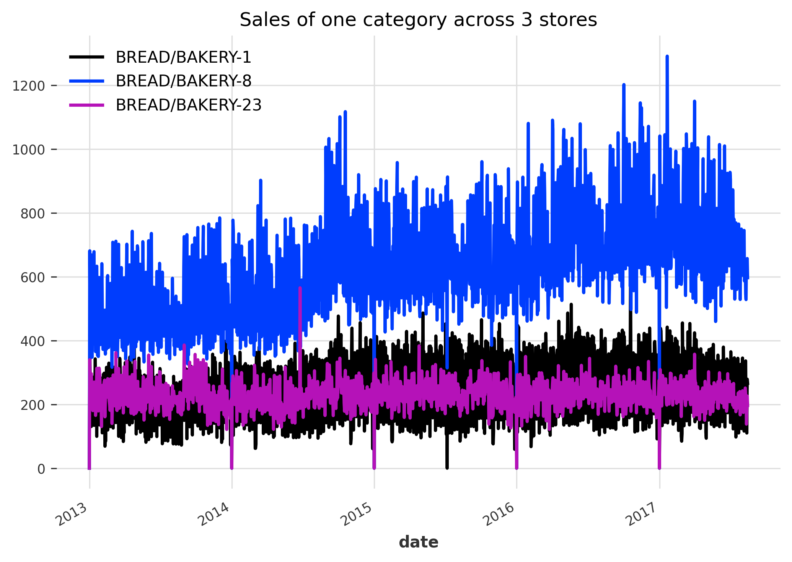
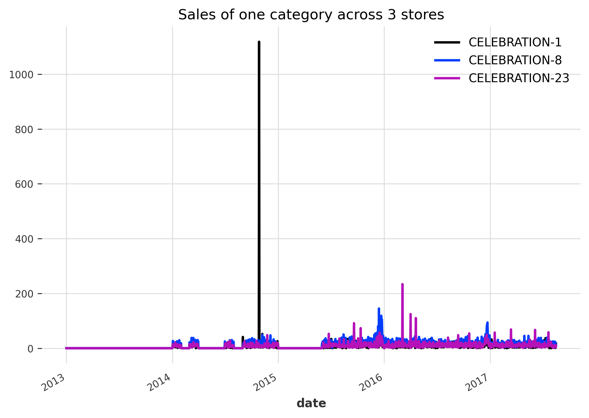
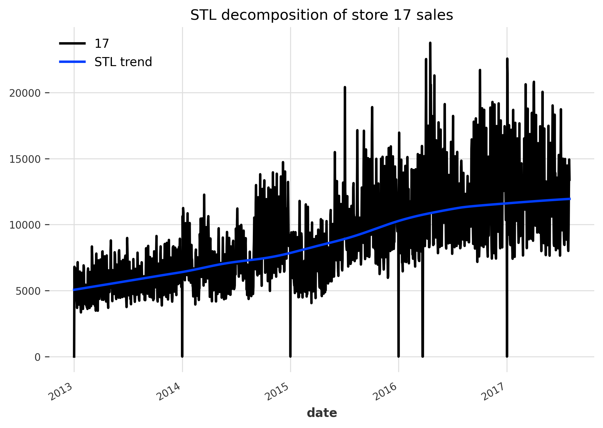
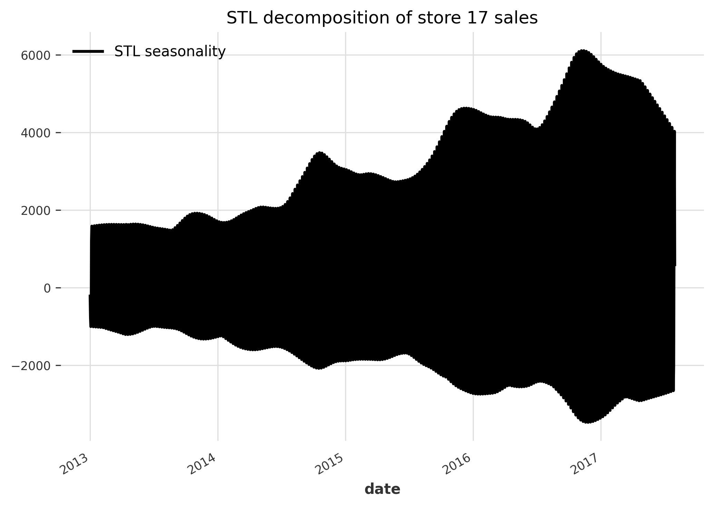
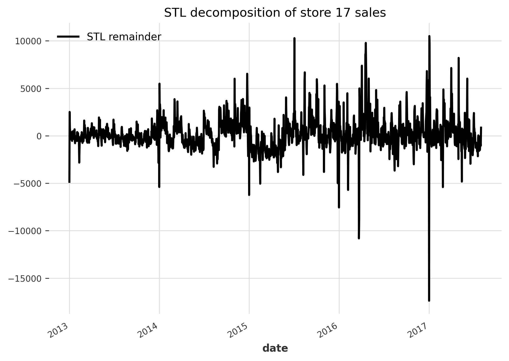
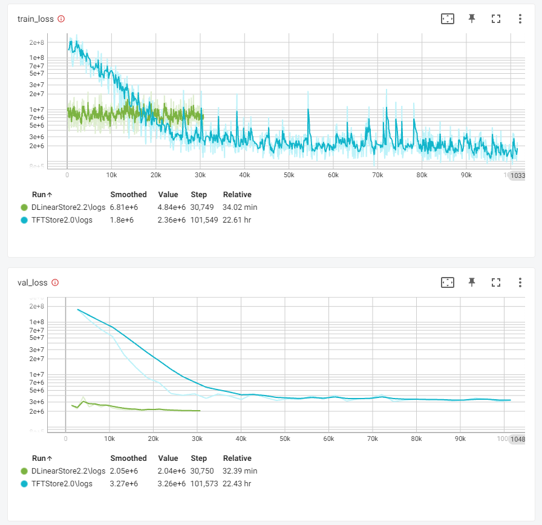
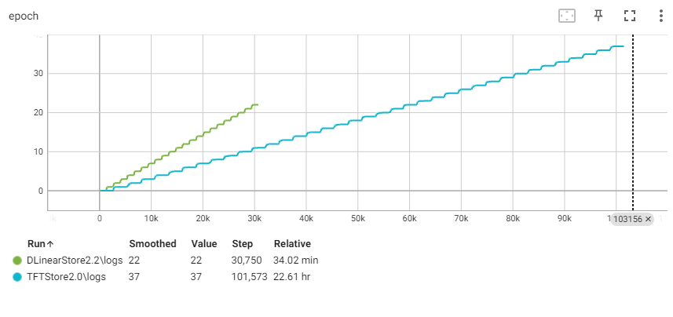
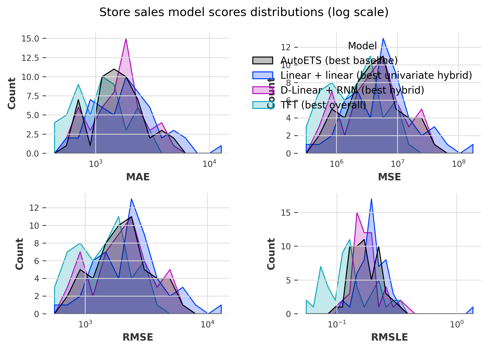
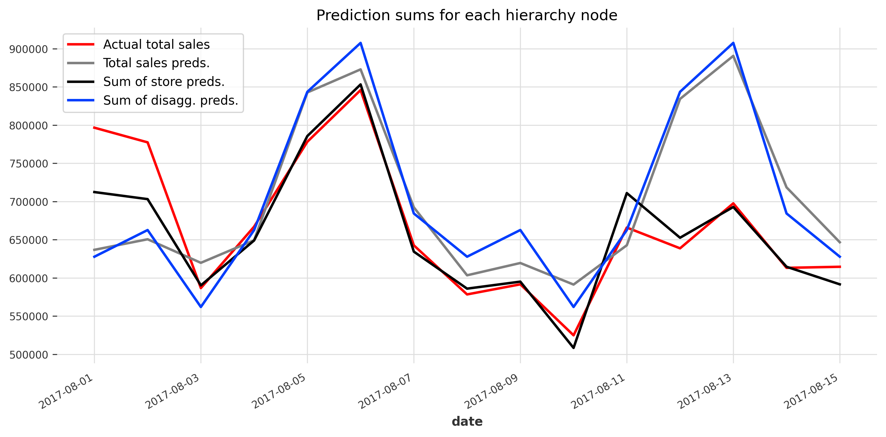

Time series regression - Store sales forecasting, part 2
================
Ahmet Zamanis

- <a href="#introduction" id="toc-introduction">Introduction</a>
- <a href="#data-preparation-steps-from-part-1"
  id="toc-data-preparation-steps-from-part-1">Data preparation steps from
  part 1</a>
- <a href="#hierarchical-time-series-sales"
  id="toc-hierarchical-time-series-sales">Hierarchical time series:
  Sales</a>
- <a href="#covariate-series" id="toc-covariate-series">Covariate
  series</a>
  - <a href="#total-sales-covariates" id="toc-total-sales-covariates">Total
    sales covariates</a>
  - <a href="#store-sales-covariates" id="toc-store-sales-covariates">Store
    sales covariates</a>
  - <a href="#disaggregated-sales-covariates"
    id="toc-disaggregated-sales-covariates">Disaggregated sales
    covariates</a>
- <a href="#helper-functions-for-modeling"
  id="toc-helper-functions-for-modeling">Helper functions for modeling</a>
- <a href="#modeling-total-sales" id="toc-modeling-total-sales">Modeling:
  Total sales</a>
  - <a href="#baseline-models" id="toc-baseline-models">Baseline models</a>
  - <a href="#linear-linear-hybrid-from-part-1"
    id="toc-linear-linear-hybrid-from-part-1">Linear + linear hybrid from
    part 1</a>
  - <a href="#d-linear" id="toc-d-linear">D-Linear</a>
  - <a href="#model-scores" id="toc-model-scores">Model scores</a>
- <a href="#modeling-store-sales" id="toc-modeling-store-sales">Modeling:
  Store sales</a>
  - <a href="#preprocessing" id="toc-preprocessing">Preprocessing</a>
  - <a href="#baseline-models-1" id="toc-baseline-models-1">Baseline
    models</a>
  - <a href="#stl-decomposition" id="toc-stl-decomposition">STL
    decomposition</a>
  - <a href="#hybrid-models" id="toc-hybrid-models">Hybrid models</a>
  - <a href="#global-hybrid-models" id="toc-global-hybrid-models">Global
    hybrid models</a>
  - <a href="#global-models-on-raw-series"
    id="toc-global-models-on-raw-series">Global models on raw series</a>
  - <a href="#model-scores-1" id="toc-model-scores-1">Model scores</a>
- <a href="#modeling-disaggregated-sales"
  id="toc-modeling-disaggregated-sales">Modeling: Disaggregated sales</a>
  - <a href="#preprocessing-1" id="toc-preprocessing-1">Preprocessing</a>
  - <a href="#baseline-models-2" id="toc-baseline-models-2">Baseline
    models</a>
  - <a href="#linear-regression" id="toc-linear-regression">Linear
    regression</a>
  - <a href="#global-d-linear" id="toc-global-d-linear">Global D-Linear</a>
- <a href="#hierarchical-reconciliation"
  id="toc-hierarchical-reconciliation">Hierarchical reconciliation</a>
  - <a href="#bottom-up-reconciliation"
    id="toc-bottom-up-reconciliation">Bottom-up reconciliation</a>
  - <a href="#top-down-reconciliation"
    id="toc-top-down-reconciliation">Top-down reconciliation</a>
  - <a href="#mint-reconciliation" id="toc-mint-reconciliation">MinT
    reconciliation</a>
  - <a href="#raw-vs-hierarchical-reconciled-scores"
    id="toc-raw-vs-hierarchical-reconciled-scores">Raw vs hierarchical
    reconciled scores</a>
- <a href="#conclusions-and-competition-submission"
  id="toc-conclusions-and-competition-submission">Conclusions and
  competition submission</a>

## Introduction

This is part 2 of a report on time series analysis & regression
modeling, performed in Python with the [Darts](https://github.com/unit8co/darts) library. In [part
1](https://github.com/AhmetZamanis/KaggleStoreSales/blob/main/ReportPart1.md),
we analyzed & forecasted only the daily national supermarket sales in
the [Kaggle Store Sales forecasting
competition](https://www.kaggle.com/competitions/store-sales-time-series-forecasting)
dataset. Now, we will generate forecasts for each level of the
hierarchy: Total sales, store sales (for each of the 54 stores), and
disaggregated series (1782 in total, 33 categories in 54 stores). For a
more detailed look into the data handling, feature engineering &
exploratory analysis process, as well as some of the models used, I
suggest looking at part 1 first.

In part 1, we had one series to forecast, so we performed manual
exploratory analysis & feature engineering, and achieved the best
forecasts using a hybrid model of two linear regressions. This time, we
have many series to forecast, so we will use a more automated approach.
We’ll also try some global deep learning / neural network models,
trained on multiple time series at once. Darts offers PyTorch
[implementations](https://unit8co.github.io/darts/userguide/torch_forecasting_models.html)
of numerous deep learning models specialized for time series
forecasting.

<details>
<summary>Show code</summary>

``` python
import pandas as pd 
import numpy as np
import matplotlib.pyplot as plt
import seaborn as sns
import torch
import tensorboard
from tqdm import tqdm

# Set printing options
np.set_printoptions(suppress=True, precision=4)
pd.options.display.float_format = '{:.4f}'.format
pd.set_option('display.max_columns', None)

# Set plotting options
plt.rcParams['figure.dpi'] = 300
plt.rcParams['savefig.dpi'] = 300
plt.rcParams["figure.autolayout"] = True

# Set torch settings
torch.set_float32_matmul_precision("high")
```

</details>
<details>
<summary>Show code</summary>

``` python
# Import Darts time series
from darts import TimeSeries
from darts.utils.timeseries_generation import datetime_attribute_timeseries

# Import transformers
from sklearn.preprocessing import StandardScaler
from darts.dataprocessing.transformers import Scaler
from sktime.transformations.series.difference import Differencer
from darts.dataprocessing.transformers import MissingValuesFiller

# Import baseline models
from darts.models.forecasting.baselines import NaiveDrift, NaiveSeasonal
from darts.models.forecasting.sf_ets import StatsForecastETS as ETS

# Import forecasting models
from darts.models.forecasting.linear_regression_model import LinearRegressionModel
from darts.models.forecasting.auto_arima import AutoARIMA
from darts.models.forecasting.random_forest import RandomForest
from darts.models.forecasting.dlinear import DLinearModel as DLinear
from darts.models.forecasting.rnn_model import RNNModel as RNN
from darts.models.forecasting.tft_model import TFTModel
from sklearn.linear_model import LinearRegression

# Import time decomposition functions
from statsmodels.tsa.deterministic import DeterministicProcess
from darts.utils.statistics import extract_trend_and_seasonality as decomposition
from darts.utils.statistics import remove_from_series
from darts.utils.utils import ModelMode, SeasonalityMode

# Import performance metrics
from darts.metrics import rmse, rmsle, mape, mae, mse

# Import Torch callbacks
from pytorch_lightning.callbacks.early_stopping import EarlyStopping
from pytorch_lightning.callbacks import RichProgressBar, RichModelSummary
```

</details>

## Data preparation steps from part 1

The initial data preparation is mostly the same as part 1, so we won’t
discuss it further, though the code below is a more compact version of
the code in part 1.

<details>
<summary>Show code</summary>

``` python
# Load original datasets
df_train = pd.read_csv("./OriginalData/train.csv", encoding = "utf-8")
df_test = pd.read_csv("./OriginalData/test.csv", encoding = "utf-8")
df_stores = pd.read_csv("./OriginalData/stores.csv", encoding = "utf-8")
df_oil = pd.read_csv("./OriginalData/oil.csv", encoding = "utf-8")
df_holidays = pd.read_csv("./OriginalData/holidays_events.csv", encoding = "utf-8")
df_trans = pd.read_csv("./OriginalData/transactions.csv", encoding = "utf-8")

# Combine df_train and df_test
df = pd.concat([df_train, df_test])

# Rename columns
df = df.rename(columns = {"family":"category"})
df_holidays = df_holidays.rename(columns = {"type":"holiday_type"})
df_oil = df_oil.rename(columns = {"dcoilwtico":"oil"})
df_stores = df_stores.rename(columns = {
  "type":"store_type", "cluster":"store_cluster"})

# Add columns from oil, stores and transactions datasets into main data
df = df.merge(df_stores, on = "store_nbr", how = "left")
df = df.merge(df_trans, on = ["date", "store_nbr"], how = "left")
df = df.merge(df_oil, on = "date", how = "left")


# Split holidays data into local, regional, national and events
events = df_holidays[df_holidays["holiday_type"] == "Event"].copy()
df_holidays = df_holidays.drop(labels=(events.index), axis=0)
local = df_holidays.loc[df_holidays["locale"] == "Local"].copy()
regional = df_holidays.loc[df_holidays["locale"] == "Regional"].copy()
national = df_holidays.loc[df_holidays["locale"] == "National"].copy()

# Drop duplicate rows in holidays-events
local = local.drop(265, axis = 0)
national = national.drop([35, 39, 156], axis = 0)
events = events.drop(244, axis = 0)

# Add local_holiday binary column to local holidays data, to be merged into main 
# data
local["local_holiday"] = (
  local.holiday_type.isin(["Transfer", "Additional", "Bridge"]) |
  ((local.holiday_type == "Holiday") & (local.transferred == False))
  ).astype(int)

# Add regional_holiday binary column to regional holidays data
regional["regional_holiday"] = (
  regional.holiday_type.isin(["Transfer", "Additional", "Bridge"]) |
  ((regional.holiday_type == "Holiday") & (regional.transferred == False))
  ).astype(int)

# Add national_holiday binary column to national holidays data
national["national_holiday"] = (
  national.holiday_type.isin(["Transfer", "Additional", "Bridge"]) |
  ((national.holiday_type == "Holiday") & (national.transferred == False))
  ).astype(int)

# Add event column to events
events["event"] = 1

# Merge local holidays binary column to main data, on date and city
local_merge = local.drop(
  labels = [
    "holiday_type", "locale", "description", "transferred"], axis = 1).rename(
      columns = {"locale_name":"city"})
df = df.merge(local_merge, how="left", on=["date", "city"])
df["local_holiday"] = df["local_holiday"].fillna(0).astype(int)

# Merge regional holidays binary column to main data
regional_merge = regional.drop(
  labels = [
    "holiday_type", "locale", "description", "transferred"], axis = 1).rename(
      columns = {"locale_name":"state"})
df = df.merge(regional_merge, how="left", on=["date", "state"])
df["regional_holiday"] = df["regional_holiday"].fillna(0).astype(int)

# Merge national holidays binary column to main data, on date
national_merge = national.drop(
  labels = [
    "holiday_type", "locale", "locale_name", "description", 
    "transferred"], axis = 1)
df = df.merge(national_merge, how="left", on="date")
df["national_holiday"] = df["national_holiday"].fillna(0).astype(int)

# Merge events binary column to main data
events_merge = events.drop(
  labels = [
    "holiday_type", "locale", "locale_name", "description", 
    "transferred"], axis = 1)
df = df.merge(events_merge, how="left", on="date")
df["event"] = df["event"].fillna(0).astype(int)

# Set datetime index
df = df.set_index(pd.to_datetime(df.date))
df = df.drop("date", axis=1)


# CPI adjust sales and oil, with CPI 2010 = 100
cpis = {
  "2010": 100, "2013": 112.8, "2014": 116.8, "2015": 121.5, "2016": 123.6, 
  "2017": 124.1
  }
  
for year in [2013, 2014, 2015, 2016, 2017]:
  df.loc[df.index.year == year, "sales"] = df.loc[
    df.index.year == year, "sales"] / cpis[str(year)] * cpis["2010"]
  df.loc[df.index.year == year, "oil"] = df.loc[
    df.index.year == year, "oil"] / cpis[str(year)] * cpis["2010"]
del year

# Interpolate missing values in oil
df["oil"] = df["oil"].interpolate("time", limit_direction = "both")


# New year's day features
df["ny1"] = ((df.index.day == 1) & (df.index.month == 1)).astype(int)
df["ny2"] = ((df.index.day == 2) & (df.index.month == 1)).astype(int)

# Set holiday dummies to 0 if NY dummies are 1
df.loc[df["ny1"] == 1, ["local_holiday", "regional_holiday", "national_holiday"]] = 0
df.loc[df["ny2"] == 1, ["local_holiday", "regional_holiday", "national_holiday"]] = 0

# NY's eve features
df["ny_eve31"] = ((df.index.day == 31) & (df.index.month == 12)).astype(int)

df["ny_eve30"] = ((df.index.day == 30) & (df.index.month == 12)).astype(int)

df.loc[(df["ny_eve31"] == 1) | (df["ny_eve30"] == 1), ["local_holiday", "regional_holiday", "national_holiday"]] = 0

# Proximity to Christmas sales peak
df["xmas_before"] = 0

df.loc[
  (df.index.day.isin(range(13,24))) & (df.index.month == 12), "xmas_before"] = df.loc[
  (df.index.day.isin(range(13,24))) & (df.index.month == 12)].copy().index.day - 12

df["xmas_after"] = 0
df.loc[
  (df.index.day.isin(range(24,28))) & (df.index.month == 12), "xmas_after"] = abs(df.loc[
  (df.index.day.isin(range(24,28))) & (df.index.month == 12)].index.day - 27)

df.loc[(df["xmas_before"] != 0) | (df["xmas_after"] != 0), ["local_holiday", "regional_holiday", "national_holiday"]] = 0

# Strength of earthquake effect on sales
# April 18 > 17 > 19 > 20 > 21 > 22
df["quake_after"] = 0
df.loc[df.index == "2016-04-18", "quake_after"] = 6
df.loc[df.index == "2016-04-17", "quake_after"] = 5
df.loc[df.index == "2016-04-19", "quake_after"] = 4
df.loc[df.index == "2016-04-20", "quake_after"] = 3
df.loc[df.index == "2016-04-21", "quake_after"] = 2
df.loc[df.index == "2016-04-22", "quake_after"] = 1

# Split events, delete events column
df["dia_madre"] = ((df["event"] == 1) & (df.index.month == 5) & (df.index.day.isin([8,10,11,12,14]))).astype(int)

df["futbol"] = ((df["event"] == 1) & (df.index.isin(pd.date_range(start = "2014-06-12", end = "2014-07-13")))).astype(int)

df["black_friday"] = ((df["event"] == 1) & (df.index.isin(["2014-11-28", "2015-11-27", "2016-11-25"]))).astype(int)

df["cyber_monday"] = ((df["event"] == 1) & (df.index.isin(["2014-12-01", "2015-11-30", "2016-11-28"]))).astype(int)

df = df.drop("event", axis=1)

# Days of week dummies
df["tuesday"] = (df.index.dayofweek == 1).astype(int)
df["wednesday"] = (df.index.dayofweek == 2).astype(int)
df["thursday"] = (df.index.dayofweek == 3).astype(int)
df["friday"] = (df.index.dayofweek == 4).astype(int)
df["saturday"] = (df.index.dayofweek == 5).astype(int)
df["sunday"] = (df.index.dayofweek == 6).astype(int)

# Add category X store_nbr column for Darts hierarchy
df["category_store_nbr"] = df["category"].astype(str) + "-" + df["store_nbr"].astype(str)

# Train-test split
df_train = df.loc[:"2017-08-15"]
df_test = df.loc["2017-08-16":]

# Replace transactions NAs in train with 0
df_train = df_train.fillna({"transactions": 0})

# Recombine train and test
df = pd.concat([df_train, df_test])
```

</details>
<details>
<summary>Show code</summary>

``` python
print(df.head(2))
```

</details>

                id  store_nbr    category  sales  onpromotion   city      state  \
    date                                                                          
    2013-01-01   0          1  AUTOMOTIVE 0.0000            0  Quito  Pichincha   
    2013-01-01   1          1   BABY CARE 0.0000            0  Quito  Pichincha   

               store_type  store_cluster  transactions     oil  local_holiday  \
    date                                                                        
    2013-01-01          D             13        0.0000 82.5709              0   
    2013-01-01          D             13        0.0000 82.5709              0   

                regional_holiday  national_holiday  ny1  ny2  ny_eve31  ny_eve30  \
    date                                                                           
    2013-01-01                 0                 0    1    0         0         0   
    2013-01-01                 0                 0    1    0         0         0   

                xmas_before  xmas_after  quake_after  dia_madre  futbol  \
    date                                                                  
    2013-01-01            0           0            0          0       0   
    2013-01-01            0           0            0          0       0   

                black_friday  cyber_monday  tuesday  wednesday  thursday  friday  \
    date                                                                           
    2013-01-01             0             0        1          0         0       0   
    2013-01-01             0             0        1          0         0       0   

                saturday  sunday category_store_nbr  
    date                                             
    2013-01-01         0       0       AUTOMOTIVE-1  
    2013-01-01         0       0        BABY CARE-1  

## Hierarchical time series: Sales

Each row in our original dataset is the sales of one product category,
at one store, on one date. We have 33 categories and 54 stores in our
data, which means we have a total of 1782 bottom level series we need to
forecast for the competition. These series add up in certain ways:

- Total sales = sum of 33 categories’ sales = sum of 1782 disaggregated
  series

- Total sales = sum of 54 stores’ sales = sum of 1782 disaggregated
  series

These are **hierarchical** time series structures, and we will generate
forecasts for each hierarchy node. I’ve attempted working with both
hierarchy structures, but had much worse results trying to predict
category sales:

- The sales patterns of each store are considerably similar in terms of
  trend and seasonality, while the sales patterns of each category can
  be very different. Some categories (such as school supplies) even take
  zero values for most of a year.

- This makes it much harder to model category sales with a general
  approach. Therefore, this report will only examine the second
  hierarchy structure: Total \> store totals \> disaggregated series.

We will create a multivariate Darts TimeSeries, where each series in the
hierarchy will be one component. We’ll also map the hierarchy structure
as a dictionary, and embed this into the Darts TS, so we can perform
hierarchical reconciliation later.

<details>
<summary>Show code</summary>

``` python
# Create wide dataframes with dates as rows, sales numbers for each hierarchy node as columns

# Total
total = pd.DataFrame(
  data = df_train.groupby("date").sales.sum(),
  index = df_train.groupby("date").sales.sum().index)

# Stores
store_nbr = pd.DataFrame(
  data = df_train.groupby(["date", "store_nbr"]).sales.sum(),
  index = df_train.groupby(["date", "store_nbr"]).sales.sum().index)
store_nbr = store_nbr.reset_index(level = 1)
store_nbr = store_nbr.pivot(columns = "store_nbr", values = "sales")

# Categories x stores
category_store_nbr = pd.DataFrame(
  data = df_train.groupby(["date", "category_store_nbr"]).sales.sum(),
  index = df_train.groupby(["date", "category_store_nbr"]).sales.sum().index)
category_store_nbr = category_store_nbr.reset_index(level = 1)
category_store_nbr = category_store_nbr.pivot(columns = "category_store_nbr", values = "sales")

# Merge all wide dataframes
from functools import reduce
wide_frames = [total, store_nbr, category_store_nbr]
df_sales = reduce(lambda left, right: pd.merge(
  left, right, how = "left", on = "date"), wide_frames)
df_sales = df_sales.rename(columns = {"sales":"TOTAL"})
del total, store_nbr, wide_frames, category_store_nbr

# Print wide sales dataframe
print(df_sales.iloc[0:5, [0, 1, 2, 84, 148]])
print("Rows x columns: " + str(df_sales.shape))
```

</details>

                     TOTAL         1         2  AUTOMOTIVE-36  BABY CARE-45
    date                                                                   
    2013-01-01   2226.6126    0.0000    0.0000         0.0000        0.0000
    2013-01-02 439798.2429 6575.4858 9101.7012         0.0000        0.0000
    2013-01-03 320444.3538 5206.7766 6748.7057         0.0000        0.0000
    2013-01-04 314237.3024 5248.1197 6672.3200         0.0000        0.0000
    2013-01-05 423182.7316 5601.7598 8457.0621         0.0000        0.0000
    Rows x columns: (1684, 1837)

<details>
<summary>Show code</summary>

``` python
# Create multivariate time series with sales series
ts_sales = TimeSeries.from_dataframe(df_sales, freq = "D")

# Create lists of hierarchy nodes
categories = df_train.category.unique().tolist()
stores = df_train.store_nbr.unique().astype(str).tolist()
categories_stores = df_train.category_store_nbr.unique().tolist()

# Initialize empty dict
hierarchy_target = dict()

# Map store sales series to total sales
for store in stores:
  hierarchy_target[store] = ["TOTAL"]

# Map category X store combinations to respective stores
from itertools import product
for category, store in product(categories, stores):
  hierarchy_target["{}-{}".format(category, store)] = [store]

# Embed hierarchy to ts_train
ts_sales = ts_sales.with_hierarchy(hierarchy_target)
print(ts_sales)

del category, store
```

</details>

    <TimeSeries (DataArray) (date: 1688, component: 1837, sample: 1)>
    array([[[  2226.6126],
            [     0.    ],
            [     0.    ],
            ...,
            [     0.    ],
            [     0.    ],
            [     0.    ]],

           [[439798.2429],
            [  6575.4858],
            [  9101.7012],
            ...,
            [    52.9716],
            [    64.0816],
            [    25.8989]],

           [[320444.3538],
            [  5206.7766],
            [  6748.7057],
            ...,
    ...
            ...,
            [    27.1136],
            [    28.411 ],
            [    16.116 ]],

           [[613152.6238],
            [  8407.1829],
            [  9840.0169],
            ...,
            [    38.66  ],
            [    26.7953],
            [    13.6986]],

           [[614554.34  ],
            [  7915.8348],
            [  9021.9662],
            ...,
            [    37.4754],
            [    18.7994],
            [    12.8928]]])
    Coordinates:
      * date       (date) datetime64[ns] 2013-01-01 2013-01-02 ... 2017-08-15
      * component  (component) <U29 'TOTAL' '1' '2' ... 'SEAFOOD-8' 'SEAFOOD-9'
    Dimensions without coordinates: sample
    Attributes:
        static_covariates:  None
        hierarchy:          {'1': ['TOTAL'], '10': ['TOTAL'], '11': ['TOTAL'], '1...

December 25 (Christmas Day) is missing from our original data. Darts
automatically recognizes these gaps in the date, and we can fill in
their values.

<details>
<summary>Show code</summary>

``` python
# Scan gaps
print(ts_sales.gaps())

# Fill gaps
na_filler = MissingValuesFiller()
ts_sales = na_filler.transform(ts_sales)
```

</details>

       gap_start    gap_end  gap_size
    0 2013-12-25 2013-12-25         1
    1 2014-12-25 2014-12-25         1
    2 2015-12-25 2015-12-25         1
    3 2016-12-25 2016-12-25         1

Let’s plot a few examples of the sales in our 54 stores.

<details>
<summary>Show code</summary>

``` python
_ = ts_sales["1"].plot()
_ = ts_sales["8"].plot()
_ = ts_sales["23"].plot()
_ = ts_sales["42"].plot()
_ = ts_sales["51"].plot()
_ = plt.title("Sales of 5 select stores")
plt.show()
plt.close("all")
```

</details>


We see the seasonality and even cyclicality in store sales are
considerably similar to one another, and to the total sales we analyzed
in part 1.

- This means a single feature set is likely to perform well for many
  stores, if not all.

- We will also consider global deep learning models: Models that will
  train on all 54 series in one go, and will be able to predict all 54
  stores (even new ones) with just one set of parameters. This wouldn’t
  be feasible for series that are quite different from one another, such
  as the sales of 33 categories.

- We also see store 42 likely didn’t open until roughly Q3 2015, so it
  had zero sales until then. Parametric models such as linear regression
  could struggle with such series.

<details>
<summary>Show code</summary>

``` python
_ = ts_sales["BREAD/BAKERY-1"].plot()
_ = ts_sales["BREAD/BAKERY-8"].plot()
_ = ts_sales["BREAD/BAKERY-23"].plot()
_ = plt.title("Sales of one category across 3 stores")
plt.show()
plt.close("all")
```

</details>



Some categories, such as bread & bakery, could display fairly consistent
seasonality in all stores, though we see the trends can be different
across stores.

<details>
<summary>Show code</summary>

``` python
_ = ts_sales["CELEBRATION-1"].plot()
_ = ts_sales["CELEBRATION-8"].plot()
_ = ts_sales["CELEBRATION-23"].plot()
_ = plt.title("Sales of one category across 3 stores")
plt.show()
plt.close("all")
```

</details>



Other categories such as celebration or school supplies could take zero
values for many periods of the year. Their seasonality patterns across
stores could differ considerably, making it hard to model them with a
single feature set and global models.

To sum up findings from our short exploratory analysis:

- Patterns in store sales are fairly similar to one another, though
  trends can be different. These could be modeled well by a single
  global model trained on all 54 stores. We’ll compare the performance
  of such global models with simpler models trained on each store
  separately.

- The patterns in category sales, both in category totals and single
  categories across different stores, could differ considerably.
  Applying global models to category totals (33 series), or to the
  disaggregated series (1782 series) is not likely to perform well (and
  indeed, they performed considerably worse than baseline models when I
  tried).

  - One configuration could be promising for modeling the 1782
    disaggregated series: Training 33 global models on each category’s
    sales in all 54 stores. This way, we derive a separate set of
    parameters for each category, as well as take advantage of the
    similarities across stores.

  - This would take a training time of at least 30+ hours on my machine
    depending on the model used (not to mention coding time and pauses),
    so I did not explore it further, but I believe it could result in
    the best predictions.

  - One of the best performing [Kaggle
    notebooks](https://www.kaggle.com/code/ferdinandberr/darts-forecasting-deep-learning-global-models)
    in the competition had the best results with this approach, but with
    global XGBoost models instead of global deep learning models. I
    expect NN models could do even better, as tree-based models may not
    be able to learn trend and long-term dependencies very well.

## Covariate series

We have the target series for our Darts models, now we need to create
the covariate series with our features.

### Total sales covariates

<details>
<summary>Show code</summary>

``` python
# Define functions to perform log transformation and reverse it. +1 to avoid zeroes
def trafo_log(x):
  return x.map(lambda x: np.log(x+1))

def trafo_exp(x):
  return x.map(lambda x: np.exp(x)-1)

# Create differencer
diff = Differencer(lags = 1)
```

</details>

#### For part 1 hybrid model

The feature engineering for the total sales hybrid model is explained in
detail in part 1, so I won’t discuss it again here, though the compact
code is available below.

<details>
<summary>Show code</summary>

``` python
# Aggregate time features by mean
total_covars1 = df.drop(
  columns=['id', 'store_nbr', 'category', 'sales', 'onpromotion', 'transactions', 'oil', 'city', 'state', 'store_type', 'store_cluster'], axis=1).groupby("date").mean(numeric_only=True)
  
# Add piecewise linear trend dummies
total_covars1["trend"] = range(1, 1701) # Linear trend dummy 1
total_covars1["trend_knot"] = 0
total_covars1.iloc[728:,-1] = range(0, 972) # Linear trend dummy 2

# Add Fourier features for monthly seasonality
dp = DeterministicProcess(
  index = total_covars1.index,
  constant = False,
  order = 0, # No trend feature
  seasonal = False, # No seasonal dummy features
  period = 28, # 28-period seasonality (28 days, 1 month)
  fourier = 5, # 5 Fourier pairs
  drop = True # Drop perfectly collinear terms
)
total_covars1 = total_covars1.merge(dp.in_sample(), how="left", on="date")

# Create Darts time series with time features
ts_totalcovars1 = TimeSeries.from_dataframe(total_covars1, freq = "D")

# Fill gaps in covars
ts_totalcovars1 = na_filler.transform(ts_totalcovars1)

# Retrieve covars with filled gaps
total_covars1 = ts_totalcovars1.pd_dataframe()
```

</details>
<details>
<summary>Show code</summary>

``` python
# Aggregate daily covariate series
total_covars2 = df.groupby("date").agg(
 {
  # "sales": "sum",
  "oil": "mean",
  "onpromotion": "sum"}
  )
total_covars2["transactions"] = df.groupby(["date", "store_nbr"]).transactions.mean().groupby("date").sum()


# Difference daily covariate series
total_covars2 = diff.fit_transform(total_covars2)
  
  
# Replace covariate series with their MAs

# Oil
total_covars2["oil_ma28"] = total_covars2["oil"].rolling(window = 28, center = False).mean()

total_covars2["oil_ma28"] = total_covars2["oil_ma28"].interpolate(
  method = "spline", order = 2, limit_direction = "both")

# Onpromotion
total_covars2["onp_ma28"] = total_covars2["onpromotion"].rolling(window = 28, center = False).mean()

total_covars2["onp_ma28"] = total_covars2["onp_ma28"].interpolate(
  method = "spline", order = 2, limit_direction = "both") 

# Transactions
total_covars2["trns_ma7"] = total_covars2["transactions"].rolling(window = 7, center = False).mean()

total_covars2["trns_ma7"] = total_covars2["trns_ma7"].interpolate("linear", limit_direction = "backward")  

# Drop original covariate series
total_covars2 = total_covars2.drop([
  "oil", "onpromotion", "transactions"], axis = 1)

# Replace last 16 dates' transactions MAs with NAs
total_covars2.loc[total_covars2.index > "2017-08-15", "trns_ma7"] = np.nan
```

</details>

#### For models on raw series

We’ll derive a slightly different feature set for the model to be fit on
the raw total sales. We’ll drop the trend dummies, and replace the
Fourier pairs with a cyclical encoding of day of month and month
features. We’ll discuss the rationale later when we introduce our model.

<details>
<summary>Show code</summary>

``` python
# Retrieve copy of total_covars1, drop Fourier terms, trend knot (leaving daily predictors common to all hierarchy levels).
common_covars = total_covars1[total_covars1.columns[2:21].values.tolist()].copy()

# Add differenced oil price and its MA to common covariates. 
common_covars["oil"] = df.groupby("date").oil.mean()

common_covars["oil"] = diff.fit_transform(common_covars["oil"]).interpolate("time", limit_direction = "both")

common_covars["oil_ma28"] = common_covars["oil"].rolling(window = 28, center = False).mean()

common_covars["oil_ma28"] = common_covars["oil_ma28"].interpolate(
  method = "spline", order = 2, limit_direction = "both")
  
# Print common covariates
print(common_covars.columns)
```

</details>

    Index(['national_holiday', 'ny1', 'ny2', 'ny_eve31', 'ny_eve30', 'xmas_before',
           'xmas_after', 'quake_after', 'dia_madre', 'futbol', 'black_friday',
           'cyber_monday', 'tuesday', 'wednesday', 'thursday', 'friday',
           'saturday', 'sunday', 'trend', 'oil', 'oil_ma28'],
          dtype='object', name='component')

<details>
<summary>Show code</summary>

``` python
# Retrieve copy of common covariates
total_covars = common_covars.copy()
  
# Retrieve local & regional holiday
total_covars["local_holiday"] = total_covars1["local_holiday"].copy()
total_covars["regional_holiday"] = total_covars1["regional_holiday"].copy()
  
# Retrieve differenced sales EMA
total_covars["sales_ema5"] = diff.fit_transform(
    df.groupby("date").sales.sum()
    ).interpolate(
  "linear", limit_direction = "backward"
  ).rolling(
    window = 5, min_periods = 1, center = False, win_type = "exponential").mean()
    
# Retrieve differenced onpromotion, its MA
total_covars["onpromotion"] = diff.fit_transform(
    df.groupby("date").onpromotion.sum()
    ).interpolate(
      "time", limit_direction = "both"
      )
      
total_covars["onp_ma28"] = total_covars["onpromotion"].rolling(
    window = 28, center = False
    ).mean().interpolate(
  method = "spline", order = 2, limit_direction = "both"
  ) 
  
# Retrieve differenced transactions, its MA
total_covars["transactions"] = diff.fit_transform(
    df.groupby("date").transactions.sum().interpolate(
      "time", limit_direction = "both"
      )
    )
    
total_covars["trns_ma7"] = total_covars["transactions"].rolling(
    window = 7, center = False
    ).mean().interpolate(
  "linear", limit_direction = "backward"
  )
  
# Create darts TS, fill gaps
x_total = na_filler.transform(
    TimeSeries.from_dataframe(total_covars, freq = "D")
    )
  
# Cyclical encode day of month using datetime_attribute_timeseries
x_total = x_total.stack(
    datetime_attribute_timeseries(
      time_index = x_total,
      attribute = "day",
      cyclic = True
      )
    )
    
# Cyclical encode month using datetime_attribute_timeseries
x_total = x_total.stack(
    datetime_attribute_timeseries(
      time_index = x_total,
      attribute = "month",
      cyclic = True
      )
    )
```

</details>

### Store sales covariates

For each of the 54 stores, we will retrieve a different set of
covariates.

- Some covariates, such as day of week or oil prices are common to all
  levels of the hierarchy.

- Others are unique to each series, for example, the local and regional
  holiday features will take different values for stores in different
  locations, not to mention the moving averages of past sales or
  transactions.

- Instead of using Fourier pairs for long-term seasonality features,
  such as day of month, we use cyclical encoding, which encodes the day
  of month as a single sine-cosine pair. This will likely generalize
  better to multiple stores (and algorithms), and is less likely to
  overfit.

<details>
<summary>Show code</summary>

``` python
# Initialize list of store covariates
store_covars = []

for store in [int(store) for store in stores]:
  
  # Retrieve common covariates
  covars = common_covars.copy()
  
  # Retrieve local & regional holiday
  covars["local_holiday"] = df[
    df["store_nbr"] == store].groupby("date").local_holiday.mean()
    
  covars["regional_holiday"] = df[
    df["store_nbr"] == store].groupby("date").regional_holiday.mean()  
  
  # Retrieve differenced sales EMA
  covars["sales_ema7"] = diff.fit_transform(
    df[df["store_nbr"] == store].groupby("date").sales.sum()
    ).interpolate(
  "linear", limit_direction = "backward"
  ).rolling(
    window = 7, min_periods = 1, center = False, win_type = "exponential").mean()
    
  # Retrieve differenced onpromotion, its MA
  covars["onpromotion"] = diff.fit_transform(
    df[df["store_nbr"] == store].groupby("date").onpromotion.sum()
    ).interpolate(
      "time", limit_direction = "both"
      )
      
  covars["onp_ma28"] = covars["onpromotion"].rolling(
    window = 28, center = False
    ).mean().interpolate(
  method = "spline", order = 2, limit_direction = "both"
  ) 
  
  # Retrieve differenced transactions, its MA
  covars["transactions"] = diff.fit_transform(
    df[df["store_nbr"] == store].groupby("date").transactions.sum().interpolate(
      "time", limit_direction = "both"
      )
    )
    
  covars["trns_ma7"] = covars["transactions"].rolling(
    window = 7, center = False
    ).mean().interpolate(
  "linear", limit_direction = "backward"
  )
  
  # Create darts TS, fill gaps
  covars = na_filler.transform(
    TimeSeries.from_dataframe(covars, freq = "D")
    )
  
  # Cyclical encode day of month using datetime_attribute_timeseries
  covars = covars.stack(
    datetime_attribute_timeseries(
      time_index = covars,
      attribute = "day",
      cyclic = True
      )
    )
    
   # Cyclical encode month using datetime_attribute_timeseries
  covars = covars.stack(
    datetime_attribute_timeseries(
      time_index = covars,
      attribute = "month",
      cyclic = True
      )
    )
    
  # Append TS to list
  store_covars.append(covars)
  
# Cleanup
del covars, store
```

</details>

**Static covariates** are time-invariant covariates, such as store
location. Global models use these to differentiate the multiple series
they are trained on. They are not used by models trained on one series
at a time.

- These could be quite useful for our deep learning models: For example,
  a complex combination of weights for the store static covariates and
  the trend features can allow a model adjust its trend predictions for
  each store.

- We’ll retrieve the store location, type and cluster information and
  one-hot encode them, to be later embedded into the target series.
  We’ll create a Pandas dataframe where columns are static covariates,
  and the index is the store numbers, to be passed into Darts.

  - One-hot encoding will create a lot of columns, and there may be
    better encoding methods to use here, especially for tree-based
    models (though we won’t apply any tree-based models globally).

<details>
<summary>Show code</summary>

``` python
# Create dataframe where column = static covariate and index = store nbr
store_static = df[["store_nbr", "city", "state", "store_type", "store_cluster"]].reset_index().drop("date", axis=1).drop_duplicates().set_index("store_nbr")

# Convert store cluster to string
store_static["store_cluster"] = store_static["store_cluster"].astype(str)

# One-hot encode static covariates
store_static = pd.get_dummies(store_static, sparse = False, drop_first = True)
```

</details>

### Disaggregated sales covariates

We’ll retrieve 1782 covariate series for our 1782 bottom level target
series. This takes around 10 minutes on my machine, though the code is
simpler as no aggregation is necessary.

<details>
<summary>Show code</summary>

``` python
# Initialize list of disagg covariates
disagg_covars = []

for series in tqdm(categories_stores):

  # Retrieve common covariates
  covars = common_covars.copy()

  # Retrieve local & regional holiday
  covars["local_holiday"] = df[
    df["category_store_nbr"] == series].local_holiday.copy()

  covars["regional_holiday"] = df[
    df["category_store_nbr"] == series].regional_holiday.copy()

  # Retrieve differenced sales EMA
  covars["sales_ema7"] = diff.fit_transform(
    df[df["category_store_nbr"] == series].sales.copy()).interpolate(
  "linear", limit_direction = "backward"
  ).rolling(
    window = 7, min_periods = 1, center = False, win_type = "exponential").mean()

  # Retrieve differenced onpromotion, its MA
  covars["onpromotion"] = diff.fit_transform(
    df[df["category_store_nbr"] == series].onpromotion.copy()).interpolate(
      "time", limit_direction = "both")

  covars["onp_ma28"] = covars["onpromotion"].rolling(
    window = 28, center = False
    ).mean().interpolate(
  method = "spline", order = 2, limit_direction = "both")

  # Retrieve differenced transactions, its MA
  covars["transactions"] = diff.fit_transform(
    df[df["category_store_nbr"] == series].transactions.copy()).interpolate(
      "time", limit_direction = "both")

  covars["trns_ma7"] = covars["transactions"].rolling(
    window = 7, center = False
    ).mean().interpolate(
  "linear", limit_direction = "backward")

  # Create darts TS, fill gaps
  covars = na_filler.transform(
    TimeSeries.from_dataframe(covars, freq = "D")
    )

  # Cyclical encode day of month using datetime_attribute_timeseries
  covars = covars.stack(
    datetime_attribute_timeseries(
      time_index = covars,
      attribute = "day",
      cyclic = True
      )
    )

   # Cyclical encode month using datetime_attribute_timeseries
  covars = covars.stack(
    datetime_attribute_timeseries(
      time_index = covars,
      attribute = "month",
      cyclic = True
      )
    )

  # Append TS to list
  disagg_covars.append(covars)

# Cleanup
del covars, series
```

</details>

We’ll also retrieve a set of static covariates for the disaggregated
series. In addition to the store information, we have the product
category available for use as a static covariate.

<details>
<summary>Show code</summary>

``` python
# Create dataframe where column = static covariate and index = series label
disagg_static = df[["category", "store_nbr", "city", "state", "store_type", "store_cluster", "category_store_nbr"]].reset_index().drop("date", axis=1).drop_duplicates().set_index("category_store_nbr")

# Convert store cluster to string
disagg_static["store_cluster"] = disagg_static["store_cluster"].astype(str)

# One-hot encode static covariates
disagg_static = pd.get_dummies(disagg_static, sparse = False, drop_first = True)
```

</details>

## Helper functions for modeling

We’ll define some performance scoring, plotting and transformation
functions.

We’ll look at several performance metrics, but the most important one is
RMSLE, as log errors penalize underpredictions more severely, which
makes sense for sales forecasts. The competition is also scored on
RMSLE.

<details>
<summary>Show code</summary>

``` python
# Define model scoring function for total sales (one series)
def perf_scores(val, pred, model = "drift", rounding = 4, logtrafo = True):
  
  if logtrafo == True:
    scores_dict = {
      "MAE": mae(trafo_exp(val), trafo_exp(pred)),
      "MSE": mse(trafo_exp(val), trafo_exp(pred)),
      "RMSE": rmse(trafo_exp(val), trafo_exp(pred)), 
      "RMSLE": rmse(val, pred), 
      "MAPE": mape(trafo_exp(val), trafo_exp(pred))
        }
  else:
    scores_dict = {
      "MAE": mae(val, pred),
      "MSE": mse(val, pred),
      "RMSE": rmse(val, pred), 
      "RMSLE": rmsle(val, pred), 
      "MAPE": mape(val, pred)
        }
      
  print("Model: " + model)
  
  for key in scores_dict:
    print(
      key + ": " + 
      str(round(scores_dict[key], rounding))
       )
  print("--------")
```

</details>
<details>
<summary>Show code</summary>

``` python
# Define model scoring function for hierarchy nodes (multiple series)
def scores_hierarchy(val, pred, subset, model, rounding = 4):
  
  def measure_mae(val, pred, subset):
    return mae([val[c] for c in subset], [pred[c] for c in subset])
  
  def measure_mse(val, pred, subset):
    return mse([val[c] for c in subset], [pred[c] for c in subset])
  
  def measure_rmse(val, pred, subset):
    return rmse([val[c] for c in subset], [pred[c] for c in subset])

  def measure_rmsle(val, pred, subset):
    return rmsle([(val[c]) for c in subset], [pred[c] for c in subset])

  scores_dict = {
    "MAE": measure_mae(val, pred, subset),
    "MSE": measure_mse(val, pred, subset),
    "RMSE": measure_rmse(val, pred, subset), 
    "RMSLE": measure_rmsle(val, pred, subset)
      }
      
  print("Model = " + model)    
  
  for key in scores_dict:
    print(
      key + ": mean = " + 
      str(round(np.nanmean(scores_dict[key]), rounding)) + 
      ", sd = " + 
      str(round(np.nanstd(scores_dict[key]), rounding)) + 
      ", min = " + str(round(min(scores_dict[key]), rounding)) + 
      ", max = " + 
      str(round(max(scores_dict[key]), rounding))
       )
       
  print("--------")
```

</details>
<details>
<summary>Show code</summary>

``` python
# Define model score plotting function for hierarchy nodes
def scores_plot(val, preds_dict, subset, logscale = True, title = "Plot Title"):
  
  # Scoring functions
  def measure_mae(val, pred, subset):
    return mae([val[c] for c in subset], [pred[c] for c in subset])
  
  def measure_mse(val, pred, subset):
    return mse([val[c] for c in subset], [pred[c] for c in subset])
  
  def measure_rmse(val, pred, subset):
    return rmse([val[c] for c in subset], [pred[c] for c in subset])

  def measure_rmsle(val, pred, subset):
    return rmsle([(val[c]) for c in subset], [pred[c] for c in subset])
  
  scores_df_all = []
  for key in preds_dict:
    
    # Dict of scores for 1 model
    scores_dict = {
      "MAE": measure_mae(val, preds_dict[key], subset),
      "MSE": measure_mse(val, preds_dict[key], subset),
      "RMSE": measure_rmse(val, preds_dict[key], subset), 
      "RMSLE": measure_rmsle(val, preds_dict[key], subset),
      "Model": key
      }
    
    # df of scores for 1 model
    scores_df = pd.DataFrame(
      data = scores_dict
    )
    
    # Append to list of score df's
    scores_df_all.append(scores_df)
  
  # Combine all models' score dfs
  scores_df_all = pd.concat(scores_df_all)
  
  # Create fig. of 4 histplots, one for each metric, grouped by model
  fig, ax = plt.subplots(2, 2)
  plt.suptitle(title)
  
  _ = sns.histplot(
    data = scores_df_all,
    x = "MAE",
    hue = "Model",
    element = "poly",
    log_scale = logscale,
    ax = ax[0,0],
    legend = False
  )
  
  _ = sns.histplot(
    data = scores_df_all,
    x = "MSE",
    hue = "Model",
    element = "poly",
    log_scale = logscale,
    ax = ax[0,1]
  )

  _ = sns.histplot(
    data = scores_df_all,
    x = "RMSE",
    hue = "Model",
    element = "poly",
    log_scale = logscale,
    ax = ax[1,0], 
    legend = False
  )
  
  _ = sns.histplot(
    data = scores_df_all,
    x = "RMSLE",
    hue = "Model",
    element = "poly",
    log_scale = logscale,
    ax = ax[1,1],
    legend = False
  )
  
  # Display and close
  plt.show()
  plt.close("all")
```

</details>

Some of our disaggregated series often take values of zero, or close to
zero. Some of our models could generate negative forecasts for these, so
we’ll define a function to clip negative forecasts to zero.

- Some competition notebooks also use zero forecasters: Transformers
  that replace predictions with zero based on certain rules, as some
  series take zero values for most of the year. I didn’t use such a
  transformation because it may hurt as well as help some models, but
  they are worth investigating for the best predictions.

<details>
<summary>Show code</summary>

``` python
# Define function to replace negative predictions with zeroes
def trafo_zeroclip(x):
  return x.map(lambda x: np.clip(x, a_min = 0, a_max = None))
```

</details>

## Modeling: Total sales

We’ll start by modeling total sales. We’ll fit and validate some
baseline models, our linear + linear hybrid from part 1, and a D-Linear
neural network model to see if it does better even with a small amount
of data.

### Baseline models

The baseline models we’ll use are naive drift, naive seasonal, and
automatic exponential smoothing. Their characteristics are discussed in
more detail in part 1 of this analysis.

<details>
<summary>Show code</summary>

``` python
# Specify baseline models
model_drift = NaiveDrift()
model_seasonal = NaiveSeasonal(K = 7) # Repeats the last week of the training data

# Specify ETS model for total sales
model_ets = ETS(
  season_length = 7, # Weekly seasonality
  model = "AAA", # Additive trend, seasonality and remainder component
  damped = None # Try both dampened and non-dampened trend
)
```

</details>
<details>
<summary>Show code</summary>

``` python
# Fit & validate baseline models

# Naive drift
_ = model_drift.fit(trafo_log(ts_sales["TOTAL"][:-15]))
pred_drift_total = model_drift.predict(n = 15)

# Naive seasonal
_ = model_seasonal.fit(trafo_log(ts_sales["TOTAL"][:-15]))
pred_seasonal_total = model_seasonal.predict(n = 15)

# ETS
_ = model_ets.fit(trafo_log(ts_sales["TOTAL"][:-15]))
pred_ets_total = model_ets.predict(n=15)
```

</details>

### Linear + linear hybrid from part 1

We’ll replicate our hybrid model from part 1, which uses a linear
regression to model, predict and remove the trend, seasonality &
calendar effects, and a second linear regression trained on the
remainder to model and predict the cyclical effects. This model was
discussed in detail in part 1, and the compact code is available below.

<details>
<summary>Show code</summary>

``` python
# Perform time decomposition in Sklearn

# Train-test split
y_train_decomp, y_val_decomp = trafo_log(
  ts_sales["TOTAL"][:-15].pd_series()
  ), trafo_log(
    ts_sales["TOTAL"][-15:].pd_series()
    ) 

x_train_decomp, x_val_decomp = total_covars1.iloc[:-31,], total_covars1.iloc[-31:-16,]

# Fit & predict on train, retrieve residuals
model_decomp = LinearRegression()
_ = model_decomp.fit(x_train_decomp, y_train_decomp)
pred_total1 = model_decomp.predict(x_train_decomp)
res_total1 = y_train_decomp - pred_total1

# Predict on val, retrieve residuals
pred_total2 = model_decomp.predict(x_val_decomp)
res_total2 = y_val_decomp - pred_total2

# Concatenate residuals to get decomposed sales
sales_decomp = pd.concat([res_total1, res_total2])

# Concatenate predictions to get model 1 predictions
preds_total1 = pd.Series(np.concatenate((pred_total1, pred_total2)), index = total_covars1.iloc[:-16,].index)


# Add decomped sales ema5 to covars2
total_covars2["sales_ema5"] = sales_decomp.rolling(
  window = 5, min_periods = 1, center = False, win_type = "exponential").mean()

# Make Darts TS with decomposed sales
ts_decomp = TimeSeries.from_series(sales_decomp.rename("TOTAL"), freq="D")

# Make Darts TS with model 1 predictions
ts_preds_total1 = TimeSeries.from_series(preds_total1.rename("TOTAL"), freq="D")

# Make Darts TS with covars2, fill gaps
ts_totalcovars2 = TimeSeries.from_dataframe(total_covars2, freq="D")
ts_totalcovars2 = na_filler.transform(ts_totalcovars2)

# Train-validation split
y_train_decomp2, y_val_decomp2 = ts_decomp[:-15], trafo_log(ts_sales["TOTAL"][-15:])
x_train_decomp2, x_val_decomp2 = ts_totalcovars2[:-31], ts_totalcovars2[-31:-16]

# Scale covariates (train-validation split only)
scaler = Scaler(StandardScaler())
x_train_decomp2 = scaler.fit_transform(x_train_decomp2)
x_val_decomp2 = scaler.transform(x_val_decomp2)

# Combine back scaled covariates
x_decomp = x_train_decomp2.append(x_val_decomp2)

# Model spec
model_linear = LinearRegressionModel(
  lags = [-1], # Target lags that can be used
  lags_future_covariates = [0], # No covariate lags
  lags_past_covariates = [-1], # Lag 1 of past covariates
  output_chunk_length = 15 # 15 predictions at a time
  )

# Fit model & predict validation set
_ = model_linear.fit(
  y_train_decomp2, 
  future_covariates = x_decomp[['oil_ma28', 'onp_ma28']],
  past_covariates = x_decomp[['sales_ema5', 'trns_ma7']]
  )

pred_linear_total = model_linear.predict(
  n = 15, 
  future_covariates = x_decomp[['oil_ma28', 'onp_ma28']],
  past_covariates = x_decomp[['sales_ema5', 'trns_ma7']]
  ) + ts_preds_total1[-15:]
```

</details>

### D-Linear

The linear + linear hybrid was our best performing model from part 1.
Now we’ll compare it against a neural network model tailored for time
series forecasting, the D-Linear model. The model has a fairly simple
architecture, and is able to outperform more complex Transformer models
([Original paper](https://arxiv.org/pdf/2205.13504.pdf), [GitHub
repository](https://github.com/cure-lab/LTSF-Linear)) in time series
forecasting.

- The raw input series are detrended using a moving average kernel,
  which is why we won’t use a trend dummy feature.

- Then, two linear layers are applied separately to the trend component
  and the detrended component. The final predictions are the sum of the
  output of both components.

- D-Linear is able to handle trended & non-stationary series well, which
  in my experience is not the case for some complex NN architectures
  such as recurrent neural networks. I believe this ability is crucial
  for good performance in this dataset, as sales are strongly trended
  and seasonal.

We have some preprocessing for our covariates:

- We need to train our neural networks with an “inner” validation set,
  to evaluate how well the model generalizes after each training epoch.
  This will be separate from the “outer” validation set we use for
  evaluating the performance of all models. The outer validation is the
  last 15 days in our data similar to the competition requirement, and
  the inner validation will be the 45 days before that.

  - We need 45 days of validation data because our NN models will be
    trained on input chunks of 30 days, and they will output predictions
    of 15 days at a time (except RNN).

- The gradient descent algorithm in NNs is sensitive to features with
  large values, so we’ll scale all our features between 0 and 1.
  Otherwise the weight updates would focus on features with large
  values, and training may even crash due to gradient explosion.

- It’s
  [recommended](https://unit8co.github.io/darts/userguide/torch_forecasting_models.html#performance-recommendations)
  to cast Darts TS to 32-bit data to improve training speed of Torch
  models, so we’ll do that.

- After all the preprocessing is done, we’ll join back the training,
  inner and outer validation covariates into one, as Darts automatically
  picks the right slice of covariates for training or prediction using
  the date index. This simplifies our workflow quite a bit.

<details>
<summary>Show code</summary>

``` python
# Create min-max scaler
scaler_minmax = Scaler()

# Split train-val series (inner validation for training Torch models, outer
# validation for evaluating performance)
cov_train, cov_innerval, cov_outerval = x_total[:-76], x_total[-76:-31], x_total[-31:]
  
# Scale train-val series
cov_train = scaler_minmax.fit_transform(cov_train)
cov_innerval = scaler_minmax.transform(cov_innerval)
cov_outerval = scaler_minmax.transform(cov_outerval)
  
# Rejoin series
cov_train = (cov_train.append(cov_innerval)).append(cov_outerval)
  
# Cast series to 32-bits for performance gains in Torch models
x_total = cov_train.astype(np.float32)

# Cleanup
del cov_train, cov_innerval, cov_outerval
```

</details>
<details>
<summary>Show code</summary>

``` python
# Retrieve total sales
total_sales = ts_sales["TOTAL"]

# Cast series to 32-bits for performance gains in Torch models
total_sales = total_sales.astype(np.float32)

# Split train-val series
y_train_total, y_val_total = total_sales[:-15], total_sales[-15:]
```

</details>

To avoid overfitting, we’ll use a Torch early stopper to train our NN
models. It will terminate training if the validation loss doesn’t
improve by a certain amount in 10 epochs. For total sales, we’ll use
0.1% of the mean squared error of our best baseline model as our
improvement threshold. The loss metric for training will also be the
default MSE.

<details>
<summary>Show code</summary>

``` python
# Create early stopper
early_stopper = EarlyStopping(
  monitor = "val_loss",
  min_delta = 10292685, # 0.1% of MSE of best baseline (ETS)
  patience = 10
)

# Progress bar
progress_bar = RichProgressBar()

# Rich model summary
model_summary = RichModelSummary(max_depth = -1)
```

</details>

Below is the specification I used for the best performing D-Linear model
on total sales.

- The model will train on input chunks of 30 days at a time, and output
  predictions for the next 15 days.

  - This was mainly chosen due to the validation set requirements: The
    training validation set has to be at least as long as the input +
    output sequence. Longer training sequences may be more informative
    for model training, but they will also require a longer validation
    set, which means less training data. There could be a better
    trade-off than my settings.

- The trend decomposition will be done with a moving average kernel of
  25 days, the default. This likely separates the data into a wiggly
  “trend-cycle” component, and a seasonal component free of trend and
  cyclicality.

  - Again, it’s worth experimenting with a longer kernel (meaning a
    smoother trend-cycle component which may generalize better into the
    future), but this kernel also has to be shorter than the training
    input sequence.

- Each training pass (batch) will use 32 input-output sequences. This
  parameter is likely more important for training speed than for
  prediction performance.

- Since we’ll use an early stopper and a validation set to terminate
  training and prevent overfitting, we set the number of epochs to an
  arbitrarily high number to ensure we have enough.

- We’ll use the default Torch optimizer, Adam, but double its default
  learning rate and use 0.002. A learning rate scheduler will decrease
  the learning rate in every 5 epochs with no improvement in the
  validation score.

  - The learning rate is a key parameter in training NNs, and affects
    how severely the model weights are adjusted in each iteration. Too
    high LR may result in a sub-optimal model, or even crash training.
    Too low LR will cause training to take longer and may even prevent
    improvement.

  - I did not try drastically different values for LR, but in general,
    higher values didn’t result in better prediction performance, and
    lower values weren’t necessary as I saw no indications of
    overfitting. The higher initial LR combined with scheduled decay
    enabled me to get the same or better prediction performances
    compared to default, with roughly half the training times.

- Torch models available in Darts can be logged and monitored with
  Tensorboard, and saved model checkpoints can be loaded later. The
  Torch optimizer, loss function, LR scheduler and trainer options can
  all be modified.

<details>
<summary>Show code</summary>

``` python
# Specify D-Linear model
model_dlinear = DLinear(
  input_chunk_length = 30,
  output_chunk_length = 15,
  kernel_size = 25,
  batch_size = 32,
  n_epochs = 500,
  model_name = "DLinearTotalX",
  log_tensorboard = True,
  save_checkpoints = True,
  show_warnings = True,
  optimizer_kwargs = {"lr": 0.002},
  lr_scheduler_cls = torch.optim.lr_scheduler.ReduceLROnPlateau,
  lr_scheduler_kwargs = {"patience": 5},
  pl_trainer_kwargs = {
    "callbacks": [early_stopper, progress_bar, model_summary],
    "accelerator": "gpu",
    "devices": [0],
    "log_every_n_steps": 1
    }
)
```

</details>

As stated before, we won’t include a trend dummy in the D-Linear models
as they handle trend natively. We’ll use all other available features.

- The sales moving average, transactions and its moving average are
  **past covariates.** We won’t know the value of these for our future
  predictions, but some Darts models can still use them in training. We
  can generate up to **output_chunk_length** predictions (in our case,
  15 days) without needing to pass “future” values of past covariates.

- All our other covariates are known into the future (at least in the
  competition dataset), so we’ll pass them as **future covariates** both
  in training and prediction.

<details>
<summary>Show code</summary>

``` python
dlinear_futcovs_total = ['tuesday', 'wednesday', 'thursday', 'friday', 'saturday', 'sunday', 'oil', 'oil_ma28', 'local_holiday', 'regional_holiday','national_holiday', 'ny1', 'ny2', 'ny_eve31', 'ny_eve30', 'xmas_before', 'xmas_after', 'quake_after', 'dia_madre', 'futbol', 'black_friday', 'cyber_monday',  'onpromotion', 'onp_ma28', 'day_sin', 'day_cos', 'month_sin', 'month_cos']

dlinear_pastcovs_total = ['sales_ema5','transactions', 'trns_ma7']
```

</details>

As stated before, we don’t need to separate the covariates for our
training, inner validation or outer validation data, as Darts will
automatically slice them according to the training data / prediction
period (as long as the dates are correct and matching).

<details>
<summary>Show code</summary>

``` python
# Fit DLinear model
_ = model_dlinear.fit(
  series = y_train_total[:-45],
  future_covariates = x_total[dlinear_futcovs_total],
  past_covariates = x_total[dlinear_pastcovs_total],
  val_series = y_train_total[-45:],
  val_future_covariates = x_total[dlinear_futcovs_total],
  val_past_covariates = x_total[dlinear_pastcovs_total],
  verbose = True
)
```

</details>

Of course, instead of retraining multiple neural network models in one
notebook, we’ll load the best checkpoint from our best
previously-trained model. Note that the model object is not
automatically set to the best checkpoint when training is finished (if
different from the last checkpoint).

<details>
<summary>Show code</summary>

``` python
# Load a previously trained Torch model's best checkpoint
model_dlinear = DLinear.load_from_checkpoint("DLinearTotal2.0", best = True)
```

</details>
<details>
<summary>Show code</summary>

``` python
pred_dlinear_total = model_dlinear.predict(
  n=15,
  series = y_train_total,
  future_covariates = x_total[dlinear_futcovs_total],
  )
```

</details>

### Model scores

Let’s score our baseline models, hybrid model and D-Linear model.

<details>
<summary>Show code</summary>

``` python
print("Total sales prediction scores")
print("--------")

perf_scores(
  trafo_log(ts_sales["TOTAL"][-15:]),
  pred_drift_total,
  "Naive drift"
  )

perf_scores(
  trafo_log(ts_sales["TOTAL"][-15:]), 
  pred_seasonal_total,
  "Naive seasonal"
  )

perf_scores(
  trafo_log(ts_sales["TOTAL"][-15:]), 
  pred_ets_total,
  "ETS (additive with log transformation)"
  )

perf_scores(
  y_val_decomp2, 
  pred_linear_total,
  "Linear + linear hybrid"
  )
  
perf_scores(
  y_val_total, 
  pred_dlinear_total, 
  model="D-Linear", 
  logtrafo = False
  )  
```

</details>

    Total sales prediction scores
    --------
    Model: Naive drift
    MAE: 107000.9836
    MSE: 13525244085.8885
    RMSE: 116298.0829
    RMSLE: 0.1736
    MAPE: 16.9895
    --------
    Model: Naive seasonal
    MAE: 80765.2427
    MSE: 12577473346.4179
    RMSE: 112149.335
    RMSLE: 0.1574
    MAPE: 11.5387
    --------
    Model: ETS (additive with log transformation)
    MAE: 75875.6335
    MSE: 10292685446.1179
    RMSE: 101452.873
    RMSLE: 0.1405
    MAPE: 10.9375
    --------
    Model: Linear + linear hybrid
    MAE: 80266.172
    MSE: 10433799544.9758
    RMSE: 102145.9718
    RMSLE: 0.139
    MAPE: 11.7372
    --------
    Model: D-Linear
    MAE: 76489.2
    MSE: 9623683000.0
    RMSE: 98100.375
    RMSLE: 0.1358
    MAPE: 11.3185
    --------

We see our models don’t perform much better than our baselines, and in
some metrics, slightly worse. This is mainly due to the forecast
horizon:

- With a short forecast horizon of 15 days, the long-term patterns in
  our data don’t matter too much, so exponential smoothing without
  covariates can perform almost as good as a NN model with many
  features.

- In part 1, we used all of the 2017 data as our validation period (227
  days), and the linear regression model greatly outperformed
  exponential smoothing and other baselines, as it was able to capture
  long-term patterns with covariates.

- Still, ETS performs considerably better than our naive baselines, our
  linear + linear hybrid performs a bit better than ETS, and the
  D-Linear model performs a bit better than the hybrid, despite not
  having the advantage of utilizing large amounts of data.

## Modeling: Store sales

Now, we’ll attempt to model and predict the sales in all 54 stores, with
simpler methods trained on each store separately, as well as with global
neural networks trained on all stores at once.

### Preprocessing

The preprocessing steps are the same as total sales, except applied to
the target and covariate series of each store. The target and covariate
series are gathered in lists, to be easily accessed and used in Darts
models.

<details>
<summary>Show code</summary>

``` python
# Train-validation split and scaling for covariates
x_store = []

for series in store_covars:
  
  # Split train-val series (inner validation for training Torch models, outer
  # validation for evaluating performance)
  cov_train, cov_innerval, cov_outerval = series[:-76], series[-76:-31], series[-31:]
  
  # Scale train-val series
  cov_train = scaler_minmax.fit_transform(cov_train)
  cov_innerval = scaler_minmax.transform(cov_innerval)
  cov_outerval = scaler_minmax.transform(cov_outerval)
  
  # Rejoin series
  cov_train = (cov_train.append(cov_innerval)).append(cov_outerval)
  
  # Cast series to 32-bits for performance gains in Torch models
  cov_train = cov_train.astype(np.float32)
  
  # Append series to list
  x_store.append(cov_train)
  
# Cleanup
del cov_train, cov_innerval, cov_outerval
```

</details>
<details>
<summary>Show code</summary>

``` python
# List of store sales
store_sales = [ts_sales[store] for store in stores]

# Train-validation split for store sales
y_train_store, y_val_store = [], []

for series in store_sales:
  
  # Add static covariates to series
  series = series.with_static_covariates(
    store_static[store_static.index == int(series.components[0])]
  )
  
  # Split train-val series
  y_train, y_val = series[:-15], series[-15:]
  
  # Cast series to 32-bits for performance gains in Torch models
  y_train = y_train.astype(np.float32)
  y_val = y_val.astype(np.float32)
  
  # Append series
  y_train_store.append(y_train)
  y_val_store.append(y_val)
  
# Cleanup
del y_train, y_val
```

</details>

### Baseline models

We’ll use the same baseline models as total sales, but make a slight
modification to the ETS model: We’ll allow the AutoETS process to choose
between an additive or multiplicative version of each ETS component
(error, trend, seasonality), or to drop them altogether. The choice is
made by fitting ETS models with all settings, and comparing their AICc
scores. This should help us tailor the baseline a little for each
series.

<details>
<summary>Show code</summary>

``` python
# Specify AutoETS model
model_autoets = ETS(
  season_length = 7, # Weekly seasonality
  model = "ZZZ", # Try additive, multiplicative or omission for each component
  damped = None # Try both dampened and non-dampened trend
)


# Fit & validate baseline models


# Naive drift
_ = model_drift.fit(ts_sales[stores][:-15])
pred_drift_store = model_drift.predict(n = 15)


# Naive seasonal
_ = model_seasonal.fit(ts_sales[stores][:-15])
pred_seasonal_store = model_seasonal.predict(n = 15)


# ETS

# First fit & validate the first store to initialize series
_ = model_autoets.fit(y_train_store[0])
pred_ets_store = model_autoets.predict(n = 15)

# Then loop over all stores except first
for i in tqdm(range(1, len(y_train_store))):

  # Fit on training data
  _ = model_autoets.fit(y_train_store[i])

  # Predict validation data
  pred = model_autoets.predict(n = 15)

  # Stack predictions to multivariate series
  pred_ets_store = pred_ets_store.stack(pred)
  
del pred, i


print("Store sales prediction scores, baseline models")
print("--------")

scores_hierarchy(
  ts_sales[stores][-15:],
  trafo_zeroclip(pred_drift_store),
  stores, 
  "Naive drift"
  )

scores_hierarchy(
  ts_sales[stores][-15:], 
  trafo_zeroclip(pred_seasonal_store),
  stores, 
  "Naive seasonal"
  )

scores_hierarchy(
  ts_sales[stores][-15:], 
  trafo_zeroclip(pred_ets_store),
  stores, 
  "AutoETS (all configurations evaluated)"
  )
```

</details>

    Store sales prediction scores, baseline models
    --------

    Model = Naive drift
    MAE: mean = 2328.177, sd = 1136.4971, min = 451.7328, max = 5366.7402
    MSE: mean = 9456240.9585, sd = 9595478.7352, min = 337899.9963, max = 39601845.7175
    RMSE: mean = 2766.8203, sd = 1341.9935, min = 581.2917, max = 6292.9997
    RMSLE: mean = 0.2362, sd = 0.0814, min = 0.0947, max = 0.4938
    --------

    Model = Naive seasonal
    MAE: mean = 2030.8822, sd = 1035.465, min = 560.4581, max = 5120.9853
    MSE: mean = 8805785.35, sd = 10045164.6608, min = 469271.2874, max = 48934329.0129
    RMSE: mean = 2621.2977, sd = 1390.8932, min = 685.0338, max = 6995.3076
    RMSLE: mean = 0.2171, sd = 0.0672, min = 0.1109, max = 0.36
    --------

    Model = AutoETS (all configurations evaluated)
    MAE: mean = 1764.8952, sd = 970.2832, min = 530.253, max = 4860.8032
    MSE: mean = 6891643.5112, sd = 8368370.5105, min = 516867.0186, max = 40144777.0205
    RMSE: mean = 2285.0048, sd = 1292.4383, min = 718.9346, max = 6335.9906
    RMSLE: mean = 0.1804, sd = 0.0519, min = 0.0991, max = 0.3466
    --------

### STL decomposition

Some of the models we’ll use are better suited to modeling time effects
such as trend and seasonality (linear regression), while others aren’t
good for modeling and extrapolating trend, but can perform well on
stationary remainders (Non-seasonal ARIMA, random forest…).

- In part 1, we used a linear + linear hybrid to model time effects,
  remove them from the series, and model the remainder. We had to do the
  decomposition part in Sklearn, as Darts does not allow predictions on
  training data (with good reason).

- Doing the same for 54 series will be quite the work, so this time
  we’ll use the time decomposition functions available in Darts. Namely,
  we’ll use an STL decomposition to separate each series into trend,
  seasonality and remainder, and we’ll train different models on
  different components. We’ll arrive at hybrid predictions by summing
  the predictions of different models.

STL decomposition is a flexible method for decomposing time series into
trend, seasonality and remainder components. STL uses the LOESS method
to capture non-linear relationships. LOESS can be thought of as
“non-linear regression” which fits combinations of polynomials instead
of a straight line.

- It’s possible to control the smoothness of the trend(-cycle)
  component, as well as adjust for changes in seasonality patterns. STL
  is also robust against extreme observations.

- However, STL is unable to perform multiplicative decomposition
  natively (though this can be achieved by working with log-transformed
  data), or capture calendar effects such as holidays.

  - The latter is likely STL’s main disadvantage compared to our linear
    decomposition from part 1, as I believe it makes more sense to
    evaluate trend, fixed seasonality and calendar effects together. On
    the other hand, there could be merit to leaving calendar effects to
    more sophisticated algorithms used to model the remainder component.

- We’ll aim to retrieve a very smooth, linear-like trend component by
  setting a very large trend window, so we can model and extrapolate a
  robust trend. This will leave cyclicality and calendar effects to our
  remainder component, to be modeled by more sophisticated algorithms.

- For seasonality, we’ll focus on the best candidate, and set a seasonal
  period of 7 days. I had the best results with a seasonal smoother of
  29 days, though better configurations may be possible.

  - As with the trend smoother, a wider window will give a more robust
    and smooth seasonality component, but may also not adapt to changes
    in seasonality quickly enough.

<details>
<summary>Show code</summary>

``` python
# Perform STL decomposition on training data to get trend + seasonality and remainder series
trend_store = []
season_store = []
remainder_store = []

for series in y_train_store:
  
  # Perform STL decomposition
  trend, seasonality = decomposition(
    series,
    model = ModelMode.ADDITIVE,
    method = "STL",
    freq = 7, # N. of obs in each seasonality cycle
    seasonal = 29, # Size of seasonal smoother (last n lags)
    trend = 731, # Size of trend smoother
    robust = True # Robust against outliers
  )
  
  # Rename components in trend and seasonality series to be same as original series
  trend = trend.with_columns_renamed(
    trend.components[0], 
    series.components[0]
    )
    
  seasonality = seasonality.with_columns_renamed(
    seasonality.components[0], 
    series.components[0]
    )
  
  # Remove trend & seasonality from series to retrieve remainder
  remainder = remove_from_series(
    series,
    (trend + seasonality),
    ModelMode.ADDITIVE
  )
  
  # Append each component to respective lists
  trend_store.append(trend)
  season_store.append(seasonality)  
  remainder_store.append(remainder)
  
# Cleanup
del series, trend, seasonality, remainder
```

</details>

We’ll plot the STL-decomposed components for one store.

<details>
<summary>Show code</summary>

``` python
y_train_store[8].plot()
trend_store[8].plot(label = "STL trend")
_ = plt.title("STL decomposition of store 17 sales")
plt.show()
plt.close("all")

season_store[8].plot(label = "STL seasonality")
_ = plt.title("STL decomposition of store 17 sales")
plt.show()
plt.close("all")

remainder_store[8].plot(label = "STL remainder")
_ = plt.title("STL decomposition of store 17 sales")
plt.show()
plt.close("all")
```

</details>







As we can see, the trend component is fairly linear, while the
cyclicality and calendar effects are mostly left to the remainder
component.

- I found this to be ideal for robust trend predictions into the future.
  With a wiggly trend-cycle component, we’d leave much of the cyclical
  effects to be modeled by the time effects model, which is often a
  simple method like linear regression, and may not handle complex
  patterns well.

### Hybrid models

We’ll start by fitting univariate hybrid models, one by one on each
series, similar to what we did in part 1. For the time effects component
(trend + seasonality), we’ll fit a linear regression. For the remainder
components, we’ll fit a linear regression, AutoARIMA and random forest
model.

#### Linear regression on STL trend + seasonality

The time effects linear regression will use a trend dummy, days of week
dummies, and the cyclical encoded day of month and month features.

<details>
<summary>Show code</summary>

``` python
# Specify linear regression model
model_linear = LinearRegressionModel(
  lags_future_covariates = [0], # Don't create any covariate lags
  output_chunk_length = 15 # Predict 15 steps in one go
)

# Time covariates (trend + seasonality, only future covariates)
linear_covars = ["trend", 'tuesday', 'wednesday', 'thursday', 'friday', 'saturday', 'sunday', 'day_sin', 'day_cos', "month_sin", "month_cos"]
```

</details>

To retrieve our predictions as a single multivariate series with 54
components, we’ll first fit and predict the first store, and use a loop
to fit & predict the remaining 53, stacking the predictions to the first
one each time.

<details>
<summary>Show code</summary>

``` python
# First fit & validate the first store to initialize multivariate series
_ = model_linear.fit(
  (trend_store[0] + season_store[0]),
  future_covariates = x_store[0][linear_covars]
)

pred_linear_store = model_linear.predict(
  n=15,
  future_covariates = x_store[0][linear_covars]
)

# Then loop over all stores except first
for i in tqdm(range(1, len(y_train_store))):

  # Fit on training data
  _ = model_linear.fit(
    (trend_store[i] + season_store[i]),
    future_covariates = x_store[i][linear_covars]
    )

  # Predict validation data
  pred = model_linear.predict(
    n=15,
    future_covariates = x_store[i][linear_covars]
    )

  # Stack predictions to multivariate series
  pred_linear_store = pred_linear_store.stack(pred)
  
del pred, i
```

</details>

#### Linear regression on STL remainder

The linear regression on the remainder component will use sales lag 1,
as well as lag 1 of the past covariates: The sales moving average and
transactions features. The future covariates will be the calendar
features, along with the oil and onpromotion features.

<details>
<summary>Show code</summary>

``` python
# Specify linear regression model
model_linear2 = LinearRegressionModel(
  lags = [-1], # Use one target lag
  lags_future_covariates = [0], # Don't use any future covariate lags
  lags_past_covariates = [-1], # Use one past covariate lag
  output_chunk_length = 15 # Predict 15 steps in one go
)


# Covariates (cylical + calendar, future & past covariates)
linear2_futcovars = ["oil", 'oil_ma28', "onpromotion", 'onp_ma28', 'local_holiday', 'regional_holiday', 'national_holiday', 'ny1', 'ny2', 'ny_eve31', 'ny_eve30', 'xmas_before', 'xmas_after', 'quake_after', 'dia_madre', 'futbol', 'black_friday', 'cyber_monday']

linear2_pastcovars = ["sales_ema7", "transactions", 'trns_ma7']


# First fit & validate the first store to initialize series
_ = model_linear2.fit(
  remainder_store[0],
  future_covariates = x_store[0][linear2_futcovars],
  past_covariates = x_store[0][linear2_pastcovars]
)

pred_linear2_store = model_linear2.predict(
  n=15,
  future_covariates = x_store[0][linear2_futcovars]
)

# Then loop over all stores except first
for i in tqdm(range(1, len(y_train_store))):

  # Fit on training data
  _ = model_linear2.fit(
        remainder_store[i],
        future_covariates = x_store[i][linear2_futcovars],
        past_covariates = x_store[i][linear2_pastcovars]
  )

  # Predict validation data
  pred = model_linear2.predict(
    n=15,
    future_covariates = x_store[i][linear2_futcovars]
  )

  # Stack predictions to multivariate series
  pred_linear2_store = pred_linear2_store.stack(pred)
  
del pred, i
```

</details>

#### AutoARIMA on STL remainder

The ARIMA model, and the AutoARIMA evaluation process was discussed in
detail in part 1. The ARIMA model will use the same future covariates as
the linear regression, but it does not take in past covariates.

<details>
<summary>Show code</summary>

``` python
# AutoARIMA
model_arima = AutoARIMA(
  start_p = 0,
  max_p = 7,
  start_q = 0,
  max_q = 7,
  seasonal = False, # Don't include seasonal orders
  information_criterion = 'aicc', # Minimize AICc to choose best model
  trace = False # Don't print tuning iterations
  )

# AutoARIMA covars (cyclical + calendar, future covariates only)
arima_covars = linear2_futcovars
```

</details>

Since the AutoARIMA process takes roughly 30 minutes for all 54 stores,
we’ll load previously saved predictions.

- In at least one iteration, AutoARIMA gave a warning that the input
  series was completely constant, and chose an ARMA(0, 0, 0) model with
  no AR or MA components. This adaptability could help it adjust better
  to series with constant zero values compared to a linear regression.

<details>
<summary>Show code</summary>

``` python
# Load previously saved ARIMA store preds
pred_arima_store = TimeSeries.from_csv(
  "./ModifiedData/pred_arima_store1.csv",
  time_col = "date",
  freq = "D"
)
```

</details>

#### Random forest on STL remainder

The random forest model was discussed in part 1, and the implementation
is pretty much the same. It uses the same covariates as the linear
regression model.

<details>
<summary>Show code</summary>

``` python
# Specify random forest model
model_rf = RandomForest(
  lags = [-1],
  lags_future_covariates = [0],
  lags_past_covariates = [-1],
  n_estimators = 500, # Fit 500 trees
  oob_score = True, # Score trees on out-of-bag samples
  random_state = 1923,
  n_jobs = 20
)

# RF covariates (cylical + calendar, future & past)
rf_futcovars = linear2_futcovars
rf_pastcovars = linear2_pastcovars
```

</details>
<details>
<summary>Show code</summary>

``` python
# First fit & validate the first store to initialize series
_ = model_rf.fit(
  remainder_store[0],
  future_covariates = x_store[0][rf_futcovars],
  past_covariates = x_store[0][rf_pastcovars],
  )

pred_rf_store = model_rf.predict(
  n=15,
  future_covariates = x_store[0][rf_futcovars]
  )

# Then loop over all stores except first
for i in tqdm(range(1, len(y_train_store))):

  # Fit on training data
  _ = model_rf.fit(
        remainder_store[i],
        future_covariates = x_store[i][rf_futcovars],
        past_covariates = x_store[i][rf_pastcovars]
  )

  # Predict validation data
  pred = model_rf.predict(
    n=15,
    future_covariates = x_store[i][rf_futcovars]
  )

  # Stack predictions to multivariate series
  pred_rf_store = pred_rf_store.stack(pred)

# Cleanup
del pred, i
```

</details>

### Global hybrid models

We’ll now consider global hybrid models: We’ll fit a D-Linear model on
all of the trend + seasonality components at once, and a recurrent
neural network model on all remainder components at once. We can sum the
predictions of these two models, as well as sum them with the univariate
models’ predictions to achieve various hybrid predictions.

As before, we’ll create an early stopper for training. This time, the
threshold value for early stopping will be the 1% of the minimum MSE
achieved by the AutoETS model (on one store).

<details>
<summary>Show code</summary>

``` python
# Create early stopper
early_stopper = EarlyStopping(
  monitor = "val_loss",
  min_delta = 5000, # 1% of min. MSE of best model so far
  patience = 10
)
```

</details>

#### D-Linear on STL trend + seasonality

This D-Linear model has the same specifications as the one for total
sales, except the batch size was doubled to 64.

<details>
<summary>Show code</summary>

``` python
# Specify D-Linear model
model_dlinear = DLinear(
  input_chunk_length = 30,
  output_chunk_length = 15,
  kernel_size = 25,
  batch_size = 64,
  n_epochs = 500,
  model_name = "DLinearStoreX",
  log_tensorboard = True,
  save_checkpoints = True,
  show_warnings = True,
  optimizer_kwargs = {"lr": 0.002},
  lr_scheduler_cls = torch.optim.lr_scheduler.ReduceLROnPlateau,
  lr_scheduler_kwargs = {"patience": 5},
  pl_trainer_kwargs = {
    "callbacks": [early_stopper, progress_bar, model_summary],
    "accelerator": "gpu",
    "devices": [0]
    }
)
```

</details>

The covariates for the D-Linear time effects model are the same as the
linear regression time effects model, but without a trend dummy. We also
retrieve the sums of trend + seasonality components for each store as a
list, to be used in model fitting.

<details>
<summary>Show code</summary>

``` python
# Time covariates (seasonality, all future)
dlinear_covars = linear_covars.copy()
dlinear_covars.remove("trend")

# Retrieve sums of trend and seasonality components as a list
trend_season_list_store = [
  (trend_store[i] + season_store[i]) for i in range(0, len(trend_store))
    ]
```

</details>

Fitting a global Torch model on multiple Darts series is simple: We
gather all our target and covariate series into lists, and pass the
lists into the `.fit()` method instead of single series, as seen below.
Of course, the order of the target series list must match the order of
the covariate series list. We use the last 45 days in our training set
as our inner validation set for training Torch models.

<details>
<summary>Show code</summary>

``` python
# Fit DLinear model
model_dlinear.fit(
  series = [y[:-45] for y in trend_season_list_store],
  future_covariates = [x[dlinear_covars] for x in x_store],
  val_series = [y[-45:] for y in trend_season_list_store],
  val_future_covariates = [x[dlinear_covars] for x in x_store],
  verbose = True
)
```

</details>

We load our global D-Linear model trained on all series, and use it to
predict the next 15 days for each store series using a loop.

- Unlike prediction with a model trained on a single series, this time
  we have to specify which series we want to generate forecasts for.

- It’s even possible to generate forecasts for series not used in
  training (in this case, this would be new stores) as long as the same
  covariates are available.

  - If this was a real-life business scenario, a well-generalized global
    model could be used to generate forecasts for new stores without
    needing retraining, or be used for forecasting hypothetical
    scenarios.

<details>
<summary>Show code</summary>

``` python
# Load a previously trained Torch model's best checkpoint
model_dlinear = DLinear.load_from_checkpoint("DLinearStore1.3", best = True)
```

</details>
<details>
<summary>Show code</summary>

``` python
# First validate the first store to initialize series
pred_dlinear_store = model_dlinear.predict(
  n=15,
  series = trend_season_list_store[0],
  future_covariates = x_store[0][dlinear_covars]
  )

# Then loop over all stores except first
for i in tqdm(range(1, len(trend_season_list_store))):

  # Predict validation data
  pred = model_dlinear.predict(
    n=15,
    series = trend_season_list_store[i],
    future_covariates = x_store[i][dlinear_covars]
  )

  # Stack predictions to multivariate series
  pred_dlinear_store = pred_dlinear_store.stack(pred)
  
del pred, i
```

</details>

#### RNN on STL remainder

As our global remainder model, we’ll use a recurrent neural network,
more specifically the long short-term memory (LSTM) variant.

- This deep learning architecture includes “memory” cells that can
  learn, retain and discard long-term dependencies. This allows it to
  learn long-term patterns dependent on the input order of data. RNNs
  are used in language and speech modeling tasks as well as time series
  forecasting.

- From what I could learn, and in my experience, the RNN architecture
  doesn’t handle trended / non-stationary data very well, at least
  compared to the D-Linear model.

  - This may be because it doesn’t perform any decomposition on the
    inputs, nor does it model trend in “one go” like linear regression,
    as NN models are trained on input chunks and not the full training
    data at each training iteration.

  - [This
    article](https://towardsdatascience.com/how-to-learn-long-term-trends-with-lstm-c992d32d73be)
    sheds more light on the nature of the memory cells, and suggests
    they discard information too quickly to learn long-term trends
    effectively (and suggests an alternative implementation).

  - However, with a more complex architecture and higher capacity, it
    may perform better on the remainder component, which may have
    complex patterns.

The RNN models (at least in Darts) are only able to predict one time
step ahead, so they don’t take in an `output_chunk_length` argument.

- The `training_length` argument has to be at least 1 step longer than
  the `input_chunk_length`. As before, we use an input length of 30
  days.

- `dropout` is the fraction of units (neurons) in the model affected by
  dropout, the random removal of some of the inputs of a neuron.

  - This helps combat overfitting, because spurious relationships in the
    data are learned as very specific combinations of weights across the
    network, and randomly applying dropout to a few neurons destroys
    such combinations.

There are some parameters specific to the RNN model:

- `n_rnn_layers` is the number of recurrent layers in the model, which
  hold the memory cells. The default is one, but I had slightly better
  results with 2.

- `hidden_dim` is the number of features in the hidden state, which
  stores the information necessary to capture long-term dependencies. I
  increased this a bit from the default value of 25 because I also added
  a second recurrent layer, but I did not tune it purposefully.

<details>
<summary>Show code</summary>

``` python
# Specify RNN model
model_rnn = RNN(
  model = "LSTM",
  input_chunk_length = 30,
  training_length = 31,
  batch_size = 64,
  n_epochs = 500,
  n_rnn_layers = 2,
  hidden_dim = 32,
  dropout = 0.1,
  model_name = "RNNStoreX",
  log_tensorboard = True,
  save_checkpoints = True,
  show_warnings = True,
  optimizer_kwargs = {"lr": 0.002},
  lr_scheduler_cls = torch.optim.lr_scheduler.ReduceLROnPlateau,
  lr_scheduler_kwargs = {"patience": 5},
  pl_trainer_kwargs = {
    "callbacks": [early_stopper, progress_bar, model_summary],
    "accelerator": "gpu",
    "devices": [0]
    }
)
```

</details>

The RNN model will use the same future covariates as the linear
regression remainder model, but it can’t use past covariates.

<details>
<summary>Show code</summary>

``` python
# RNN covariates (calendar + cyclical, future only)
rnn_covars = linear2_futcovars
```

</details>
<details>
<summary>Show code</summary>

``` python
# Load a previously trained Torch model's best checkpoint
model_rnn = RNN.load_from_checkpoint("RNNStore1.3", best = True)
```

</details>
<details>
<summary>Show code</summary>

``` python
# First fit & validate the first store to initialize series
pred_rnn_store = model_rnn.predict(
  n=15,
  series = remainder_store[0],
  future_covariates = x_store[0][rnn_covars]
  )

# Then loop over all stores except first
for i in tqdm(range(1, len(remainder_store))):

  # Predict validation data
  pred = model_rnn.predict(
    n=15,
    series = remainder_store[i],
    future_covariates = x_store[i][rnn_covars]
  )

  # Stack predictions to multivariate series
  pred_rnn_store = pred_rnn_store.stack(pred)
  
del pred, i
```

</details>

### Global models on raw series

Besides the hybrid modeling approach, I wanted to try training global NN
models on raw, undecomposed time series, to see if decomposition is even
necessary. While the rationale of hybrid modeling is to separate the
time effects from cyclical effects and model them with appropriate
algorithms, it’s possible a NN model may perform better by learning
complex relationships between them.

#### D-Linear

We’ll evaluate a D-Linear model trained on all of the raw series, with
all features except the trend dummy. The hyperparameters are the same as
before.

<details>
<summary>Show code</summary>

``` python
# Specify D-Linear model
model_dlinear = DLinear(
  input_chunk_length = 30,
  output_chunk_length = 15,
  kernel_size = 25,
  batch_size = 64,
  n_epochs = 500,
  model_name = "DLinearStoreX",
  log_tensorboard = True,
  save_checkpoints = True,
  show_warnings = True,
  optimizer_kwargs = {"lr": 0.002},
  lr_scheduler_cls = torch.optim.lr_scheduler.ReduceLROnPlateau,
  lr_scheduler_kwargs = {"patience": 5},
  pl_trainer_kwargs = {
    "callbacks": [early_stopper, progress_bar, model_summary],
    "accelerator": "gpu",
    "devices": [0]
    }
)
```

</details>
<details>
<summary>Show code</summary>

``` python
# All covariates, future & past
dlinear2_futcovars = dlinear_covars + rnn_covars

dlinear2_pastcovars = linear2_pastcovars
```

</details>
<details>
<summary>Show code</summary>

``` python
# Load a previously trained Torch model's best checkpoint
model_dlinear = DLinear.load_from_checkpoint("DLinearStore2.2", best = True)
```

</details>
<details>
<summary>Show code</summary>

``` python
# First fit & validate the first store to initialize series
pred_dlinear2_store = model_dlinear.predict(
  n=15,
  series = y_train_store[0],
  future_covariates = x_store[0][dlinear2_futcovars],
  past_covariates = x_store[0][dlinear2_pastcovars]
  )

# Then loop over all stores except first
for i in tqdm(range(1, len(y_train_store))):

  # Predict validation data
  pred = model_dlinear.predict(
    n=15,
    series = y_train_store[i],
    future_covariates = x_store[i][dlinear2_futcovars],
    past_covariates = x_store[i][dlinear2_pastcovars]
  )

  # Stack predictions to multivariate series
  pred_dlinear2_store = pred_dlinear2_store.stack(pred)
  
del pred, i
```

</details>

#### Temporal Fusion Transformer

We’ll also consider an even more complex architecture, the Temporal
Fusion Transformer ([original
paper](https://arxiv.org/pdf/1912.09363.pdf)). I won’t pretend to fully
understand the architecture of this model, but I thought it could be
suitable to this problem for a few reasons:

- The model uses LSTM components to learn shorter-term dependencies, and
  a multi-headed attention mechanism to learn long-term dependencies.

  - The authors apparently used the “time index” as a feature in some of
    their benchmarks in the paper, so we will do the same with a trend
    dummy. This approach did not perform well when I tried it with the
    RNN model.

- A sort of “feature selection” is applied to the inputs within the
  network. Since we are using the same feature set on dozens of time
  series and hoping they generalize well, this could be helpful.

- The static covariates, future covariates and past covariates are
  processed differently in the network, instead of being treated as the
  same types of input. Especially the static covariates may make a
  considerable difference for our global model.

- The model generates prediction intervals instead of single predictions
  by default, which I’m sure is much more useful in real-life scenarios.
  But for the sake of this example analysis, we’ll set
  `likelihood = None` to retrieve point forecasts only.

- The model also offers interpretability and feature importance
  assessments, but I’m not sure if this functionality is available
  through Darts.

As with the D-Linear model, we will use input and output chunks of 30
and 15 days respectively. We leave the TFT-specific parameters default
as this is a computationally expensive model, and tuning them would take
a lot of time.

- `hidden_size`, `lstm_layers` and `hidden_continuous_size` pertain to
  the LSTM component of the model, as previously discussed with the RNN
  model.

- `num_attention_heads` is the number of the attention heads in the
  multi-headed attention mechanism which will capture long-term
  dependencies.

<details>
<summary>Show code</summary>

``` python
# Specify TFT model
model_tft = TFTModel(
  input_chunk_length = 30,
  output_chunk_length = 15,
  hidden_size = 16,
  lstm_layers = 1,
  num_attention_heads = 4,
  dropout = 0.1,
  hidden_continuous_size = 8,
  batch_size = 32,
  n_epochs = 500,
  likelihood = None,
  loss_fn = torch.nn.MSELoss(),
  model_name = "TFTStoreX",
  log_tensorboard = True,
  save_checkpoints = True,
  show_warnings = True,
  optimizer_kwargs = {"lr": 0.002},
  lr_scheduler_cls = torch.optim.lr_scheduler.ReduceLROnPlateau,
  lr_scheduler_kwargs = {"patience": 5},
  pl_trainer_kwargs = {
    "callbacks": [early_stopper],
    "accelerator": "gpu",
    "devices": [0]
    }
)
```

</details>

As stated before, we’ll use all future and past covariates including the
trend dummy.

- Surprisingly, the predictions from a previously trained TFT model
  seemed to change drastically when I added “trend” to the end of the
  features list instead of the start, performing much worse. They
  returned to normal only after I moved “trend” to the start of the
  features list. Maybe this is because variable selection is performed
  even at prediction time, or maybe I just broke and fixed something
  else in my code without realizing.

<details>
<summary>Show code</summary>

``` python
# All covariates, future & past
tft_futcovars = ["trend"] + dlinear2_futcovars

tft_pastcovars = dlinear2_pastcovars
```

</details>
<details>
<summary>Show code</summary>

``` python
# Load best checkpoint
model_tft = TFTModel.load_from_checkpoint("TFTStore2.0", best = True)
```

</details>
<details>
<summary>Show code</summary>

``` python
# First fit & validate the first store to initialize series
pred_tft_store = model_tft.predict(
  n=15,
  series = y_train_store[0],
  future_covariates = x_store[0][tft_futcovars],
  past_covariates = x_store[0][tft_pastcovars]
  )

# Then loop over all categories except first
for i in tqdm(range(1, len(y_train_store))):

  # Predict validation data
  pred = model_tft.predict(
    n=15,
    series = y_train_store[i],
    future_covariates = x_store[i][tft_futcovars],
    past_covariates = x_store[i][tft_pastcovars]
  )

  # Stack predictions to multivariate series
  pred_tft_store = pred_tft_store.stack(pred)

del pred, i
```

</details>

### Model scores

We’ll now compare the scores of all models, including all hybrid
predictions possible from the predictions we have.

<details>
<summary>Show code</summary>

``` python
print("Store sales prediction scores")
print("--------")

scores_hierarchy(
  ts_sales[stores][-15:],
  trafo_zeroclip(pred_drift_store),
  stores, 
  "Naive drift"
  )

scores_hierarchy(
  ts_sales[stores][-15:], 
  trafo_zeroclip(pred_seasonal_store),
  stores, 
  "Naive seasonal"
  )

scores_hierarchy(
  ts_sales[stores][-15:], 
  trafo_zeroclip(pred_ets_store),
  stores, 
  "AutoETS (all configurations evaluated)"
  )

scores_hierarchy(
  ts_sales[stores][-15:],
  trafo_zeroclip(pred_linear_store),
  stores,
  "Linear (trend + seasonality)"
  )
  
scores_hierarchy(
  ts_sales[stores][-15:],
  trafo_zeroclip(pred_linear_store + pred_linear2_store),
  stores,
  "Linear (trend + seasonality) + linear (remainder)"
  )

scores_hierarchy(
  ts_sales[stores][-15:],
  trafo_zeroclip(pred_linear_store + pred_arima_store),
  stores,
  "Linear (trend + seasonality) + AutoARIMA (remainder)"
  )

scores_hierarchy(
  ts_sales[stores][-15:],
  trafo_zeroclip(pred_linear_store + pred_rf_store),
  stores,
  "Linear (trend + seasonality) + RF (remainder)"
  )

scores_hierarchy(
  ts_sales[stores][-15:],
  trafo_zeroclip(pred_linear_store + pred_rnn_store),
  stores,
  "Linear (trend + seasonality) + RNN (remainder, global)"
  )
  
scores_hierarchy(
  ts_sales[stores][-15:],
  trafo_zeroclip(pred_dlinear_store),
  stores,
  "D-Linear (trend + seasonality, global)"
  )

scores_hierarchy(
  ts_sales[stores][-15:],
  trafo_zeroclip(pred_dlinear_store + pred_linear2_store),
  stores,
  "D-Linear (trend + seasonality, global) + linear (remainder)"
  )

scores_hierarchy(
  ts_sales[stores][-15:],
  trafo_zeroclip(pred_dlinear_store + pred_arima_store),
  stores,
  "D-Linear (trend + seasonality, global) + AutoARIMA (remainder)"
  )  

scores_hierarchy(
  ts_sales[stores][-15:],
  trafo_zeroclip(pred_dlinear_store + pred_rf_store),
  stores,
  "D-Linear (trend + seasonality, global) + RF (remainder)"
  )


scores_hierarchy(
  ts_sales[stores][-15:],
  trafo_zeroclip(pred_dlinear_store + pred_rnn_store),
  stores,
  "D-Linear (trend + seasonality, global) + RNN (remainder, global)"
  )

scores_hierarchy(
  ts_sales[stores][-15:],
  trafo_zeroclip(pred_dlinear2_store),
  stores,
  "D-Linear (raw series, global)"
  )
  
scores_hierarchy(
  ts_sales[stores][-15:],
  trafo_zeroclip(pred_tft_store),
  stores,
  "TFT (raw series, global)"
  )  
```

</details>

    Store sales prediction scores
    --------

    Model = Naive drift
    MAE: mean = 2328.177, sd = 1136.4971, min = 451.7328, max = 5366.7402
    MSE: mean = 9456240.9585, sd = 9595478.7352, min = 337899.9963, max = 39601845.7175
    RMSE: mean = 2766.8203, sd = 1341.9935, min = 581.2917, max = 6292.9997
    RMSLE: mean = 0.2362, sd = 0.0814, min = 0.0947, max = 0.4938
    --------

    Model = Naive seasonal
    MAE: mean = 2030.8822, sd = 1035.465, min = 560.4581, max = 5120.9853
    MSE: mean = 8805785.35, sd = 10045164.6608, min = 469271.2874, max = 48934329.0129
    RMSE: mean = 2621.2977, sd = 1390.8932, min = 685.0338, max = 6995.3076
    RMSLE: mean = 0.2171, sd = 0.0672, min = 0.1109, max = 0.36
    --------

    Model = AutoETS (all configurations evaluated)
    MAE: mean = 1764.8952, sd = 970.2832, min = 530.253, max = 4860.8032
    MSE: mean = 6891643.5112, sd = 8368370.5105, min = 516867.0186, max = 40144777.0205
    RMSE: mean = 2285.0048, sd = 1292.4383, min = 718.9346, max = 6335.9906
    RMSLE: mean = 0.1804, sd = 0.0519, min = 0.0991, max = 0.3466
    --------

    Model = Linear (trend + seasonality)
    MAE: mean = 2511.7564, sd = 2258.5144, min = 598.3314, max = 14206.4418
    MSE: mean = 14628335.9978, sd = 30947397.1564, min = 514776.9245, max = 211145503.821
    RMSE: mean = 2997.6249, sd = 2375.4117, min = 717.4796, max = 14530.8466
    RMSLE: mean = 0.2372, sd = 0.1755, min = 0.1057, max = 1.4614
    --------

    Model = Linear (trend + seasonality) + linear (remainder)
    MAE: mean = 2320.8571, sd = 2071.4217, min = 519.9801, max = 14206.4418
    MSE: mean = 12761294.4576, sd = 29523880.8788, min = 394579.5492, max = 211145504.0305
    RMSE: mean = 2811.8426, sd = 2203.3692, min = 628.1557, max = 14530.8466
    RMSLE: mean = 0.2263, sd = 0.1764, min = 0.1048, max = 1.4614
    --------

    Model = Linear (trend + seasonality) + AutoARIMA (remainder)
    MAE: mean = 2365.3748, sd = 2160.7664, min = 529.7516, max = 14206.4418
    MSE: mean = 13240588.3643, sd = 30127632.0882, min = 408764.0225, max = 211145504.0641
    RMSE: mean = 2829.0974, sd = 2288.4048, min = 639.3466, max = 14530.8466
    RMSLE: mean = 0.2239, sd = 0.175, min = 0.0984, max = 1.4614
    --------

    Model = Linear (trend + seasonality) + RF (remainder)
    MAE: mean = 2571.1454, sd = 2296.1474, min = 522.9081, max = 14206.4418
    MSE: mean = 15923670.7153, sd = 32302808.4534, min = 444871.489, max = 211145503.821
    RMSE: mean = 3065.99, sd = 2554.0901, min = 666.9869, max = 14530.8466
    RMSLE: mean = 0.2333, sd = 0.178, min = 0.0947, max = 1.4614
    --------

    Model = Linear (trend + seasonality) + RNN (remainder, global)
    MAE: mean = 2204.6819, sd = 2051.9575, min = 601.1813, max = 14210.0722
    MSE: mean = 11940866.4253, sd = 29258131.3889, min = 476468.3993, max = 211240137.3374
    RMSE: mean = 2677.0369, sd = 2185.0262, min = 690.2669, max = 14534.1026
    RMSLE: mean = 0.217, sd = 0.1786, min = 0.0936, max = 1.4622
    --------

    Model = D-Linear (trend + seasonality, global)
    MAE: mean = 2037.3991, sd = 1193.0949, min = 622.5164, max = 5979.9464
    MSE: mean = 8891668.0128, sd = 10957331.0073, min = 678799.8009, max = 56311677.094
    RMSE: mean = 2583.3276, sd = 1489.3242, min = 823.8931, max = 7504.1107
    RMSLE: mean = 0.2009, sd = 0.0483, min = 0.1171, max = 0.3265
    --------

    Model = D-Linear (trend + seasonality, global) + linear (remainder)
    MAE: mean = 1865.4765, sd = 1030.1803, min = 640.3172, max = 5724.1928
    MSE: mean = 7766366.6715, sd = 9740884.75, min = 558966.4969, max = 54646412.4904
    RMSE: mean = 2421.8865, sd = 1378.7068, min = 747.6406, max = 7392.3212
    RMSLE: mean = 0.1883, sd = 0.0488, min = 0.1073, max = 0.3395
    --------

    Model = D-Linear (trend + seasonality, global) + AutoARIMA (remainder)
    MAE: mean = 1910.5009, sd = 1171.8067, min = 536.2856, max = 6138.3636
    MSE: mean = 8163077.1726, sd = 10987995.6823, min = 513327.3527, max = 57579060.0013
    RMSE: mean = 2435.6618, sd = 1493.529, min = 716.4687, max = 7588.0867
    RMSLE: mean = 0.1854, sd = 0.0427, min = 0.1074, max = 0.3361
    --------

    Model = D-Linear (trend + seasonality, global) + RF (remainder)
    MAE: mean = 2051.6943, sd = 1415.9825, min = 505.7695, max = 6541.404
    MSE: mean = 10354913.6201, sd = 15864939.9459, min = 419248.6166, max = 66808292.3648
    RMSE: mean = 2610.5771, sd = 1881.4359, min = 647.4941, max = 8173.634
    RMSLE: mean = 0.1899, sd = 0.0615, min = 0.1115, max = 0.4225
    --------

    Model = D-Linear (trend + seasonality, global) + RNN (remainder, global)
    MAE: mean = 1803.8849, sd = 977.746, min = 490.3503, max = 5174.2058
    MSE: mean = 7216220.9503, sd = 8521546.6999, min = 412588.8356, max = 44823369.6728
    RMSE: mean = 2337.1007, sd = 1324.4551, min = 642.3308, max = 6695.0257
    RMSLE: mean = 0.1833, sd = 0.0555, min = 0.1011, max = 0.3658
    --------

    Model = D-Linear (raw series, global)
    MAE: mean = 1600.2577, sd = 801.3244, min = 492.6346, max = 4345.1654
    MSE: mean = 5517059.0031, sd = 6307348.8066, min = 390232.4119, max = 33151775.8288
    RMSE: mean = 2073.6542, sd = 1103.185, min = 624.6859, max = 5757.7579
    RMSLE: mean = 0.1687, sd = 0.0539, min = 0.0997, max = 0.3337
    --------

    Model = TFT (raw series, global)
    MAE: mean = 1262.733, sd = 676.1699, min = 383.7968, max = 3156.0067
    MSE: mean = 3074339.0296, sd = 2976528.4363, min = 243829.9226, max = 13977659.8768
    RMSE: mean = 1567.242, sd = 786.1879, min = 493.7914, max = 3738.6709
    RMSLE: mean = 0.1415, sd = 0.0709, min = 0.0515, max = 0.353
    --------

We see that none of the hybrid models are able to beat the AutoETS
baselines.

- The global hybrids come close, and generally perform better than
  univariate hybrids. The best hybrid model is the D-Linear + RNN
  hybrid, which is impressive as these are single models used to predict
  54 different series. It seems we were right to expect good
  generalization across store sales.

  - Note that the time effects linear regression model, and all hybrids
    involving it have much bigger maximum errors. This is likely because
    linear regression performs badly on series with many zeroes. In
    contrast, ETS or NN models have much more reasonable maximum errors.

- The D-Linear global model trained on raw decomposed sales does
  considerably better than the AutoETS baselines. Again, impressive for
  a single set of parameters that apply to 54 series. Also note that the
  D-Linear architecture is very simple compared to other NN models.

- The TFT global model does even better than D-Linear, and nets us the
  best store sales predictions by far.

  - The improvement in scores comes at the cost of computational
    expense. The D-Linear model took roughly 30 minutes to train for 22
    epochs on my machine, while the TFT model took longer than 9 hours
    (not to mention a break of 14+ hours) to train for 37 epochs.

  - It’s clear TFT captured some relationships no other approach could,
    and learned much more from the data, but D-Linear’s trade-off
    between performance and computational cost is also very impressive.





Unlike total sales, our model scores are now averages of scores for 54
series. Plotting these scores’ distributions can help us better
understand the nuances of each model’s performance. Let’s plot the score
histograms for a few models.

<details>
<summary>Show code</summary>

``` python
store_preds_dict = {
  "AutoETS (best baseline)": trafo_zeroclip(pred_ets_store),
  "Linear + linear (best univariate hybrid)": trafo_zeroclip(pred_linear_store + pred_linear2_store),
  "D-Linear + RNN (best hybrid)": trafo_zeroclip(pred_dlinear_store + pred_rnn_store),
  "TFT (best overall)": trafo_zeroclip(pred_tft_store)
}

scores_plot(
  ts_sales[stores][-15:],
  store_preds_dict,
  stores,
  logscale = True,
  title = "Store sales model scores distributions (log scale)"
)
```

</details>



- As expected, the linear + linear hybrid performs much worse than other
  methods for a few extreme series (or possibly just one), likely with
  many zeroes. The rest of its score distribution is still not better
  than the baseline or other models though, so its average score is not
  too impacted by this outlier.

- The TFT model has the best score distribution overall in all metrics.

## Modeling: Disaggregated sales

Now, the 1782 bottom level series we need to forecast for the
competition. We’ll consider the usual baseline models, the best
univariate model from store sales trained on each series one by one, and
a global NN model trained on all the raw undecomposed series at once.

With 1782 series, many of the operations we performed before take quite
some time (even retrieving the covariate series took around 10 minutes).
Therefore, we have to make some limitations to our modeling:

- We won’t perform STL decomposition and fit univariate hybrids, as just
  the STL composition on 1782 series with the settings from store sales
  is estimated to take around 1 hour. Instead, we’ll fit one linear
  regression with all features, on each raw series.

- The global TFT model performed the best in store sales, but it was
  computationally expensive even with 54 series. Besides, I doubt the
  global approach will do well with 1782 sales of different categories.
  Instead, we’ll try the much simpler D-Linear model which performed
  close to TFT at a fraction of the computational cost.

- As stated before, I believe the best results for this competition may
  come from 33 global NN models for each category, each one trained on
  that category’s sales in all 54 stores, however long that may take.

### Preprocessing

Our preprocessing steps are the same as before, but they take
considerably longer.

<details>
<summary>Show code</summary>

``` python
# Create min-max scaler
scaler_minmax = Scaler()

# Train-validation split and scaling for covariates
x_disagg = []

for series in tqdm(disagg_covars):
  
  # Split train-val series (inner validation for training Torch models, outer
  # validation for evaluating performance)
  cov_train, cov_innerval, cov_outerval = series[:-76], series[-76:-31], series[-31:]
  
  # Scale train-val series
  cov_train = scaler_minmax.fit_transform(cov_train)
  cov_innerval = scaler_minmax.transform(cov_innerval)
  cov_outerval = scaler_minmax.transform(cov_outerval)
  
  # Rejoin series
  cov_train = (cov_train.append(cov_innerval)).append(cov_outerval)
  
  # Cast series to 32-bits for performance gains in Torch models
  cov_train = cov_train.astype(np.float32)
  
  # Append series to list
  x_disagg.append(cov_train)
  
# Cleanup
del cov_train, cov_innerval, cov_outerval
```

</details>
<details>
<summary>Show code</summary>

``` python
# List of disagg sales
disagg_sales = [ts_sales[series] for series in categories_stores]

# Train-validation split for disagg sales
y_train_disagg, y_val_disagg = [], []

for series in tqdm(disagg_sales):
  
  # Add static covariates to series
  series = series.with_static_covariates(
    disagg_static[disagg_static.index == series.components[0]]
  )
  
  # Split train-val series
  y_train, y_val = series[:-15], series[-15:]
  
  # Cast series to 32-bits for performance gains in Torch models
  y_train = y_train.astype(np.float32)
  y_val = y_val.astype(np.float32)
  
  # Append series
  y_train_disagg.append(y_train)
  y_val_disagg.append(y_val)
  
# Cleanup
del y_train, y_val
```

</details>

### Baseline models

We fit and score the same baseline models as before. The AutoETS process
takes considerably longer this time, and so does the model scoring.

<details>
<summary>Show code</summary>

``` python
# Fit & validate baseline models


# Naive drift
_ = model_drift.fit(ts_sales[categories_stores][:-15])
pred_drift_disagg = model_drift.predict(n = 15)


# Naive seasonal
_ = model_seasonal.fit(ts_sales[categories_stores][:-15])
pred_seasonal_disagg = model_seasonal.predict(n = 15)


# ETS

# First fit & validate the first series to initialize multivariate series
_ = model_autoets.fit(y_train_disagg[0])
pred_ets_disagg = model_autoets.predict(n = 15)

# Then loop over all series except first
for i in tqdm(range(1, len(y_train_disagg))):

  # Fit on training data
  _ = model_autoets.fit(y_train_disagg[i])

  # Predict validation data
  pred = model_autoets.predict(n = 15)

  # Stack predictions to multivariate series
  pred_ets_disagg = pred_ets_disagg.stack(pred)
  
del pred, i


print("Disaggregated sales prediction scores, baseline models")
print("--------")

scores_hierarchy(
  ts_sales[categories_stores][-15:],
  trafo_zeroclip(pred_drift_disagg),
  categories_stores, 
  "Naive drift"
  )

scores_hierarchy(
  ts_sales[categories_stores][-15:], 
  trafo_zeroclip(pred_seasonal_disagg),
  categories_stores, 
  "Naive seasonal"
  )

scores_hierarchy(
  ts_sales[categories_stores][-15:], 
  trafo_zeroclip(pred_ets_disagg),
  categories_stores, 
  "AutoETS (all configurations evaluated)"
  )
```

</details>

    Disaggregated sales prediction scores, baseline models
    --------

    Model = Naive drift
    MAE: mean = 92.9231, sd = 233.9524, min = 0.0, max = 2334.5231
    MSE: mean = 87450.2089, sd = 426141.0613, min = 0.0, max = 5821057.3192
    RMSE: mean = 113.0393, sd = 273.2624, min = 0.0, max = 2412.6867
    RMSLE: mean = 0.4762, sd = 0.3572, min = 0.0, max = 4.8177
    --------

    Model = Naive seasonal
    MAE: mean = 79.5286, sd = 208.2337, min = 0.0, max = 2161.5901
    MSE: mean = 82868.9559, sd = 445058.1321, min = 0.0, max = 8114651.5887
    RMSE: mean = 102.5711, sd = 268.9761, min = 0.0, max = 2848.6228
    RMSLE: mean = 0.4529, sd = 0.3705, min = 0.0, max = 5.0955
    --------

    Model = AutoETS (all configurations evaluated)
    MAE: mean = 71.0212, sd = 192.6541, min = 0.0, max = 2418.322
    MSE: mean = 63619.9583, sd = 357595.1559, min = 0.0, max = 6229022.9222
    RMSE: mean = 89.1847, sd = 235.9365, min = 0.0, max = 2495.8011
    RMSLE: mean = 0.365, sd = 0.2906, min = 0.0, max = 4.9423
    --------

AutoETS scores considerably well on the validation data, as the few best
scores I saw for the competition predictions were in the 0.36-0.40 RMSLE
range. The ability to adjust model configuration for each of the 1782
series is likely much more useful at this level of the hierarchy.

### Linear regression

<details>
<summary>Show code</summary>

``` python
# Covariates (all, past & future)
linear_disagg_futcovars = ["trend"] + dlinear2_futcovars

linear_disagg_pastcovars = linear2_pastcovars


# First fit & validate the first series to initialize mulivariate series
_ = model_linear2.fit(
  y_train_disagg[0],
  future_covariates = x_disagg[0][linear_disagg_futcovars],
  past_covariates = x_disagg[0][linear_disagg_pastcovars]
  )

pred_linear_disagg = model_linear2.predict(
  n=15,
  future_covariates = x_disagg[0][linear_disagg_futcovars]
  )

# Then loop over all series except first
for i in tqdm(range(1, len(y_train_disagg))):

  # Fit on training data
  _ = model_linear2.fit(
        y_train_disagg[i],
        future_covariates = x_disagg[i][linear_disagg_futcovars],
        past_covariates = x_disagg[i][linear_disagg_pastcovars]
  )

  # Predict validation data
  pred = model_linear2.predict(
    n=15,
    future_covariates = x_disagg[i][linear_disagg_futcovars]
  )

  # Stack predictions to multivariate series
  pred_linear_disagg = pred_linear_disagg.stack(pred)
  
del pred, i

# Score model
scores_hierarchy(
  ts_sales[categories_stores][-15:], 
  trafo_zeroclip(pred_linear_disagg),
  categories_stores, 
  "Linear regression"
  )
```

</details>

    Model = Linear regression
    MAE: mean = 79.5002, sd = 199.5047, min = 0.0, max = 2476.2983
    MSE: mean = 67418.3049, sd = 346389.5931, min = 0.0, max = 7386625.3219
    RMSE: mean = 97.7129, sd = 240.5629, min = 0.0, max = 2717.8347
    RMSLE: mean = 0.4078, sd = 0.2533, min = 0.0, max = 2.0986
    --------

The linear regression on raw series approach scores better than the
naive baselines, and achieves a good score compared to the competition
bests, so it has some merit, but is unable to improve on the AutoETS
scores.

### Global D-Linear

Below are the specifications and the previously saved model scores for
the D-Linear model.

- This report was generated with Quarto using RStudio, and it appears
  RStudio freezes if a Quarto Markdown chunk has too many lines in its
  output (even with output: false). Running even the predictions code
  for 1782 series was enough to repeatedly freeze my RStudio session due
  to the Torch warnings printed for every iteration. The code for
  predictions is omitted, but it is no different than before.

<details>
<summary>Show code</summary>

``` python
# Specify D-Linear model
model_dlinear = DLinear(
  input_chunk_length = 30,
  output_chunk_length = 15,
  kernel_size = 25,
  batch_size = 32,
  n_epochs = 500,
  model_name = "DLinearDisagg2.0",
  log_tensorboard = True,
  save_checkpoints = True,
  show_warnings = True,
  optimizer_kwargs = {"lr": 0.002},
  lr_scheduler_cls = torch.optim.lr_scheduler.ReduceLROnPlateau,
  lr_scheduler_kwargs = {"patience": 5},
  pl_trainer_kwargs = {
    "callbacks": [early_stopper, progress_bar, model_summary],
    "accelerator": "gpu",
    "devices": [0]
    }
)
```

</details>

`--------`

`Model = D-Linear (global)`

`MAE: mean = 95.4615, sd = 262.7068, min = 2.2765, max = 5283.5649`

`MSE: mean = 144055.2264, sd = 1400417.7929, min = 23.08, max = 40024200.7085`

`RMSE: mean = 124.0217, sd = 358.7114, min = 4.8042, max = 6326.4683`

`RMSLE: mean = 0.9723, sd = 0.7964, min = 0.1258, max = 6.285`

`--------`

We see the global approach performs much worse than the baselines, which
is not surprising, as deriving a single robust set of weights for 1782
noisy series of different nature is likely not possible.

This leaves us with simple AutoETS as our best option for a competition
submission, besides the much more lengthy 33 global models approach,
which I won’t explore at least for now.

## Hierarchical reconciliation

Before moving on to the competition submission, we’ll explore the topic
of hierarchical reconciliation. As stated before, we have a hierarchy of
predictions that should realistically add up in a certain way, but
likely doesn’t.

There are several methods we can use to transform predictions and make
sure they add up. Let’s start by retrieving the best predictions for
each hierarchy node (D-Linear for total sales, TFT for store totals,
AutoETS for disaggregated series), and stacking them into a multivariate
hierarchical time series, just like our original sales series.

<details>
<summary>Show code</summary>

``` python
# Remove static covariates from store and disagg predictions
pred_tft_store = pred_tft_store.with_static_covariates(None)
pred_ets_disagg = pred_ets_disagg.with_static_covariates(None)

# Stack total, store and disaggregated predictions to get all predictions as a multivariate TS
pred_all = (
  pred_dlinear_total.stack(pred_tft_store)
  ).stack(pred_ets_disagg)

# Embed hierarchy into predictions TS
pred_all = pred_all.with_hierarchy(hierarchy_target)
```

</details>

Let’s plot the totals of each hierarchy node and see how they (don’t)
add up.

<details>
<summary>Show code</summary>

``` python
# Define function to plot hierarchy sums
def plot_forecast_sums(pred_series, val_series=None):

    plt.figure(figsize=(10, 5))
    
    val_series["TOTAL"].plot(
      label="Actual total sales", 
      alpha=0.3, 
      color="red")
      
    pred_series["TOTAL"].plot(
      label="Total sales preds.", 
      alpha=0.3, 
      color="grey")
    
    sum([pred_series[r] for r in stores]).plot(
      label="Sum of store preds.")
      
    sum([pred_series[t] for t in categories_stores]).plot(
        label="Sum of disagg. preds."
    )
    
    legend = plt.legend(loc="best", frameon=1)
    frame = legend.get_frame()
    frame.set_facecolor("white")


# Plot hierarchical sums of predicted and actual values
plot_forecast_sums(pred_all, ts_sales[-15:])
_ = plt.title("Prediction sums for each hierarchy node")
plt.show()
plt.close()
```

</details>



Interestingly, the sum of 54 store predictions made by the global TFT
model follows the actual total sales much closer than the total sales
predictions made by the D-Linear model. It’s possible TFT captured some
within-stores information that wasn’t available from the total sales
data.

Reconciliation methods can be useful for retrieving realistic, coherent
hierarchical predictions for real-life forecasting scenarios. They may
increase prediction performance at some levels of the hierarchy, while
decreasing it in others. We’ll try all the reconciliation methods
available in Darts, and see how they affect our scores. The
implementations are based on the methods described
[here](https://otexts.com/fpp3/hierarchical.html).

### Bottom-up reconciliation

Bottom-up reconciliation is simple: The lowest level predictions are
added up to create the higher level predictions, according to the
hierarchy we previously mapped.

- This approach simply enforces the bottom level predictions without
  considering any information from higher levels. It’s simple to apply
  and avoids information loss due to aggregation, but the bottom level
  series are usually the noisiest and hardest to forecast.

- The bottom level predictions are left unchanged.

<details>
<summary>Show code</summary>

``` python
from darts.dataprocessing.transformers.reconciliation import BottomUpReconciliator as BottomUp

# Create bottom up reconciliator, transform predictions
recon_bottom = BottomUp()
pred_bottomup = recon_bottom.transform(pred_all)
```

</details>

### Top-down reconciliation

Top-down reconciliation looks at historical or forecasted proportions of
the lower level series, and allocates the top level series’ values to
lower levels accordingly.

- The top-down reconciliator needs to be fit with a historical or
  forecasted example of the hierarchical series. It won’t change the top
  level predictions.

- The historical approach ignores information from the lower levels of
  the hierarchy, except their proportions to the top level.

- If a forecasted example is given instead of a historical one, first
  the proportion of the lower level forecasts among themselves are
  retrieved, then the same proportions are applied to the top-level
  forecast to retrieve the final forecasts. This method is stated to be
  more effective, and it’s what we will use.

<details>
<summary>Show code</summary>

``` python
from darts.dataprocessing.transformers.reconciliation import TopDownReconciliator as TopDown

# Fit top down reconciliator on forecasted series
recon_top = TopDown()
_ = recon_top.fit(pred_all)

# Transform predictions
pred_topdown = recon_top.transform(pred_all)
```

</details>

### MinT reconciliation

Minimum trace reconciliation ([original
paper](https://www.tandfonline.com/doi/abs/10.1080/01621459.2018.1448825?journalCode=uasa20),
[explanation](https://otexts.com/fpp3/reconciliation.html#ref-Mint)) is
a more advanced reconciliation method that relies on matrix algebra.
Basically, it generates a set of coherent forecasts that minimizes the
forecast errors across all levels (if I understood correctly).

- The advantage of this method is that it takes information from all
  levels of the hierarchy into account, unlike top-down or bottom-up
  approaches.

- There are numerous versions of this method, some rely on simpler
  assumptions, others require forecast errors or historical values to be
  provided. We’ll use two methods that I think are most applicable to
  our case:

- `"wls_var"` scales the base forecasts using the temporal averages of
  the variance of forecast errors, and requires the forecast residuals
  to be passed to `.fit()`. We’ll test this approach, but won’t be able
  to use it for competition submissions as we won’t have the forecast
  errors available for our competition predictions.

- `"wls_val"` uses the temporal averages of the actual series values,
  historical or otherwise. We’d be able to use this approach in our
  competition submission, if it improves our forecasts.

- The calculations for MinT reconciliation raise a mathematical error
  for most methods: `np.linalg.LinAlgError: Singular matrix`

  - Our forecast residuals and historical values both include some
    zeroes, and so do their temporal averages.

  - This prevents the inversion of the diagonal temporal average matrix,
    as its determinant is zero with even one zero value in the diagonal.

  - To work around this issue, I added a very small value to all series,
    and subtracted it after reconciliation is done.

<details>
<summary>Show code</summary>

``` python
from darts.dataprocessing.transformers.reconciliation import MinTReconciliator as MinT

# Fit MinT reconciliator (with historical values) on training series
recon_wlsval = MinT(method = "wls_val")
_ = recon_wlsval.fit(
    ts_sales[:-15] + 0.0001 # Add very small value to all sales to avoid zeroes
    )
    
# Transform predictions
pred_wlsval = recon_wlsval.transform(pred_all) - 0.0001


# Fit MinT reconciliator (with forecast residuals) on training series
recon_wlsvar = MinT(method = "wls_var")
_ = recon_wlsvar.fit(
    (ts_sales[-15:] - pred_all[-15:]) + 0.0001
    )

# Transform predictions
pred_wlsvar = recon_wlsvar.transform(pred_all) - 0.0001
```

</details>

### Raw vs hierarchical reconciled scores

Let’s compare the raw prediction scores with the reconciled predictions.

<details>
<summary>Show code</summary>

``` python
print("Prediction scores, raw")
print("--------")

perf_scores(
  ts_sales["TOTAL"][-15:],
  trafo_zeroclip(pred_all["TOTAL"]),
  "D-linear, total sales",
  logtrafo = False
  )

scores_hierarchy(
  ts_sales[stores][-15:],
  trafo_zeroclip(pred_tft_store),
  stores,
  "TFT, store sales (global)"
  )
  
scores_hierarchy(
  ts_sales[categories_stores][-15:], 
  trafo_zeroclip(pred_ets_disagg),
  categories_stores, 
  "AutoETS, disaggregated series"
  )
  
print("--------\n")


print("Bottom-up reconciled")
print("--------")

perf_scores(
  ts_sales["TOTAL"][-15:],
  trafo_zeroclip(pred_bottomup["TOTAL"]),
  "D-linear, total sales",
  logtrafo = False
  )

scores_hierarchy(
  ts_sales[stores][-15:],
  trafo_zeroclip(pred_bottomup[stores]),
  stores,
  "TFT, store sales (global)"
  )  

print("Bottom-up method won't change the bottom level predictions")
print("--------")
  
print("--------\n")


print("Prediction scores, top-down reconciled")
print("--------")

print("Top-down method won't change the top level prediction")
print("--------")

scores_hierarchy(
  ts_sales[stores][-15:],
  trafo_zeroclip(pred_topdown[stores]),
  stores,
  "TFT, store sales (global)"
  )  

scores_hierarchy(
  ts_sales[categories_stores][-15:], 
  trafo_zeroclip(pred_topdown[categories_stores]),
  categories_stores, 
  "AutoETS, disaggregated series"
  )
  
print("--------\n")


print("Prediction scores, MinT reconciled (using historical sales)")
print("--------")

perf_scores(
  ts_sales["TOTAL"][-15:],
  trafo_zeroclip(pred_wlsval["TOTAL"]),
  "D-linear, total sales",
  logtrafo = False
  )

scores_hierarchy(
  ts_sales[stores][-15:],
  trafo_zeroclip(pred_wlsval[stores]),
  stores,
  "TFT, store sales (global)"
  )  

scores_hierarchy(
  ts_sales[categories_stores][-15:], 
  trafo_zeroclip(pred_wlsval[categories_stores]),
  categories_stores, 
  "AutoETS, disaggregated series"
  )
  
print("--------\n")


print("Prediction scores, MinT reconciled (using forecast residuals)")
print("--------")

perf_scores(
  ts_sales["TOTAL"][-15:],
  trafo_zeroclip(pred_wlsvar["TOTAL"]),
  "D-linear, total sales",
  logtrafo = False
  )

scores_hierarchy(
  ts_sales[stores][-15:],
  trafo_zeroclip(pred_wlsvar[stores]),
  stores,
  "TFT, store sales (global)"
  )  

scores_hierarchy(
  ts_sales[categories_stores][-15:], 
  trafo_zeroclip(pred_wlsvar[categories_stores]),
  categories_stores, 
  "AutoETS, disaggregated series"
  )
  
print("--------")
```

</details>

    Prediction scores, raw
    --------
    Model: D-linear, total sales
    MAE: 76489.1942
    MSE: 9623683061.2795
    RMSE: 98100.3724
    RMSLE: 0.1358
    MAPE: 11.3185
    --------

    Model = TFT, store sales (global)
    MAE: mean = 1262.733, sd = 676.1699, min = 383.7968, max = 3156.0067
    MSE: mean = 3074339.0296, sd = 2976528.4363, min = 243829.9226, max = 13977659.8768
    RMSE: mean = 1567.242, sd = 786.1879, min = 493.7914, max = 3738.6709
    RMSLE: mean = 0.1415, sd = 0.0709, min = 0.0515, max = 0.353
    --------

    Model = AutoETS, disaggregated series
    MAE: mean = 71.0212, sd = 192.6541, min = 0.0, max = 2418.322
    MSE: mean = 63619.9583, sd = 357595.1559, min = 0.0, max = 6229022.9222
    RMSE: mean = 89.1847, sd = 235.9365, min = 0.0, max = 2495.8011
    RMSLE: mean = 0.365, sd = 0.2906, min = 0.0, max = 4.9423
    --------
    --------

    Bottom-up reconciled
    --------
    Model: D-linear, total sales
    MAE: 76100.858
    MSE: 10151266395.1725
    RMSE: 100753.4932
    RMSLE: 0.1373
    MAPE: 11.1372
    --------

    Model = TFT, store sales (global)
    MAE: mean = 1770.6291, sd = 1004.2551, min = 504.7561, max = 4876.9741
    MSE: mean = 7043701.6581, sd = 8849985.426, min = 496945.3187, max = 41315542.1092
    RMSE: mean = 2287.4137, sd = 1345.8976, min = 704.9435, max = 6427.7167
    RMSLE: mean = 0.1783, sd = 0.0511, min = 0.0967, max = 0.3429
    --------
    Bottom-up method won't change the bottom level predictions
    --------
    --------

    Prediction scores, top-down reconciled
    --------
    Top-down method won't change the top level prediction
    --------

    Model = TFT, store sales (global)
    MAE: mean = 2052.9411, sd = 971.5402, min = 551.8978, max = 4774.7186
    MSE: mean = 7686973.8733, sd = 6551731.0485, min = 509580.7067, max = 31895347.2824
    RMSE: mean = 2538.0988, sd = 1115.8084, min = 713.8492, max = 5647.5966
    RMSLE: mean = 0.212, sd = 0.0678, min = 0.1262, max = 0.5047
    --------

    Model = AutoETS, disaggregated series
    MAE: mean = 81.247, sd = 202.8798, min = 0.0, max = 2428.8576
    MSE: mean = 70854.3792, sd = 334944.0555, min = 0.0, max = 6334108.3041
    RMSE: mean = 101.5222, sd = 246.0643, min = 0.0, max = 2516.7654
    RMSLE: mean = 0.3877, sd = 0.2832, min = 0.0, max = 4.7751
    --------
    --------

    Prediction scores, MinT reconciled (using historical sales)
    --------
    Model: D-linear, total sales
    MAE: 53342.0655
    MSE: 5144166235.1081
    RMSE: 71722.8432
    RMSLE: 0.0999
    MAPE: 7.7324
    --------

    Model = TFT, store sales (global)
    MAE: mean = 5726.8021, sd = 3570.2113, min = 1003.0711, max = 12510.5931
    MSE: mean = 50088139.0883, sd = 49314219.805, min = 1248755.7325, max = 166899134.9016
    RMSE: mean = 6104.7065, sd = 3580.6001, min = 1117.4774, max = 12918.9448
    RMSLE: mean = 0.4963, sd = 0.2705, min = 0.1362, max = 1.3013
    --------

    Model = AutoETS, disaggregated series
    MAE: mean = 162.2596, sd = 394.5509, min = 0.0, max = 5432.0321
    MSE: mean = 211717.2062, sd = 1351939.3952, min = 0.0, max = 30534342.2367
    RMSE: mean = 182.1434, sd = 422.5411, min = 0.0, max = 5525.7888
    RMSLE: mean = 1.2814, sd = 1.5131, min = 0.0, max = 7.3765
    --------
    --------

    Prediction scores, MinT reconciled (using forecast residuals)
    --------
    Model: D-linear, total sales
    MAE: 78959.4982
    MSE: 9044411394.1791
    RMSE: 95102.1104
    RMSLE: 0.1453
    MAPE: 11.4307
    --------

    Model = TFT, store sales (global)
    MAE: mean = 4676.8297, sd = 5094.2489, min = 498.4014, max = 25314.2816
    MSE: mean = 51859115.8347, sd = 120395526.3966, min = 447391.7337, max = 665678786.3173
    RMSE: mean = 5030.285, sd = 5153.1883, min = 668.8735, max = 25800.7517
    RMSLE: mean = 0.4177, sd = 0.3204, min = 0.0999, max = 1.4649
    --------

    Model = AutoETS, disaggregated series
    MAE: mean = 207.9726, sd = 701.9847, min = 0.0, max = 7630.252
    MSE: mean = 571893.5878, sd = 3609122.7173, min = 0.0, max = 59980798.9051
    RMSE: mean = 225.2665, sd = 721.9062, min = 0.0, max = 7744.7272
    RMSLE: mean = 0.8508, sd = 1.2866, min = 0.0, max = 8.8113
    --------
    --------

Some reconciliation methods did improve prediction scores at some
hierarchy levels, but generally reconciled scores are worse than raw
scores.

- None of the reconciled scores for bottom level series are better than
  the raw scores, but top-down reconciliation didn’t impact it too much.
  Other methods greatly worsened bottom level scores. We won’t use
  reconciliation for our competition submission, and stick to modeling
  just the disaggregated sales.

- Bottom-up reconciliation only slightly worsened total and store sales
  prediction scores, which is surprising. This could suggest there isn’t
  much room for improvement in our bottom level predictions.

- Top-down reconciliation with forecast proportions worsened store and
  bottom level predictions a bit, but again not by much. This could be a
  good simple option to generate coherent forecasts, though it will
  still require predictions for all levels.

  - Top-down with historical proportions performed much worse when I
    previously attempted it, though it technically doesn’t require
    predictions for bottom level series.

- MinT reconciliation with historical sales considerably improved our
  top level predictions, and greatly worsened our lower level
  predictions.

  - It’s possible this approach focuses on improving predictions for the
    top level at the expense of the lower levels because the top level
    has the largest values in terms of scale, but I am not sure about
    this mathematically.

- MinT reconciliation with forecast residuals worsened prediction
  performance for all series, but apparently less for higher level
  series, and more for lower level series, and less overall compared to
  the historical MinT approach.

## Conclusions and competition submission

Again, the best approach I can formulate for forecasting the 1782
disaggregated series is 33 global NN models for each category, each
trained on that category’s sales in all 54 stores. I did not attempt
this method because it would take quite some time, but maybe I’ll
revisit it in the future.

- It would be even better to tailor a feature set for each of the 33
  categories after detailed EDA, but this would be a time-consuming
  project.

Instead, I made a competition submission with the next best approach I
could find: An AutoETS model for each of the 1782 series. This simple
approach netted me a competition score of 0.42505 RMSLE, placing me at
61th place out of roughly 612 entries at submission time (March 2023),
which gets me into the top 10% (although barely). The Kaggle notebook
for the simple submission code is available
[here](https://www.kaggle.com/code/ahmetzamanis/store-sales-autoets-with-darts).

- AutoETS performed considerably worse than its validation score of
  0.365, while the validation score for the linear regression approach
  was roughly 0.40, so it’s possible the linear regression could
  generalize a bit better to the competition. I did not test this.

- Still, I believe AutoETS’ ability to adapt the model components and
  dampen the trend according to each unique series is important here.
  It’s unlikely a steep linear trend will extend into the future for too
  long. Linear regression can’t be that flexible, especially with a
  fixed feature set for all series, and a linear trend dummy.

- The CPI adjustment applied to the sales at the very beginning (and
  reversed before the final prediction) may be important too: The raw
  unadjusted series display a prominent increasing trend at the end of
  the training data, which seems to mostly disappear after the CPI
  adjustment. Training with unadjusted data could mislead models into
  extrapolating a steep trend into the future.

As for the global NN models tried, their performance on the stores
series was impressive, beating all univariate models as well as the
robust AutoETS baseline. When the multivariate series are similar
enough, I believe global NN forecasting models are worth the training
time.

- However, we also saw simpler statistical methods such as ETS or linear
  regression can achieve fairly close performance, especially if the
  data is highly trended and seasonal. I would definitely start simple
  with time series forecasting tasks.

- From what I gather, the ability to handle long-term trends is crucial
  for NNs, and may be hampered a bit by training on chunks of the data
  at a time instead of the entire series. D-Linear and TFT both
  performed well in this regard, with two unique approaches to handling
  trend, while RNN is better reserved for stationary data.

- I was especially impressed with D-Linear’s performance relative to its
  simple architecture and low computational cost. Note that the trend
  decomposition scheme used is similar to the ETS approach.

- TFT is a computationally expensive model, but it likely offers great
  predictive performance with large enough data, and the ability to
  capture complex long-term dependencies. It also has insightful
  “auxiliary” features like providing variable importance scores and
  generating forecast intervals natively.

Any comment or suggestion is welcome. Thanks to all authors and
developers referenced throughout this report for making the used
information and software freely available.
